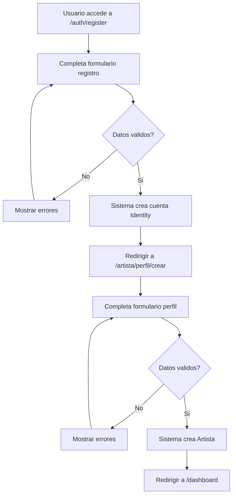

# US-01: Registro de Artista

> **ID:** US-01
> **Prioridad:** Alta
> **Sprint:** 1
> **Tarea Backlog:** WPR-010

---

## Historia de Usuario

**Como** artista
**Quiero** registrarme y crear mi perfil
**Para** presentar mi proyecto musical en la plataforma

---

## Actores

| Actor | Descripcion |
|-------|-------------|
| Artista | Usuario no autenticado que se registra y crea perfil |

---

## Precondiciones

- Ninguna (flujo de registro inicial)

## Postcondiciones

- Usuario tiene cuenta en el sistema
- Usuario tiene perfil de Artista vinculado
- Usuario puede acceder al dashboard

---

## Flujo Principal



### Pasos Detallados

1. Usuario accede a `/auth/register`
2. Completa formulario de registro:
   - Email (obligatorio)
   - Password (obligatorio)
   - Confirmar password (obligatorio)
3. Sistema valida y crea cuenta en Identity
4. Usuario es redirigido a `/artista/perfil/crear`
5. Completa formulario de perfil:
   - Nombre artistico (obligatorio)
   - Descripcion (opcional)
   - Pais (opcional)
   - Ciudad (opcional)
   - Imagen URL (opcional)
6. Sistema crea perfil de Artista vinculado al User
7. Usuario es redirigido a `/dashboard`

---

## Flujos Alternativos

| ID | Condicion | Accion |
|----|-----------|--------|
| FA-01 | Email ya existe | Mostrar error, sugerir login |
| FA-02 | Passwords no coinciden | Mostrar error de validacion |
| FA-03 | Usuario omite perfil | Puede crearlo despues desde dashboard |

---

## Criterios de Aceptacion

| ID | Criterio | Metodo de Prueba |
|----|----------|------------------|
| AC-01-1 | Email unico en el sistema | Intentar registrar email duplicado |
| AC-01-2 | Password minimo 8 caracteres | Validar en frontend y backend |
| AC-01-3 | Nombre artistico obligatorio | Form no envia sin nombre |
| AC-01-4 | Imagen es URL valida (opcional) | Acepta URLs o vacio |
| AC-01-5 | Perfil visible en `/artistas/{id}` | Navegar a perfil publico |

---

## Especificacion Tecnica

### API Endpoints

#### POST /api/auth/register

**Request:**
```json
{
  "email": "banda@example.com",
  "password": "SecurePass123!",
  "confirmPassword": "SecurePass123!"
}
```

**Response 201 Created:**
```json
{
  "userId": "guid",
  "email": "banda@example.com",
  "token": "jwt..."
}
```

**Errores:**
- `400 Bad Request` - Validacion fallida
- `409 Conflict` - Email ya existe

---

#### POST /api/artistas

**Request (Header: Authorization: Bearer {token}):**
```json
{
  "nombreArtistico": "Los Rockeros",
  "descripcion": "Banda de rock alternativo de Madrid",
  "pais": "Espana",
  "ciudad": "Madrid",
  "imagenUrl": "https://..."
}
```

**Response 201 Created:**
```json
{
  "id": "guid",
  "nombreArtistico": "Los Rockeros",
  "userId": "guid"
}
```

---

### Modelo de Datos

```csharp
public class Artista
{
    public Guid Id { get; set; }
    public string UserId { get; set; } = null!;  // FK a Identity.User
    public string NombreArtistico { get; set; } = null!;
    public string? Descripcion { get; set; }
    public string? Pais { get; set; }
    public string? Ciudad { get; set; }
    public string? ImagenUrl { get; set; }
    public DateTime FechaCreacion { get; set; }
    public DateTime? FechaActualizacion { get; set; }
}
```

### Validaciones

```csharp
RuleFor(x => x.NombreArtistico)
    .NotEmpty()
    .WithMessage("El nombre artistico es obligatorio")
    .WithErrorCode("ARTISTA_NOMBRE_REQUERIDO")
    .MaximumLength(200)
    .WithMessage("Maximo 200 caracteres")
    .WithErrorCode("ARTISTA_NOMBRE_MAX_LENGTH");

RuleFor(x => x.Descripcion)
    .MaximumLength(2000)
    .WithMessage("Maximo 2000 caracteres")
    .WithErrorCode("ARTISTA_DESC_MAX_LENGTH");

RuleFor(x => x.ImagenUrl)
    .Must(BeAValidUrl)
    .When(x => !string.IsNullOrEmpty(x.ImagenUrl))
    .WithMessage("Debe ser una URL valida")
    .WithErrorCode("ARTISTA_IMAGEN_URL_INVALIDA");
```

---

## Mockups / UI

### Pantalla de Registro
- Header con logo WePlay
- Formulario centrado
- Campos: Email, Password, Confirmar Password
- Boton "Crear cuenta"
- Link "Ya tengo cuenta" -> Login

### Pantalla de Perfil
- Stepper mostrando progreso
- Formulario con campos del perfil
- Preview de imagen (si URL valida)
- Boton "Guardar y continuar"
- Link "Saltar por ahora"

---

## Notas de Implementacion

- Usar Identity para autenticacion
- JWT token con claims de UserId
- Handler CQRS en mismo archivo que Command
- Service -> Repository -> DbContext (no inyectar DbContext en Handler)
