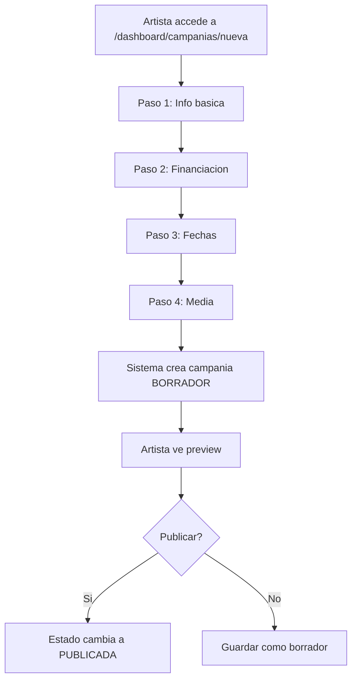

# US-02: Crear Campania de Crowdfunding

> **ID:** US-02
> **Prioridad:** Alta
> **Sprint:** 1
> **Tarea Backlog:** WPR-011

---

## Historia de Usuario

**Como** artista
**Quiero** crear una campania de crowdfunding
**Para** financiar mi proyecto musical

---

## Actores

| Actor | Descripcion |
|-------|-------------|
| Artista | Usuario autenticado con perfil de artista |

---

## Precondiciones

- Usuario tiene cuenta activa
- Usuario tiene perfil de Artista creado

## Postcondiciones

- Campania creada en estado BORRADOR
- Artista puede editar/publicar la campania

---

## Flujo Principal



### Pasos Detallados

1. Artista accede a `/dashboard/campanias/nueva`
2. Completa **Paso 1 - Informacion basica:**
   - Titulo (obligatorio)
   - Subtitulo (opcional)
   - Descripcion (obligatorio, rich text)
3. Completa **Paso 2 - Financiacion:**
   - Meta financiera (obligatorio, > 0)
   - Moneda (EUR por defecto)
   - Tipo financiacion: "Todo o nada" / "Flexible"
4. Completa **Paso 3 - Fechas:**
   - Fecha inicio (opcional, default: al publicar)
   - Fecha fin (obligatorio, min 7 dias, max 60 dias)
5. Completa **Paso 4 - Media:**
   - Imagen principal (URL)
   - Video principal (URL YouTube/Vimeo, opcional)
6. Sistema crea campania en estado BORRADOR
7. Artista ve preview de la campania
8. Artista puede publicar o guardar para despues

---

## Flujos Alternativos

| ID | Condicion | Accion |
|----|-----------|--------|
| FA-01 | Guardar como borrador | Campania queda editable en dashboard |
| FA-02 | Publicar sin rewards | Mostrar advertencia, permitir continuar |
| FA-03 | Fecha fin < 7 dias | Error de validacion |

---

## Criterios de Aceptacion

| ID | Criterio | Metodo de Prueba |
|----|----------|------------------|
| AC-02-1 | Campania se crea en BORRADOR | Verificar estado en DB |
| AC-02-2 | Meta > 0 | Validar monto positivo |
| AC-02-3 | Fecha fin >= 7 dias desde hoy | Validar calendario |
| AC-02-4 | Fecha fin <= 60 dias desde hoy | Validar calendario |
| AC-02-5 | Solo el artista dueno puede editar | Intentar editar con otro user |
| AC-02-6 | Al publicar, estado cambia a PUBLICADA | Click publicar, verificar estado |

---

## Especificacion Tecnica

### API Endpoints

#### POST /api/campanias

**Request (Header: Authorization: Bearer {token}):**
```json
{
  "titulo": "Primer Album de Los Rockeros",
  "subtitulo": "Ayudanos a grabar nuestro sueno",
  "descripcion": "<p>Somos una banda de Madrid...</p>",
  "importeObjetivo": 5000.00,
  "monedaId": 1,
  "tipoFinanciacionId": 1,
  "fechaInicio": null,
  "fechaFin": "2026-03-21",
  "imagenPrincipalUrl": "https://...",
  "videoPrincipalUrl": "https://youtube.com/..."
}
```

**Response 201 Created:**
```json
{
  "id": "guid",
  "titulo": "Primer Album de Los Rockeros",
  "estadoCampaniaId": 1,
  "estadoCampaniaNombre": "Borrador"
}
```

---

#### PUT /api/campanias/{id}

**Request:** (mismos campos que POST)

**Response 200 OK:** (campania actualizada)

---

#### POST /api/campanias/{id}/publicar

**Response 200 OK:**
```json
{
  "id": "guid",
  "estadoCampaniaId": 2,
  "estadoCampaniaNombre": "Publicada",
  "fechaPublicacion": "2026-01-21T10:30:00Z"
}
```

---

### Modelo de Datos

```csharp
public class Campania
{
    public Guid Id { get; set; }
    public Guid ArtistaId { get; set; }
    public string Titulo { get; set; } = null!;
    public string? Subtitulo { get; set; }
    public string Descripcion { get; set; } = null!;
    public decimal ImporteObjetivo { get; set; }
    public decimal ImportePledgedActual { get; set; } = 0;
    public int MonedaId { get; set; } = 1;  // EUR
    public int TipoFinanciacionId { get; set; }
    public int EstadoCampaniaId { get; set; }
    public string? ImagenPrincipalUrl { get; set; }
    public string? VideoPrincipalUrl { get; set; }
    public DateTime? FechaInicio { get; set; }
    public DateTime FechaFin { get; set; }
    public DateTime? FechaPublicacion { get; set; }
    public DateTime FechaCreacion { get; set; }
    public DateTime? FechaActualizacion { get; set; }

    // Navigation
    public Artista Artista { get; set; } = null!;
    public ICollection<Reward> Rewards { get; set; } = new List<Reward>();
    public ICollection<Backing> Backings { get; set; } = new List<Backing>();
}
```

### Enums

```csharp
public enum EstadoCampania
{
    Borrador = 1,
    Publicada = 2,
    EnCurso = 3,
    CompletadaExito = 4,
    CompletadaFallo = 5,
    Cancelada = 6
}

public enum TipoFinanciacion
{
    TodoONada = 1,
    Flexible = 2
}
```

### Validaciones

```csharp
RuleFor(x => x.Titulo)
    .NotEmpty()
    .WithMessage("El titulo es obligatorio")
    .WithErrorCode("CAMPANIA_TITULO_REQUERIDO")
    .MaximumLength(200)
    .WithMessage("Maximo 200 caracteres")
    .WithErrorCode("CAMPANIA_TITULO_MAX_LENGTH");

RuleFor(x => x.ImporteObjetivo)
    .GreaterThan(0)
    .WithMessage("La meta debe ser mayor a 0")
    .WithErrorCode("CAMPANIA_META_INVALIDA");

RuleFor(x => x.FechaFin)
    .GreaterThanOrEqualTo(DateTime.Today.AddDays(7))
    .WithMessage("La fecha fin debe ser al menos 7 dias desde hoy")
    .WithErrorCode("CAMPANIA_FECHA_MIN")
    .LessThanOrEqualTo(DateTime.Today.AddDays(60))
    .WithMessage("La fecha fin no puede superar 60 dias")
    .WithErrorCode("CAMPANIA_FECHA_MAX");
```

---

## Diagrama de Estados

```
                +-------------+
                |   BORRADOR  |
                +------+------+
                       |
                [publicar]
                       |
                       v
                +-------------+
                |  PUBLICADA  |
                +------+------+
                       |
                [fecha inicio]
                       |
                       v
                +-------------+
                |   EN_CURSO  |
                +------+------+
                       |
                [fecha fin]
                       |
       +---------------+---------------+
       |                               |
[meta alcanzada]              [meta NO alcanzada]
       |                               |
       v                               v
+---------------+             +-----------------+
|COMPLETADA_EXITO|             |COMPLETADA_FALLO|
+---------------+             +-----------------+


En cualquier momento antes de COMPLETADA_*:
+-------------+
|  CANCELADA  | <-- [artista cancela]
+-------------+
```

---

## Mockups / UI

### Wizard de Creacion
- Stepper horizontal con 4 pasos
- Navegacion prev/next
- Guardado automatico de progreso
- Preview en paso final

### Vista Preview
- Layout similar a pagina publica
- Barra de acciones: Editar, Publicar, Eliminar
- Banner indicando "Vista previa - No publicada"

---

## Notas de Implementacion

- Wizard puede persistir en localStorage para no perder progreso
- Rich text editor para descripcion (TipTap o similar)
- Validar URLs de imagen/video en frontend
- Al publicar, si no hay fecha inicio, usar fecha actual
