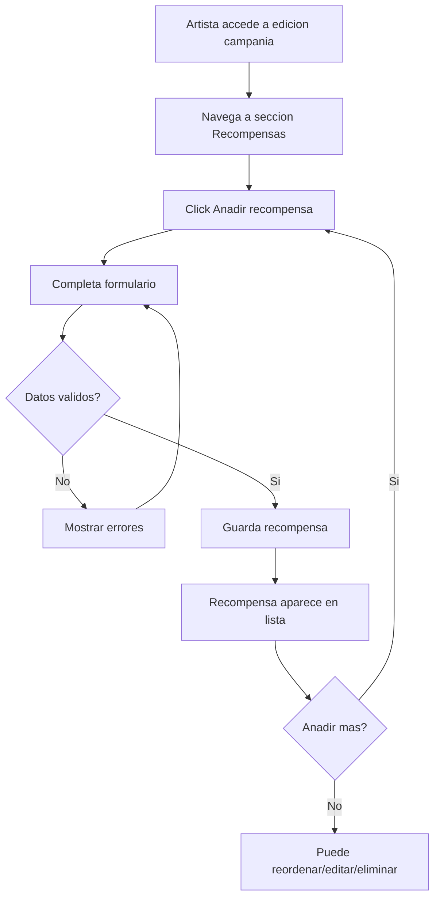

# US-03: Definir Recompensas

> **ID:** US-03
> **Prioridad:** Alta
> **Sprint:** 1
> **Tarea Backlog:** WPR-012

---

## Historia de Usuario

**Como** artista
**Quiero** anadir recompensas a mi campania
**Para** incentivar las aportaciones de los fans

---

## Actores

| Actor | Descripcion |
|-------|-------------|
| Artista | Dueno de la campania |

---

## Precondiciones

- Campania existe (cualquier estado)
- Usuario es el artista dueno de la campania

## Postcondiciones

- Recompensas creadas y vinculadas a la campania
- Recompensas visibles en detalle de campania

---

## Flujo Principal



### Pasos Detallados

1. Artista accede a edicion de campania
2. Navega a seccion "Recompensas"
3. Click "Anadir recompensa"
4. Completa formulario:
   - Nombre (obligatorio)
   - Descripcion (obligatorio)
   - Monto minimo (obligatorio, > 0)
   - Stock limitado (checkbox)
   - Cantidad maxima (si stock limitado)
   - Tiempo estimado de entrega (texto)
5. Guarda recompensa
6. Puede reordenar recompensas (drag & drop)
7. Puede editar/eliminar recompensas existentes

---

## Flujos Alternativos

| ID | Condicion | Accion |
|----|-----------|--------|
| FA-01 | Intentar publicar sin rewards | Advertencia, permitir continuar |
| FA-02 | Stock agotado | Mostrar "Agotado" en UI publica |
| FA-03 | Eliminar reward con backings | No permitir, mostrar error |

---

## Criterios de Aceptacion

| ID | Criterio | Metodo de Prueba |
|----|----------|------------------|
| AC-03-1 | Minimo 1 recompensa recomendado para publicar | Warning si no hay rewards |
| AC-03-2 | Monto minimo > 0 | Validar campo |
| AC-03-3 | Stock se decrementa al hacer backing | Crear backing, verificar stock |
| AC-03-4 | No se puede hacer backing si stock = 0 | Intentar backing sin stock |
| AC-03-5 | Recompensas ordenables | Verificar campo Orden |
| AC-03-6 | No eliminar reward con backings | Intentar eliminar, verificar error |

---

## Especificacion Tecnica

### API Endpoints

#### POST /api/campanias/{id}/rewards

**Request:**
```json
{
  "nombre": "CD Firmado",
  "descripcion": "CD fisico del album firmado por todos los miembros",
  "importeMinimo": 25.00,
  "cantidadMaxima": 100,
  "tiempoEntregaEstimado": "Marzo 2026"
}
```

**Response 201 Created:**
```json
{
  "id": "guid",
  "nombre": "CD Firmado",
  "importeMinimo": 25.00,
  "cantidadDisponible": 100,
  "orden": 1
}
```

---

#### GET /api/campanias/{id}/rewards

**Response 200 OK:**
```json
{
  "items": [
    {
      "id": "guid",
      "nombre": "CD Firmado",
      "descripcion": "CD fisico del album...",
      "importeMinimo": 25.00,
      "cantidadMaxima": 100,
      "cantidadVendida": 15,
      "cantidadDisponible": 85,
      "tiempoEntregaEstimado": "Marzo 2026",
      "orden": 1,
      "esActivo": true
    }
  ]
}
```

---

#### PUT /api/rewards/{id}

**Request:**
```json
{
  "nombre": "CD Firmado Edicion Especial",
  "descripcion": "Incluye poster adicional",
  "importeMinimo": 30.00,
  "cantidadMaxima": 50,
  "tiempoEntregaEstimado": "Abril 2026"
}
```

---

#### DELETE /api/rewards/{id}

**Response 204 No Content** (si no tiene backings)

**Response 400 Bad Request:**
```json
{
  "error": "No se puede eliminar una recompensa con backings existentes",
  "code": "REWARD_HAS_BACKINGS"
}
```

---

#### PUT /api/campanias/{id}/rewards/reorder

**Request:**
```json
{
  "rewardIds": ["guid1", "guid2", "guid3"]
}
```

**Response 200 OK**

---

### Modelo de Datos

```csharp
public class Reward
{
    public Guid Id { get; set; }
    public Guid CampaniaId { get; set; }
    public string Nombre { get; set; } = null!;
    public string Descripcion { get; set; } = null!;
    public decimal ImporteMinimo { get; set; }
    public int? CantidadMaxima { get; set; }  // null = ilimitado
    public int CantidadVendida { get; set; } = 0;
    public string? TiempoEntregaEstimado { get; set; }
    public int Orden { get; set; }
    public bool EsActivo { get; set; } = true;
    public DateTime FechaCreacion { get; set; }

    // Computed
    public int? CantidadDisponible => CantidadMaxima.HasValue
        ? CantidadMaxima.Value - CantidadVendida
        : null;

    // Navigation
    public Campania Campania { get; set; } = null!;
    public ICollection<Backing> Backings { get; set; } = new List<Backing>();
}
```

### Validaciones

```csharp
RuleFor(x => x.Nombre)
    .NotEmpty()
    .WithMessage("El nombre es obligatorio")
    .WithErrorCode("REWARD_NOMBRE_REQUERIDO")
    .MaximumLength(100)
    .WithMessage("Maximo 100 caracteres")
    .WithErrorCode("REWARD_NOMBRE_MAX_LENGTH");

RuleFor(x => x.Descripcion)
    .NotEmpty()
    .WithMessage("La descripcion es obligatoria")
    .WithErrorCode("REWARD_DESC_REQUERIDA")
    .MaximumLength(1000)
    .WithMessage("Maximo 1000 caracteres")
    .WithErrorCode("REWARD_DESC_MAX_LENGTH");

RuleFor(x => x.ImporteMinimo)
    .GreaterThan(0)
    .WithMessage("El monto minimo debe ser mayor a 0")
    .WithErrorCode("REWARD_MONTO_INVALIDO");

RuleFor(x => x.CantidadMaxima)
    .GreaterThan(0)
    .When(x => x.CantidadMaxima.HasValue)
    .WithMessage("La cantidad maxima debe ser mayor a 0")
    .WithErrorCode("REWARD_CANTIDAD_INVALIDA");
```

---

## Mockups / UI

### Lista de Recompensas (Dashboard)
- Lista sorteable con drag & drop
- Cada item muestra: nombre, monto, stock disponible
- Botones: Editar, Eliminar
- Boton "Anadir recompensa" al final

### Formulario de Recompensa
- Modal o panel lateral
- Campos del formulario
- Toggle para "Stock limitado"
- Campo cantidad aparece si toggle activo
- Botones: Cancelar, Guardar

### Vista Publica (Detalle Campania)
- Cards de recompensa ordenadas por monto
- Cada card: nombre, descripcion, monto, stock
- Badge "Agotado" si stock = 0
- Boton "Seleccionar" en cada card

---

## Ejemplos de Recompensas Tipicas

| Nivel | Nombre | Monto | Stock |
|-------|--------|-------|-------|
| 1 | Agradecimiento Digital | 5 EUR | Ilimitado |
| 2 | Descarga Digital Album | 10 EUR | Ilimitado |
| 3 | CD Fisico | 20 EUR | 200 |
| 4 | CD Firmado | 35 EUR | 100 |
| 5 | Vinilo Edicion Limitada | 50 EUR | 50 |
| 6 | Meet & Greet | 150 EUR | 20 |
| 7 | Concierto Privado | 500 EUR | 5 |

---

## Notas de Implementacion

- Ordenamiento con campo `Orden` (int)
- Al crear, asignar Orden = max(Orden) + 1
- Soft delete con `EsActivo = false` si tiene backings
- Validar CantidadDisponible antes de permitir backing
