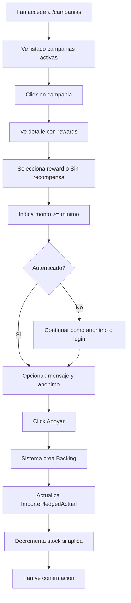

# US-04: Hacer Backing (Apoyar Campania)

> **ID:** US-04
> **Prioridad:** Alta
> **Sprint:** 1
> **Tarea Backlog:** WPR-013

---

## Historia de Usuario

**Como** fan
**Quiero** apoyar una campania
**Para** ayudar al artista y obtener recompensas

---

## Actores

| Actor | Descripcion |
|-------|-------------|
| Fan | Usuario (autenticado o anonimo) que apoya campanias |
| Sistema | Actualiza metricas y stock |

---

## Precondiciones

- Campania esta en estado PUBLICADA o EN_CURSO
- Fecha actual <= FechaFin de la campania
- Reward seleccionado tiene stock disponible (si aplica)

## Postcondiciones

- Backing registrado en el sistema
- ImportePledgedActual de campania actualizado
- Stock de reward decrementado (si aplica)
- Fan recibe confirmacion

---

## Flujo Principal



### Pasos Detallados

1. Fan accede a `/campanias`
2. Ve listado de campanias activas con:
   - Imagen, titulo, artista
   - Barra de progreso
   - Monto recaudado vs meta
   - Dias restantes
3. Click en una campania
4. Ve detalle completo:
   - Descripcion, video, imagenes
   - Barra de progreso (recaudado vs meta)
   - Lista de recompensas
   - Numero de backers
   - Dias restantes
5. Selecciona recompensa (o "Apoyar sin recompensa")
6. Indica monto (>= monto minimo de reward)
7. Opcional: escribe mensaje para el artista
8. Opcional: marcar como anonimo
9. Click "Apoyar"
10. Sistema crea Backing
11. Sistema actualiza ImportePledgedActual
12. Sistema decrementa stock si aplica
13. Fan ve pantalla de confirmacion

---

## Flujos Alternativos

| ID | Condicion | Accion |
|----|-----------|--------|
| FA-01 | Monto < minimo reward | Mostrar error validacion |
| FA-02 | Stock agotado | Deshabilitar reward, mostrar "Agotado" |
| FA-03 | Campania finalizada | Redirigir a listado, mostrar mensaje |
| FA-04 | Usuario no autenticado | Permitir backing anonimo o sugerir login |

---

## Criterios de Aceptacion

| ID | Criterio | Metodo de Prueba |
|----|----------|------------------|
| AC-04-1 | Solo campanias activas visibles | Listar solo PUBLICADA/EN_CURSO |
| AC-04-2 | Monto >= ImporteMinimo del reward | Validar monto |
| AC-04-3 | Progreso se actualiza en tiempo real | Verificar ImportePledgedActual |
| AC-04-4 | Stock se decrementa | Verificar CantidadVendida |
| AC-04-5 | Backers anonimos no muestran nombre | Verificar en lista publica |
| AC-04-6 | Sin recompensa permite cualquier monto > 0 | Hacer backing sin reward |

---

## Especificacion Tecnica

### API Endpoints

#### GET /api/campanias

**Query params:**
- `page` (default: 1)
- `pageSize` (default: 12)
- `search` (opcional)
- `orderBy` (default: fechaCreacion desc)

**Response 200 OK:**
```json
{
  "items": [
    {
      "id": "guid",
      "titulo": "Primer Album de Los Rockeros",
      "artistaNombre": "Los Rockeros",
      "artistaImagenUrl": "https://...",
      "importeObjetivo": 5000.00,
      "importeRecaudado": 1250.00,
      "porcentaje": 25,
      "numBackers": 15,
      "diasRestantes": 45,
      "imagenUrl": "https://..."
    }
  ],
  "totalCount": 10,
  "page": 1,
  "pageSize": 12
}
```

---

#### GET /api/campanias/{id}

**Response 200 OK:**
```json
{
  "id": "guid",
  "titulo": "Primer Album de Los Rockeros",
  "subtitulo": "Ayudanos a grabar nuestro sueno",
  "descripcion": "<p>Somos una banda de Madrid...</p>",
  "artista": {
    "id": "guid",
    "nombreArtistico": "Los Rockeros",
    "imagenUrl": "https://..."
  },
  "importeObjetivo": 5000.00,
  "importeRecaudado": 1250.00,
  "porcentaje": 25,
  "numBackers": 15,
  "diasRestantes": 45,
  "fechaFin": "2026-03-21",
  "imagenPrincipalUrl": "https://...",
  "videoPrincipalUrl": "https://youtube.com/...",
  "rewards": [
    {
      "id": "guid",
      "nombre": "CD Firmado",
      "descripcion": "CD fisico firmado...",
      "importeMinimo": 25.00,
      "cantidadDisponible": 85,
      "tiempoEntregaEstimado": "Marzo 2026"
    }
  ],
  "backingsRecientes": [
    {
      "nombreBacker": "Juan G.",
      "monto": 50.00,
      "fechaRelativa": "hace 2 horas"
    }
  ]
}
```

---

#### POST /api/campanias/{id}/backings

**Request:**
```json
{
  "rewardId": "guid",  // opcional, null = sin recompensa
  "monto": 25.00,
  "mensaje": "Exitos con el album!",
  "esAnonimo": false
}
```

**Response 201 Created:**
```json
{
  "id": "guid",
  "campaniaTitulo": "Primer Album de Los Rockeros",
  "rewardNombre": "CD Firmado",
  "monto": 25.00,
  "fechaCreacion": "2026-01-21T10:30:00Z"
}
```

**Errores:**
- `400 Bad Request` - Monto invalido
- `404 Not Found` - Campania no existe
- `409 Conflict` - Reward sin stock
- `422 Unprocessable Entity` - Campania no activa

---

### Modelo de Datos

```csharp
public class Backing
{
    public Guid Id { get; set; }
    public Guid CampaniaId { get; set; }
    public string? UserId { get; set; }  // null si no autenticado
    public Guid? RewardId { get; set; }  // null si sin recompensa
    public decimal Monto { get; set; }
    public string? Mensaje { get; set; }
    public bool EsAnonimo { get; set; }
    public DateTime FechaCreacion { get; set; }

    // Navigation
    public Campania Campania { get; set; } = null!;
    public Reward? Reward { get; set; }
}
```

### Validaciones

```csharp
RuleFor(x => x.Monto)
    .GreaterThan(0)
    .WithMessage("El monto debe ser mayor a 0")
    .WithErrorCode("BACKING_MONTO_INVALIDO");

RuleFor(x => x.Monto)
    .GreaterThanOrEqualTo(x => x.RewardMinimo)
    .When(x => x.RewardId.HasValue)
    .WithMessage("El monto debe ser >= al minimo de la recompensa")
    .WithErrorCode("BACKING_MONTO_INSUFICIENTE");

RuleFor(x => x.Mensaje)
    .MaximumLength(500)
    .WithMessage("Maximo 500 caracteres")
    .WithErrorCode("BACKING_MENSAJE_MAX_LENGTH");
```

### Logica de Negocio (Service)

```csharp
public async Task<Backing> CreateBacking(CreateBackingCommand command)
{
    var campania = await _campaniaRepo.GetById(command.CampaniaId);

    // Validar estado campania
    if (!campania.EstaActiva())
        throw new BusinessException("CAMPANIA_NO_ACTIVA");

    // Validar reward y stock
    if (command.RewardId.HasValue)
    {
        var reward = await _rewardRepo.GetById(command.RewardId.Value);
        if (reward.CantidadDisponible <= 0)
            throw new BusinessException("REWARD_SIN_STOCK");

        reward.CantidadVendida++;
    }

    // Crear backing
    var backing = new Backing { ... };
    await _backingRepo.Add(backing);

    // Actualizar total campania
    campania.ImportePledgedActual += command.Monto;

    await _unitOfWork.SaveChanges();

    return backing;
}
```

---

## Mockups / UI

### Listado de Campanias
- Grid de cards (3 columnas desktop, 1 mobile)
- Cada card: imagen, titulo, artista, progreso, dias
- Filtros: busqueda, categoria (futuro)
- Paginacion o scroll infinito

### Detalle de Campania
- Header con imagen/video grande
- Info artista con link a perfil
- Barra de progreso prominente
- Stats: recaudado, backers, dias
- Descripcion completa
- Lista de rewards como cards seleccionables
- Sidebar sticky con CTA "Apoyar"

### Modal/Pagina de Backing
- Reward seleccionado (o "Sin recompensa")
- Campo monto con minimo
- Campo mensaje (textarea)
- Checkbox "Hacer anonimo"
- Resumen del apoyo
- Boton "Confirmar apoyo"

### Confirmacion
- Mensaje de exito
- Resumen del backing
- Botones: Ver campania, Mis apoyos, Compartir

---

## Notas de Implementacion

- MVP sin pasarela de pago real (simular confirmacion)
- Transaccion atomica: backing + update campania + update reward
- Considerar race conditions en stock (optimistic locking)
- Cache de campanias publicas para rendimiento
