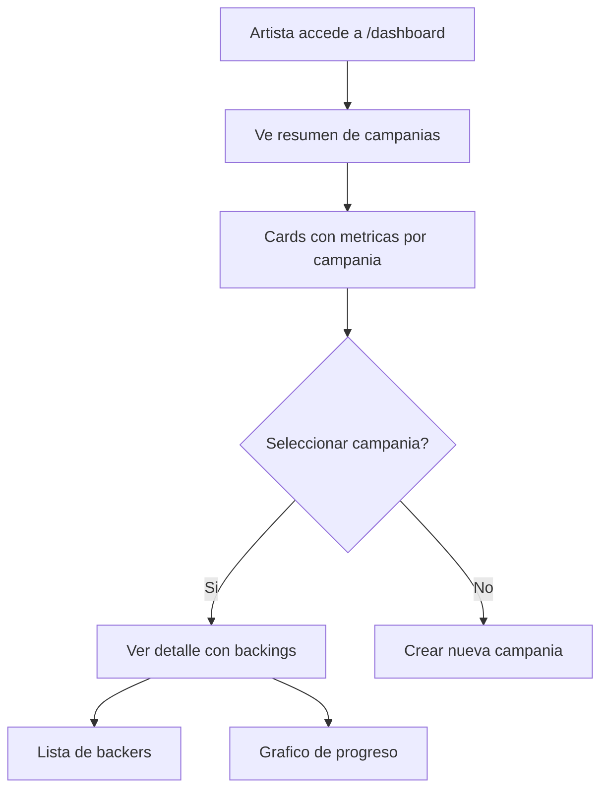

# US-05: Dashboard de Artista

> **ID:** US-05
> **Prioridad:** Alta
> **Sprint:** 1
> **Tarea Backlog:** WPR-014

---

## Historia de Usuario

**Como** artista
**Quiero** ver el progreso de mi campania
**Para** conocer las metricas y gestionar mis proyectos

---

## Actores

| Actor | Descripcion |
|-------|-------------|
| Artista | Usuario autenticado con campanias |

---

## Precondiciones

- Usuario autenticado
- Usuario tiene perfil de Artista
- Usuario tiene al menos una campania

## Postcondiciones

- Artista visualiza metricas actualizadas
- Artista puede navegar a detalle de campanias

---

## Flujo Principal



### Pasos Detallados

1. Artista accede a `/dashboard`
2. Ve resumen general:
   - Total recaudado en todas las campanias
   - Numero total de backers
   - Campanias activas vs completadas
3. Ve cards de sus campanias con:
   - Titulo e imagen
   - Total recaudado vs meta
   - Porcentaje de progreso
   - Numero de backers
   - Dias restantes (si activa)
   - Estado de la campania
4. Click en campania para ver detalle
5. En detalle ve:
   - Metricas ampliadas
   - Lista de backings recientes
   - Grafico de progreso en el tiempo (opcional MVP)
6. Puede ver lista completa de backers
7. Puede exportar lista (post-MVP)

---

## Flujos Alternativos

| ID | Condicion | Accion |
|----|-----------|--------|
| FA-01 | Sin campanias | Mostrar CTA para crear primera campania |
| FA-02 | Todas campanias finalizadas | Mostrar historico con metricas |
| FA-03 | Ver backing anonimo | Mostrar "Anonimo" en lugar de nombre |

---

## Criterios de Aceptacion

| ID | Criterio | Metodo de Prueba |
|----|----------|------------------|
| AC-05-1 | Solo ve sus propias campanias | Login con otro user, verificar |
| AC-05-2 | Metricas actualizadas en tiempo real | Crear backing, verificar dashboard |
| AC-05-3 | Lista backers muestra los mas recientes | Ordenar por fecha desc |
| AC-05-4 | Backers anonimos muestran "Anonimo" | Crear backing anonimo, verificar |
| AC-05-5 | Porcentaje calculado correctamente | Verificar formula |
| AC-05-6 | Dias restantes se actualizan | Verificar calculo de dias |

---

## Especificacion Tecnica

### API Endpoints

#### GET /api/dashboard/resumen

**Response 200 OK:**
```json
{
  "totalRecaudado": 3500.00,
  "totalBackers": 45,
  "campaniasActivas": 2,
  "campaniasCompletadas": 1,
  "moneda": "EUR"
}
```

---

#### GET /api/campanias/mis-campanias

**Query params:**
- `estado` (opcional): filtrar por estado
- `page`, `pageSize`

**Response 200 OK:**
```json
{
  "items": [
    {
      "id": "guid",
      "titulo": "Primer Album de Los Rockeros",
      "imagenUrl": "https://...",
      "estado": "EnCurso",
      "estadoNombre": "En Curso",
      "importeObjetivo": 5000.00,
      "importeRecaudado": 1250.00,
      "porcentaje": 25,
      "numBackers": 15,
      "diasRestantes": 45,
      "fechaFin": "2026-03-21",
      "fechaCreacion": "2026-01-15"
    }
  ],
  "totalCount": 3
}
```

---

#### GET /api/campanias/{id}/backings

**Query params:**
- `page` (default: 1)
- `pageSize` (default: 20)

**Response 200 OK:**
```json
{
  "items": [
    {
      "id": "guid",
      "nombreBacker": "Juan Garcia",  // o "Anonimo"
      "emailBacker": "juan@...",      // solo visible para artista
      "rewardNombre": "CD Firmado",
      "monto": 25.00,
      "mensaje": "Exitos!",
      "esAnonimo": false,
      "fechaCreacion": "2026-01-21T10:30:00Z",
      "fechaRelativa": "hace 2 horas"
    }
  ],
  "totalCount": 15,
  "totalRecaudado": 1250.00,
  "stats": {
    "backingPromedio": 83.33,
    "rewardMasPopular": "CD Firmado",
    "ultimoBacking": "2026-01-21T10:30:00Z"
  }
}
```

---

#### GET /api/campanias/{id}/stats

**Response 200 OK:**
```json
{
  "importeObjetivo": 5000.00,
  "importeRecaudado": 1250.00,
  "porcentaje": 25,
  "numBackers": 15,
  "backingPromedio": 83.33,
  "diasRestantes": 45,
  "diasTranscurridos": 6,
  "proyeccionFinal": 3750.00,
  "rewardStats": [
    {
      "rewardNombre": "CD Firmado",
      "cantidad": 10,
      "total": 350.00,
      "porcentaje": 28
    }
  ],
  "progressoPorDia": [
    { "fecha": "2026-01-15", "total": 150.00 },
    { "fecha": "2026-01-16", "total": 300.00 },
    { "fecha": "2026-01-17", "total": 500.00 }
  ]
}
```

---

### Calculos de Metricas

```csharp
// Porcentaje de meta
var porcentaje = (importeRecaudado / importeObjetivo) * 100;

// Dias restantes
var diasRestantes = (fechaFin - DateTime.Today).Days;
if (diasRestantes < 0) diasRestantes = 0;

// Backing promedio
var backingPromedio = totalRecaudado / numBackers;

// Proyeccion (regresion lineal simple)
var diasTranscurridos = (DateTime.Today - fechaInicio).Days;
var tasaDiaria = importeRecaudado / diasTranscurridos;
var diasTotales = (fechaFin - fechaInicio).Days;
var proyeccionFinal = tasaDiaria * diasTotales;
```

---

## Mockups / UI

### Dashboard Principal
```
+------------------------------------------+
|  WePlay Rises        [Perfil] [Logout]   |
+------------------------------------------+
|         |                                |
| SIDEBAR |  RESUMEN GENERAL               |
|         |  +------+ +------+ +------+    |
| - Home  |  |$3500 | |  45  | |  2   |    |
| - Camp. |  |Total | |Backers| |Activas|  |
| - Perfil|  +------+ +------+ +------+    |
|         |                                |
|         |  MIS CAMPANIAS                 |
|         |  [+ Nueva Campania]            |
|         |                                |
|         |  +---------------------------+ |
|         |  | Album Los Rockeros        | |
|         |  | [=====>    ] 25% - 45 dias| |
|         |  | $1,250 / $5,000 - 15 back | |
|         |  +---------------------------+ |
|         |                                |
|         |  +---------------------------+ |
|         |  | EP Acustico               | |
|         |  | [========> ] 60% - 20 dias| |
|         |  | $1,800 / $3,000 - 30 back | |
|         |  +---------------------------+ |
+------------------------------------------+
```

### Detalle de Campania (Dashboard)
```
+------------------------------------------+
|  < Volver     Album Los Rockeros         |
+------------------------------------------+
|                                          |
|  METRICAS                                |
|  +--------+ +--------+ +--------+        |
|  | $1,250 | |   15   | | 45 dias|        |
|  |Recaudado| |Backers | |Restantes|      |
|  +--------+ +--------+ +--------+        |
|                                          |
|  PROGRESO          [Ver pagina publica]  |
|  [===========>            ] 25%          |
|                                          |
|  GRAFICO DE PROGRESO (opcional)          |
|  [    grafico de linea por dia    ]      |
|                                          |
|  BACKINGS RECIENTES                      |
|  +--------------------------------------+|
|  | Juan G. | CD Firmado | $25 | 2h ago ||
|  | Anonimo | Digital    | $10 | 5h ago ||
|  | Maria L.| Vinilo     | $50 | 1d ago ||
|  +--------------------------------------+|
|  [Ver todos los backers]                 |
|                                          |
|  ACCIONES                                |
|  [Editar] [Ver publico] [Compartir]      |
+------------------------------------------+
```

### Lista de Backers
- Tabla con: nombre, email, reward, monto, mensaje, fecha
- Filtros: por reward, por fecha
- Ordenamiento por columnas
- Exportar CSV (post-MVP)

---

## Componentes UI Sugeridos

| Componente | Uso |
|------------|-----|
| `StatCard` | Tarjetas de metricas con icono y valor |
| `ProgressBar` | Barra de progreso con porcentaje |
| `CampaignCard` | Card resumen de campania |
| `BackingTable` | Tabla de backings con paginacion |
| `LineChart` | Grafico de progreso temporal |
| `EmptyState` | Estado vacio con CTA |

---

## Notas de Implementacion

- Usar SWR o React Query para cache y revalidacion
- Actualizar metricas con polling cada 30s (o WebSocket futuro)
- Lazy load del grafico (post-MVP puede omitirse)
- Layout con sidebar usando template dashtail
- Proteger rutas con middleware de autenticacion
