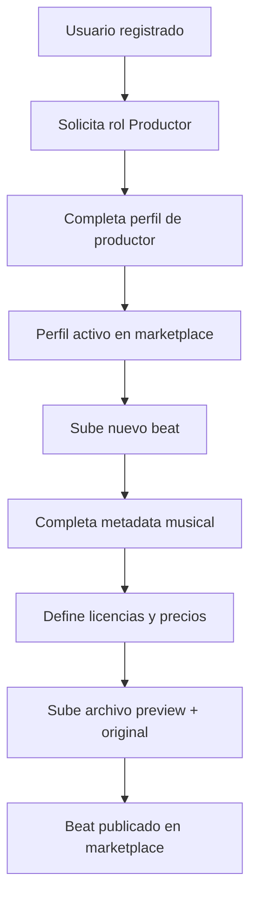
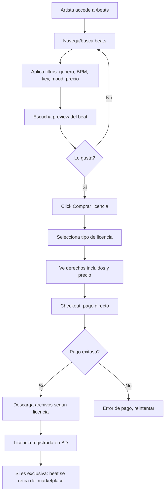
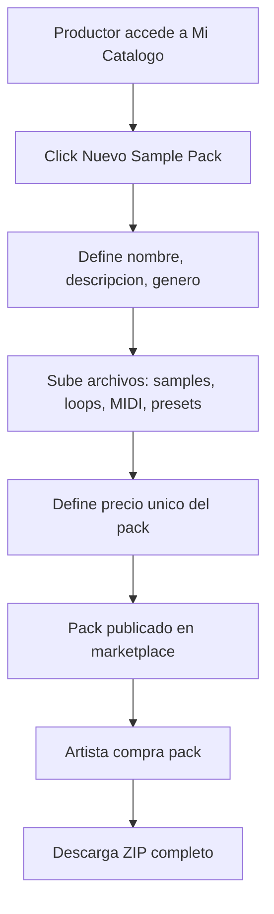

# US-BM-01: Beat Marketplace / Economia del Productor

> **ID:** US-BM-01
> **Feature Name:** `bm-beat-marketplace-productor`
> **Prioridad:** Alta
> **Estimacion:** XXL (Extra Extra Large)
> **Modulo:** BeatMarketplace (modulo nuevo)
> **Dependencias:** US-01 (Registro Artista - para perfil productor), US-CL-01 (Content Licensing - para sync de beats)
> **Feature Origen:** F-04 del [analisis de funcionalidades](../analisis/20260217_analisis-funcionalidades-industria-musical.md#f-04-beat-marketplace--economia-del-productor)

---

## Historia de Usuario

**Como** productor musical,
**Quiero** subir mis beats, sample packs y sound kits a un marketplace integrado donde artistas puedan buscarlos, previsualizarlos y comprar licencias directamente,
**Para** monetizar mi catalogo de produccion, conectar con artistas que buscan beats, y opcionalmente lanzar campanias de crowdfunding para financiar la creacion de nuevo material.

---

## Actores

| Actor | Descripcion |
|-------|-------------|
| Productor | Crea perfil, sube catalogo (beats, packs), define precios y tipos de licencia |
| Artista / Comprador | Busca beats, previsualiza, compra licencias |
| Fan | Puede backear campanias "Producer Fund" del productor |
| Sistema | Gestiona catalogo, licencias, transacciones, integracion con Content Licensing |

---

## Precondiciones

- Usuario tiene cuenta activa en la plataforma
- El modulo BeatMarketplace esta desplegado y configurado
- Pasarela de pagos configurada (Stripe / Mercado Pago)

## Postcondiciones

- Productor tiene perfil activo con catalogo de beats/packs
- Artistas pueden comprar licencias (no-exclusiva, exclusiva)
- Beats con licencia exclusiva vendida se marcan como no disponibles
- Revenue del productor se registra en su wallet
- Beats opcionalmente disponibles en Content Licensing para sync

---

## Justificacion

La economia de beats es un mercado de **55M+ tracks anuales** globalmente, dominado por plataformas especializadas:

| Plataforma | Comision | Diferenciador |
|-----------|----------|---------------|
| BeatStars | Variable | Lider. Comunidad + branded stores |
| Airbit | 0% | Zero comision (BandLab) |
| Traktrain | 20% | Curado, underground/experimental |

**Nadie combina beat marketplace + crowdfunding.** Esta combinacion crea un **efecto red unico**:

1. Productores suben beats → artistas compran → productores ganan dinero
2. Productores lanzan campanias "Producer Fund" → fans financian creacion de catalogos
3. Beats comprados alimentan Content Licensing (sync para marcas)
4. Artistas que compran beats pueden lanzar campanias de crowdfunding con esos beats
5. CrowdSourcing: artista contrata productor → el beat resultante se lista en marketplace

**Rangos de precio del mercado**:

| Tipo | Rango | Volumen |
|------|-------|---------|
| Beat no-exclusivo | $20 - $100 | Alto (mismo beat, multiples compradores) |
| Beat exclusivo | $200 - $5,000+ | Bajo (un solo comprador) |
| Sample pack | $15 - $100+ | Medio |
| Sound kit | $10 - $50 | Medio-Alto |

---

## Alcance de esta US

### A. Perfil de Productor

Nuevo tipo de perfil que extiende la identidad de usuario con datos especificos de produccion musical.

### B. Catalogo de Beats

Subida, gestion y publicacion de beats con metadata musical (BPM, tonalidad, genero, mood).

### C. Sistema de Licencias

Tipos de licencia configurables por beat con precios y derechos diferenciados.

### D. Marketplace (busqueda y compra)

Interfaz de busqueda con filtros musicales, preview de audio y checkout directo.

### E. Sample Packs y Sound Kits

Extension del catalogo para packs de samples, loops, MIDI y drums.

### Excluido

- Campanias "Producer Fund" (sera extension futura de CrowdFunding)
- Co-campanias artista + productor (extension futura)
- Beat subscription (modelo recurrente, extension futura)
- DAW plugin para preview de beats (complejidad excesiva)
- Marketplace secundario de licencias (fan-to-fan)

---

## Flujo Principal: Productor Crea Perfil y Sube Catalogo



### Paso 1: Perfil de Productor

| Campo | Tipo | Obligatorio | Validacion |
|-------|------|-------------|------------|
| Nombre artistico | Texto (max 100) | Si | Min 2 caracteres, unico |
| Bio de produccion | Texto (max 1000) | Si | Min 20 caracteres |
| Generos principales | Multi-select (max 5) | Si | Del catalogo de generos |
| Foto de perfil | Upload (JPG/PNG) | Si | Max 5MB, min 200x200px |
| Banner | Upload (JPG/PNG) | No | Max 10MB, min 1200x400px |
| Links externos | URLs | No | SoundCloud, YouTube, Instagram, BeatStars |
| DAW principal | Select | No | FL Studio, Ableton, Logic, etc. |
| Experiencia | Select | No | Principiante, Intermedio, Profesional |

### Paso 2: Subir Beat

| Campo | Tipo | Obligatorio | Validacion |
|-------|------|-------------|------------|
| Titulo | Texto (max 100) | Si | Min 3 caracteres |
| Archivo original | Upload (WAV/FLAC) | Si | Max 100MB, min 16-bit 44.1kHz |
| Archivo preview | Upload (MP3) | Auto-generado | 30 seg con tag de agua, o completo con tag |
| BPM | Entero | Si | 40-300 |
| Tonalidad (Key) | Select | Si | C, C#, D... B + Mayor/Menor |
| Genero | Select | Si | Del catalogo |
| Sub-genero | Select | No | Del catalogo |
| Mood / Tags | Multi-select (max 10) | Si | Dark, Energetic, Chill, Aggressive, etc. |
| Descripcion | Texto (max 500) | No | - |
| Tiene stems | Boolean | No | Si es true, subir stems |
| Stems | Multi-upload (WAV) | Solo si tiene stems | Vocals, Drums, Bass, Melody, etc. |

### Paso 3: Configurar Licencias

| Tipo Licencia | Derechos Incluidos | Precio Sugerido | Exclusividad |
|---------------|-------------------|-----------------|--------------|
| **Basic** | MP3 only, uso no comercial, credito obligatorio | $20-30 | No-exclusiva |
| **Standard** | MP3 + WAV, uso comercial limitado (5,000 copias), credito obligatorio | $50-80 | No-exclusiva |
| **Premium** | MP3 + WAV + Stems, uso comercial (50,000 copias), credito apreciado | $100-200 | No-exclusiva |
| **Exclusive** | Todos los archivos + derechos completos, el beat se retira del marketplace | $300-5,000+ | Exclusiva (1 comprador) |

Cada tipo de licencia es configurable por el productor:

| Campo | Tipo | Obligatorio |
|-------|------|-------------|
| Tipo de licencia | Select | Si |
| Precio | Decimal | Si (min $1) |
| Archivos incluidos | Multi-select | Si |
| Limite de copias | Entero | No (null = ilimitado) |
| Requiere credito | Boolean | Si |
| Condiciones adicionales | Texto (max 500) | No |

---

## Flujo Principal: Artista Busca y Compra Beat



### Filtros de Busqueda

| Filtro | Tipo | Opciones |
|--------|------|----------|
| Genero | Select multiple | Hip-Hop, Trap, R&B, Pop, Reggaeton, Latin, Electronic, etc. |
| BPM | Rango (slider) | 40-300, con presets: Slow (60-90), Medium (90-130), Fast (130-180) |
| Tonalidad (Key) | Select | C, C#, D... B + Mayor/Menor + "Cualquiera" |
| Mood | Multi-select | Dark, Energetic, Chill, Aggressive, Happy, Sad, etc. |
| Precio | Rango | Min-Max en moneda del usuario |
| Tipo licencia | Select | Basic, Standard, Premium, Exclusive |
| Tiene stems | Boolean | Si/No |
| Ordenar por | Select | Recientes, Populares, Precio (asc/desc), BPM |

### Preview de Audio

| Aspecto | Detalle |
|---------|---------|
| Duracion | Beat completo con tag de agua (marca de audio cada 15 seg) |
| Formato | MP3 128kbps (calidad suficiente para preview) |
| Player | Waveform visual + controles play/pause/seek |
| Tag de agua | Voz sintetizada: "WePlay Rises" o nombre del productor |
| Autoplay | No. Solo al click del usuario |

---

## Flujo Principal: Sample Packs y Sound Kits



### Campos del Sample Pack / Sound Kit

| Campo | Tipo | Obligatorio | Validacion |
|-------|------|-------------|------------|
| Titulo | Texto (max 100) | Si | Min 3 caracteres |
| Tipo | Select | Si | Sample Pack, Sound Kit, MIDI Kit, Drum Kit, Preset Pack |
| Descripcion | Texto (max 1000) | Si | Min 20 caracteres |
| Genero | Select | Si | Del catalogo |
| Num elementos | Entero (auto-calculado) | Si | Min 5 archivos |
| Archivos | Multi-upload (WAV/MIDI/Preset) | Si | Max 500MB total |
| Preview (audio demo) | Upload (MP3) | Si | Max 10MB, demo del contenido |
| Cover art | Upload (JPG/PNG) | Si | Max 5MB, min 500x500px |
| Precio | Decimal | Si | Min $5 |
| Licencia | Texto fijo | Auto | "Royalty-free para uso en producciones musicales" |

---

## Flujos Alternativos

| ID | Condicion | Accion |
|----|-----------|--------|
| FA-01 | Beat exclusivo ya vendido | Mostrar badge "SOLD" en marketplace. Solo visible como referencia, no comprable |
| FA-02 | Artista quiere devolucion | No soportado en v1. La compra de licencia digital es final. Mediacion manual via soporte |
| FA-03 | Productor quiere retirar beat del marketplace | Permitir si no hay licencias exclusivas vendidas. Los compradores no-exclusivos mantienen sus derechos |
| FA-04 | Artista quiere negociar precio custom | No soportado en v1. Precios fijos por licencia. Futuro: sistema de ofertas |
| FA-05 | Productor quiere marcar beat como disponible para sync (Content Licensing) | Toggle "Disponible para sync". El beat aparece en catalogo de Content Licensing con metadata |
| FA-06 | Comprador descarga archivos despues de la compra | Enlace de descarga disponible permanentemente en "Mis compras" |

---

## Criterios de Aceptacion

| ID | Criterio | Metodo de Prueba |
|----|----------|------------------|
| AC-BM01-1 | Un usuario puede crear un perfil de Productor con nombre artistico, bio, generos y foto | Crear perfil, verificar en BD y marketplace |
| AC-BM01-2 | El productor puede subir un beat con metadata completa (titulo, BPM, key, genero, mood) | Subir beat, verificar metadata en BD |
| AC-BM01-3 | El sistema genera automaticamente un preview con tag de agua del beat subido | Subir WAV, verificar preview MP3 con tag generado |
| AC-BM01-4 | El productor puede configurar multiples tipos de licencia con precios diferentes para un mismo beat | Crear 3 licencias para 1 beat, verificar en BD |
| AC-BM01-5 | El artista puede buscar beats por genero, BPM, tonalidad, mood y precio | Aplicar filtros, verificar resultados coherentes |
| AC-BM01-6 | El artista puede escuchar el preview completo del beat con tag de agua sin comprarlo | Reproducir preview, verificar tag de agua |
| AC-BM01-7 | El artista puede comprar una licencia no-exclusiva y descargar los archivos correspondientes | Completar compra Basic, verificar descarga MP3 only |
| AC-BM01-8 | Al comprar licencia exclusiva, el beat se retira automaticamente del marketplace | Comprar Exclusive, verificar que el beat muestra "SOLD" |
| AC-BM01-9 | Multiples artistas pueden comprar licencias no-exclusivas del mismo beat | Dos compradores compran Basic del mismo beat, ambos exitosos |
| AC-BM01-10 | El productor puede subir un sample pack con multiples archivos y un precio unico | Subir pack con 20 samples, verificar en BD y marketplace |
| AC-BM01-11 | El artista puede comprar un sample pack y descargar el ZIP completo | Comprar pack, verificar descarga ZIP |
| AC-BM01-12 | El productor ve dashboard con ventas, revenue y estadisticas de su catalogo | Verificar dashboard con datos de ventas |
| AC-BM01-13 | El productor puede marcar un beat como "disponible para sync" y aparece en Content Licensing | Activar toggle, verificar en catalogo CL |
| AC-BM01-14 | La comision de la plataforma se calcula correctamente sobre cada venta | Verificar: precio - comision = revenue productor |

---

## Especificacion Tecnica

### API Endpoints

#### POST /api/productores

Crear perfil de productor.

**Auth:** Usuario autenticado

**Request:**
```json
{
    "nombreArtistico": "808 Mafia Clone",
    "bioProduccion": "Productor de trap y hip-hop desde 2020. Especializado en beats dark y melodicos.",
    "generoIds": [1, 3, 7],
    "urlFotoPerfil": "https://storage.weplay.com/producers/profile-123.jpg",
    "urlBanner": "https://storage.weplay.com/producers/banner-123.jpg",
    "linksExternos": {
        "soundcloud": "https://soundcloud.com/808mafiaclone",
        "youtube": "https://youtube.com/@808mafiaclone",
        "instagram": "@808mafiaclone"
    },
    "dawPrincipal": "FL Studio",
    "experiencia": "Profesional"
}
```

**Response 201 Created:**
```json
{
    "data": {
        "productorId": "guid",
        "nombreArtistico": "808 Mafia Clone",
        "urlPerfil": "/productores/808-mafia-clone"
    },
    "messages": [
        { "message": "Perfil de productor creado", "errorCode": "0001" }
    ]
}
```

---

#### POST /api/productores/{productorId}/beats

Subir nuevo beat al catalogo.

**Auth:** Productor (propietario)

**Request:**
```json
{
    "titulo": "Midnight Trap",
    "urlArchivoOriginal": "https://storage.weplay.com/beats/midnight-trap.wav",
    "bpm": 140,
    "tonalidad": "Cm",
    "generoId": 1,
    "subGeneroId": 3,
    "moods": ["Dark", "Energetic", "Aggressive"],
    "descripcion": "Hard-hitting trap beat with dark melodies",
    "tieneStems": true,
    "stems": [
        { "nombre": "Drums", "url": "https://storage.weplay.com/beats/midnight-trap-drums.wav" },
        { "nombre": "Melody", "url": "https://storage.weplay.com/beats/midnight-trap-melody.wav" },
        { "nombre": "Bass", "url": "https://storage.weplay.com/beats/midnight-trap-bass.wav" }
    ],
    "licencias": [
        {
            "tipoLicenciaId": 1,
            "precio": 29.99,
            "archivosIncluidos": ["MP3"],
            "limiteCopias": null,
            "requiereCredito": true
        },
        {
            "tipoLicenciaId": 2,
            "precio": 79.99,
            "archivosIncluidos": ["MP3", "WAV"],
            "limiteCopias": 5000,
            "requiereCredito": true
        },
        {
            "tipoLicenciaId": 3,
            "precio": 199.99,
            "archivosIncluidos": ["MP3", "WAV", "Stems"],
            "limiteCopias": 50000,
            "requiereCredito": false
        },
        {
            "tipoLicenciaId": 4,
            "precio": 999.99,
            "archivosIncluidos": ["MP3", "WAV", "Stems"],
            "limiteCopias": null,
            "requiereCredito": false,
            "condicionesAdicionales": "Full ownership transfer"
        }
    ]
}
```

**Response 201 Created:**
```json
{
    "data": {
        "beatId": "guid",
        "titulo": "Midnight Trap",
        "urlPreview": "https://storage.weplay.com/beats/previews/midnight-trap-preview.mp3",
        "numLicencias": 4,
        "precioDesde": 29.99
    },
    "messages": [
        { "message": "Beat publicado en marketplace", "errorCode": "0001" }
    ]
}
```

---

#### GET /api/beats

Buscar beats en el marketplace.

**Auth:** Publico

**Query params:** `generoId`, `bpmMin`, `bpmMax`, `tonalidad`, `moods` (csv), `precioMin`, `precioMax`, `tipoLicenciaId`, `tieneStems`, `orderBy` (recientes|populares|precio_asc|precio_desc|bpm), `search` (texto libre), `page`, `pageSize`

**Response 200 OK:**
```json
{
    "data": {
        "items": [
            {
                "beatId": "guid",
                "titulo": "Midnight Trap",
                "productor": {
                    "productorId": "guid",
                    "nombreArtistico": "808 Mafia Clone",
                    "urlFoto": "https://..."
                },
                "bpm": 140,
                "tonalidad": "Cm",
                "genero": "Trap",
                "moods": ["Dark", "Energetic"],
                "urlPreview": "https://storage.weplay.com/beats/previews/midnight-trap-preview.mp3",
                "duracion": 195,
                "tieneStems": true,
                "precioDesde": 29.99,
                "monedaId": 1,
                "numVentas": 23,
                "disponibleParaExclusiva": true,
                "disponibleParaSync": true,
                "fechaPublicacion": "2026-02-15T10:00:00Z"
            }
        ],
        "totalCount": 342,
        "page": 1,
        "pageSize": 20
    },
    "messages": []
}
```

---

#### POST /api/beats/{beatId}/comprar

Comprar licencia de un beat.

**Auth:** Usuario autenticado (artista o cualquier comprador)

**Request:**
```json
{
    "licenciaId": "guid",
    "monedaId": 1
}
```

**Response 201 Created:**
```json
{
    "data": {
        "compraId": "guid",
        "beatTitulo": "Midnight Trap",
        "tipoLicencia": "Standard",
        "importePagado": 79.99,
        "moneda": "EUR",
        "comisionPlataforma": 8.00,
        "revenueProductor": 71.99,
        "archivosDescargables": [
            { "nombre": "Midnight Trap.mp3", "url": "https://storage.weplay.com/downloads/..." },
            { "nombre": "Midnight Trap.wav", "url": "https://storage.weplay.com/downloads/..." }
        ],
        "licencia": {
            "tipo": "Standard",
            "limiteCopias": 5000,
            "requiereCredito": true,
            "condiciones": "Uso comercial limitado a 5,000 copias distribuidas. Credito obligatorio: Prod. by 808 Mafia Clone"
        }
    },
    "messages": [
        { "message": "Licencia adquirida", "errorCode": "0001" }
    ]
}
```

---

#### GET /api/productores/{productorId}/dashboard

Dashboard del productor con estadisticas.

**Auth:** Productor (propietario)

**Response 200 OK:**
```json
{
    "data": {
        "resumen": {
            "totalBeats": 45,
            "totalPacks": 8,
            "ventasTotales": 312,
            "revenueTotalBruto": 15420.00,
            "revenueTotalNeto": 13878.00,
            "ventasEsteMes": 28,
            "revenueEsteMes": 1340.00
        },
        "topBeats": [
            {
                "beatId": "guid",
                "titulo": "Midnight Trap",
                "ventas": 23,
                "revenue": 1120.00
            }
        ],
        "ventasRecientes": [
            {
                "compraId": "guid",
                "beatTitulo": "Midnight Trap",
                "compradorUsername": "dj_nova",
                "tipoLicencia": "Standard",
                "importe": 79.99,
                "fecha": "2026-02-16T14:30:00Z"
            }
        ]
    },
    "messages": []
}
```

---

#### POST /api/productores/{productorId}/sample-packs

Subir sample pack.

**Auth:** Productor (propietario)

**Request:**
```json
{
    "titulo": "Dark Trap Drums Vol. 1",
    "tipo": "Drum Kit",
    "descripcion": "50 808s, hi-hats, snares y percs para trap oscuro",
    "generoId": 1,
    "archivos": [
        { "nombre": "808_deep_1.wav", "url": "https://storage.weplay.com/packs/..." },
        { "nombre": "808_distorted_1.wav", "url": "https://storage.weplay.com/packs/..." }
    ],
    "urlPreviewAudio": "https://storage.weplay.com/packs/previews/dark-trap-drums-demo.mp3",
    "urlCoverArt": "https://storage.weplay.com/packs/covers/dark-trap-drums.jpg",
    "precio": 24.99,
    "monedaId": 1
}
```

**Response 201 Created:**
```json
{
    "data": {
        "samplePackId": "guid",
        "titulo": "Dark Trap Drums Vol. 1",
        "numElementos": 50,
        "precio": 24.99
    },
    "messages": [
        { "message": "Sample pack publicado", "errorCode": "0001" }
    ]
}
```

---

### Modelo de Datos

```
PerfilProductor (Aggregate Root)
  Id                      UNIQUEIDENTIFIER (PK)
  UserId                  FK → Users (unique)
  NombreArtistico         NVARCHAR(100) UNIQUE
  Slug                    NVARCHAR(100) UNIQUE -- URL-friendly
  BioProduccion           NVARCHAR(1000)
  UrlFotoPerfil           NVARCHAR(500)
  UrlBanner?              NVARCHAR(500)
  LinksExternos?          NVARCHAR(MAX) -- JSON
  DawPrincipal?           NVARCHAR(50)
  ExperienciaId?          FK → MaestraExperienciaProductor
  EsActivo                BIT DEFAULT 1
  FechaCreacion           DATETIME2(3)
  FechaActualizacion?     DATETIME2(3)

PerfilProductorGenero (M2M)
  PerfilProductorId       FK → PerfilProductor
  GeneroId                FK → MaestraGeneroMusical

Beat (Aggregate Root)
  Id                      UNIQUEIDENTIFIER (PK)
  ProductorId             FK → PerfilProductor
  Titulo                  NVARCHAR(100)
  Slug                    NVARCHAR(100)
  UrlArchivoOriginal      NVARCHAR(500) -- WAV/FLAC (acceso restringido)
  UrlPreview              NVARCHAR(500) -- MP3 con tag de agua
  Bpm                     INT
  Tonalidad               NVARCHAR(10) -- "Cm", "D#M", etc.
  GeneroId                FK → MaestraGeneroMusical
  SubGeneroId?            FK → MaestraGeneroMusical
  Descripcion?            NVARCHAR(500)
  Duracion                INT -- segundos
  TieneStems              BIT DEFAULT 0
  DisponibleParaSync      BIT DEFAULT 0
  ExclusivaVendida        BIT DEFAULT 0
  NumVentas               INT DEFAULT 0
  EstadoBeatId            FK → MaestraEstadoBeat
  FechaPublicacion        DATETIME2(3)
  FechaCreacion           DATETIME2(3)
  FechaActualizacion?     DATETIME2(3)

BeatMood (M2M)
  BeatId                  FK → Beat
  MoodId                  FK → MaestraMoodMusical

BeatStem
  Id                      UNIQUEIDENTIFIER (PK)
  BeatId                  FK → Beat
  Nombre                  NVARCHAR(50) -- "Drums", "Melody", "Bass", etc.
  UrlArchivo              NVARCHAR(500)
  Orden                   INT

LicenciaBeat
  Id                      UNIQUEIDENTIFIER (PK)
  BeatId                  FK → Beat
  TipoLicenciaId          FK → MaestraTipoLicenciaBeat
  Precio                  DECIMAL(18,2)
  MonedaId                FK → MaestraMoneda
  ArchivosIncluidos       NVARCHAR(200) -- JSON: ["MP3", "WAV", "Stems"]
  LimiteCopias?           INT -- null = ilimitado
  RequiereCredito         BIT DEFAULT 1
  CondicionesAdicionales? NVARCHAR(500)
  EsActiva                BIT DEFAULT 1

CompraBeat
  Id                      UNIQUEIDENTIFIER (PK)
  BeatId                  FK → Beat
  LicenciaId              FK → LicenciaBeat
  CompradorId             FK → Users
  ImportePagado           DECIMAL(18,2)
  MonedaId                FK → MaestraMoneda
  ComisionPlataforma      DECIMAL(18,2)
  RevenueProductor        DECIMAL(18,2)
  EsExclusiva             BIT
  FechaCompra             DATETIME2(3)

SamplePack
  Id                      UNIQUEIDENTIFIER (PK)
  ProductorId             FK → PerfilProductor
  Titulo                  NVARCHAR(100)
  Slug                    NVARCHAR(100)
  TipoPackId              FK → MaestraTipoPack
  Descripcion             NVARCHAR(1000)
  GeneroId                FK → MaestraGeneroMusical
  NumElementos            INT
  UrlPreviewAudio         NVARCHAR(500)
  UrlCoverArt             NVARCHAR(500)
  UrlArchivoZip           NVARCHAR(500) -- ZIP con todos los archivos
  Precio                  DECIMAL(18,2)
  MonedaId                FK → MaestraMoneda
  NumVentas               INT DEFAULT 0
  EsActivo                BIT DEFAULT 1
  FechaPublicacion        DATETIME2(3)
  FechaCreacion           DATETIME2(3)

CompraPack
  Id                      UNIQUEIDENTIFIER (PK)
  SamplePackId            FK → SamplePack
  CompradorId             FK → Users
  ImportePagado           DECIMAL(18,2)
  MonedaId                FK → MaestraMoneda
  ComisionPlataforma      DECIMAL(18,2)
  RevenueProductor        DECIMAL(18,2)
  FechaCompra             DATETIME2(3)

--- Maestras ---

MaestraGeneroMusical
  1 = Hip-Hop/Rap
  2 = Trap
  3 = R&B
  4 = Pop
  5 = Reggaeton
  6 = Latin
  7 = Electronic/EDM
  8 = Lo-Fi
  9 = Drill
  10 = Afrobeats
  11 = Regional Mexicano
  12 = Rock
  13 = Jazz/Soul
  14 = Cumbia
  15 = Dancehall

MaestraMoodMusical
  1 = Dark
  2 = Energetic
  3 = Chill
  4 = Aggressive
  5 = Happy
  6 = Sad
  7 = Melodic
  8 = Hard
  9 = Bouncy
  10 = Atmospheric
  11 = Romantic
  12 = Party

MaestraTipoLicenciaBeat
  1 = Basic (MP3)
  2 = Standard (MP3 + WAV)
  3 = Premium (MP3 + WAV + Stems)
  4 = Exclusive (todo + derechos completos)

MaestraEstadoBeat
  1 = Borrador
  2 = Publicado
  3 = Exclusiva Vendida (visible pero no comprable)
  4 = Retirado
  5 = Eliminado

MaestraTipoPack
  1 = Sample Pack
  2 = Sound Kit
  3 = Drum Kit
  4 = MIDI Kit
  5 = Preset Pack
  6 = Loop Pack

MaestraExperienciaProductor
  1 = Principiante
  2 = Intermedio
  3 = Profesional
```

---

## Notas de Implementacion

- **Nuevo Bounded Context**: Crear modulo `BeatMarketplace` con su propio DbContext, siguiendo patron de modulos existentes
- **Archivos de audio**: Almacenar en Azure Blob Storage. Originals en container privado, previews en container publico
- **Tag de agua**: Generar preview con tag via servicio de audio (FFmpeg o API como Audd). Tag cada 15 segundos
- **Busqueda**: Para v1, usar queries EF Core con filtros. Para v2, considerar Elasticsearch/Azure Cognitive Search
- **Comision plataforma**: 10% por venta (configurable). El productor recibe 90%
- **Integracion Content Licensing**: Cuando `DisponibleParaSync = true`, crear registro en `ContenidoLicenciable` con metadata del beat
- **Slug**: Generar automaticamente desde titulo, verificar unicidad, formato URL-friendly
- **Preview auto-generado**: Job en background que procesa WAV → MP3 con tag de agua usando FFmpeg
- **Handler CQRS**: Command + Handler en mismo archivo, inyectar Service (no DbContext)
- **El rol Productor es adicional**: Un usuario puede ser Fan + Artista + Productor simultaneamente
