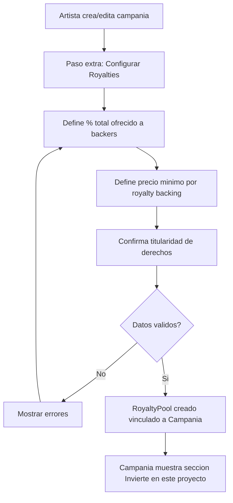
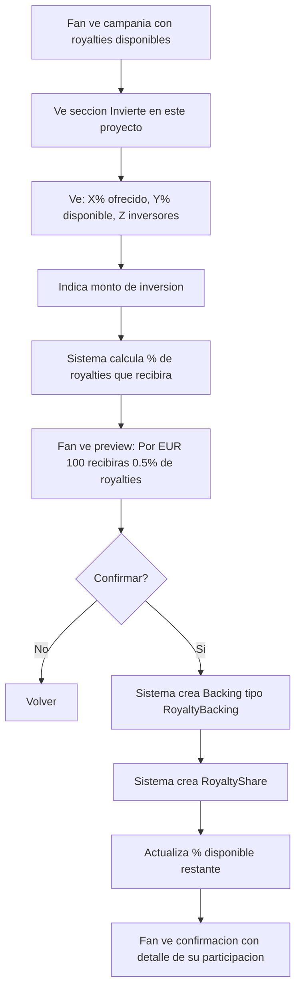
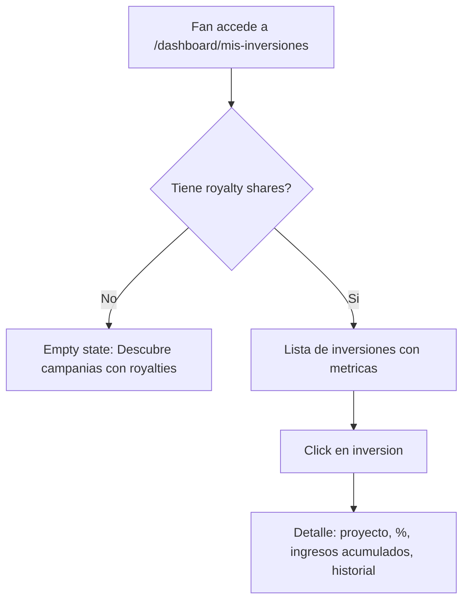
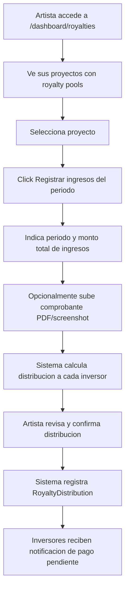

# US-CF-01: Backing con Royalties Tokenizados

> **ID:** US-CF-01
> **Feature Name:** `cf-backing-royalties-tokenizados`
> **Prioridad:** Alta
> **Estimacion:** XXL (Extra Extra Large)
> **Modulo:** Crowdfunding (extension)
> **Dependencias:** US-04 (Hacer Backing), US-02 (Crear Campania)
> **Feature Origen:** F-01 del [analisis de funcionalidades](../analisis/20260217_analisis-funcionalidades-industria-musical.md#f-01-royalties-tokenizados--backing-con-retorno)

---

## Historia de Usuario

**Como** fan inversor,
**Quiero** apoyar una campania de crowdfunding y recibir a cambio un porcentaje de los royalties futuros del proyecto musical financiado,
**Para** participar economicamente en el exito del artista al que apoyo, recibiendo ingresos proporcionales a mi aportacion cuando la musica genere revenue por streaming, sync u otras fuentes.

---

## Actores

| Actor | Descripcion |
|-------|-------------|
| Artista | Crea campania y define el % de royalties que ofrece a backers |
| Fan Inversor | Aporta fondos a la campania a cambio de royalty shares |
| Sistema | Calcula proporciones, registra participaciones, distribuye royalties |

---

## Precondiciones

- Campania existe en estado BORRADOR o PUBLICADA
- Artista ha definido el porcentaje de royalties que ofrece (ej: 15%)
- Artista ha confirmado que posee los derechos de la musica que se financiara
- Fan inversor tiene cuenta activa y verificada en la plataforma

## Postcondiciones

- Backing registrado con tipo "RoyaltyBacking"
- RoyaltyShare creado con el porcentaje proporcional a la aportacion del fan
- Fan puede ver sus royalty shares en su dashboard
- Artista ve el desglose de participaciones en su dashboard

---

## Justificacion

El modelo de crowdfunding basado en donaciones/rewards tiene un techo natural: el fan paga y recibe un producto puntual. El modelo de **royalties tokenizados** transforma al fan en **co-inversor**, creando:

1. **Mayor ticket promedio**: El backer tiene incentivo financiero, no solo emocional
2. **Promocion organica**: El inversor esta incentivado a difundir la musica (su retorno depende del exito)
3. **Retencion**: El inversor mantiene vinculo a largo plazo con el artista
4. **Diferenciacion**: Ningun competidor combina crowdfunding + royalty sharing + ecosistema de servicios

**Mercado validado**: Royal.io ($7.5M trading, $156K royalties pagados), Corite (EUR 6.2M raised), SongVest (SEC Reg A+). Mercado de inversion en royalties musicales: $5.2B (2024) → $12.4B (2033).

---

## Alcance de esta US

### Incluido

1. Configuracion de "Royalty Pool" al crear campania
2. Nuevo tipo de backing: "Backing con Royalties"
3. Calculo automatico de participacion proporcional
4. Dashboard del inversor con royalty shares
5. Dashboard del artista con desglose de participaciones
6. Registro de ingresos y distribucion (manual en Fase 1, automatizado en Fase 4 con F-16)

### Excluido (fases posteriores)

- Smart contracts en blockchain (ver F-16)
- Marketplace secundario de royalty tokens (ver F-16)
- Compliance SEC/regulatorio (requiere asesoria legal previa)
- Integracion automatica con distribuidoras de streaming

---

## Flujo Principal: Artista Configura Royalty Pool



### Campos de Configuracion - Royalty Pool

| Campo | Tipo | Obligatorio | Validacion |
|-------|------|-------------|------------|
| Porcentaje total ofrecido | Decimal (%) | Si | 1% - 30% (cap para proteger al artista) |
| Importe minimo por royalty backing | Decimal (EUR) | Si | >= 10 EUR |
| Importe maximo por royalty backing | Decimal (EUR) | No | > importe minimo |
| Moneda | Select (MaestraMoneda) | Si | Default: EUR |
| Declaracion de titularidad | Checkbox | Si | Debe aceptar |
| Fuentes de revenue incluidas | Multi-select | Si | Streaming, Sync, Performance, Todas |
| Duracion del royalty sharing | Select | Si | 2 anos, 5 anos, 10 anos, Perpetuo |
| Max inversores | Entero | No | >= 1 (null = sin limite) |

---

## Flujo Principal: Fan Realiza Royalty Backing



### Calculo de Participacion

```
Ejemplo:
- Campania objetivo: 10,000 EUR
- Royalty Pool: 15% del revenue futuro
- Fan invierte: 500 EUR (5% del objetivo)
- Participacion del fan: 15% * (500/10,000) = 0.75% del revenue total

Formula:
  fan_share = pool_percentage * (fan_investment / campaign_total_raised)
```

**Nota**: La participacion se recalcula al cierre de la campania basandose en el total real recaudado, no en el objetivo.

### Pantalla de Inversion

```
+--------------------------------------------------+
|  INVIERTE EN ESTE PROYECTO                        |
+--------------------------------------------------+
|                                                    |
|  El artista ofrece 15% de los royalties futuros   |
|  a los inversores de esta campania.                |
|                                                    |
|  Disponible: 12.3% de 15% (18 inversores)         |
|  [=============================--------] 82%       |
|                                                    |
|  Revenue incluido: Streaming, Sync                 |
|  Duracion: 5 anos desde release                    |
|                                                    |
|  Tu inversion                                      |
|  [______500_______] EUR                            |
|                                                    |
|  Recibiras aproximadamente:                        |
|  +----------------------------------------------+ |
|  | 0.75% de todos los ingresos del proyecto      | |
|  | durante 5 anos                                | |
|  +----------------------------------------------+ |
|                                                    |
|  [ ] He leido y acepto los terminos de inversion   |
|                                                    |
|  [Cancelar]              [Invertir 500 EUR]        |
+--------------------------------------------------+
```

---

## Flujo Principal: Dashboard del Inversor



### Datos del Dashboard

**Vista lista:**

| Dato | Fuente |
|------|--------|
| Proyecto / Campania | Campania.Titulo |
| Artista | Artista.NombreArtistico |
| Mi inversion | RoyaltyShare.ImporteInvertido |
| Mi % de royalties | RoyaltyShare.PorcentajeParticipacion |
| Ingresos acumulados | SUM(RoyaltyDistributionDetail.Importe) |
| Ultimo pago | MAX(RoyaltyDistributionDetail.FechaPago) |
| Estado | RoyaltyShare.Estado (Activo, Pendiente Release, Finalizado) |

**Vista detalle:**

| Dato | Fuente |
|------|--------|
| Todo lo de la lista | - |
| Historial de pagos mensuales | RoyaltyDistributionDetail[] |
| Desglose por fuente (streaming, sync, etc.) | RoyaltyDistributionDetail.FuenteRevenue |
| Grafico de ingresos en el tiempo | Agregacion mensual |
| Fecha de vencimiento del royalty sharing | RoyaltyPool.FechaFin |
| Link a la campania original | Campania.Id |

---

## Flujo Principal: Artista Registra Ingresos y Distribucion

> **Fase 1**: Registro manual. El artista sube reportes de revenue y el sistema calcula/distribuye.
> **Fase 4** (F-16): Automatizado via smart contracts e integracion con distribuidoras.



### Campos - Registro de Ingresos

| Campo | Tipo | Obligatorio | Validacion |
|-------|------|-------------|------------|
| Periodo | Mes/Ano | Si | No puede ser futuro |
| Importe total ingresos del periodo | Decimal | Si | > 0 |
| Fuente de revenue | Multi-select | Si | Streaming, Sync, Performance, Otro |
| URL comprobante | URL | No | Formato valido |
| Notas | Texto | No | Max 500 caracteres |

### Calculo de Distribucion

```
Ejemplo:
- Revenue del periodo: 1,000 EUR
- Comision plataforma: 5% = 50 EUR
- Revenue distribuible: 950 EUR
- Pool royalties: 15% → 142.50 EUR para pool de inversores
- Artista retiene: 85% → 807.50 EUR

Distribucion del pool:
- Inversor A (0.75%): 142.50 * (0.75/15) = 7.125 EUR
- Inversor B (2.00%): 142.50 * (2.00/15) = 19.00 EUR
- ... (proporcional a cada share)
```

---

## Flujos Alternativos

| ID | Condicion | Accion |
|----|-----------|--------|
| FA-01 | Fan intenta invertir mas del % disponible | Error: "Solo queda X% disponible, tu inversion maxima es Y EUR" |
| FA-02 | Campania no alcanza objetivo (all-or-nothing) | Royalty shares se cancelan, fondos se devuelven |
| FA-03 | Artista no registra ingresos en 3+ meses | Notificacion automatica a inversores. Warning en dashboard |
| FA-04 | Fan intenta invertir sin cuenta verificada | Redirigir a verificacion de cuenta |
| FA-05 | Pool de royalties llega a 0% disponible | Seccion de inversion desaparece, mostrar "Sold out" |
| FA-06 | Campania usa modelo "keep what you raise" | Shares se calculan sobre el monto real recaudado al cierre |

---

## Criterios de Aceptacion

| ID | Criterio | Metodo de Prueba |
|----|----------|------------------|
| AC-CF01-1 | Un artista puede crear un Royalty Pool al configurar su campania, definiendo % total (1-30%), importe minimo de inversion, fuentes de revenue y duracion | Crear campania con royalty pool, verificar en BD |
| AC-CF01-2 | El artista debe aceptar declaracion de titularidad de derechos antes de activar royalties | Intentar sin aceptar, verificar error |
| AC-CF01-3 | Un fan puede realizar un "Royalty Backing" indicando monto y recibiendo preview del % que obtendra | Completar flujo, verificar calculo |
| AC-CF01-4 | El sistema calcula correctamente la participacion: `pool% * (inversion / total_recaudado)` | Crear multiples backings, verificar proporciones |
| AC-CF01-5 | Las participaciones se recalculan al cierre de la campania sobre el total real recaudado | Cerrar campania, verificar recalculo |
| AC-CF01-6 | El fan ve sus royalty shares en /dashboard/mis-inversiones con: proyecto, %, ingresos acumulados | Verificar dashboard despues de backing |
| AC-CF01-7 | El artista puede registrar ingresos de un periodo y el sistema distribuye proporcionalmente | Registrar ingreso, verificar distribucion por inversor |
| AC-CF01-8 | La comision de plataforma se descuenta antes de calcular la distribucion (default 5%) | Registrar ingreso, verificar que plataforma retiene 5% |
| AC-CF01-9 | El fan no puede invertir si el % disponible del pool es 0% | Intentar inversion con pool agotado, verificar error |
| AC-CF01-10 | Si la campania es all-or-nothing y no alcanza objetivo, los royalty shares se cancelan | Expirar campania sin alcanzar objetivo, verificar cancelacion |
| AC-CF01-11 | El inversor recibe notificacion cuando el artista registra ingresos del periodo | Registrar ingresos, verificar notificacion |
| AC-CF01-12 | El % total ofrecido no puede superar 30% (proteccion del artista) | Intentar configurar 35%, verificar error |

---

## Especificacion Tecnica

### API Endpoints

#### POST /api/campanias/{id}/royalty-pool

Crear/configurar royalty pool de una campania.

**Auth:** Artista (propietario de la campania)

**Request:**
```json
{
    "porcentajeTotalOfrecido": 15.00,
    "importeMinimoInversion": 10.00,
    "importeMaximoInversion": 5000.00,
    "monedaId": 1,
    "fuentesRevenueIds": [1, 2],
    "duracionAnosId": 2,
    "maxInversores": null,
    "aceptaTitularidadDerechos": true
}
```

**Response 201 Created:**
```json
{
    "data": {
        "id": "guid",
        "campaniaId": "guid",
        "porcentajeTotalOfrecido": 15.00,
        "porcentajeDisponible": 15.00,
        "numInversores": 0,
        "duracionAnos": 5,
        "fuentesRevenue": ["Streaming", "Sync"]
    },
    "messages": [
        { "message": "Royalty pool configurado", "errorCode": "0001" }
    ]
}
```

---

#### GET /api/campanias/{id}/royalty-pool

Obtener info del royalty pool de una campania (publico).

**Auth:** Cualquier usuario autenticado

**Response 200 OK:**
```json
{
    "data": {
        "id": "guid",
        "porcentajeTotalOfrecido": 15.00,
        "porcentajeDisponible": 12.30,
        "numInversores": 18,
        "importeMinimoInversion": 10.00,
        "importeMaximoInversion": 5000.00,
        "duracionAnos": 5,
        "fuentesRevenue": ["Streaming", "Sync"],
        "monedaNombre": "EUR"
    },
    "messages": []
}
```

---

#### POST /api/campanias/{id}/royalty-backings

Realizar un royalty backing (inversion).

**Auth:** Fan inversor (autenticado, verificado)

**Request:**
```json
{
    "importeInversion": 500.00,
    "aceptaTerminosInversion": true
}
```

**Response 201 Created:**
```json
{
    "data": {
        "backingId": "guid",
        "royaltyShareId": "guid",
        "importeInversion": 500.00,
        "porcentajeEstimado": 0.75,
        "nota": "El porcentaje final se calculara al cierre de la campania"
    },
    "messages": [
        { "message": "Inversion registrada", "errorCode": "0001" }
    ]
}
```

---

#### GET /api/mis-inversiones

Listar royalty shares del usuario autenticado.

**Auth:** Fan inversor

**Query params:** `estado`, `page`, `pageSize`

**Response 200 OK:**
```json
{
    "data": {
        "items": [
            {
                "royaltyShareId": "guid",
                "campaniaTitulo": "Mi Primer Album",
                "artistaNombre": "DJ Nova",
                "importeInversion": 500.00,
                "porcentajeParticipacion": 0.75,
                "ingresosAcumulados": 23.50,
                "ultimoPago": "2026-01-15T00:00:00Z",
                "estado": "Activo",
                "duracionRestanteMeses": 48
            }
        ],
        "totalCount": 3,
        "page": 1,
        "pageSize": 10,
        "totalInvertido": 1500.00,
        "totalIngresosAcumulados": 67.25
    },
    "messages": []
}
```

---

#### POST /api/royalty-pools/{poolId}/distribuciones

Registrar ingresos de un periodo y distribuir.

**Auth:** Artista (propietario)

**Request:**
```json
{
    "periodo": "2026-01",
    "importeTotalIngresos": 1000.00,
    "fuentesRevenueIds": [1],
    "urlComprobante": "https://storage.weplay.com/reports/enero-2026.pdf",
    "notas": "Reporte Spotify + Apple Music enero 2026"
}
```

**Response 201 Created:**
```json
{
    "data": {
        "distribucionId": "guid",
        "periodo": "2026-01",
        "importeTotalIngresos": 1000.00,
        "comisionPlataforma": 50.00,
        "importeDistribuido": 142.50,
        "importeRetenidoArtista": 807.50,
        "numInversoresBeneficiados": 18,
        "detalle": [
            {
                "inversorId": "guid",
                "porcentaje": 0.75,
                "importeDistribuido": 7.13
            }
        ]
    },
    "messages": [
        { "message": "Distribucion registrada. 18 inversores notificados", "errorCode": "0001" }
    ]
}
```

---

### Modelo de Datos

#### Entidades Nuevas

```
RoyaltyPool
  Id                        UNIQUEIDENTIFIER (PK)
  CampaniaId                FK → Campania
  PorcentajeTotalOfrecido   DECIMAL(5,2)
  PorcentajeDisponible      DECIMAL(5,2)
  ImporteMinimoInversion    DECIMAL(18,2)
  ImporteMaximoInversion?   DECIMAL(18,2)
  MonedaId                  FK → MaestraMoneda
  DuracionAnosId            FK → MaestraDuracionRoyalty
  MaxInversores?            INT
  NumInversoresActual       INT DEFAULT 0
  AceptaTitularidad         BIT
  EstadoPoolId              FK → MaestraEstadoRoyaltyPool
  FechaInicioRoyalties?     DATETIME2(3)
  FechaFinRoyalties?        DATETIME2(3)
  FechaCreacion             DATETIME2(3)
  FechaActualizacion?       DATETIME2(3)

RoyaltyPoolFuenteRevenue (M:N)
  Id                        UNIQUEIDENTIFIER (PK)
  RoyaltyPoolId             FK → RoyaltyPool
  FuenteRevenueId           FK → MaestraFuenteRevenue

RoyaltyShare
  Id                        UNIQUEIDENTIFIER (PK)
  RoyaltyPoolId             FK → RoyaltyPool
  BackingId                 FK → Backing
  InversorUserId            FK → Users
  ImporteInvertido          DECIMAL(18,2)
  PorcentajeEstimado        DECIMAL(8,4)
  PorcentajeFinal?          DECIMAL(8,4)
  EstadoShareId             FK → MaestraEstadoRoyaltyShare
  IngresosAcumulados        DECIMAL(18,2) DEFAULT 0
  FechaCreacion             DATETIME2(3)
  FechaActualizacion?       DATETIME2(3)

RoyaltyDistribution
  Id                        UNIQUEIDENTIFIER (PK)
  RoyaltyPoolId             FK → RoyaltyPool
  Periodo                   NVARCHAR(7)  -- "2026-01"
  ImporteTotalIngresos      DECIMAL(18,2)
  ComisionPlataforma        DECIMAL(18,2)
  ImporteDistribuible       DECIMAL(18,2)
  ImportePool               DECIMAL(18,2)
  ImporteRetenidoArtista    DECIMAL(18,2)
  UrlComprobante?           NVARCHAR(500)
  Notas?                    NVARCHAR(500)
  FechaCreacion             DATETIME2(3)

RoyaltyDistributionDetail
  Id                        UNIQUEIDENTIFIER (PK)
  RoyaltyDistributionId     FK → RoyaltyDistribution
  RoyaltyShareId            FK → RoyaltyShare
  InversorUserId            FK → Users
  PorcentajeParticipacion   DECIMAL(8,4)
  ImporteDistribuido        DECIMAL(18,2)
  FuenteRevenueId           FK → MaestraFuenteRevenue
  EstadoPagoId              FK → MaestraEstadoPago
  FechaCreacion             DATETIME2(3)
```

#### Tablas Maestras Nuevas

```
MaestraFuenteRevenue
  1 = Streaming
  2 = Sync Licensing
  3 = Performance (conciertos)
  4 = Otro

MaestraDuracionRoyalty
  1 = 2 anos
  2 = 5 anos
  3 = 10 anos
  4 = Perpetuo

MaestraEstadoRoyaltyPool
  1 = Configurado (campania en borrador)
  2 = Activo (campania publicada, aceptando inversiones)
  3 = Cerrado (campania cerrada, no mas inversiones)
  4 = En Distribucion (campania cerrada, royalties activos)
  5 = Finalizado (duracion cumplida)
  6 = Cancelado

MaestraEstadoRoyaltyShare
  1 = Estimado (campania abierta, % provisional)
  2 = Confirmado (campania cerrada, % final calculado)
  3 = Activo (recibiendo distribuciones)
  4 = Finalizado (duracion cumplida)
  5 = Cancelado (campania no alcanzo objetivo)
```

#### Modificaciones a Entidades Existentes

```
Backing (agregar campo)
  TipoBackingId             FK → MaestraTipoBacking (nuevo)

MaestraTipoBacking (nuevo)
  1 = Reward (comportamiento actual)
  2 = SinRecompensa (comportamiento actual)
  3 = RoyaltyBacking (nuevo)
```

---

## Notas de Implementacion

- **Fase 1** (esta US): Registro manual de ingresos por el artista. Sin blockchain. Sin marketplace secundario
- **Fase 4** (F-16): Migracion a smart contracts, distribucion automatica, marketplace de tokens
- El recalculo de participaciones al cierre de campania debe ser transaccional
- La comision de plataforma (5%) se configura a nivel de sistema, no por campania
- Los porcentajes se almacenan con 4 decimales para precision en distribuciones
- El artista NO puede modificar el % total ofrecido despues de que haya al menos 1 inversor
- Handler CQRS: Command + Handler en mismo archivo, inyectar Service (no DbContext)
- Validaciones usan ServiceResponseMessageType constants
