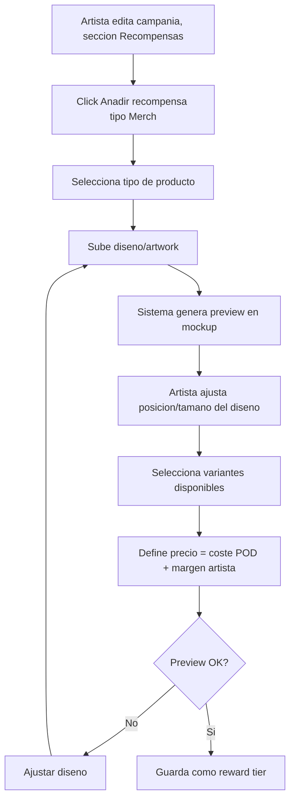
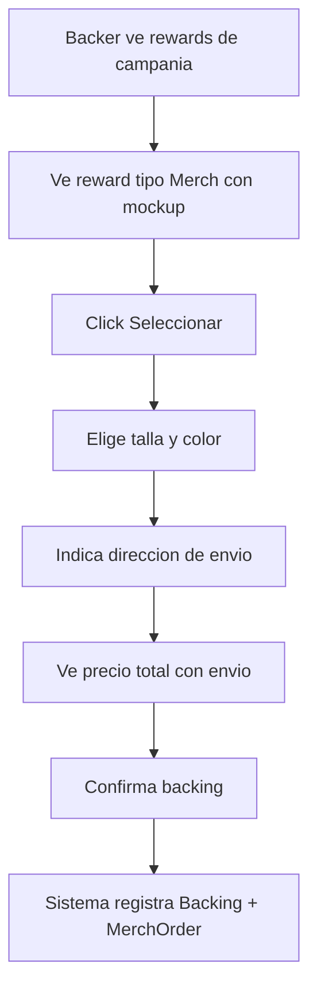
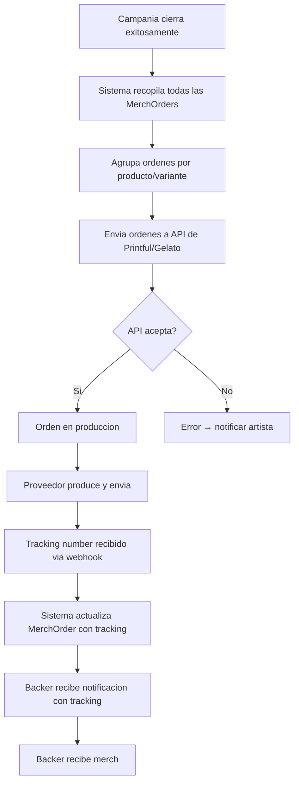

# US-CF-02: Merchandise Print-on-Demand Integrado

> **ID:** US-CF-02
> **Feature Name:** `cf-merch-print-on-demand`
> **Prioridad:** Alta
> **Estimacion:** L (Large)
> **Modulo:** Crowdfunding (extension)
> **Dependencias:** US-03 (Definir Recompensas), US-04 (Hacer Backing)
> **Feature Origen:** F-03 del [analisis de funcionalidades](../analisis/20260217_analisis-funcionalidades-industria-musical.md#f-03-merch-print-on-demand-integrado)

---

## Historia de Usuario

**Como** artista,
**Quiero** ofrecer merchandise fisico (camisetas, posters, tote bags, vinilos) como recompensa de mi campania sin tener que gestionar inventario, produccion ni envios,
**Para** poder ofrecer recompensas fisicas atractivas que aumenten los backings sin asumir riesgo logistico ni inversion upfront.

---

## Actores

| Actor | Descripcion |
|-------|-------------|
| Artista | Diseña merch y lo configura como reward tier |
| Fan / Backer | Selecciona merch, elige variante (talla/color), recibe en casa |
| Proveedor POD | Printful/Gelato produce y envia bajo demanda |
| Sistema | Orquesta ordenes entre campania exitosa y proveedor POD |

---

## Precondiciones

- Campania existe (cualquier estado)
- Artista tiene disenos listos (imagenes PNG/SVG con especificaciones del proveedor)
- Integracion API con proveedor POD configurada (Printful o Gelato)

## Postcondiciones

- Reward tipo "Merch POD" creado con variantes (tallas, colores)
- Al cerrar campania exitosa, ordenes se envian automaticamente al proveedor POD
- Backer recibe tracking de envio
- Artista nunca toca inventario

---

## Justificacion

El merchandise fisico es uno de los reward tiers mas atractivos en crowdfunding musical, pero la **barrera logistica** (comprar stock upfront, almacenar, embalar, enviar) disuade a artistas independientes. Print-on-Demand elimina esta barrera completamente.

**Mercado POD**: $12.96B (2025) → $102.99B (2034). Printful y Gelato (30+ paises con produccion local) ofrecen APIs maduras.

**Impacto esperado**: Aumento del ticket promedio de backing en 30-50% cuando hay merch fisico disponible vs solo rewards digitales.

---

## Alcance de esta US

### Incluido

1. Nuevo tipo de reward: "Merch POD"
2. Configuracion de producto POD (tipo, diseno, variantes)
3. Seleccion de variante por backer (talla, color)
4. Envio automatico de ordenes al proveedor al cierre de campania exitosa
5. Tracking de estado de ordenes
6. Dashboard de artista con estado de fulfillment

### Excluido

- Tienda permanente de merch (feature futura F-20)
- Produccion custom fuera del catalogo del proveedor POD
- Gestion de devoluciones (se delega al proveedor POD)

---

## Flujo Principal: Artista Configura Merch POD



### Paso 1: Seleccion de Producto

| Tipo de Producto | Proveedor | Coste Base Aprox. | Precio Sugerido |
|-----------------|-----------|-------------------|-----------------|
| Camiseta unisex | Printful | 12-15 EUR | 25-35 EUR |
| Hoodie | Printful | 25-30 EUR | 45-55 EUR |
| Poster A3 | Printful | 5-8 EUR | 15-20 EUR |
| Tote bag | Printful | 8-10 EUR | 18-25 EUR |
| Vinyl sticker pack | Printful | 3-5 EUR | 8-12 EUR |
| Phone case | Printful | 10-12 EUR | 20-28 EUR |

### Paso 2: Configuracion de Diseno

| Campo | Tipo | Obligatorio | Validacion |
|-------|------|-------------|------------|
| Tipo de producto | Select | Si | Del catalogo POD |
| Archivo de diseno | Upload (PNG/SVG) | Si | Min 300 DPI, formato segun producto |
| Posicion del diseno | Visual editor | Si | Drag & drop sobre mockup |
| Nombre del reward | Texto (max 100) | Si | Min 3 caracteres |
| Descripcion | Texto (max 500) | Si | Min 10 caracteres |

### Paso 3: Variantes

| Campo | Tipo | Obligatorio |
|-------|------|-------------|
| Tallas disponibles | Multi-select (S, M, L, XL, XXL) | Si (si aplica al producto) |
| Colores disponibles | Multi-select (del catalogo POD) | Si (si aplica) |
| Stock limitado | Checkbox | No (default: ilimitado) |
| Cantidad maxima | Entero | Solo si stock limitado |

### Paso 4: Pricing

```
Precio del reward = Coste POD + Envio estimado + Margen artista + Comision plataforma

Ejemplo camiseta:
  Coste POD:             13.50 EUR
  Envio estimado:         5.00 EUR
  Margen artista:        10.00 EUR
  Comision plataforma:    1.43 EUR (5% del total)
  = Precio al backer:    29.93 EUR → redondeado a 30 EUR
```

El sistema muestra al artista un **calculador en tiempo real** con el desglose.

---

## Flujo Principal: Backer Selecciona Merch



### Campos del Backer

| Campo | Tipo | Obligatorio | Validacion |
|-------|------|-------------|------------|
| Talla | Select | Si (si aplica) | De las disponibles |
| Color | Select | Si (si aplica) | De los disponibles |
| Nombre completo | Texto | Si | Min 2 caracteres |
| Direccion linea 1 | Texto | Si | Min 5 caracteres |
| Direccion linea 2 | Texto | No | - |
| Ciudad | Texto | Si | Min 2 caracteres |
| Codigo postal | Texto | Si | Formato segun pais |
| Pais | Select | Si | De la lista de paises con envio POD |
| Telefono | Texto | No | Para courier |

---

## Flujo Principal: Fulfillment Post-Campania



---

## Flujos Alternativos

| ID | Condicion | Accion |
|----|-----------|--------|
| FA-01 | Campania no alcanza objetivo (all-or-nothing) | MerchOrders se cancelan, fondos se devuelven. No se envia nada a POD |
| FA-02 | Producto agotado en proveedor POD | Notificar artista, ofrecer producto alternativo al backer |
| FA-03 | Envio falla (direccion invalida) | Notificar backer para corregir direccion. Reintentar envio |
| FA-04 | Backer quiere cambiar talla/color | Permitir cambio si campania aun no cerro. Despues de cierre: contactar soporte |
| FA-05 | Artista quiere agregar nuevo producto merch | Permitir mientras campania este en borrador o activa sin backings de ese reward |

---

## Criterios de Aceptacion

| ID | Criterio | Metodo de Prueba |
|----|----------|------------------|
| AC-CF02-1 | El artista puede crear un reward tipo "Merch POD" seleccionando producto del catalogo | Crear reward merch, verificar en BD |
| AC-CF02-2 | El artista puede subir diseno y ver preview en mockup del producto | Subir PNG, verificar preview generado |
| AC-CF02-3 | El sistema muestra calculador de precio con desglose (coste POD + envio + margen) | Crear producto, verificar calculo |
| AC-CF02-4 | El backer puede seleccionar talla y color al hacer backing con reward merch | Completar backing con variante, verificar MerchOrder |
| AC-CF02-5 | El backer debe indicar direccion de envio completa para reward tipo merch | Intentar sin direccion, verificar error |
| AC-CF02-6 | Al cerrar campania exitosa, las ordenes se envian automaticamente al proveedor POD | Cerrar campania, verificar llamada API POD |
| AC-CF02-7 | El backer recibe notificacion con tracking number cuando el proveedor envia | Simular webhook de tracking, verificar notificacion |
| AC-CF02-8 | El artista ve dashboard de fulfillment con estado de cada orden (Pendiente, En produccion, Enviado, Entregado) | Verificar dashboard post-cierre |
| AC-CF02-9 | Si la campania no alcanza objetivo, las MerchOrders se cancelan y no se envia nada al POD | Expirar campania, verificar cancelacion |
| AC-CF02-10 | El precio del reward incluye coste POD + envio estimado + margen artista | Verificar que precio final cubre costes |

---

## Especificacion Tecnica

### API Endpoints

#### POST /api/campanias/{id}/rewards/merch

Crear reward tipo merch POD.

**Auth:** Artista (propietario)

**Request:**
```json
{
    "nombre": "Camiseta Edicion Limitada - Album X",
    "descripcion": "Camiseta unisex con artwork exclusivo del album",
    "tipoProductoPodId": 1,
    "urlDiseno": "https://storage.weplay.com/designs/album-x-front.png",
    "posicionDiseno": { "x": 50, "y": 30, "width": 300, "height": 400 },
    "tallasDisponibles": ["S", "M", "L", "XL"],
    "coloresDisponibles": ["Negro", "Blanco"],
    "precioReward": 30.00,
    "monedaId": 1,
    "stockLimitado": true,
    "cantidadMaxima": 100
}
```

**Response 201 Created:**
```json
{
    "data": {
        "rewardId": "guid",
        "nombre": "Camiseta Edicion Limitada - Album X",
        "tipoProducto": "Camiseta Unisex",
        "urlMockup": "https://storage.weplay.com/mockups/generated-123.png",
        "precioReward": 30.00,
        "costePod": 13.50,
        "envioEstimado": 5.00,
        "margenArtista": 10.07,
        "comisionPlataforma": 1.43
    },
    "messages": [
        { "message": "Reward merch creado", "errorCode": "0001" }
    ]
}
```

---

#### POST /api/campanias/{campaniaId}/backings/merch

Realizar backing con reward merch (incluye direccion de envio).

**Auth:** Fan (autenticado)

**Request:**
```json
{
    "rewardId": "guid",
    "monto": 30.00,
    "talla": "L",
    "color": "Negro",
    "direccionEnvio": {
        "nombreCompleto": "Juan Garcia",
        "linea1": "Calle Mayor 15, 3o B",
        "linea2": null,
        "ciudad": "Madrid",
        "codigoPostal": "28001",
        "paisId": 6,
        "telefono": "+34 612 345 678"
    },
    "mensaje": "Gran album!",
    "esAnonimo": false
}
```

---

#### GET /api/campanias/{id}/merch-orders

Dashboard de fulfillment del artista.

**Auth:** Artista (propietario)

**Response 200 OK:**
```json
{
    "data": {
        "resumen": {
            "totalOrdenes": 87,
            "pendientes": 0,
            "enProduccion": 12,
            "enviadas": 60,
            "entregadas": 15
        },
        "items": [
            {
                "orderId": "guid",
                "backerUsername": "musiclover92",
                "producto": "Camiseta Unisex",
                "talla": "L",
                "color": "Negro",
                "estado": "Enviado",
                "trackingNumber": "1Z999AA10123456784",
                "trackingUrl": "https://tracking.printful.com/...",
                "fechaOrden": "2026-02-10",
                "fechaEnvio": "2026-02-14"
            }
        ]
    },
    "messages": []
}
```

---

### Modelo de Datos

```
MerchRewardConfig (extension de Reward)
  Id                      UNIQUEIDENTIFIER (PK)
  RewardId                FK → Reward
  TipoProductoPodId       FK → MaestraTipoProductoPod
  UrlDiseno               NVARCHAR(500)
  PosicionDiseno          NVARCHAR(500) -- JSON
  UrlMockupGenerado       NVARCHAR(500)
  CostePodUnitario        DECIMAL(18,2)
  EnvioEstimado           DECIMAL(18,2)
  TallasDisponibles       NVARCHAR(200) -- JSON array
  ColoresDisponibles      NVARCHAR(200) -- JSON array
  ProveedorPodId          FK → MaestraProveedorPod
  ProductoExternoPodId    NVARCHAR(100) -- ID en API del proveedor
  FechaCreacion           DATETIME2(3)

MerchOrder
  Id                      UNIQUEIDENTIFIER (PK)
  BackingId               FK → Backing
  MerchRewardConfigId     FK → MerchRewardConfig
  TallaSeleccionada       NVARCHAR(10)
  ColorSeleccionado       NVARCHAR(50)
  NombreCompleto          NVARCHAR(200)
  DireccionLinea1         NVARCHAR(300)
  DireccionLinea2?        NVARCHAR(300)
  Ciudad                  NVARCHAR(100)
  CodigoPostal            NVARCHAR(20)
  PaisId                  FK → MaestraPais
  Telefono?               NVARCHAR(50)
  EstadoOrdenId           FK → MaestraEstadoMerchOrder
  OrdenExternaPodId?      NVARCHAR(100) -- ID en API del proveedor
  TrackingNumber?         NVARCHAR(100)
  TrackingUrl?            NVARCHAR(500)
  FechaEnvioAPod?         DATETIME2(3)
  FechaProduccion?        DATETIME2(3)
  FechaEnvio?             DATETIME2(3)
  FechaEntrega?           DATETIME2(3)
  FechaCreacion           DATETIME2(3)
  FechaActualizacion?     DATETIME2(3)

MaestraTipoProductoPod
  1 = Camiseta Unisex
  2 = Hoodie
  3 = Poster A3
  4 = Tote Bag
  5 = Vinyl Sticker Pack
  6 = Phone Case
  7 = Mug

MaestraEstadoMerchOrder
  1 = Pendiente (campania abierta)
  2 = Confirmada (campania cerrada exitosa)
  3 = Enviada a POD
  4 = En Produccion
  5 = Enviada (con tracking)
  6 = Entregada
  7 = Cancelada
  8 = Error

MaestraProveedorPod
  1 = Printful
  2 = Gelato
```

---

## Notas de Implementacion

- **Integracion API**: Usar Printful API v2 (REST, bien documentada). Gelato como fallback
- Las ordenes NO se envian al POD hasta que la campania cierre exitosamente
- Webhook del proveedor POD para recibir actualizaciones de estado y tracking
- El mockup se genera via API del proveedor (Printful Mockup Generator)
- Almacenar disenos en Azure Blob Storage con acceso restringido
- El coste POD incluye produccion. El envio se estima segun pais del backer
- El margen del artista = precio reward - coste POD - envio - comision plataforma
- Si el margen es negativo, advertir al artista y no permitir guardar
- Handler CQRS: Command + Handler en mismo archivo, inyectar Service (no DbContext)
