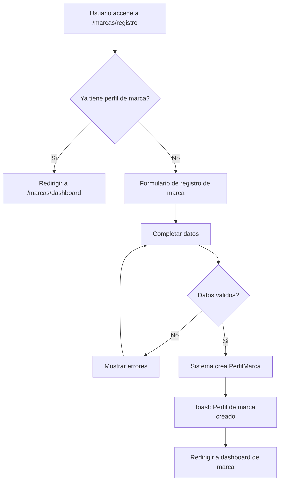
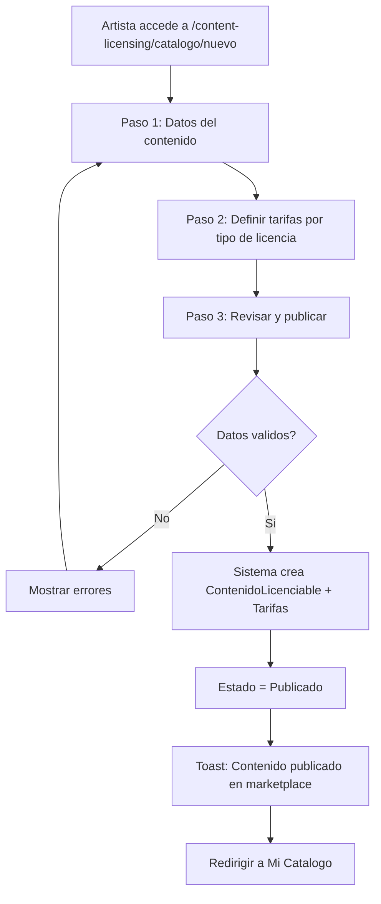
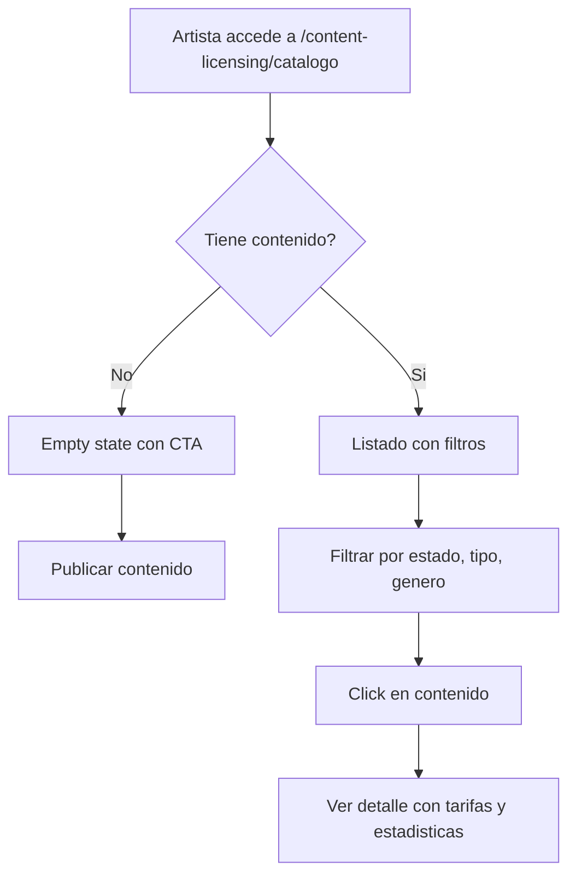

# US-CL-01: Foundation del Modulo, Perfil de Marca y Catalogo de Contenido

> **ID:** US-CL-01
> **Feature Name:** `cl-foundation-perfil-marca-catalogo`
> **Prioridad:** Alta
> **Estimacion:** XXL (Extra Extra Large)
> **Modulo:** ContentLicensing
> **Dependencias:** Ninguna (punto de entrada al modulo)

---

## TAREA PREVIA: Revision de Agentes y Tooling

> **BLOQUEANTE:** Antes de implementar esta US, se debe verificar que el sistema de agentes
> soporta correctamente la creacion de un modulo NUEVO desde cero. Revisar:
>
> 1. **Migraciones EF Core**: Verificar que los agentes pueden generar migraciones para un nuevo DbContext
>    (`ContentLicensingContext`) independiente del `CrowdfundingContext` y `CrowdsourcingContext`.
> 2. **Scaffolding de dominio**: Verificar que `/new-entity` y los templates de `.claude/templates/api/`
>    soportan la creacion de entidades en un modulo nuevo (no solo Crowdfunding/Crowdsourcing).
> 3. **Nuevo DbContext por modulo**: Verificar que el patron de registro en `DependencyInjection.cs`
>    y `Program.cs` permite agregar un nuevo contexto sin romper los existentes.
> 4. **Tablas maestras compartidas**: Verificar que `MaestraMoneda`, `MaestraPais` y otras maestras
>    compartidas entre modulos se referencian correctamente desde el nuevo contexto.
> 5. **StronglyTypedIds**: Verificar que se pueden crear nuevos IDs tipados
>    (`ContenidoLicenciableId`, `PerfilMarcaId`, `AcuerdoLicenciaId`, etc.) en el nuevo modulo.
>
> **Si alguno de estos puntos no esta soportado, crear/adaptar los agentes necesarios ANTES de empezar.**

---

## Historia de Usuario

**Como** administrador de la plataforma,
**Quiero** establecer la infraestructura base del modulo Content Licensing, incluyendo el modelo de dominio, las migraciones de base de datos, el DbContext del modulo, la entidad PerfilMarca (compartida con Sponsorship) y la entidad ContenidoLicenciable con sus tarifas,
**Para** que los artistas puedan publicar su contenido para licenciamiento y las marcas puedan registrarse en la plataforma.

---

## Actores

| Actor | Descripcion |
|-------|-------------|
| Artista | Publica contenido licenciable en su catalogo |
| Marca | Se registra con un perfil de marca para interactuar con la plataforma |

---

## Precondiciones

- Modulo ContentLicensing creado con proyectos Domain, Application, Infra, WebApi
- Migracion ejecutada con todas las tablas maestras y entidades base
- Datos seed de maestras cargados

## Postcondiciones

- ContentLicensingContext operativo con todas las entidades configuradas
- Marca puede crear su PerfilMarca
- Artista puede publicar ContenidoLicenciable con TarifaLicencia

---

## Justificacion

Content Licensing es un modulo completamente nuevo que requiere infraestructura propia: DbContext, migraciones, entidades de dominio, tablas maestras y la entidad compartida PerfilMarca. Esta US establece los cimientos sobre los que se construiran las demas funcionalidades del modulo.

---

## Alcance de esta US

### A. Infraestructura del Modulo

1. Crear proyecto `WePlayRises.ContentLicensing.Domain`
2. Crear proyecto `WePlayRises.ContentLicensing.Application`
3. Crear proyecto `WePlayRises.ContentLicensing.Infra`
4. Crear proyecto `WePlayRises.ContentLicensing.WebApi`
5. Crear `ContentLicensingContext` con DbSets para todas las entidades
6. Registrar en `DependencyInjection.cs` y en `Program.cs`
7. Crear migracion inicial con todas las tablas
8. Cargar datos seed de maestras

### B. PerfilMarca (Entidad Compartida)

> **Nota:** PerfilMarca sera usada tambien por el modulo Sponsorship.
> Se ubica en ContentLicensing como modulo primario, con referencia cruzada.

### C. ContenidoLicenciable + TarifaLicencia

---

## Flujo Principal: Registrar Perfil de Marca



### Campos del Formulario - Registro de Marca

| Campo | Tipo | Obligatorio | Validacion |
|-------|------|-------------|------------|
| Nombre comercial | Texto (max 200) | Si | Min 2 caracteres |
| Razon social | Texto (max 300) | No | - |
| Sector | Select (MaestraSectorMarca) | Si | Debe existir en maestras |
| Tamano empresa | Select (MaestraTamanoEmpresa) | No | Debe existir en maestras |
| Pais | Select (MaestraPais) | No | Debe existir en maestras |
| URL sitio web | URL (max 300) | No | Formato URL valido |
| URL logo | URL (max 500) | No | Formato URL valido |
| Descripcion | Texto largo | No | Max 2000 caracteres |
| Persona de contacto | Texto (max 200) | Si | Min 2 caracteres |
| Email de contacto | Email (max 200) | Si | Formato email valido |
| Telefono de contacto | Texto (max 50) | No | - |

---

## Flujo Principal: Publicar Contenido Licenciable



### Paso 1: Datos del Contenido

| Campo | Tipo | Obligatorio | Validacion |
|-------|------|-------------|------------|
| Titulo | Texto (max 200) | Si | Min 3 caracteres |
| Descripcion | Texto largo | No | Max 4000 caracteres |
| Tipo de contenido | Select (MaestraTipoContenido) | Si | Debe existir en maestras |
| Genero musical | Select (MaestraGeneroMusical) | Si | Debe existir en maestras |
| Mood | Select (MaestraMoodContenido) | No | Debe existir en maestras |
| BPM | Entero | No | 20-300 |
| Tonalidad | Texto (max 10) | No | - |
| Duracion (segundos) | Entero | No | > 0 |
| URL archivo original | URL (max 500) | Si | URL valida |
| URL preview | URL (max 500) | No | URL valida |
| URL imagen portada | URL (max 500) | No | URL valida |
| Tags | Texto (max 500) | No | Comma-separated |
| Disponible para exclusiva | Boolean | Si | Default: false |
| Proyecto artistico | Select | No | FK a ProyectoArtistico del artista |

### Paso 2: Tarifas por Tipo de Licencia

El artista agrega N tarifas. Cada tarifa:

| Campo | Tipo | Obligatorio | Validacion |
|-------|------|-------------|------------|
| Tipo de licencia | Select (MaestraTipoLicencia) | Si | Debe existir en maestras |
| Tipo de uso | Select (MaestraTipoUsoLicencia) | Si | Debe existir en maestras |
| Moneda | Select (MaestraMoneda) | Si | Debe existir en maestras |
| Precio base | Decimal | Si | > 0 |
| Es negociable | Boolean | Si | Default: true |
| Precio minimo | Decimal | No | > 0, <= precio base (si negociable) |
| Duracion meses por defecto | Entero | Si | >= 1, default: 12 |
| Es exclusiva | Boolean | Si | Default: false |
| Territorio | Select (MaestraTerritorioLicencia) | No | Debe existir en maestras |

---

## Flujo Secundario: Listar Mi Catalogo



**Datos por contenido en listado:**

| Dato | Fuente |
|------|--------|
| Titulo | ContenidoLicenciable.Titulo |
| Tipo | MaestraTipoContenido.Nombre |
| Genero | MaestraGeneroMusical.Nombre |
| Estado (badge) | MaestraEstadoContenido.Nombre |
| Num solicitudes | ContenidoLicenciable.NumSolicitudes |
| Num licencias vendidas | ContenidoLicenciable.NumLicenciasVendidas |
| Num visualizaciones | ContenidoLicenciable.NumVisualizaciones |
| Fecha publicacion | ContenidoLicenciable.FechaPublicacion |

---

## Flujo Secundario: Editar Contenido Licenciable

- Artista puede editar metadatos y tarifas
- Si tiene solicitudes activas, mostrar aviso informativo
- No se pueden eliminar tarifas con acuerdos asociados
- Se puede pausar/reactivar contenido (cambiar estado)

---

## Flujo Secundario: Editar Perfil de Marca

- Todos los campos editables excepto sector (requiere contacto con soporte)
- Al guardar se actualiza FechaActualizacion

---

## Flujos Alternativos

| ID | Condicion | Accion |
|----|-----------|--------|
| FA-01 | Usuario ya tiene perfil de marca | Redirigir a dashboard |
| FA-02 | Artista no define ninguna tarifa | Permitir guardar como borrador |
| FA-03 | Artista no tiene ProyectoArtistico | Permitir publicar sin vincular proyecto |
| FA-04 | URL de archivo no accesible | Solo validar formato, no accesibilidad |

---

## Criterios de Aceptacion

| ID | Criterio | Metodo de Prueba |
|----|----------|------------------|
| AC-CL01-1 | El modulo ContentLicensing tiene DbContext propio (`ContentLicensingContext`) operativo con migraciones ejecutadas | Ejecutar migracion, verificar tablas en BD |
| AC-CL01-2 | Todas las tablas maestras del modulo tienen datos seed cargados | Verificar datos en BD tras migracion |
| AC-CL01-3 | Un usuario autenticado puede crear un PerfilMarca con nombre comercial, sector y datos de contacto | Completar formulario, verificar en BD |
| AC-CL01-4 | Un usuario no puede crear dos perfiles de marca (uno por UserId) | Intentar duplicado, verificar error |
| AC-CL01-5 | El perfil de marca se crea con EsVerificada = false y EsActiva = true | Verificar campos en BD |
| AC-CL01-6 | Un artista puede publicar contenido licenciable con al menos una tarifa | Completar wizard, verificar en BD |
| AC-CL01-7 | El contenido se crea con EstadoContenidoId = Publicado y contadores en 0 | Verificar campos en BD |
| AC-CL01-8 | El ArtistaId se asigna automaticamente desde el contexto del usuario | Verificar FK en BD |
| AC-CL01-9 | El artista ve un listado de su catalogo con badges de estado y contadores | Crear contenido, verificar listado |
| AC-CL01-10 | Se puede editar contenido y tarifas. Se actualiza FechaActualizacion | Editar, verificar cambios |
| AC-CL01-11 | Se puede pausar/reactivar contenido cambiando su estado | Pausar y reactivar, verificar estado |
| AC-CL01-12 | Las URLs se validan con formato correcto | Enviar URL invalida, verificar error |

---

## Especificacion Tecnica

### API Endpoints

#### POST /api/content-licensing/marcas

Crear perfil de marca.

**Auth:** Usuario autenticado

**Request:**
```json
{
  "nombreComercial": "SoundBrands Inc",
  "razonSocial": "SoundBrands International SL",
  "sectorId": 1,
  "tamanoEmpresaId": 3,
  "paisId": 6,
  "urlSitioWeb": "https://soundbrands.com",
  "urlLogo": "https://cdn.soundbrands.com/logo.png",
  "descripcion": "Agencia de publicidad especializada en marcas musicales",
  "personaContacto": "Laura Martinez",
  "emailContacto": "laura@soundbrands.com",
  "telefonoContacto": "+34 612 345 678"
}
```

**Response 201 Created:**
```json
{
  "data": {
    "id": "guid",
    "nombreComercial": "SoundBrands Inc",
    "sectorNombre": "Tecnologia",
    "esVerificada": false,
    "esActiva": true,
    "fechaCreacion": "2026-02-17T10:00:00Z"
  },
  "messages": [
    { "message": "Perfil de marca creado", "errorCode": "0001" }
  ]
}
```

---

#### GET /api/content-licensing/marcas/me

Obtener perfil de marca del usuario autenticado.

**Auth:** Marca (autenticado)

**Response 200 OK:**
```json
{
  "data": {
    "id": "guid",
    "nombreComercial": "SoundBrands Inc",
    "razonSocial": "SoundBrands International SL",
    "sectorId": 1,
    "sectorNombre": "Tecnologia",
    "tamanoEmpresaId": 3,
    "tamanoEmpresaNombre": "Mediana (51-250)",
    "paisNombre": "Espana",
    "urlSitioWeb": "https://soundbrands.com",
    "urlLogo": "https://cdn.soundbrands.com/logo.png",
    "descripcion": "Agencia de publicidad...",
    "personaContacto": "Laura Martinez",
    "emailContacto": "laura@soundbrands.com",
    "esVerificada": false,
    "esActiva": true,
    "totalSolicitudesLicencia": 5,
    "totalAcuerdosActivos": 2,
    "totalBriefsPublicados": 1
  },
  "messages": []
}
```

---

#### PUT /api/content-licensing/marcas/me

Editar perfil de marca.

**Auth:** Marca (autenticado)

---

#### POST /api/content-licensing/catalogo

Publicar contenido licenciable con tarifas.

**Auth:** Artista (autenticado)

**Request:**
```json
{
  "titulo": "Amanecer Electronico - Full Track",
  "descripcion": "Track electronico con influencias ambient...",
  "tipoContenidoId": 1,
  "generoMusicalId": 4,
  "moodId": 1,
  "bpm": 128,
  "tonalidad": "Am",
  "duracionSegundos": 245,
  "urlArchivoOriginal": "https://storage.weplay.com/tracks/amanecer.wav",
  "urlPreview": "https://storage.weplay.com/previews/amanecer-preview.mp3",
  "urlImagenPortada": "https://storage.weplay.com/covers/amanecer.jpg",
  "tags": "electronica,ambient,energetico,comercial",
  "esExclusivoDisponible": true,
  "proyectoArtisticoId": "guid",
  "tarifas": [
    {
      "tipoLicenciaId": 1,
      "tipoUsoId": 3,
      "monedaId": 1,
      "precioBase": 500.00,
      "esNegociable": true,
      "precioMinimo": 300.00,
      "duracionMesesDefecto": 12,
      "esExclusiva": false,
      "territorioId": 1
    },
    {
      "tipoLicenciaId": 3,
      "tipoUsoId": 4,
      "monedaId": 1,
      "precioBase": 100.00,
      "esNegociable": false,
      "precioMinimo": null,
      "duracionMesesDefecto": 6,
      "esExclusiva": false,
      "territorioId": 1
    }
  ]
}
```

**Response 201 Created:**
```json
{
  "data": {
    "id": "guid",
    "titulo": "Amanecer Electronico - Full Track",
    "estadoNombre": "Publicado",
    "tarifasCreadas": 2,
    "fechaPublicacion": "2026-02-17T10:00:00Z"
  },
  "messages": [
    { "message": "Contenido publicado en marketplace", "errorCode": "0001" }
  ]
}
```

---

#### GET /api/content-licensing/catalogo/mi-catalogo

Listar catalogo del artista autenticado.

**Auth:** Artista (autenticado)

**Query params:** `estadoId`, `tipoContenidoId`, `generoMusicalId`, `page`, `pageSize`

**Response 200 OK:**
```json
{
  "data": {
    "items": [
      {
        "id": "guid",
        "titulo": "Amanecer Electronico - Full Track",
        "tipoContenidoNombre": "Cancion Completa",
        "generoMusicalNombre": "Electronica/EDM",
        "estadoNombre": "Publicado",
        "numVisualizaciones": 45,
        "numSolicitudes": 3,
        "numLicenciasVendidas": 1,
        "fechaPublicacion": "2026-02-17T10:00:00Z"
      }
    ],
    "totalCount": 5,
    "page": 1,
    "pageSize": 10
  },
  "messages": []
}
```

---

#### GET /api/content-licensing/catalogo/{id}

Detalle de contenido licenciable con tarifas.

**Auth:** Artista (propietario) o Marca (marketplace)

---

#### PUT /api/content-licensing/catalogo/{id}

Editar contenido y tarifas.

**Auth:** Artista (propietario)

---

#### PATCH /api/content-licensing/catalogo/{id}/estado

Cambiar estado del contenido (pausar/reactivar/retirar).

**Auth:** Artista (propietario)

**Request:**
```json
{
  "estadoContenidoId": 4
}
```

---

### Modelo de Datos

Entidades definidas en el documento de analisis `docs/analisis/20260217_nuevos-modulos-content-licensing-sponsorship.md`.

Entidades de esta US:
- `PerfilMarca` (Aggregate Root, compartida)
- `ContenidoLicenciable` (Aggregate Root)
- `TarifaLicencia` (Value Object de ContenidoLicenciable)

### Tablas Maestras (Seed Data)

```
MaestraTipoContenido: 8 valores (Cancion Completa, Instrumental, Sample, Stems, Video Musical, Video Lyric, Imagen, Podcast)
MaestraGeneroMusical: 15 valores (Pop, Rock, Hip-Hop, Electronica, R&B, Latin, Jazz, Classical, Folk, Country, Metal, Funk, Ambient, World, Otro)
MaestraMoodContenido: 12 valores (Energetico, Relajado, Melancolico, Inspirador, Festivo, Dramatico, Romantico, Misterioso, Epico, Minimalista, Agresivo, Nostalgico)
MaestraTipoLicencia: 6 valores (Sync, Master Use, Micro-Sync, Blanket, Sample/Remix, Performance)
MaestraTipoUsoLicencia: 12 valores (TV Nacional, TV Regional, Digital, Social Media, Pelicula, Serie, Videojuego, Podcast, Evento, Retail, App Movil, Otro)
MaestraTerritorioLicencia: 9 valores (Mundial, Europa, Norteamerica, Latinoamerica, Asia-Pacifico, Espana, USA, UK, Personalizado)
MaestraEstadoContenido: 5 valores (Borrador, En Revision, Publicado, Pausado, Retirado)
MaestraSectorMarca: 12 valores (Tecnologia, Moda, Alimentacion, Automocion, Entretenimiento, Deportes, Salud, Finanzas, Turismo, Retail, Telecomunicaciones, Otro)
MaestraTamanoEmpresa: 5 valores (Startup, Pequena, Mediana, Grande, Corporacion)
```

### Validaciones

```csharp
// CreatePerfilMarcaValidator
RuleFor(x => x.NombreComercial)
    .NotEmpty().WithMessage("El nombre comercial es obligatorio").WithErrorCode(ServiceResponseMessageType.Validation_Required)
    .MinimumLength(2).WithMessage("Minimo 2 caracteres").WithErrorCode(ServiceResponseMessageType.Validation_MinLength)
    .MaximumLength(200).WithMessage("Maximo 200 caracteres").WithErrorCode(ServiceResponseMessageType.Validation_MaxLength);

RuleFor(x => x.SectorId)
    .NotEmpty().WithMessage("El sector es obligatorio").WithErrorCode(ServiceResponseMessageType.Validation_Required);

RuleFor(x => x.PersonaContacto)
    .NotEmpty().WithMessage("La persona de contacto es obligatoria").WithErrorCode(ServiceResponseMessageType.Validation_Required);

RuleFor(x => x.EmailContacto)
    .NotEmpty().WithMessage("El email es obligatorio").WithErrorCode(ServiceResponseMessageType.Validation_Required)
    .EmailAddress().WithMessage("Formato email invalido").WithErrorCode(ServiceResponseMessageType.Validation_InvalidEmail);

// CreateContenidoLicenciableValidator
RuleFor(x => x.Titulo)
    .NotEmpty().WithMessage("El titulo es obligatorio").WithErrorCode(ServiceResponseMessageType.Validation_Required)
    .MaximumLength(200).WithMessage("Maximo 200 caracteres").WithErrorCode(ServiceResponseMessageType.Validation_MaxLength);

RuleFor(x => x.TipoContenidoId)
    .NotEmpty().WithMessage("El tipo de contenido es obligatorio").WithErrorCode(ServiceResponseMessageType.Validation_Required);

RuleFor(x => x.GeneroMusicalId)
    .NotEmpty().WithMessage("El genero musical es obligatorio").WithErrorCode(ServiceResponseMessageType.Validation_Required);

RuleFor(x => x.UrlArchivoOriginal)
    .NotEmpty().WithMessage("La URL del archivo es obligatoria").WithErrorCode(ServiceResponseMessageType.Validation_Required)
    .Must(BeAValidUrl).WithMessage("URL invalida").WithErrorCode(ServiceResponseMessageType.Validation_InvalidUrl);

RuleFor(x => x.Tarifas)
    .NotEmpty().WithMessage("Debe definir al menos una tarifa").WithErrorCode(ServiceResponseMessageType.Validation_Required);

RuleForEach(x => x.Tarifas).ChildRules(t =>
{
    t.RuleFor(x => x.PrecioBase)
        .GreaterThan(0).WithMessage("El precio debe ser mayor a 0").WithErrorCode(ServiceResponseMessageType.Validation_InvalidRange);

    t.RuleFor(x => x.PrecioMinimo)
        .LessThanOrEqualTo(x => x.PrecioBase)
        .When(x => x.PrecioMinimo.HasValue && x.EsNegociable)
        .WithMessage("El precio minimo debe ser <= al precio base").WithErrorCode(ServiceResponseMessageType.Validation_InvalidRange);
});
```

---

## Estructura de Archivos del Modulo

```
src/api/Modules/ContentLicensing/
  WePlayRises.ContentLicensing.Domain/
    Model/
      PerfilMarca.cs
      ContenidoLicenciable.cs
      TarifaLicencia.cs
      SolicitudLicencia.cs          (US-CL-03)
      AcuerdoLicencia.cs            (US-CL-04)
      PagoLicencia.cs               (US-CL-04)
      BriefMarca.cs                 (US-CL-06)
      PostulacionBrief.cs           (US-CL-06)
      MensajeLicencia.cs            (US-CL-03)
    Constants/
      ServiceResponseMessageType.cs
  WePlayRises.ContentLicensing.Application/
    Features/
      PerfilMarca/
        Commands/
          CreatePerfilMarcaCommand.cs
          UpdatePerfilMarcaCommand.cs
        Queries/
          GetPerfilMarcaMeQuery.cs
        Validators/
          CreatePerfilMarcaValidator.cs
        Dtos/
          PerfilMarcaDto.cs
      ContenidoLicenciable/
        Commands/
          CreateContenidoLicenciableCommand.cs
          UpdateContenidoLicenciableCommand.cs
          CambiarEstadoContenidoCommand.cs
        Queries/
          GetMiCatalogoQuery.cs
          GetContenidoByIdQuery.cs
        Validators/
          CreateContenidoLicenciableValidator.cs
        Dtos/
          ContenidoLicenciableDto.cs
          ContenidoLicenciableListDto.cs
    Mapping/
      PerfilMarcaProfile.cs
      ContenidoLicenciableProfile.cs
    Interfaces/
      Services/
        IPerfilMarcaService.cs
        IContenidoLicenciableService.cs
  WePlayRises.ContentLicensing.Infra/
    Context/
      ContentLicensingContext.cs
    Repositories/
      PerfilMarcaRepository.cs
      ContenidoLicenciableRepository.cs
    Services/
      PerfilMarcaService.cs
      ContenidoLicenciableService.cs
    DependencyInjection.cs
  WePlayRises.ContentLicensing.WebApi/
    Controllers/
      PerfilMarcaController.cs
      CatalogoController.cs
```

---

## Mockups / UI

### Formulario Registro de Marca
```
+------------------------------------------+
|  Registra tu marca en WePlay Rises       |
+------------------------------------------+
|                                          |
|  Nombre comercial *                      |
|  [_____________________________________] |
|                                          |
|  Razon social                            |
|  [_____________________________________] |
|                                          |
|  Sector *                Tamano          |
|  [Tecnologia       v]   [Mediana     v] |
|                                          |
|  Pais                                    |
|  [Espana            v]                   |
|                                          |
|  Persona de contacto *                   |
|  [_____________________________________] |
|                                          |
|  Email *               Telefono          |
|  [________________]    [______________]  |
|                                          |
|  Logo (URL)                              |
|  [_____________________________________] |
|                                          |
|  Sitio web                               |
|  [_____________________________________] |
|                                          |
|  [Cancelar]          [Crear perfil]      |
+------------------------------------------+
```

### Wizard - Publicar Contenido (Paso 2: Tarifas)
```
+------------------------------------------+
|  Definir tarifas               [2/3]     |
+------------------------------------------+
|                                          |
|  +------------------------------------+ |
|  | Sync - Anuncio Digital              | |
|  | 500 EUR | Negociable (min 300)      | |
|  | 12 meses | Mundial | No exclusiva  | |
|  | [Editar] [Eliminar]                | |
|  +------------------------------------+ |
|                                          |
|  +------------------------------------+ |
|  | Micro-Sync - Social Media           | |
|  | 100 EUR | Precio fijo               | |
|  | 6 meses | Mundial | No exclusiva   | |
|  | [Editar] [Eliminar]                | |
|  +------------------------------------+ |
|                                          |
|  [+ Agregar tarifa]                      |
|                                          |
|  [< Atras]             [Siguiente >]     |
+------------------------------------------+
```

---

## Notas de Implementacion

- La creacion de PerfilMarca y ContenidoLicenciable son operaciones transaccionales
- PerfilMarca tiene constraint unico por UserId
- ContenidoLicenciable + Tarifas se crean en una sola operacion
- El wizard persiste estado en React (useState/useReducer), no en servidor
- Handler CQRS: Command + Handler en mismo archivo, inyectar Service (no DbContext)
- Los contadores (NumVisualizaciones, NumSolicitudes, NumLicenciasVendidas) se actualizan desde otros flujos
