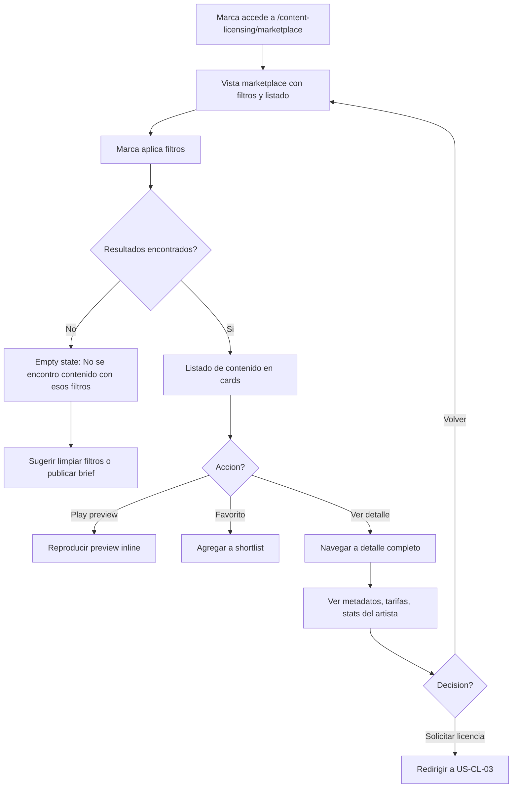
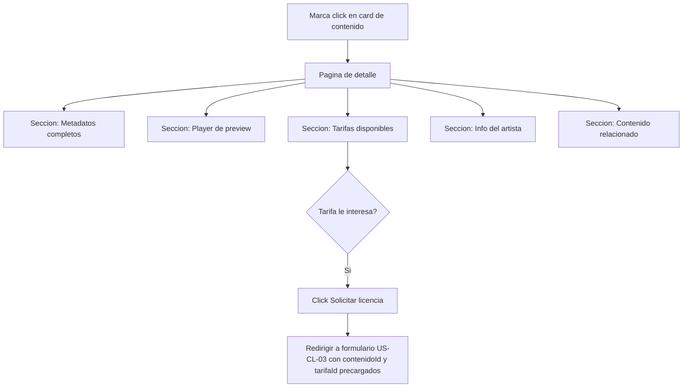
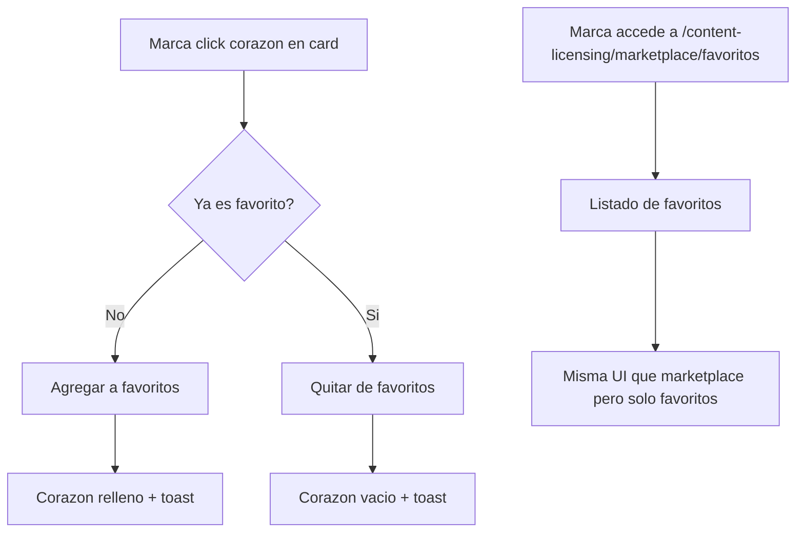

# US-CL-02: Marketplace - Busqueda y Descubrimiento de Contenido

> **ID:** US-CL-02
> **Feature Name:** `cl-marketplace-busqueda`
> **Prioridad:** Alta
> **Estimacion:** L (Large)
> **Modulo:** ContentLicensing
> **Dependencias:** US-CL-01

---

## Historia de Usuario

**Como** marca registrada en la plataforma,
**Quiero** buscar y filtrar contenido licenciable por genero, mood, tempo, tipo de uso y presupuesto,
**Para** encontrar la musica perfecta para mi campana publicitaria.

---

## Actores

| Actor | Descripcion |
|-------|-------------|
| Marca | Usuario autenticado con perfil de marca activo que busca contenido para licenciar |

---

## Precondiciones

- Marca tiene perfil activo (`EsActiva = true`)
- Existen contenidos publicados en estado `Publicado` por artistas
- Datos seed de maestras cargados (generos, moods, tipos licencia, etc.)

## Postcondiciones

- Marca puede visualizar contenido licenciable filtrado segun sus necesidades
- Se registran visualizaciones en `ContenidoLicenciable.NumVisualizaciones`
- Contenido agregado a favoritos queda disponible en shortlist de la marca

---

## Justificacion

El marketplace es el punto central de descubrimiento para las marcas. Sin un sistema robusto de busqueda y filtrado, las marcas no pueden encontrar contenido adecuado entre el catalogo disponible, lo que reduce las conversiones a solicitudes de licencia. Un buen sistema de descubrimiento incrementa el valor tanto para artistas (mas exposicion) como para marcas (mejor match).

---

## Flujo Principal: Buscar y Filtrar Contenido



### Filtros Disponibles

| Filtro | Tipo | Origen | Comportamiento |
|--------|------|--------|----------------|
| Busqueda texto | Input | Titulo, Tags, Artista | Busqueda parcial, case-insensitive |
| Genero musical | Multi-select | MaestraGeneroMusical | OR entre seleccionados |
| Mood | Multi-select | MaestraMoodContenido | OR entre seleccionados |
| Tipo de contenido | Multi-select | MaestraTipoContenido | OR entre seleccionados |
| BPM (rango) | Range slider | ContenidoLicenciable.Bpm | Min-Max (20-300) |
| Duracion (rango) | Range slider | ContenidoLicenciable.DuracionSegundos | Min-Max en segundos |
| Tipo de uso pretendido | Select | MaestraTipoUsoLicencia | Filtra contenido con tarifa para ese uso |
| Rango presupuesto | Range slider | TarifaLicencia.PrecioBase | Min-Max en EUR |
| Exclusividad disponible | Checkbox | ContenidoLicenciable.EsExclusivoDisponible | Si marcado, solo exclusivos |
| Territorio | Select | MaestraTerritorioLicencia | Filtra contenido con tarifa para ese territorio |

### Ordenamiento

| Criterio | Descripcion |
|----------|-------------|
| Relevancia | Default, basado en match de filtros |
| Mas recientes | FechaPublicacion DESC |
| Mas populares | NumVisualizaciones DESC |
| Precio menor | PrecioBase ASC (tarifa mas barata) |
| Precio mayor | PrecioBase DESC (tarifa mas cara) |

### Card de Resultado

| Dato | Fuente |
|------|--------|
| Titulo | ContenidoLicenciable.Titulo |
| Artista | Artista.NombreArtistico |
| Genero | MaestraGeneroMusical.Nombre |
| Mood | MaestraMoodContenido.Nombre |
| Tipo contenido (badge) | MaestraTipoContenido.Nombre |
| Duracion | ContenidoLicenciable.DuracionSegundos (formateado mm:ss) |
| BPM | ContenidoLicenciable.Bpm |
| Precio desde | MIN(TarifaLicencia.PrecioBase) + moneda |
| Imagen portada | ContenidoLicenciable.UrlImagenPortada |
| Boton play preview | Reproduce UrlPreview inline |
| Boton favorito | Toggle en shortlist |

---

## Flujo Secundario: Ver Detalle de Contenido



### Secciones del Detalle

| Seccion | Contenido |
|---------|-----------|
| Player | Preview reproducible con waveform visual, duracion, boton play/pause |
| Metadatos | Titulo, descripcion, tipo, genero, mood, BPM, tonalidad, duracion, tags |
| Tarifas | Tabla con tipo licencia, tipo uso, precio, negociable, duracion, territorio, exclusividad |
| Artista | NombreArtistico, imagen, numero de contenidos publicados, numero de licencias vendidas |
| Relacionado | Otros contenidos del mismo artista o genero similar |

---

## Flujo Secundario: Gestionar Favoritos / Shortlist



---

## Flujos Alternativos

| ID | Condicion | Accion |
|----|-----------|--------|
| FA-01 | Marca sin perfil activo intenta acceder | Redirigir a creacion de perfil de marca |
| FA-02 | Ningun resultado con filtros aplicados | Mostrar empty state con CTA: limpiar filtros o publicar brief (US-CL-06) |
| FA-03 | Contenido sin preview de audio | Mostrar card sin boton play, indicar "Preview no disponible" |
| FA-04 | Contenido pausado/retirado mientras marca navega | Mostrar mensaje "Este contenido ya no esta disponible" |
| FA-05 | Artista con perfil desactivado | No mostrar su contenido en marketplace |

---

## Criterios de Aceptacion

| ID | Criterio | Metodo de Prueba |
|----|----------|------------------|
| AC-CL02-1 | Una marca autenticada con perfil activo puede acceder al marketplace y ver contenido publicado | Login como marca, acceder a marketplace, verificar listado |
| AC-CL02-2 | Se puede buscar por texto libre (titulo, tags, nombre artista) con resultados parciales | Buscar termino parcial, verificar resultados relevantes |
| AC-CL02-3 | Se puede filtrar por genero musical, mood, tipo contenido, BPM, duracion, tipo uso, presupuesto, exclusividad y territorio | Aplicar cada filtro, verificar que resultados cumplen criterio |
| AC-CL02-4 | Los filtros se combinan con logica AND entre categorias y OR dentro de multi-selects | Aplicar multiples filtros, verificar interseccion |
| AC-CL02-5 | Se puede reproducir el preview de audio inline desde la card sin navegar al detalle | Click play, verificar reproduccion |
| AC-CL02-6 | Se puede agregar y quitar contenido de favoritos con feedback visual | Toggle favorito, verificar en BD y UI |
| AC-CL02-7 | El detalle del contenido muestra metadatos completos, tarifas disponibles y datos del artista | Acceder a detalle, verificar todas las secciones |
| AC-CL02-8 | Desde el detalle se puede iniciar solicitud de licencia con contenidoId y tarifaId precargados | Click solicitar, verificar redirect con params |
| AC-CL02-9 | Los resultados se pueden ordenar por relevancia, fecha, popularidad y precio | Cambiar ordenamiento, verificar orden |
| AC-CL02-10 | Se registra la visualizacion al acceder al detalle, incrementando NumVisualizaciones | Acceder a detalle, verificar contador en BD |

---

## Especificacion Tecnica

### API Endpoints

#### GET /api/content-licensing/marketplace

Buscar y filtrar contenido licenciable publicado.

**Auth:** Marca (autenticado con perfil activo)

**Query Params:**
```
?search=electronico
&generoMusicalIds=4,7
&moodIds=1,5
&tipoContenidoIds=1,2
&bpmMin=100&bpmMax=140
&duracionMin=60&duracionMax=300
&tipoUsoId=3
&precioMin=50&precioMax=500
&esExclusivoDisponible=true
&territorioId=1
&orderBy=recientes
&page=1&pageSize=20
```

**Response 200 OK:**
```json
{
  "data": {
    "items": [
      {
        "id": "guid",
        "titulo": "Amanecer Electronico - Full Track",
        "artistaNombreArtistico": "DJ Luna",
        "tipoContenidoNombre": "Cancion Completa",
        "generoMusicalNombre": "Electronica/EDM",
        "moodNombre": "Energetico",
        "bpm": 128,
        "duracionSegundos": 245,
        "urlImagenPortada": "https://storage.weplay.com/covers/amanecer.jpg",
        "urlPreview": "https://storage.weplay.com/previews/amanecer-preview.mp3",
        "precioDesde": 100.00,
        "monedaPrecioDesde": "EUR",
        "esExclusivoDisponible": true,
        "esFavorito": false,
        "numVisualizaciones": 45
      }
    ],
    "totalCount": 34,
    "page": 1,
    "pageSize": 20
  },
  "messages": []
}
```

**Errores:**
- `401 Unauthorized` - No autenticado
- `403 Forbidden` - No tiene perfil de marca activo

---

#### GET /api/content-licensing/marketplace/{id}

Detalle completo de contenido licenciable con tarifas y datos del artista.

**Auth:** Marca (autenticado con perfil activo)

**Response 200 OK:**
```json
{
  "data": {
    "id": "guid",
    "titulo": "Amanecer Electronico - Full Track",
    "descripcion": "Track electronico con influencias ambient...",
    "tipoContenidoNombre": "Cancion Completa",
    "generoMusicalNombre": "Electronica/EDM",
    "moodNombre": "Energetico",
    "bpm": 128,
    "tonalidad": "Am",
    "duracionSegundos": 245,
    "tags": "electronica,ambient,energetico,comercial",
    "urlPreview": "https://storage.weplay.com/previews/amanecer-preview.mp3",
    "urlImagenPortada": "https://storage.weplay.com/covers/amanecer.jpg",
    "esExclusivoDisponible": true,
    "fechaPublicacion": "2026-02-17T10:00:00Z",
    "esFavorito": true,
    "artista": {
      "id": "guid",
      "nombreArtistico": "DJ Luna",
      "urlImagen": "https://storage.weplay.com/artistas/djluna.jpg",
      "totalContenidosPublicados": 12,
      "totalLicenciasVendidas": 8
    },
    "tarifas": [
      {
        "id": "guid",
        "tipoLicenciaNombre": "Sync",
        "tipoUsoNombre": "Digital",
        "precioBase": 500.00,
        "monedaNombre": "EUR",
        "esNegociable": true,
        "precioMinimo": 300.00,
        "duracionMesesDefecto": 12,
        "esExclusiva": false,
        "territorioNombre": "Mundial"
      },
      {
        "id": "guid",
        "tipoLicenciaNombre": "Micro-Sync",
        "tipoUsoNombre": "Social Media",
        "precioBase": 100.00,
        "monedaNombre": "EUR",
        "esNegociable": false,
        "precioMinimo": null,
        "duracionMesesDefecto": 6,
        "esExclusiva": false,
        "territorioNombre": "Mundial"
      }
    ],
    "contenidoRelacionado": [
      {
        "id": "guid",
        "titulo": "Noche de Neon - Instrumental",
        "generoMusicalNombre": "Electronica/EDM",
        "precioDesde": 80.00,
        "monedaPrecioDesde": "EUR"
      }
    ]
  },
  "messages": []
}
```

**Errores:**
- `401 Unauthorized` - No autenticado
- `403 Forbidden` - No tiene perfil de marca activo
- `404 Not Found` - Contenido no existe o no esta publicado

---

#### POST /api/content-licensing/favoritos

Agregar contenido a favoritos de la marca.

**Auth:** Marca (autenticado)

**Request:**
```json
{
  "contenidoLicenciableId": "guid"
}
```

**Response 201 Created:**
```json
{
  "data": {
    "id": "guid",
    "contenidoLicenciableId": "guid",
    "contenidoTitulo": "Amanecer Electronico - Full Track",
    "fechaCreacion": "2026-02-17T10:00:00Z"
  },
  "messages": [
    { "message": "Contenido agregado a favoritos", "errorCode": "0001" }
  ]
}
```

**Errores:**
- `400 Bad Request` - Ya esta en favoritos
- `404 Not Found` - Contenido no existe

---

#### DELETE /api/content-licensing/favoritos/{contenidoLicenciableId}

Quitar contenido de favoritos.

**Auth:** Marca (autenticado)

**Response 200 OK:**
```json
{
  "data": {
    "contenidoLicenciableId": "guid"
  },
  "messages": [
    { "message": "Contenido eliminado de favoritos", "errorCode": "0003" }
  ]
}
```

---

#### GET /api/content-licensing/marketplace/favoritos

Listar favoritos de la marca autenticada.

**Auth:** Marca (autenticado)

**Query Params:** `page`, `pageSize`

**Response 200 OK:**
```json
{
  "data": {
    "items": [
      {
        "id": "guid",
        "titulo": "Amanecer Electronico - Full Track",
        "artistaNombreArtistico": "DJ Luna",
        "generoMusicalNombre": "Electronica/EDM",
        "precioDesde": 100.00,
        "monedaPrecioDesde": "EUR",
        "esFavorito": true,
        "fechaFavorito": "2026-02-17T10:00:00Z"
      }
    ],
    "totalCount": 8,
    "page": 1,
    "pageSize": 20
  },
  "messages": []
}
```

---

### Modelo de Datos

Entidades nuevas de esta US:

```csharp
public class FavoritoContenido
{
    public Guid Id { get; set; }
    public Guid PerfilMarcaId { get; set; }               // FK -> PerfilMarca
    public Guid ContenidoLicenciableId { get; set; }       // FK -> ContenidoLicenciable
    public DateTime FechaCreacion { get; set; }

    // Navigation
    public PerfilMarca PerfilMarca { get; set; } = null!;
    public ContenidoLicenciable ContenidoLicenciable { get; set; } = null!;
}
```

Referencia a entidades existentes (US-CL-01):
- `ContenidoLicenciable` (campo NumVisualizaciones se incrementa al ver detalle)
- `TarifaLicencia` (se usa para filtros de precio, tipo uso, territorio)
- `PerfilMarca` (se vincula via PerfilMarcaId en favoritos)

### Validaciones

```csharp
// MarketplaceSearchValidator
RuleFor(x => x.BpmMin)
    .GreaterThanOrEqualTo(20)
    .When(x => x.BpmMin.HasValue)
    .WithMessage("BPM minimo es 20")
    .WithErrorCode(ServiceResponseMessageType.Validation_InvalidRange);

RuleFor(x => x.BpmMax)
    .LessThanOrEqualTo(300)
    .When(x => x.BpmMax.HasValue)
    .WithMessage("BPM maximo es 300")
    .WithErrorCode(ServiceResponseMessageType.Validation_InvalidRange);

RuleFor(x => x.BpmMax)
    .GreaterThanOrEqualTo(x => x.BpmMin ?? 0)
    .When(x => x.BpmMax.HasValue && x.BpmMin.HasValue)
    .WithMessage("BPM maximo debe ser >= al minimo")
    .WithErrorCode(ServiceResponseMessageType.Validation_InvalidRange);

RuleFor(x => x.PrecioMin)
    .GreaterThanOrEqualTo(0)
    .When(x => x.PrecioMin.HasValue)
    .WithMessage("El precio minimo no puede ser negativo")
    .WithErrorCode(ServiceResponseMessageType.Validation_InvalidRange);

RuleFor(x => x.PrecioMax)
    .GreaterThanOrEqualTo(x => x.PrecioMin ?? 0)
    .When(x => x.PrecioMax.HasValue && x.PrecioMin.HasValue)
    .WithMessage("El precio maximo debe ser >= al minimo")
    .WithErrorCode(ServiceResponseMessageType.Validation_InvalidRange);

RuleFor(x => x.PageSize)
    .InclusiveBetween(1, 100)
    .WithMessage("PageSize debe estar entre 1 y 100")
    .WithErrorCode(ServiceResponseMessageType.Validation_InvalidRange);

// CreateFavoritoValidator
RuleFor(x => x.ContenidoLicenciableId)
    .NotEmpty()
    .WithMessage("El contenido es obligatorio")
    .WithErrorCode(ServiceResponseMessageType.Validation_Required);
```

---

## Mockups / UI

### Marketplace - Vista General
```
+----------------------------------------------------------+
|  Marketplace de Contenido                                |
+----------------------------------------------------------+
|                                                          |
|  Buscar: [______________________________] [Buscar]      |
|                                                          |
|  FILTROS                                                 |
|  +----------------------------------------------------+ |
|  | Genero    [Pop] [Rock] [Electronica] [+3 mas]      | |
|  | Mood      [Energetico] [Relajado] [+5 mas]         | |
|  | Tipo      [Cancion] [Instrumental] [Sample]         | |
|  | BPM       [60 ====o==========o==== 200]             | |
|  | Duracion  [0:30 ===o========o===== 5:00]            | |
|  | Precio    [0 =====o========o====== 1000] EUR        | |
|  | Uso       [Digital            v]                     | |
|  | Territorio[Mundial            v]                     | |
|  | [x] Solo exclusivos disponibles                     | |
|  +----------------------------------------------------+ |
|                                                          |
|  Ordenar: [Mas recientes v]    34 resultados            |
|                                                          |
|  +------------------------+ +------------------------+  |
|  | [img]                   | | [img]                   | |
|  | Amanecer Electronico    | | Noche de Neon           | |
|  | DJ Luna                 | | DJ Luna                 | |
|  | Electronica | Energetico| | Electronica | Relajado  | |
|  | 128 BPM | 4:05          | | 110 BPM | 3:22          | |
|  | Desde 100 EUR            | | Desde 80 EUR            | |
|  | [>] Play   [<3] Fav     | | [>] Play   [<3] Fav     | |
|  +------------------------+ +------------------------+  |
|                                                          |
|  +------------------------+ +------------------------+  |
|  | [img]                   | | [img]                   | |
|  | Ritmo Urbano            | | Melodia Acustica        | |
|  | MC Flow                 | | Ana Guitar              | |
|  | Hip-Hop | Agresivo      | | Folk | Nostalgico        | |
|  | 95 BPM | 3:45           | | 0 BPM | 4:20            | |
|  | Desde 200 EUR            | | Desde 150 EUR            | |
|  | [>] Play   [<3] Fav     | | [>] Play   [<3] Fav     | |
|  +------------------------+ +------------------------+  |
|                                                          |
|  [< Anterior]  Pagina 1 de 2  [Siguiente >]            |
+----------------------------------------------------------+
```

### Detalle de Contenido
```
+----------------------------------------------------------+
|  < Volver al marketplace                                 |
+----------------------------------------------------------+
|                                                          |
|  Amanecer Electronico - Full Track         [<3] Fav     |
|  por DJ Luna                                             |
|                                                          |
|  PREVIEW                                                 |
|  +----------------------------------------------------+ |
|  | [>]  ===o================================  4:05     | |
|  +----------------------------------------------------+ |
|                                                          |
|  DETALLES                                                |
|  Tipo: Cancion Completa    Genero: Electronica/EDM      |
|  Mood: Energetico          BPM: 128                     |
|  Tonalidad: Am             Duracion: 4:05               |
|  Tags: electronica, ambient, energetico, comercial      |
|  Exclusividad: Disponible                                |
|                                                          |
|  Track electronico con influencias ambient ideal para    |
|  spots publicitarios con energia positiva...             |
|                                                          |
|  TARIFAS DISPONIBLES                                     |
|  +----------------------------------------------------+ |
|  | Tipo        | Uso         | Precio | Dur  | Territ | |
|  |-------------|-------------|--------|------|--------| |
|  | Sync        | Digital     | 500 EUR| 12m  | Mundial| |
|  |             |             | Neg.   |      |        | |
|  |             |             |(min300)|      |        | |
|  |             |             | [Solicitar licencia]   | |
|  |-------------|-------------|--------|------|--------| |
|  | Micro-Sync  | Social Media| 100 EUR| 6m   | Mundial| |
|  |             |             | Fijo   |      |        | |
|  |             |             | [Solicitar licencia]   | |
|  +----------------------------------------------------+ |
|                                                          |
|  SOBRE EL ARTISTA                                        |
|  +----------------------------------------------------+ |
|  | [img] DJ Luna                                       | |
|  |       12 contenidos publicados | 8 licencias        | |
|  +----------------------------------------------------+ |
|                                                          |
|  CONTENIDO RELACIONADO                                   |
|  +------------------------+ +------------------------+  |
|  | Noche de Neon           | | Beat Cosmico            | |
|  | DJ Luna | Electronica   | | DJ Luna | Electronica   | |
|  | Desde 80 EUR            | | Desde 120 EUR            | |
|  +------------------------+ +------------------------+  |
+----------------------------------------------------------+
```

---

## Notas de Implementacion

- La busqueda de texto aplica LIKE sobre Titulo, Tags y Artista.NombreArtistico
- Los filtros multi-select (genero, mood, tipo) usan logica OR dentro del mismo filtro y AND entre filtros distintos
- El precio "desde" se calcula como MIN(TarifaLicencia.PrecioBase) del contenido
- La visualizacion se incrementa solo al acceder al detalle (no al listar en marketplace)
- El contenido relacionado se basa en mismo artista o mismo genero musical
- Favoritos tienen constraint unico por (PerfilMarcaId, ContenidoLicenciableId)
- Solo se muestra contenido en estado `Publicado` de artistas con perfil activo
- La paginacion usa offset-based (page/pageSize) para simplicidad en MVP
- Handler CQRS: Command + Handler en mismo archivo, inyectar Service (no DbContext)
- Considerar indice compuesto en ContenidoLicenciable para optimizar busquedas frecuentes
