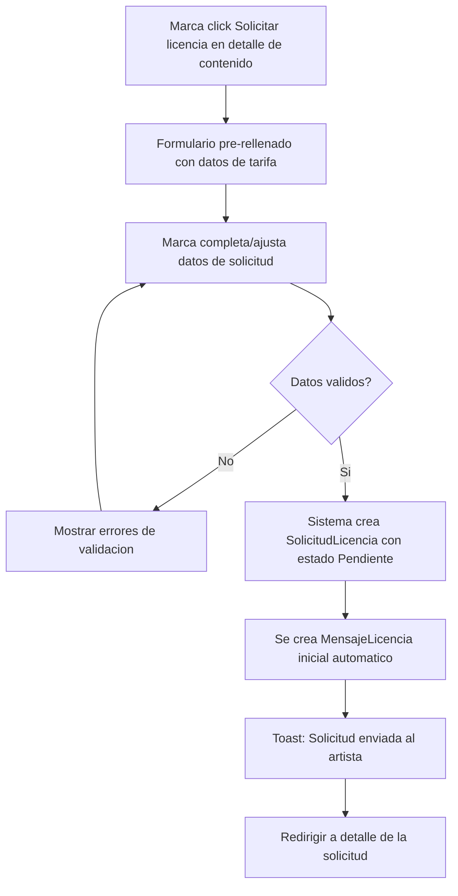
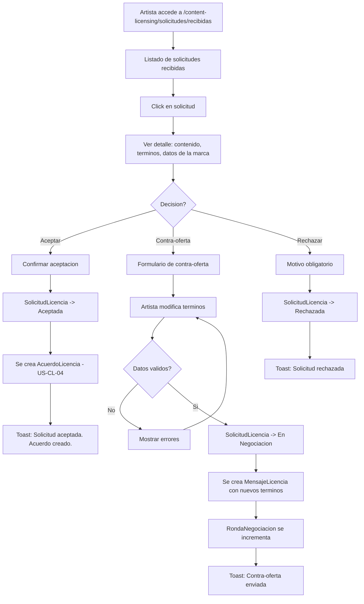
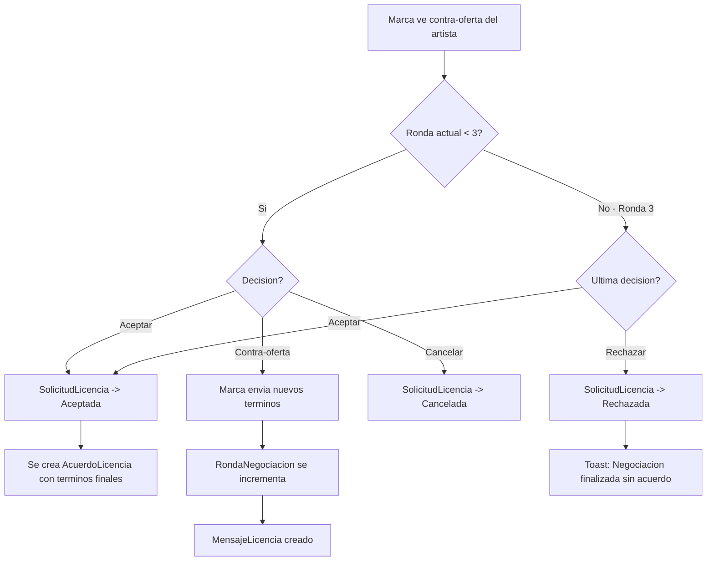
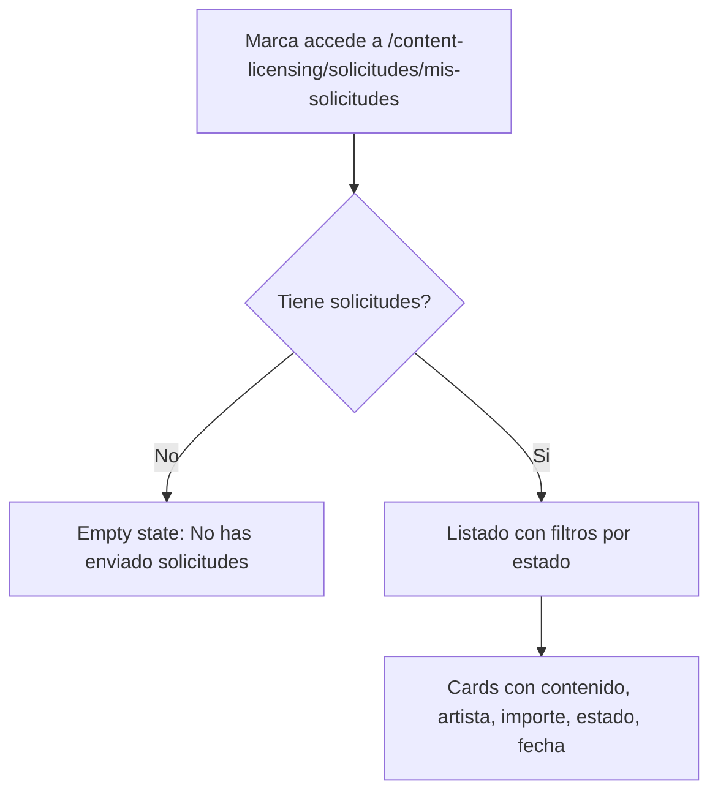
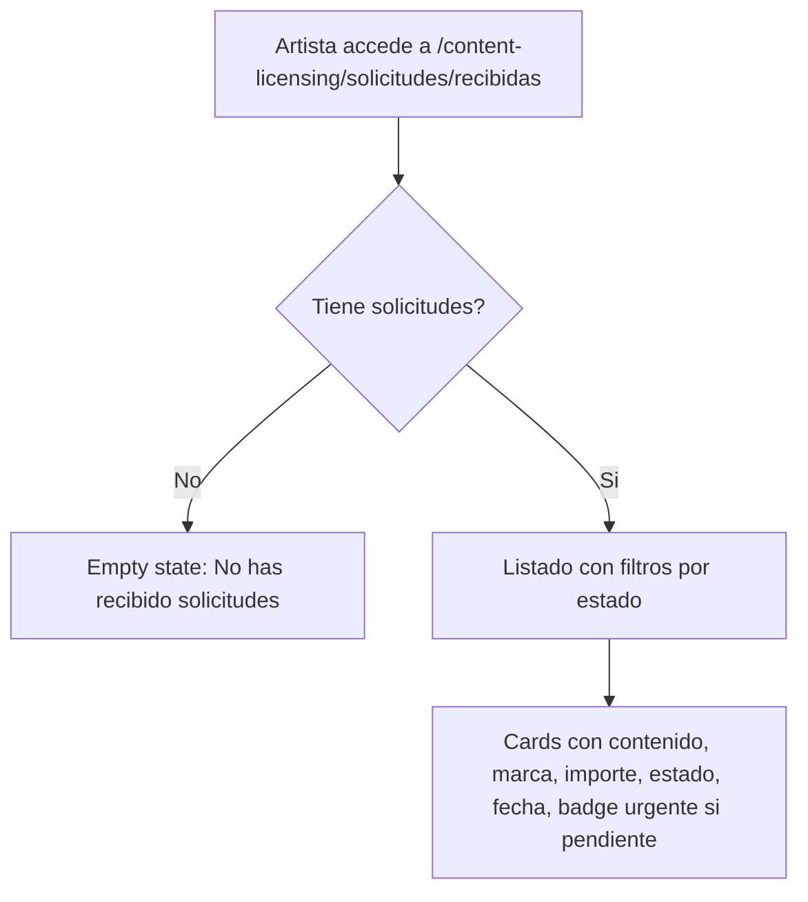

# US-CL-03: Solicitud y Negociacion de Licencia

> **ID:** US-CL-03
> **Feature Name:** `cl-solicitud-negociacion`
> **Prioridad:** Alta
> **Estimacion:** XL (Extra Large)
> **Modulo:** ContentLicensing
> **Dependencias:** US-CL-02

---

## Historia de Usuario

**Como** marca registrada en la plataforma,
**Quiero** solicitar una licencia para contenido especifico indicando tipo de uso, plataformas, territorio y duracion, y negociar terminos con el artista,
**Para** llegar a un acuerdo de licencia mutuamente beneficioso.

---

## Actores

| Actor | Descripcion |
|-------|-------------|
| Marca | Inicia solicitud de licencia, puede enviar contra-ofertas, cancela solicitudes |
| Artista | Recibe solicitudes, puede aceptar, rechazar o enviar contra-oferta |

---

## Precondiciones

- Marca tiene perfil activo (`EsActiva = true`)
- Existe contenido publicado con al menos una tarifa definida
- El contenido esta en estado `Publicado`

## Postcondiciones

- Se crea una `SolicitudLicencia` con los terminos propuestos
- Al aceptar, se genera un `AcuerdoLicencia` (US-CL-04)
- Historial completo de negociacion preservado en `MensajeLicencia`

---

## Justificacion

La negociacion es el paso critico entre el descubrimiento de contenido y el acuerdo formal. Permitir un flujo estructurado de solicitud y contra-ofertas (maximo 3 rondas) asegura que ambas partes lleguen a terminos justos, mientras mantiene el proceso acotado para evitar negociaciones interminables.

---

## Flujo Principal: Crear Solicitud de Licencia



### Campos del Formulario de Solicitud

| Campo | Tipo | Obligatorio | Validacion | Pre-relleno |
|-------|------|-------------|------------|-------------|
| Contenido | Readonly | Si | - | Del marketplace |
| Tarifa seleccionada | Select | Si | FK valida | De tarifa elegida |
| Tipo de licencia | Select (MaestraTipoLicencia) | Si | Debe existir | De la tarifa |
| Tipo de uso | Select (MaestraTipoUsoLicencia) | Si | Debe existir | De la tarifa |
| Descripcion del uso | Texto largo | Si | Min 20, max 2000 chars | - |
| Plataformas | Multi-select texto | Si | Min 1 seleccion | - |
| Territorio | Select (MaestraTerritorioLicencia) | Si | Debe existir | De la tarifa |
| Duracion (meses) | Entero | Si | >= 1 | De la tarifa |
| Exclusividad solicitada | Boolean | Si | - | De la tarifa |
| Importe ofrecido | Decimal | Si | > 0 | PrecioBase de la tarifa |
| Moneda | Select (MaestraMoneda) | Si | Debe existir | De la tarifa |
| Fecha lanzamiento prevista | Date | No | >= hoy | - |
| Notas adicionales | Texto largo | No | Max 2000 chars | - |

### Plataformas Disponibles

| Plataforma |
|------------|
| YouTube |
| Instagram |
| TikTok |
| Spotify Ads |
| TV Abierta |
| TV Cable |
| Cine |
| Radio |
| Podcast |
| Web/Banner |
| App Movil |
| Evento Presencial |
| Otro |

---

## Flujo Secundario: Artista Revisa Solicitud



### Contra-oferta del Artista

| Campo | Tipo | Obligatorio | Validacion |
|-------|------|-------------|------------|
| Importe propuesto | Decimal | Si | > 0 |
| Duracion propuesta (meses) | Entero | No | >= 1 |
| Territorio propuesto | Select | No | Debe existir |
| Exclusividad propuesta | Boolean | No | - |
| Mensaje | Texto largo | Si | Min 10, max 2000 chars |

---

## Flujo Secundario: Marca Responde a Contra-oferta



**Regla de rondas:** Maximo 3 rondas de negociacion. En la ronda 3 solo se puede aceptar o rechazar, no enviar nueva contra-oferta.

---

## Flujo Secundario: Listar Mis Solicitudes (Marca)



---

## Flujo Secundario: Listar Solicitudes Recibidas (Artista)



---

## Diagrama de Estados de la Solicitud

```
    +-------------+
    |  PENDIENTE  | <-- marca crea solicitud
    +------+------+
           |
    +------+------+------+
    |             |       |
 [aceptar]  [contra-   [rechazar]
    |       oferta]      |
    |          |         |
    v          v         v
+--------+ +----------+ +----------+
|ACEPTADA| |EN NEGOC. | |RECHAZADA |
+--------+ +----+-----+ +----------+
    |           |
    |    +------+------+------+
    |    |             |       |
    | [aceptar]  [contra-  [rechazar]     (max 3 rondas)
    |    |       oferta]      |
    |    v          |         v
    |  +--------+   |   +----------+
    |  |ACEPTADA|   +-->|EN NEGOC. |
    |  +--------+       +----------+
    |
    v
[Crear AcuerdoLicencia]

Desde cualquier estado activo:
  [cancelar marca] --> CANCELADA
  [expirar 30 dias sin respuesta] --> EXPIRADA
```

---

## Flujos Alternativos

| ID | Condicion | Accion |
|----|-----------|--------|
| FA-01 | Marca solicita licencia y ya tiene solicitud activa para ese contenido | Error: Ya tienes una solicitud activa para este contenido |
| FA-02 | Contenido se pausa/retira mientras hay solicitud pendiente | Solicitud pasa a Cancelada automaticamente, notificar marca |
| FA-03 | Importe ofrecido < precio minimo de tarifa negociable | Warning: El importe ofrecido esta por debajo del minimo del artista |
| FA-04 | Importe ofrecido en tarifa no negociable es diferente al precio base | Error: Esta tarifa no es negociable |
| FA-05 | Solicitud sin respuesta por 30 dias | Sistema la marca como Expirada automaticamente |
| FA-06 | Marca cancela solicitud en cualquier estado activo | SolicitudLicencia -> Cancelada |

---

## Criterios de Aceptacion

| ID | Criterio | Metodo de Prueba |
|----|----------|------------------|
| AC-CL03-1 | Una marca puede crear una solicitud de licencia con todos los campos requeridos y el formulario se pre-rellena con datos de la tarifa seleccionada | Crear solicitud desde marketplace, verificar datos |
| AC-CL03-2 | La solicitud se crea con estado Pendiente y RondaNegociacion = 0. Se crea un MensajeLicencia inicial automatico | Verificar estado y mensaje en BD |
| AC-CL03-3 | El artista puede ver sus solicitudes recibidas y acceder al detalle con datos completos del contenido, terminos y marca | Login como artista, verificar listado y detalle |
| AC-CL03-4 | El artista puede aceptar una solicitud pendiente, lo que genera un AcuerdoLicencia y cambia estado a Aceptada | Aceptar solicitud, verificar acuerdo creado |
| AC-CL03-5 | El artista puede enviar una contra-oferta con importe, duracion, territorio y mensaje. La solicitud pasa a En Negociacion y se incrementa RondaNegociacion | Enviar contra-oferta, verificar estado y ronda |
| AC-CL03-6 | El artista puede rechazar una solicitud con motivo obligatorio. La solicitud pasa a Rechazada | Rechazar, verificar estado y motivo |
| AC-CL03-7 | La marca puede ver sus solicitudes enviadas filtradas por estado | Listar solicitudes, aplicar filtros |
| AC-CL03-8 | La marca puede responder a una contra-oferta: aceptar, contra-ofertar o cancelar | Probar cada accion, verificar estados |
| AC-CL03-9 | Maximo 3 rondas de negociacion. En la ronda 3 solo se puede aceptar o rechazar, no contra-ofertar | Negociar 3 rondas, verificar que no permite ronda 4 |
| AC-CL03-10 | Al aceptar una solicitud (en cualquier ronda), se crea AcuerdoLicencia con los terminos acordados (ultimos de la negociacion) | Aceptar tras contra-oferta, verificar acuerdo |
| AC-CL03-11 | Una solicitud sin respuesta por 30 dias pasa automaticamente a Expirada | Verificar con job o query de expiracion |
| AC-CL03-12 | No se puede crear una segunda solicitud activa para el mismo contenido por la misma marca | Intentar duplicado, verificar error |

---

## Especificacion Tecnica

### API Endpoints

#### POST /api/content-licensing/solicitudes

Crear solicitud de licencia.

**Auth:** Marca (autenticado con perfil activo)

**Request:**
```json
{
  "contenidoLicenciableId": "guid",
  "tarifaLicenciaId": "guid",
  "tipoLicenciaId": 1,
  "tipoUsoId": 3,
  "descripcionUso": "Spot publicitario de 30 segundos para campana de verano de nuestra marca de ropa, con presencia en redes sociales y YouTube.",
  "plataformas": ["YouTube", "Instagram", "TikTok"],
  "territorioId": 1,
  "duracionMeses": 12,
  "exclusividadSolicitada": false,
  "importeOfrecido": 500.00,
  "monedaId": 1,
  "fechaLanzamientoPrevista": "2026-04-15",
  "notasAdicionales": "Posibilidad de renovacion si la campana funciona bien."
}
```

**Response 201 Created:**
```json
{
  "data": {
    "id": "guid",
    "contenidoTitulo": "Amanecer Electronico - Full Track",
    "artistaNombre": "DJ Luna",
    "estadoSolicitudNombre": "Pendiente",
    "importeOfrecido": 500.00,
    "monedaNombre": "EUR",
    "rondaNegociacion": 0,
    "fechaCreacion": "2026-02-17T10:00:00Z"
  },
  "messages": [
    { "message": "Solicitud de licencia enviada al artista", "errorCode": "0001" }
  ]
}
```

**Errores:**
- `400 Bad Request` - Validacion fallida, solicitud duplicada activa, o tarifa no negociable con importe diferente
- `401 Unauthorized` - No autenticado
- `403 Forbidden` - No tiene perfil de marca activo
- `404 Not Found` - Contenido o tarifa no existe

---

#### GET /api/content-licensing/solicitudes/mis-solicitudes

Listar solicitudes enviadas por la marca.

**Auth:** Marca (autenticado)

**Query Params:** `estadoSolicitudId`, `page`, `pageSize`

**Response 200 OK:**
```json
{
  "data": {
    "items": [
      {
        "id": "guid",
        "contenidoTitulo": "Amanecer Electronico - Full Track",
        "contenidoImagenPortada": "https://storage.weplay.com/covers/amanecer.jpg",
        "artistaNombre": "DJ Luna",
        "estadoSolicitudNombre": "Pendiente",
        "importeOfrecido": 500.00,
        "monedaNombre": "EUR",
        "rondaNegociacion": 0,
        "fechaCreacion": "2026-02-17T10:00:00Z",
        "fechaUltimaActividad": "2026-02-17T10:00:00Z"
      }
    ],
    "totalCount": 5,
    "page": 1,
    "pageSize": 10
  },
  "messages": []
}
```

---

#### GET /api/content-licensing/solicitudes/recibidas

Listar solicitudes recibidas por el artista.

**Auth:** Artista (autenticado)

**Query Params:** `estadoSolicitudId`, `page`, `pageSize`

**Response 200 OK:**
```json
{
  "data": {
    "items": [
      {
        "id": "guid",
        "contenidoTitulo": "Amanecer Electronico - Full Track",
        "contenidoImagenPortada": "https://storage.weplay.com/covers/amanecer.jpg",
        "marcaNombre": "SoundBrands Inc",
        "marcaLogoUrl": "https://cdn.soundbrands.com/logo.png",
        "estadoSolicitudNombre": "Pendiente",
        "importeOfrecido": 500.00,
        "monedaNombre": "EUR",
        "tipoUsoNombre": "Digital",
        "rondaNegociacion": 0,
        "fechaCreacion": "2026-02-17T10:00:00Z",
        "fechaUltimaActividad": "2026-02-17T10:00:00Z"
      }
    ],
    "totalCount": 3,
    "page": 1,
    "pageSize": 10
  },
  "messages": []
}
```

---

#### GET /api/content-licensing/solicitudes/{id}

Detalle completo de solicitud con historial de negociacion.

**Auth:** Marca (propietaria) o Artista (propietario del contenido)

**Response 200 OK:**
```json
{
  "data": {
    "id": "guid",
    "estadoSolicitudId": 1,
    "estadoSolicitudNombre": "En Negociacion",
    "rondaNegociacion": 1,
    "maxRondas": 3,
    "contenido": {
      "id": "guid",
      "titulo": "Amanecer Electronico - Full Track",
      "tipoContenidoNombre": "Cancion Completa",
      "generoMusicalNombre": "Electronica/EDM",
      "urlImagenPortada": "https://storage.weplay.com/covers/amanecer.jpg"
    },
    "marca": {
      "id": "guid",
      "nombreComercial": "SoundBrands Inc",
      "sectorNombre": "Tecnologia",
      "urlLogo": "https://cdn.soundbrands.com/logo.png"
    },
    "artista": {
      "id": "guid",
      "nombreArtistico": "DJ Luna"
    },
    "terminosActuales": {
      "tipoLicenciaNombre": "Sync",
      "tipoUsoNombre": "Digital",
      "descripcionUso": "Spot publicitario de 30 segundos...",
      "plataformas": ["YouTube", "Instagram", "TikTok"],
      "territorioNombre": "Mundial",
      "duracionMeses": 12,
      "exclusividadSolicitada": false,
      "importeOfrecido": 450.00,
      "monedaNombre": "EUR",
      "fechaLanzamientoPrevista": "2026-04-15"
    },
    "mensajes": [
      {
        "id": "guid",
        "emisorTipo": "Marca",
        "emisorNombre": "SoundBrands Inc",
        "tipo": "SolicitudInicial",
        "importePropuesto": 500.00,
        "mensaje": "Nos encantaria usar este track para nuestra campana de verano.",
        "fechaCreacion": "2026-02-17T10:00:00Z"
      },
      {
        "id": "guid",
        "emisorTipo": "Artista",
        "emisorNombre": "DJ Luna",
        "tipo": "ContraOferta",
        "importePropuesto": 450.00,
        "duracionPropuesta": 12,
        "territorioPropuesto": "Mundial",
        "mensaje": "Me interesa pero el importe deberia ser mayor para uso en 3 plataformas. Propongo 450 EUR.",
        "fechaCreacion": "2026-02-18T14:00:00Z"
      }
    ],
    "miRol": "Marca",
    "fechaCreacion": "2026-02-17T10:00:00Z",
    "fechaUltimaActividad": "2026-02-18T14:00:00Z"
  },
  "messages": []
}
```

---

#### PATCH /api/content-licensing/solicitudes/{id}/aceptar

Aceptar solicitud (artista acepta, o marca acepta contra-oferta).

**Auth:** Artista (propietario contenido) o Marca (propietaria solicitud, al aceptar contra-oferta)

**Request:**
```json
{
  "mensaje": "Acepto los terminos propuestos. Encantado de trabajar juntos."
}
```

**Response 200 OK:**
```json
{
  "data": {
    "solicitudId": "guid",
    "estadoSolicitudNombre": "Aceptada",
    "acuerdoLicenciaId": "guid",
    "importeAcordado": 450.00,
    "monedaNombre": "EUR"
  },
  "messages": [
    { "message": "Solicitud aceptada. Acuerdo de licencia creado.", "errorCode": "0002" }
  ]
}
```

---

#### PATCH /api/content-licensing/solicitudes/{id}/contraoferta

Enviar contra-oferta.

**Auth:** Artista o Marca (participante, ronda < 3)

**Request:**
```json
{
  "importePropuesto": 450.00,
  "duracionPropuesta": 12,
  "territorioPropuestoId": 1,
  "exclusividadPropuesta": false,
  "mensaje": "Propongo ajustar el importe a 450 EUR considerando el alcance del uso."
}
```

**Response 200 OK:**
```json
{
  "data": {
    "solicitudId": "guid",
    "estadoSolicitudNombre": "En Negociacion",
    "rondaNegociacion": 2,
    "maxRondas": 3
  },
  "messages": [
    { "message": "Contra-oferta enviada", "errorCode": "0002" }
  ]
}
```

**Errores:**
- `400 Bad Request` - Ronda maxima alcanzada o solicitud no esta en estado valido
- `403 Forbidden` - No es participante

---

#### PATCH /api/content-licensing/solicitudes/{id}/rechazar

Rechazar solicitud.

**Auth:** Artista (propietario contenido)

**Request:**
```json
{
  "motivo": "El tipo de uso propuesto no se alinea con la imagen artistica que quiero proyectar para este track."
}
```

**Response 200 OK:**
```json
{
  "data": {
    "solicitudId": "guid",
    "estadoSolicitudNombre": "Rechazada"
  },
  "messages": [
    { "message": "Solicitud rechazada", "errorCode": "0002" }
  ]
}
```

---

#### POST /api/content-licensing/solicitudes/{id}/mensajes

Enviar mensaje en la negociacion (sin cambiar terminos).

**Auth:** Marca o Artista (participante)

**Request:**
```json
{
  "mensaje": "Tengo una pregunta sobre la exclusividad: seria posible una exclusividad parcial solo para redes sociales?"
}
```

**Response 201 Created:**
```json
{
  "data": {
    "id": "guid",
    "emisorTipo": "Marca",
    "mensaje": "Tengo una pregunta sobre la exclusividad...",
    "fechaCreacion": "2026-02-19T09:00:00Z"
  },
  "messages": [
    { "message": "Mensaje enviado", "errorCode": "0001" }
  ]
}
```

---

### Modelo de Datos

```csharp
public class SolicitudLicencia
{
    public Guid Id { get; set; }
    public Guid ContenidoLicenciableId { get; set; }       // FK -> ContenidoLicenciable
    public Guid TarifaLicenciaId { get; set; }             // FK -> TarifaLicencia
    public Guid PerfilMarcaId { get; set; }                // FK -> PerfilMarca
    public Guid ArtistaId { get; set; }                    // FK -> Artista (propietario contenido)
    public int TipoLicenciaId { get; set; }                // FK -> MaestraTipoLicencia
    public int TipoUsoId { get; set; }                     // FK -> MaestraTipoUsoLicencia
    public string DescripcionUso { get; set; } = null!;
    public string Plataformas { get; set; } = null!;       // JSON array serializado
    public int TerritorioId { get; set; }                  // FK -> MaestraTerritorioLicencia
    public int DuracionMeses { get; set; }
    public bool ExclusividadSolicitada { get; set; }
    public decimal ImporteOfrecido { get; set; }
    public int MonedaId { get; set; }                      // FK -> MaestraMoneda
    public DateTime? FechaLanzamientoPrevista { get; set; }
    public string? NotasAdicionales { get; set; }
    public int EstadoSolicitudId { get; set; }             // FK -> MaestraEstadoSolicitudLicencia
    public int RondaNegociacion { get; set; }              // 0 = inicial, max 3
    public string? MotivoRechazo { get; set; }
    public DateTime FechaCreacion { get; set; }
    public DateTime? FechaActualizacion { get; set; }

    // Navigation
    public ContenidoLicenciable ContenidoLicenciable { get; set; } = null!;
    public TarifaLicencia TarifaLicencia { get; set; } = null!;
    public PerfilMarca PerfilMarca { get; set; } = null!;
    public ICollection<MensajeLicencia> Mensajes { get; set; } = new List<MensajeLicencia>();
    public AcuerdoLicencia? AcuerdoLicencia { get; set; }
}

public class MensajeLicencia
{
    public Guid Id { get; set; }
    public Guid SolicitudLicenciaId { get; set; }          // FK -> SolicitudLicencia
    public string UserIdEmisor { get; set; } = null!;      // FK -> Identity.User
    public string EmisorTipo { get; set; } = null!;        // "Marca" | "Artista"
    public string TipoMensaje { get; set; } = null!;       // "SolicitudInicial" | "ContraOferta" | "Aceptacion" | "Rechazo" | "Mensaje"
    public string? Mensaje { get; set; }
    public decimal? ImportePropuesto { get; set; }
    public int? DuracionPropuesta { get; set; }
    public int? TerritorioPropuestoId { get; set; }
    public bool? ExclusividadPropuesta { get; set; }
    public DateTime FechaCreacion { get; set; }

    // Navigation
    public SolicitudLicencia SolicitudLicencia { get; set; } = null!;
}
```

### Tablas Maestras Adicionales (Seed Data)

```
MaestraEstadoSolicitudLicencia: 6 valores (Pendiente, En Negociacion, Aceptada, Rechazada, Expirada, Cancelada)
```

### Validaciones

```csharp
// CreateSolicitudLicenciaValidator
RuleFor(x => x.ContenidoLicenciableId)
    .NotEmpty()
    .WithMessage("El contenido es obligatorio")
    .WithErrorCode(ServiceResponseMessageType.Validation_Required);

RuleFor(x => x.TarifaLicenciaId)
    .NotEmpty()
    .WithMessage("La tarifa es obligatoria")
    .WithErrorCode(ServiceResponseMessageType.Validation_Required);

RuleFor(x => x.DescripcionUso)
    .NotEmpty()
    .WithMessage("La descripcion del uso es obligatoria")
    .WithErrorCode(ServiceResponseMessageType.Validation_Required)
    .MinimumLength(20)
    .WithMessage("Minimo 20 caracteres describiendo el uso pretendido")
    .WithErrorCode(ServiceResponseMessageType.Validation_MinLength)
    .MaximumLength(2000)
    .WithMessage("Maximo 2000 caracteres")
    .WithErrorCode(ServiceResponseMessageType.Validation_MaxLength);

RuleFor(x => x.Plataformas)
    .NotEmpty()
    .WithMessage("Debe seleccionar al menos una plataforma")
    .WithErrorCode(ServiceResponseMessageType.Validation_Required);

RuleFor(x => x.DuracionMeses)
    .GreaterThanOrEqualTo(1)
    .WithMessage("La duracion debe ser al menos 1 mes")
    .WithErrorCode(ServiceResponseMessageType.Validation_InvalidRange);

RuleFor(x => x.ImporteOfrecido)
    .GreaterThan(0)
    .WithMessage("El importe debe ser mayor a 0")
    .WithErrorCode(ServiceResponseMessageType.Validation_InvalidRange);

RuleFor(x => x.FechaLanzamientoPrevista)
    .GreaterThanOrEqualTo(DateTime.UtcNow.Date)
    .When(x => x.FechaLanzamientoPrevista.HasValue)
    .WithMessage("La fecha de lanzamiento debe ser futura")
    .WithErrorCode(ServiceResponseMessageType.Validation_InvalidRange);

// ContraOfertaValidator
RuleFor(x => x.ImportePropuesto)
    .GreaterThan(0)
    .WithMessage("El importe propuesto debe ser mayor a 0")
    .WithErrorCode(ServiceResponseMessageType.Validation_InvalidRange);

RuleFor(x => x.Mensaje)
    .NotEmpty()
    .WithMessage("El mensaje es obligatorio en una contra-oferta")
    .WithErrorCode(ServiceResponseMessageType.Validation_Required)
    .MinimumLength(10)
    .WithMessage("Minimo 10 caracteres")
    .WithErrorCode(ServiceResponseMessageType.Validation_MinLength)
    .MaximumLength(2000)
    .WithMessage("Maximo 2000 caracteres")
    .WithErrorCode(ServiceResponseMessageType.Validation_MaxLength);

// RechazarSolicitudValidator
RuleFor(x => x.Motivo)
    .NotEmpty()
    .WithMessage("El motivo de rechazo es obligatorio")
    .WithErrorCode(ServiceResponseMessageType.Validation_Required)
    .MinimumLength(10)
    .WithMessage("Minimo 10 caracteres")
    .WithErrorCode(ServiceResponseMessageType.Validation_MinLength)
    .MaximumLength(1000)
    .WithMessage("Maximo 1000 caracteres")
    .WithErrorCode(ServiceResponseMessageType.Validation_MaxLength);
```

---

## Mockups / UI

### Formulario de Solicitud de Licencia
```
+----------------------------------------------------------+
|  Solicitar Licencia                                      |
+----------------------------------------------------------+
|                                                          |
|  CONTENIDO                                               |
|  Amanecer Electronico - Full Track | DJ Luna            |
|  Tarifa: Sync - Digital | 500 EUR                       |
|                                                          |
|  Tipo de licencia *          Tipo de uso *               |
|  [Sync                v]    [Digital             v]     |
|                                                          |
|  Descripcion del uso *                                   |
|  [Spot publicitario de 30 segundos para campana de     ]|
|  [verano de nuestra marca de ropa...                   ]|
|                                                          |
|  Plataformas *                                           |
|  [x] YouTube  [x] Instagram  [x] TikTok               |
|  [ ] TV       [ ] Radio      [ ] Cine                  |
|  [ ] Podcast  [ ] Web        [ ] App                   |
|                                                          |
|  Territorio *             Duracion *                     |
|  [Mundial           v]   [12] meses                     |
|                                                          |
|  [ ] Solicitar exclusividad                              |
|                                                          |
|  Importe ofrecido *       Moneda *                       |
|  [500.00]                 [EUR          v]              |
|                                                          |
|  Fecha lanzamiento prevista                              |
|  [2026-04-15]                                           |
|                                                          |
|  Notas adicionales                                       |
|  [Posibilidad de renovacion si la campana funciona...  ]|
|                                                          |
|  [Cancelar]              [Enviar solicitud]              |
+----------------------------------------------------------+
```

### Detalle de Solicitud (vista artista)
```
+----------------------------------------------------------+
|  Solicitud de Licencia              PENDIENTE            |
+----------------------------------------------------------+
|                                                          |
|  CONTENIDO: Amanecer Electronico - Full Track           |
|  MARCA: SoundBrands Inc (Tecnologia)                    |
|                                                          |
|  TERMINOS PROPUESTOS                                     |
|  +----------------------------------------------------+ |
|  | Licencia: Sync          | Uso: Digital              | |
|  | Plataformas: YouTube, Instagram, TikTok             | |
|  | Territorio: Mundial     | Duracion: 12 meses       | |
|  | Exclusividad: No        | Importe: 500 EUR         | |
|  | Lanzamiento: 15 abr 2026                            | |
|  +----------------------------------------------------+ |
|                                                          |
|  DESCRIPCION DEL USO                                     |
|  Spot publicitario de 30 segundos para campana de       |
|  verano de nuestra marca de ropa, con presencia en      |
|  redes sociales y YouTube.                               |
|                                                          |
|  HISTORIAL DE NEGOCIACION                                |
|  +----------------------------------------------------+ |
|  | [SoundBrands] 17 feb 2026                           | |
|  | Solicitud inicial - 500 EUR                         | |
|  | "Nos encantaria usar este track..."                 | |
|  +----------------------------------------------------+ |
|                                                          |
|  Ronda 0 de 3                                            |
|                                                          |
|  [Aceptar]  [Contra-oferta]  [Rechazar]                 |
+----------------------------------------------------------+
```

### Vista Contra-oferta
```
+----------------------------------------------------------+
|  Enviar contra-oferta                                    |
+----------------------------------------------------------+
|                                                          |
|  Importe propuesto *                                     |
|  [450.00] EUR                                           |
|                                                          |
|  Duracion propuesta                                      |
|  [12] meses (sin cambio)                                |
|                                                          |
|  Territorio propuesto                                    |
|  [Mundial           v] (sin cambio)                     |
|                                                          |
|  [ ] Modificar exclusividad                              |
|                                                          |
|  Mensaje *                                               |
|  [Me interesa pero propongo ajustar el importe a       ]|
|  [450 EUR considerando el alcance del uso...           ]|
|                                                          |
|  [Cancelar]              [Enviar contra-oferta]          |
+----------------------------------------------------------+
```

---

## Notas de Implementacion

- La creacion de solicitud debe validar que no exista otra activa (Pendiente o En Negociacion) para el mismo contenido y marca
- Si la tarifa no es negociable (`EsNegociable = false`), el importe ofrecido debe ser exactamente igual al PrecioBase
- Los terminos actuales se actualizan con cada contra-oferta aceptada (ultima version vigente)
- La ronda de negociacion se incrementa con cada contra-oferta (no con mensajes simples)
- Al aceptar, se usa un servicio transaccional que: actualiza solicitud -> crea AcuerdoLicencia -> crea MensajeLicencia de aceptacion
- Plataformas se almacena como JSON array en la BD para flexibilidad
- El job de expiracion (30 dias) puede ser un background service o evaluarse al consultar
- Handler CQRS: Command + Handler en mismo archivo, inyectar Service (no DbContext)
- Considerar notificacion por email al artista cuando recibe solicitud (post-MVP)
