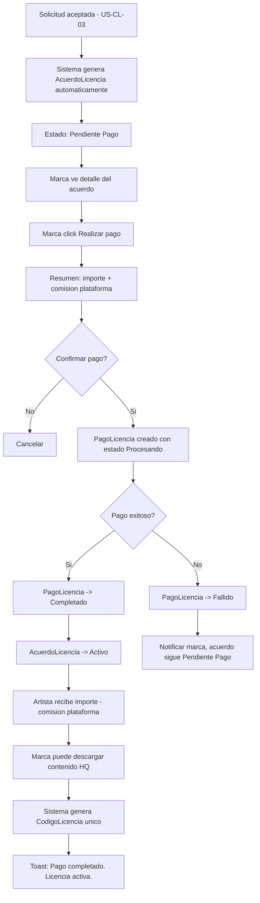
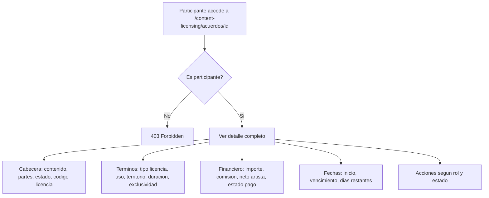
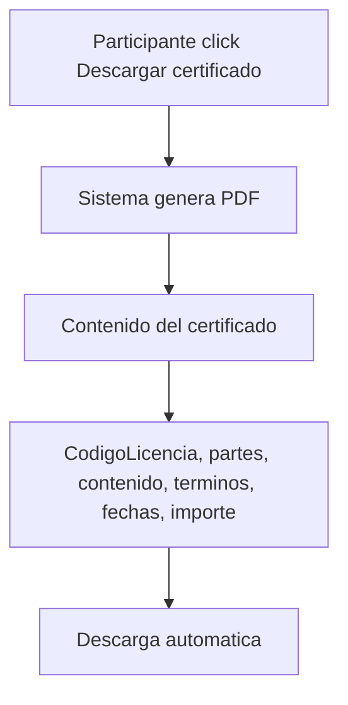
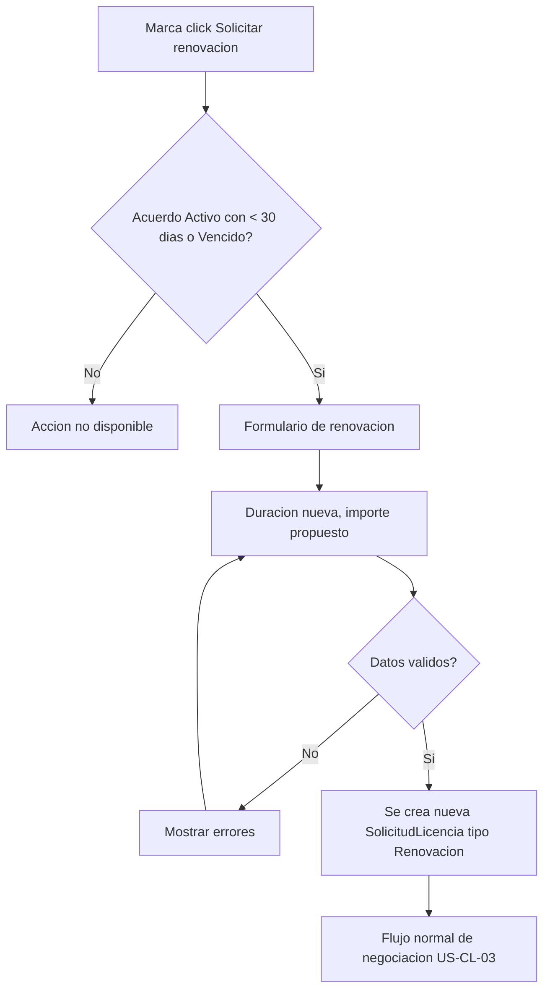
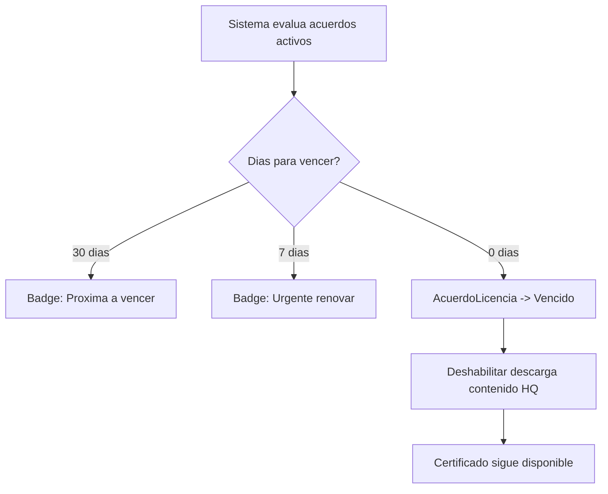
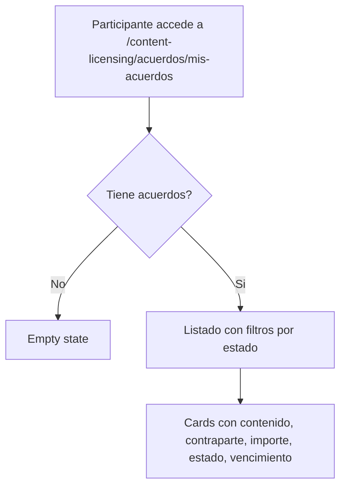

# US-CL-04: Acuerdo y Ejecucion de Licencia

> **ID:** US-CL-04
> **Feature Name:** `cl-acuerdo-ejecucion`
> **Prioridad:** Alta
> **Estimacion:** XL (Extra Large)
> **Modulo:** ContentLicensing
> **Dependencias:** US-CL-03

---

## Historia de Usuario

**Como** artista o marca participante de una licencia acordada,
**Quiero** gestionar el ciclo completo del acuerdo: pago, descarga del contenido, certificado de licencia y monitoreo de vencimiento,
**Para** garantizar cumplimiento y trazabilidad durante toda la vigencia de la licencia.

---

## Actores

| Actor | Descripcion |
|-------|-------------|
| Marca | Realiza el pago, descarga contenido HQ, gestiona renovaciones |
| Artista | Recibe pago (menos comision), monitorea uso, puede cancelar por incumplimiento |

---

## Precondiciones

- Existe una `SolicitudLicencia` en estado `Aceptada`
- Ambos participantes estan autenticados y con perfiles activos

## Postcondiciones

- `AcuerdoLicencia` creado con todos los terminos acordados
- `PagoLicencia` procesado y registrado
- Marca puede descargar contenido en alta calidad
- Se genera un `CodigoLicencia` unico para trazabilidad
- Sistema monitorea fecha de vencimiento

---

## Justificacion

El acuerdo de licencia es el nucleo comercial del modulo: formaliza la relacion entre artista y marca, gestiona el flujo de dinero (con comision de plataforma del 15-20%) y proporciona trazabilidad legal mediante certificados de licencia. Sin este flujo, el marketplace no genera valor transaccional.

---

## Flujo Principal: Generacion y Pago de Acuerdo



### Datos del Acuerdo Generados Automaticamente

| Campo del Acuerdo | Origen |
|-------------------|--------|
| SolicitudLicenciaId | De la solicitud aceptada |
| ContenidoLicenciableId | De la solicitud |
| ArtistaId | Propietario del contenido |
| PerfilMarcaId | De la solicitud |
| TipoLicenciaId | Terminos acordados (ultima negociacion) |
| TipoUsoId | Terminos acordados |
| TerritorioId | Terminos acordados |
| DuracionMeses | Terminos acordados |
| EsExclusiva | Terminos acordados |
| ImporteAcordado | Terminos acordados |
| MonedaId | De la solicitud |
| ComisionPlataformaPorcentaje | Configuracion del sistema (15-20%) |
| ImporteComision | Calculado: ImporteAcordado * ComisionPlataformaPorcentaje |
| ImporteNetoArtista | Calculado: ImporteAcordado - ImporteComision |
| FechaInicio | Fecha de activacion (tras pago) |
| FechaVencimiento | FechaInicio + DuracionMeses |
| CodigoLicencia | Generado: WPR-CL-{YYYYMMDD}-{6 chars alfanumericos} |

### Comision de Plataforma

| Tipo de Licencia | Comision |
|------------------|----------|
| Sync | 15% |
| Master Use | 15% |
| Micro-Sync | 20% |
| Blanket | 15% |
| Sample/Remix | 20% |
| Performance | 15% |

---

## Flujo Secundario: Ver Detalle de Acuerdo



### Secciones del Detalle

| Seccion | Contenido |
|---------|-----------|
| Cabecera | Contenido titulo, artista, marca, estado (badge), CodigoLicencia |
| Terminos | Tipo licencia, tipo uso, plataformas, territorio, duracion, exclusividad |
| Financiero | ImporteAcordado, ComisionPlataforma, ImporteNetoArtista, EstadoPago (badge) |
| Vigencia | FechaInicio, FechaVencimiento, DiasRestantes (calculado), barra progreso temporal |
| Descargas | Link descarga contenido HQ (solo marca, solo si pago completado) |
| Certificado | Link descarga certificado de licencia PDF |
| Timeline | Historial de eventos del acuerdo |

### Acciones por Rol y Estado

| Accion | Marca | Artista | Estado requerido |
|--------|-------|---------|------------------|
| Realizar pago | Si | No | Pendiente Pago |
| Descargar contenido HQ | Si | No | Activo |
| Descargar certificado | Si | Si | Activo, Vencido, Renovado |
| Solicitar renovacion | Si | No | Activo (< 30 dias para vencer) o Vencido |
| Cancelar acuerdo | Si | Si | Pendiente Pago |
| Reportar disputa | Si | Si | Activo |

---

## Flujo Secundario: Descargar Certificado de Licencia



### Contenido del Certificado PDF

| Dato | Descripcion |
|------|-------------|
| CodigoLicencia | Identificador unico del acuerdo |
| Plataforma | WePlay Rises |
| Licenciante (Artista) | NombreArtistico, email |
| Licenciatario (Marca) | NombreComercial, PersonaContacto, email |
| Contenido | Titulo, tipo, genero, duracion |
| Terminos | Tipo licencia, tipo uso, plataformas, territorio, exclusividad |
| Vigencia | FechaInicio, FechaVencimiento, DuracionMeses |
| Importe | ImporteAcordado, moneda |
| Fecha emision | Fecha actual |

---

## Flujo Secundario: Renovacion de Licencia



---

## Flujo Secundario: Monitoreo de Vencimiento



---

## Flujo Secundario: Listar Mis Acuerdos



---

## Diagrama de Estados del Acuerdo

```
    +------------------+
    | PENDIENTE PAGO   | <-- solicitud aceptada
    +--------+---------+
             |
      +------+------+
      |             |
   [pagar]     [cancelar]
      |             |
      v             v
  +--------+  +----------+
  | ACTIVO |  | CANCELADO|
  +---+----+  +----------+
      |
  +---+---+----------+
  |       |          |
[vencer] [renovar] [disputa]
  |       |          |
  v       v          v
+--------+ +--------+ +----------+
|VENCIDO | |RENOVADO| |EN DISPUTA|
+--------+ +--------+ +----------+
```

## Diagrama de Estados del Pago

```
    +-------------+
    |  PENDIENTE  | <-- acuerdo creado
    +------+------+
           |
        [pagar]
           |
           v
    +-------------+
    | PROCESANDO  |
    +------+------+
           |
    +------+------+
    |             |
 [exito]      [fallo]
    |             |
    v             v
+----------+ +--------+
|COMPLETADO| | FALLIDO| --> [reintentar] --> PROCESANDO
+----------+ +--------+
    |
    |
 [disputa]
    |
    v
+------------+
| REEMBOLSADO|
+------------+

+----------+
| EN ESCROW| (post-MVP: pago retenido hasta confirmacion artista)
+----------+
```

---

## Flujos Alternativos

| ID | Condicion | Accion |
|----|-----------|--------|
| FA-01 | Marca no paga en 7 dias | Enviar recordatorio. A los 14 dias, cancelar acuerdo automaticamente |
| FA-02 | Pago falla por error tecnico | PagoLicencia -> Fallido, permitir reintento |
| FA-03 | Artista reporta uso indebido | Crear disputa, AcuerdoLicencia -> En Disputa |
| FA-04 | Marca solicita reembolso con acuerdo activo | Requiere aprobacion del artista |
| FA-05 | Contenido retirado por artista con acuerdos activos | Acuerdos activos se mantienen hasta vencimiento |
| FA-06 | Renovacion solicitada con condiciones distintas | Flujo normal de negociacion US-CL-03 |

---

## Criterios de Aceptacion

| ID | Criterio | Metodo de Prueba |
|----|----------|------------------|
| AC-CL04-1 | Al aceptar una solicitud de licencia, se genera automaticamente un AcuerdoLicencia con estado Pendiente Pago y todos los terminos acordados | Aceptar solicitud, verificar acuerdo en BD |
| AC-CL04-2 | El acuerdo incluye CodigoLicencia unico con formato WPR-CL-{YYYYMMDD}-{6 chars} | Verificar formato y unicidad en BD |
| AC-CL04-3 | La comision de plataforma se calcula correctamente segun tipo de licencia (15-20%) | Verificar ImporteComision e ImporteNetoArtista |
| AC-CL04-4 | La marca puede realizar el pago. Al completarse, el acuerdo pasa a Activo y el artista recibe ImporteNetoArtista | Realizar pago, verificar estados y montos |
| AC-CL04-5 | La marca puede descargar el contenido en alta calidad solo cuando el acuerdo esta Activo y el pago esta Completado | Intentar descarga en distintos estados |
| AC-CL04-6 | Ambos participantes pueden descargar el certificado de licencia en PDF con todos los datos del acuerdo | Descargar certificado, verificar contenido |
| AC-CL04-7 | Solo los dos participantes del acuerdo pueden ver su detalle | Intentar acceder con otro user, verificar 403 |
| AC-CL04-8 | El detalle muestra cabecera, terminos, seccion financiera, vigencia con barra de progreso temporal, descargas y timeline | Verificar todas las secciones |
| AC-CL04-9 | A 30 dias del vencimiento se muestra badge "Proxima a vencer". Al vencer, estado pasa a Vencido y se deshabilita descarga HQ | Verificar badges y transicion de estado |
| AC-CL04-10 | La marca puede solicitar renovacion cuando faltan < 30 dias o el acuerdo esta Vencido. Se crea nueva SolicitudLicencia | Solicitar renovacion, verificar nueva solicitud |
| AC-CL04-11 | Si la marca no paga en 14 dias, el acuerdo se cancela automaticamente | Verificar con job o evaluacion temporal |
| AC-CL04-12 | Ambos participantes ven el listado de sus acuerdos filtrable por estado | Listar acuerdos con filtros, verificar resultados |

---

## Especificacion Tecnica

### API Endpoints

#### GET /api/content-licensing/acuerdos/mis-acuerdos

Listar acuerdos del participante autenticado (marca o artista).

**Auth:** Marca o Artista (autenticado)

**Query Params:** `estadoAcuerdoId`, `page`, `pageSize`

**Response 200 OK:**
```json
{
  "data": {
    "items": [
      {
        "id": "guid",
        "codigoLicencia": "WPR-CL-20260217-A3F8K2",
        "contenidoTitulo": "Amanecer Electronico - Full Track",
        "contenidoImagenPortada": "https://storage.weplay.com/covers/amanecer.jpg",
        "contraparteNombre": "DJ Luna",
        "estadoAcuerdoNombre": "Activo",
        "estadoPagoNombre": "Completado",
        "importeAcordado": 450.00,
        "monedaNombre": "EUR",
        "fechaInicio": "2026-02-18T00:00:00Z",
        "fechaVencimiento": "2027-02-18T00:00:00Z",
        "diasRestantes": 365,
        "miRol": "Marca"
      }
    ],
    "totalCount": 3,
    "page": 1,
    "pageSize": 10
  },
  "messages": []
}
```

---

#### GET /api/content-licensing/acuerdos/{id}

Detalle completo del acuerdo.

**Auth:** Participante del acuerdo

**Response 200 OK:**
```json
{
  "data": {
    "id": "guid",
    "codigoLicencia": "WPR-CL-20260217-A3F8K2",
    "estadoAcuerdoId": 2,
    "estadoAcuerdoNombre": "Activo",
    "contenido": {
      "id": "guid",
      "titulo": "Amanecer Electronico - Full Track",
      "tipoContenidoNombre": "Cancion Completa",
      "generoMusicalNombre": "Electronica/EDM",
      "duracionSegundos": 245,
      "urlImagenPortada": "https://storage.weplay.com/covers/amanecer.jpg"
    },
    "artista": {
      "id": "guid",
      "nombreArtistico": "DJ Luna"
    },
    "marca": {
      "id": "guid",
      "nombreComercial": "SoundBrands Inc",
      "personaContacto": "Laura Martinez"
    },
    "terminos": {
      "tipoLicenciaNombre": "Sync",
      "tipoUsoNombre": "Digital",
      "plataformas": ["YouTube", "Instagram", "TikTok"],
      "territorioNombre": "Mundial",
      "duracionMeses": 12,
      "esExclusiva": false
    },
    "financiero": {
      "importeAcordado": 450.00,
      "monedaNombre": "EUR",
      "comisionPlataformaPorcentaje": 15,
      "importeComision": 67.50,
      "importeNetoArtista": 382.50,
      "estadoPagoId": 3,
      "estadoPagoNombre": "Completado",
      "fechaPago": "2026-02-18T10:00:00Z"
    },
    "vigencia": {
      "fechaInicio": "2026-02-18T00:00:00Z",
      "fechaVencimiento": "2027-02-18T00:00:00Z",
      "diasRestantes": 365,
      "porcentajeTranscurrido": 0,
      "proximaAVencer": false
    },
    "descargas": {
      "puedeDescargarContenido": true,
      "urlDescargaContenidoHQ": "/api/content-licensing/acuerdos/{id}/contenido",
      "puedeDescargarCertificado": true,
      "urlDescargaCertificado": "/api/content-licensing/acuerdos/{id}/certificado"
    },
    "miRol": "Marca",
    "timeline": [
      {
        "accion": "Acuerdo creado",
        "fecha": "2026-02-17T15:00:00Z",
        "actor": "Sistema"
      },
      {
        "accion": "Pago completado - 450 EUR",
        "fecha": "2026-02-18T10:00:00Z",
        "actor": "SoundBrands Inc"
      },
      {
        "accion": "Licencia activada",
        "fecha": "2026-02-18T10:00:00Z",
        "actor": "Sistema"
      }
    ],
    "fechaCreacion": "2026-02-17T15:00:00Z"
  },
  "messages": []
}
```

---

#### POST /api/content-licensing/acuerdos/{id}/pagar

Realizar pago del acuerdo.

**Auth:** Marca (participante)

**Request:**
```json
{
  "metodoPago": "tarjeta",
  "confirmacion": true
}
```

**Response 200 OK:**
```json
{
  "data": {
    "acuerdoId": "guid",
    "estadoAcuerdoNombre": "Activo",
    "pagoId": "guid",
    "estadoPagoNombre": "Completado",
    "importePagado": 450.00,
    "monedaNombre": "EUR",
    "importeNetoArtista": 382.50,
    "codigoLicencia": "WPR-CL-20260217-A3F8K2",
    "fechaInicio": "2026-02-18T00:00:00Z",
    "fechaVencimiento": "2027-02-18T00:00:00Z"
  },
  "messages": [
    { "message": "Pago completado. Licencia activa. Ya puedes descargar el contenido.", "errorCode": "0002" }
  ]
}
```

**Errores:**
- `400 Bad Request` - Acuerdo no esta en Pendiente Pago
- `402 Payment Required` - Error de procesamiento de pago
- `403 Forbidden` - No es la marca del acuerdo

---

#### GET /api/content-licensing/acuerdos/{id}/certificado

Descargar certificado de licencia en PDF.

**Auth:** Participante del acuerdo

**Response 200 OK:** `application/pdf`

**Errores:**
- `403 Forbidden` - No es participante
- `404 Not Found` - Acuerdo no existe

---

#### PATCH /api/content-licensing/acuerdos/{id}/cancelar

Cancelar acuerdo (solo si Pendiente Pago).

**Auth:** Marca o Artista (participante)

**Request:**
```json
{
  "motivo": "Hemos decidido cambiar la direccion creativa de la campana."
}
```

**Response 200 OK:**
```json
{
  "data": {
    "acuerdoId": "guid",
    "estadoAcuerdoNombre": "Cancelado",
    "solicitudEstadoNombre": "Cancelada"
  },
  "messages": [
    { "message": "Acuerdo cancelado", "errorCode": "0002" }
  ]
}
```

---

### Modelo de Datos

```csharp
public class AcuerdoLicencia
{
    public Guid Id { get; set; }
    public Guid SolicitudLicenciaId { get; set; }          // FK -> SolicitudLicencia
    public Guid ContenidoLicenciableId { get; set; }       // FK -> ContenidoLicenciable
    public Guid ArtistaId { get; set; }                    // FK -> Artista
    public Guid PerfilMarcaId { get; set; }                // FK -> PerfilMarca
    public int TipoLicenciaId { get; set; }                // FK -> MaestraTipoLicencia
    public int TipoUsoId { get; set; }                     // FK -> MaestraTipoUsoLicencia
    public string Plataformas { get; set; } = null!;       // JSON array
    public int TerritorioId { get; set; }                  // FK -> MaestraTerritorioLicencia
    public int DuracionMeses { get; set; }
    public bool EsExclusiva { get; set; }
    public decimal ImporteAcordado { get; set; }
    public int MonedaId { get; set; }                      // FK -> MaestraMoneda
    public decimal ComisionPlataformaPorcentaje { get; set; }
    public decimal ImporteComision { get; set; }
    public decimal ImporteNetoArtista { get; set; }
    public string CodigoLicencia { get; set; } = null!;    // Unico: WPR-CL-{YYYYMMDD}-{6chars}
    public int EstadoAcuerdoId { get; set; }               // FK -> MaestraEstadoAcuerdoLicencia
    public DateTime? FechaInicio { get; set; }             // Se asigna al completar pago
    public DateTime? FechaVencimiento { get; set; }        // FechaInicio + DuracionMeses
    public string? MotivoCancelacion { get; set; }
    public string? CanceladoPor { get; set; }              // UserId
    public Guid? AcuerdoRenovadoDesdeId { get; set; }     // FK -> AcuerdoLicencia (si es renovacion)
    public DateTime FechaCreacion { get; set; }
    public DateTime? FechaActualizacion { get; set; }

    // Navigation
    public SolicitudLicencia SolicitudLicencia { get; set; } = null!;
    public ContenidoLicenciable ContenidoLicenciable { get; set; } = null!;
    public PagoLicencia? Pago { get; set; }
}

public class PagoLicencia
{
    public Guid Id { get; set; }
    public Guid AcuerdoLicenciaId { get; set; }            // FK -> AcuerdoLicencia
    public decimal ImporteTotal { get; set; }
    public int MonedaId { get; set; }                      // FK -> MaestraMoneda
    public decimal ImporteComisionPlataforma { get; set; }
    public decimal ImporteNetoArtista { get; set; }
    public int EstadoPagoId { get; set; }                  // FK -> MaestraEstadoPagoLicencia
    public string? MetodoPago { get; set; }
    public string? ReferenciaExterna { get; set; }         // ID de transaccion del procesador
    public DateTime? FechaPago { get; set; }
    public DateTime? FechaReembolso { get; set; }
    public DateTime FechaCreacion { get; set; }
    public DateTime? FechaActualizacion { get; set; }

    // Navigation
    public AcuerdoLicencia AcuerdoLicencia { get; set; } = null!;
}
```

### Tablas Maestras Adicionales (Seed Data)

```
MaestraEstadoAcuerdoLicencia: 6 valores (Pendiente Pago, Activo, Vencido, Renovado, Cancelado, En Disputa)
MaestraEstadoPagoLicencia: 6 valores (Pendiente, Procesando, Completado, Fallido, Reembolsado, En Escrow)
```

### Validaciones

```csharp
// PagarAcuerdoValidator
RuleFor(x => x.AcuerdoId)
    .NotEmpty()
    .WithMessage("El acuerdo es obligatorio")
    .WithErrorCode(ServiceResponseMessageType.Validation_Required);

RuleFor(x => x.Confirmacion)
    .Equal(true)
    .WithMessage("Debe confirmar el pago")
    .WithErrorCode(ServiceResponseMessageType.Validation_Required);

// CancelarAcuerdoLicenciaValidator
RuleFor(x => x.Motivo)
    .NotEmpty()
    .WithMessage("El motivo es obligatorio")
    .WithErrorCode(ServiceResponseMessageType.Validation_Required)
    .MinimumLength(10)
    .WithMessage("Minimo 10 caracteres")
    .WithErrorCode(ServiceResponseMessageType.Validation_MinLength)
    .MaximumLength(1000)
    .WithMessage("Maximo 1000 caracteres")
    .WithErrorCode(ServiceResponseMessageType.Validation_MaxLength);

// RenovarLicenciaValidator
RuleFor(x => x.DuracionMesesNueva)
    .GreaterThanOrEqualTo(1)
    .WithMessage("La duracion debe ser al menos 1 mes")
    .WithErrorCode(ServiceResponseMessageType.Validation_InvalidRange);

RuleFor(x => x.ImportePropuesto)
    .GreaterThan(0)
    .WithMessage("El importe propuesto debe ser mayor a 0")
    .WithErrorCode(ServiceResponseMessageType.Validation_InvalidRange);
```

---

## Mockups / UI

### Detalle de Acuerdo (vista marca)
```
+----------------------------------------------------------+
|  Licencia WPR-CL-20260217-A3F8K2              ACTIVO    |
+----------------------------------------------------------+
|                                                          |
|  CONTENIDO                                               |
|  [img] Amanecer Electronico - Full Track                |
|        por DJ Luna                                       |
|                                                          |
|  TERMINOS                                                |
|  +----------------------------------------------------+ |
|  | Tipo: Sync            | Uso: Digital                | |
|  | Plataformas: YouTube, Instagram, TikTok             | |
|  | Territorio: Mundial   | Exclusividad: No            | |
|  | Duracion: 12 meses                                  | |
|  +----------------------------------------------------+ |
|                                                          |
|  FINANCIERO                                              |
|  +----------------------------------------------------+ |
|  | Importe acordado:     450.00 EUR                    | |
|  | Comision plataforma:  -67.50 EUR (15%)              | |
|  | Neto artista:         382.50 EUR                    | |
|  | Estado pago:          COMPLETADO                    | |
|  +----------------------------------------------------+ |
|                                                          |
|  VIGENCIA                                                |
|  +----------------------------------------------------+ |
|  | Inicio: 18 feb 2026   Vencimiento: 18 feb 2027     | |
|  | [===>                                    ] 0%       | |
|  | 365 dias restantes                                  | |
|  +----------------------------------------------------+ |
|                                                          |
|  DESCARGAS                                               |
|  [Descargar contenido HQ]  [Descargar certificado PDF] |
|                                                          |
|  TIMELINE                                                |
|  - Licencia activada (hoy)                              |
|  - Pago completado - 450 EUR (hoy)                      |
|  - Acuerdo creado (ayer)                                 |
|                                                          |
|  [Solicitar renovacion]                                  |
+----------------------------------------------------------+
```

### Acuerdo Pendiente de Pago (vista marca)
```
+----------------------------------------------------------+
|  Licencia WPR-CL-20260217-A3F8K2    PENDIENTE PAGO     |
+----------------------------------------------------------+
|                                                          |
|  CONTENIDO                                               |
|  [img] Amanecer Electronico - Full Track                |
|        por DJ Luna                                       |
|                                                          |
|  RESUMEN DE PAGO                                         |
|  +----------------------------------------------------+ |
|  | Importe a pagar:      450.00 EUR                    | |
|  | Comision plataforma:  67.50 EUR (15%)               | |
|  | Total:                450.00 EUR                     | |
|  |                                                      | |
|  | Tiene 14 dias para completar el pago.               | |
|  | Dias restantes: 14                                  | |
|  +----------------------------------------------------+ |
|                                                          |
|  [Cancelar acuerdo]           [Realizar pago]            |
+----------------------------------------------------------+
```

---

## Notas de Implementacion

- La generacion del acuerdo es transaccional: actualizar solicitud + crear acuerdo + crear pago pendiente
- El CodigoLicencia debe ser unico globalmente. Formato: WPR-CL-{YYYYMMDD}-{6 chars alfanumericos aleatorios}
- La comision de plataforma se configura por tipo de licencia en una tabla de configuracion (no hardcodear)
- MVP: El pago se simula (no integracion real con procesador). Se asume pago exitoso al confirmar
- La descarga de contenido HQ retorna un redirect a la URL original del archivo (UrlArchivoOriginal)
- El certificado PDF se genera en el servidor usando una libreria como QuestPDF o iText
- El job de vencimiento puede evaluarse al consultar (calcular DiasRestantes) en lugar de un background job
- El job de cancelacion automatica (14 dias sin pago) puede ser background service o evaluacion lazy
- Al renovar, se crea una nueva SolicitudLicencia con tipo "Renovacion" que vincula al acuerdo original
- Handler CQRS: Command + Handler en mismo archivo, inyectar Service (no DbContext)
- Considerar idempotencia en el endpoint de pago para evitar cobros duplicados
