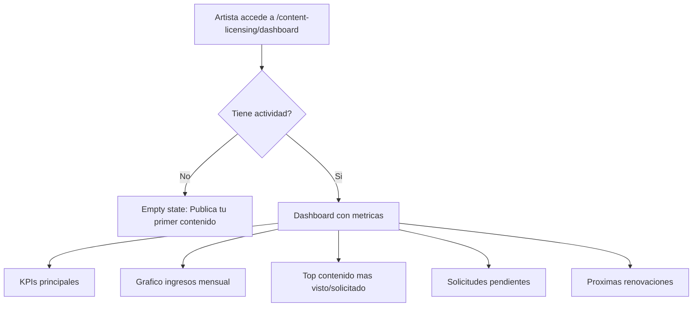
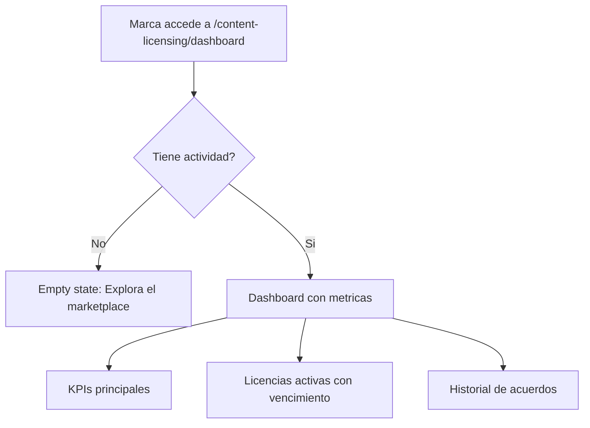

# US-CL-05: Dashboard y Analytics de Licencias

> **ID:** US-CL-05
> **Feature Name:** `cl-dashboard-analytics`
> **Prioridad:** Media
> **Estimacion:** M (Medium)
> **Modulo:** ContentLicensing
> **Dependencias:** US-CL-04

---

## Historia de Usuario

**Como** artista con contenido licenciable,
**Quiero** ver un dashboard con metricas de mi catalogo: ingresos por licencias, contenido mas popular, solicitudes pendientes y licencias proximas a vencer,
**Para** gestionar mi negocio de licencias eficientemente.

---

## Actores

| Actor | Descripcion |
|-------|-------------|
| Artista | Ve dashboard con metricas de su catalogo, ingresos y actividad de licencias |
| Marca | Ve dashboard con metricas de sus licencias activas, gasto y historial |

---

## Precondiciones

- Artista tiene al menos un contenido publicado o una licencia activa
- Marca tiene perfil activo con al menos una solicitud o acuerdo

## Postcondiciones

- Dashboard renderizado con datos actualizados
- Metricas calculadas en tiempo real desde las tablas existentes

---

## Justificacion

Sin visibilidad sobre el rendimiento de su catalogo, el artista no puede tomar decisiones informadas sobre precios, contenido a publicar o negociaciones pendientes. El dashboard centraliza toda la informacion relevante para que tanto artistas como marcas gestionen eficientemente su actividad de licencias.

---

## Flujo Principal: Dashboard del Artista



### KPIs del Artista

| KPI | Calculo | Formato |
|-----|---------|---------|
| Catalogo activo | COUNT(ContenidoLicenciable WHERE Estado = Publicado) | Numero |
| Solicitudes pendientes | COUNT(SolicitudLicencia WHERE Estado IN (Pendiente, En Negociacion)) | Numero con badge |
| Licencias activas | COUNT(AcuerdoLicencia WHERE Estado = Activo) | Numero |
| Ingresos total | SUM(PagoLicencia.ImporteNetoArtista WHERE Estado = Completado) | Moneda |
| Ingresos ultimo mes | SUM(PagoLicencia.ImporteNetoArtista WHERE FechaPago >= 30 dias) | Moneda |
| Ingresos por tipo | GROUP BY TipoLicencia, SUM(ImporteNetoArtista) | Tabla |
| Contenido mas visto | TOP 5 ContenidoLicenciable ORDER BY NumVisualizaciones DESC | Lista |
| Contenido mas solicitado | TOP 5 ContenidoLicenciable ORDER BY NumSolicitudes DESC | Lista |
| Proximas renovaciones | AcuerdoLicencia WHERE Estado = Activo AND DiasRestantes <= 30 | Lista con urgencia |

### Grafico de Ingresos Mensual

| Eje | Datos |
|-----|-------|
| X | Ultimos 12 meses |
| Y | ImporteNetoArtista agrupado por mes |
| Series | Total, por tipo de licencia (opcional toggle) |

---

## Flujo Secundario: Dashboard de la Marca



### KPIs de la Marca

| KPI | Calculo | Formato |
|-----|---------|---------|
| Licencias activas | COUNT(AcuerdoLicencia WHERE Estado = Activo) | Numero |
| Solicitudes en curso | COUNT(SolicitudLicencia WHERE Estado IN (Pendiente, En Negociacion)) | Numero |
| Presupuesto gastado total | SUM(PagoLicencia.ImporteTotal WHERE Estado = Completado) | Moneda |
| Presupuesto ultimo mes | SUM(PagoLicencia.ImporteTotal WHERE FechaPago >= 30 dias) | Moneda |
| Licencias proximas a vencer | AcuerdoLicencia WHERE Estado = Activo AND DiasRestantes <= 30 | Lista con urgencia |
| Historial de acuerdos | Ultimos 10 AcuerdoLicencia ORDER BY FechaCreacion DESC | Lista |

---

## Flujos Alternativos

| ID | Condicion | Accion |
|----|-----------|--------|
| FA-01 | Artista sin contenido publicado ni licencias | Empty state con CTA a publicar contenido |
| FA-02 | Marca sin solicitudes ni acuerdos | Empty state con CTA a explorar marketplace |
| FA-03 | Datos insuficientes para grafico (< 2 meses) | Mostrar KPIs sin grafico, con mensaje informativo |

---

## Criterios de Aceptacion

| ID | Criterio | Metodo de Prueba |
|----|----------|------------------|
| AC-CL05-1 | El artista ve un dashboard con KPIs: catalogo activo, solicitudes pendientes, licencias activas, ingresos total e ingresos ultimo mes | Crear datos, verificar KPIs correctos |
| AC-CL05-2 | El dashboard del artista muestra grafico de ingresos mensual de los ultimos 12 meses | Crear pagos en distintos meses, verificar grafico |
| AC-CL05-3 | El artista ve el top 5 de contenido mas visto y mas solicitado | Crear contenidos con distintos contadores, verificar ranking |
| AC-CL05-4 | Las solicitudes pendientes muestran badge con contador y link directo al listado | Verificar badge y navegacion |
| AC-CL05-5 | Las licencias proximas a vencer (< 30 dias) se muestran con indicador de urgencia | Crear acuerdo proximo a vencer, verificar indicador |
| AC-CL05-6 | La marca ve un dashboard con KPIs: licencias activas, solicitudes en curso, presupuesto gastado e historial | Crear datos como marca, verificar KPIs |
| AC-CL05-7 | Si no hay actividad, se muestra empty state con CTA apropiado para cada rol | Acceder sin datos, verificar empty state |
| AC-CL05-8 | Los ingresos por tipo de licencia se muestran desglosados correctamente | Crear licencias de distintos tipos, verificar desglose |

---

## Especificacion Tecnica

### API Endpoints

#### GET /api/content-licensing/dashboard/artista

Dashboard del artista autenticado.

**Auth:** Artista (autenticado)

**Response 200 OK:**
```json
{
  "data": {
    "kpis": {
      "catalogoActivo": 12,
      "solicitudesPendientes": 3,
      "licenciasActivas": 5,
      "ingresoTotal": 4250.00,
      "ingresoUltimoMes": 850.00,
      "moneda": "EUR"
    },
    "ingresosPorMes": [
      { "mes": "2025-03", "importe": 0 },
      { "mes": "2025-04", "importe": 300.00 },
      { "mes": "2025-05", "importe": 150.00 },
      { "mes": "2025-06", "importe": 500.00 },
      { "mes": "2025-07", "importe": 0 },
      { "mes": "2025-08", "importe": 200.00 },
      { "mes": "2025-09", "importe": 400.00 },
      { "mes": "2025-10", "importe": 350.00 },
      { "mes": "2025-11", "importe": 250.00 },
      { "mes": "2025-12", "importe": 500.00 },
      { "mes": "2026-01", "importe": 750.00 },
      { "mes": "2026-02", "importe": 850.00 }
    ],
    "ingresosPorTipo": [
      { "tipoLicenciaNombre": "Sync", "importe": 2500.00 },
      { "tipoLicenciaNombre": "Micro-Sync", "importe": 1200.00 },
      { "tipoLicenciaNombre": "Blanket", "importe": 550.00 }
    ],
    "topContenidoMasVisto": [
      {
        "id": "guid",
        "titulo": "Amanecer Electronico",
        "numVisualizaciones": 234,
        "numSolicitudes": 8,
        "numLicenciasVendidas": 3
      },
      {
        "id": "guid",
        "titulo": "Noche de Neon",
        "numVisualizaciones": 189,
        "numSolicitudes": 5,
        "numLicenciasVendidas": 2
      }
    ],
    "topContenidoMasSolicitado": [
      {
        "id": "guid",
        "titulo": "Amanecer Electronico",
        "numSolicitudes": 8,
        "numLicenciasVendidas": 3
      }
    ],
    "solicitudesPendientes": [
      {
        "id": "guid",
        "contenidoTitulo": "Beat Cosmico",
        "marcaNombre": "BrandX Agency",
        "importeOfrecido": 300.00,
        "estadoNombre": "Pendiente",
        "fechaCreacion": "2026-02-15T10:00:00Z"
      }
    ],
    "proximasRenovaciones": [
      {
        "acuerdoId": "guid",
        "codigoLicencia": "WPR-CL-20250301-X7K2M9",
        "contenidoTitulo": "Amanecer Electronico",
        "marcaNombre": "SoundBrands Inc",
        "fechaVencimiento": "2026-03-01T00:00:00Z",
        "diasRestantes": 12,
        "importeAcordado": 500.00
      }
    ]
  },
  "messages": []
}
```

---

#### GET /api/content-licensing/dashboard/marca

Dashboard de la marca autenticada.

**Auth:** Marca (autenticado)

**Response 200 OK:**
```json
{
  "data": {
    "kpis": {
      "licenciasActivas": 3,
      "solicitudesEnCurso": 2,
      "presupuestoGastadoTotal": 1850.00,
      "presupuestoUltimoMes": 450.00,
      "moneda": "EUR"
    },
    "licenciasActivas": [
      {
        "acuerdoId": "guid",
        "codigoLicencia": "WPR-CL-20260217-A3F8K2",
        "contenidoTitulo": "Amanecer Electronico - Full Track",
        "artistaNombre": "DJ Luna",
        "importeAcordado": 450.00,
        "fechaVencimiento": "2027-02-18T00:00:00Z",
        "diasRestantes": 365,
        "proximaAVencer": false
      }
    ],
    "solicitudesEnCurso": [
      {
        "id": "guid",
        "contenidoTitulo": "Ritmo Urbano",
        "artistaNombre": "MC Flow",
        "importeOfrecido": 200.00,
        "estadoNombre": "En Negociacion",
        "rondaNegociacion": 1
      }
    ],
    "historialAcuerdos": [
      {
        "acuerdoId": "guid",
        "codigoLicencia": "WPR-CL-20260217-A3F8K2",
        "contenidoTitulo": "Amanecer Electronico",
        "artistaNombre": "DJ Luna",
        "estadoNombre": "Activo",
        "importeAcordado": 450.00,
        "fechaCreacion": "2026-02-17T15:00:00Z"
      }
    ]
  },
  "messages": []
}
```

---

### Modelo de Datos

No se crean entidades nuevas. El dashboard se construye con queries de agregacion sobre:
- `ContenidoLicenciable` (contadores, catalogo)
- `SolicitudLicencia` (pendientes, en curso)
- `AcuerdoLicencia` (activos, vencimiento)
- `PagoLicencia` (ingresos, presupuesto)

### Validaciones

No aplica. Los endpoints de dashboard son de solo lectura (GET).

---

## Mockups / UI

### Dashboard del Artista
```
+----------------------------------------------------------+
|  Content Licensing - Mi Dashboard                        |
+----------------------------------------------------------+
|                                                          |
|  +----------+ +----------+ +----------+ +----------+    |
|  | Catalogo | | Solicit. | | Licencias| | Ingresos |    |
|  |    12    | |    3     | |    5     | | 4,250 EUR|    |
|  | activos  | | pendient | | activas  | | total    |    |
|  +----------+ +----------+ +----------+ +----------+    |
|                                                          |
|  INGRESOS MENSUALES (ultimos 12 meses)                  |
|  +----------------------------------------------------+ |
|  |  EUR                                                | |
|  | 900|                                         __     | |
|  | 750|                                    __ /  \    | |
|  | 600|          __                   __ /       |    | |
|  | 450|     __ /  \        __    __ /            |    | |
|  | 300| __ /       \  __ /  \  /                 |    | |
|  | 150|/             \/       \/                  |    | |
|  |   0+--+--+--+--+--+--+--+--+--+--+--+--+     | |
|  |     Mar Abr May Jun Jul Ago Sep Oct Nov Dic Ene Feb | |
|  +----------------------------------------------------+ |
|                                                          |
|  INGRESOS POR TIPO                                       |
|  +----------------------------------------------------+ |
|  | Sync:        2,500 EUR  (59%)                       | |
|  | Micro-Sync:  1,200 EUR  (28%)                       | |
|  | Blanket:       550 EUR  (13%)                       | |
|  +----------------------------------------------------+ |
|                                                          |
|  TOP CONTENIDO                                           |
|  +----------------------------------------------------+ |
|  | # | Titulo               | Vistas | Solic | Venta | |
|  |---|----------------------|--------|-------|-------| |
|  | 1 | Amanecer Electronico | 234    | 8     | 3     | |
|  | 2 | Noche de Neon        | 189    | 5     | 2     | |
|  | 3 | Beat Cosmico         | 156    | 4     | 1     | |
|  +----------------------------------------------------+ |
|                                                          |
|  SOLICITUDES PENDIENTES (3)        [Ver todas ->]       |
|  +----------------------------------------------------+ |
|  | Beat Cosmico | BrandX Agency | 300 EUR | Pendiente  | |
|  | Noche Neon   | TechAds Co    | 150 EUR | En Negoc.  | |
|  +----------------------------------------------------+ |
|                                                          |
|  PROXIMAS RENOVACIONES                                   |
|  +----------------------------------------------------+ |
|  | WPR-CL-...-X7K2M9 | Amanecer | SoundBrands        | |
|  | Vence: 1 mar 2026  | 12 dias  | 500 EUR   URGENTE | |
|  +----------------------------------------------------+ |
+----------------------------------------------------------+
```

### Dashboard de la Marca
```
+----------------------------------------------------------+
|  Content Licensing - Dashboard de Marca                  |
+----------------------------------------------------------+
|                                                          |
|  +----------+ +----------+ +----------+ +----------+    |
|  | Licencias| | Solicit. | | Gastado  | | Gasto mes|    |
|  |    3     | |    2     | | 1,850 EUR| | 450 EUR  |    |
|  | activas  | | en curso | | total    | | feb 2026 |    |
|  +----------+ +----------+ +----------+ +----------+    |
|                                                          |
|  LICENCIAS ACTIVAS                                       |
|  +----------------------------------------------------+ |
|  | WPR-CL-...-A3F8K2 | Amanecer Electronico           | |
|  | DJ Luna | 450 EUR | Vence: 18 feb 2027 | 365 dias  | |
|  |----------------------------------------------------| |
|  | WPR-CL-...-B5J9L4 | Ritmo Latino                   | |
|  | MC Flow | 200 EUR | Vence: 15 may 2026 | 87 dias   | |
|  +----------------------------------------------------+ |
|                                                          |
|  SOLICITUDES EN CURSO                                    |
|  +----------------------------------------------------+ |
|  | Ritmo Urbano | MC Flow | 200 EUR | En Negociacion  | |
|  | Melodia Folk | Ana G.  | 150 EUR | Pendiente       | |
|  +----------------------------------------------------+ |
|                                                          |
|  HISTORIAL DE ACUERDOS              [Ver todos ->]      |
|  +----------------------------------------------------+ |
|  | WPR-CL-...-A3F8K2 | Amanecer | Activo  | 450 EUR  | |
|  | WPR-CL-...-B5J9L4 | Ritmo    | Activo  | 200 EUR  | |
|  | WPR-CL-...-C2M6P8 | Noche    | Vencido | 300 EUR  | |
|  +----------------------------------------------------+ |
+----------------------------------------------------------+
```

---

## Notas de Implementacion

- Los KPIs se calculan con queries de agregacion (COUNT, SUM, GROUP BY) sobre las tablas existentes
- El grafico de ingresos mensuales agrupa por mes usando FechaPago del PagoLicencia
- Para meses sin ingresos, retornar importe 0 (no omitir el mes)
- Top contenido se calcula en el servidor, no en el frontend
- Las proximas renovaciones se calculan filtrando AcuerdoLicencia WHERE Estado = Activo AND FechaVencimiento <= DateTime.UtcNow.AddDays(30)
- Considerar caching de dashboard (RequestCacheService) ya que los datos no cambian en cada request
- El dashboard no requiere paginacion: muestra datos resumidos con links a listados completos
- Handler CQRS: Query + Handler en mismo archivo, inyectar Service (no DbContext)
- Los endpoints son de solo lectura, no requieren validators
