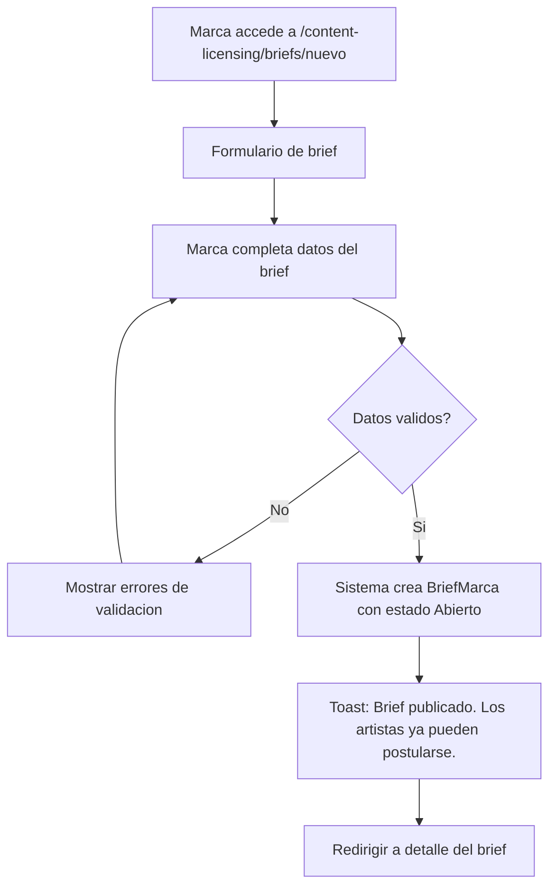
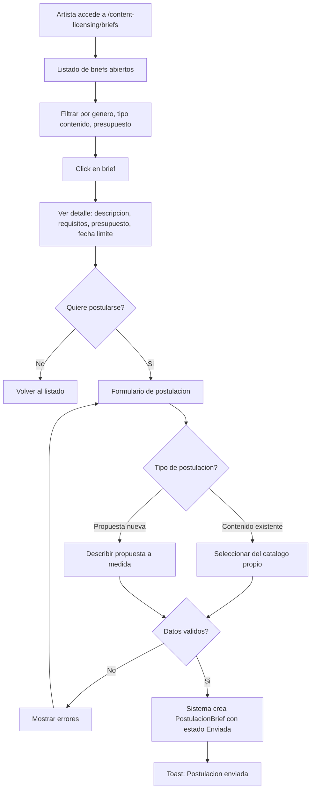
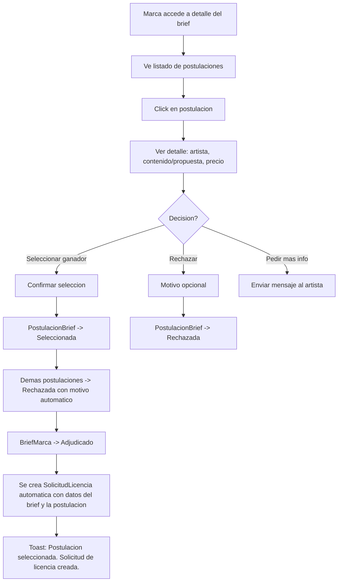
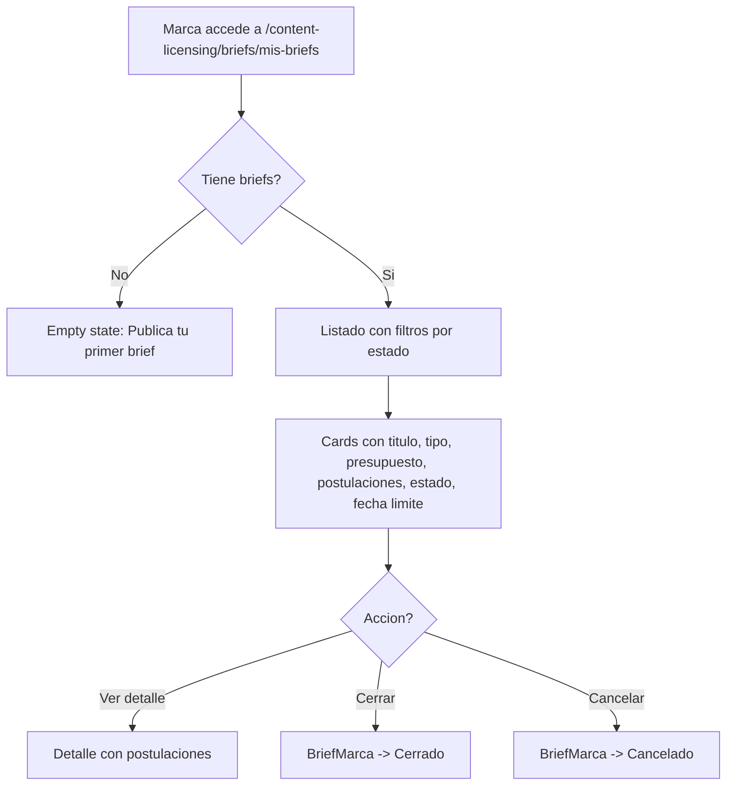
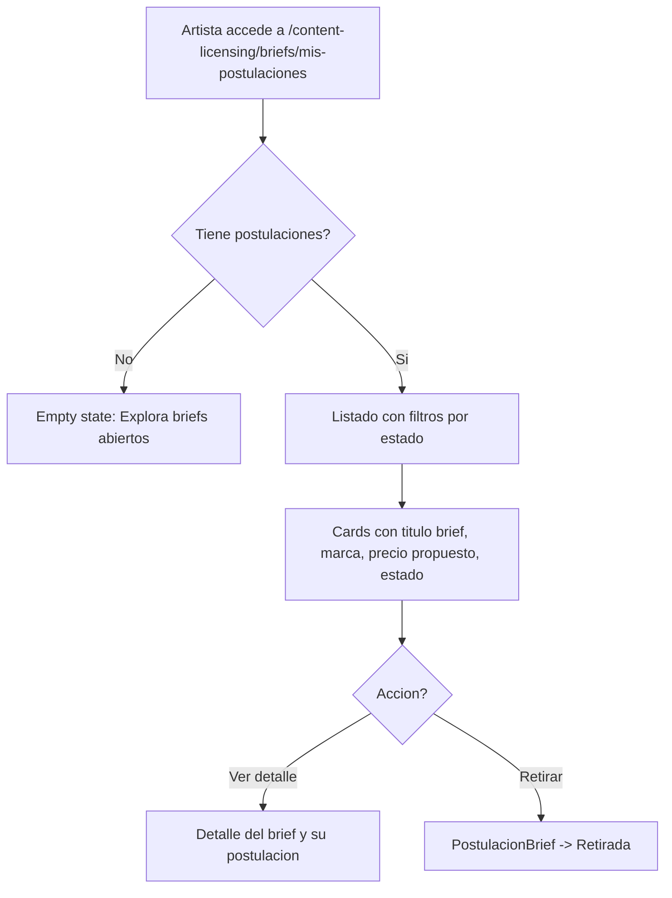

# US-CL-06: Briefs Abiertos y Postulaciones

> **ID:** US-CL-06
> **Feature Name:** `cl-briefs-postulaciones`
> **Prioridad:** Baja
> **Estimacion:** XL (Extra Large)
> **Modulo:** ContentLicensing
> **Dependencias:** US-CL-01

---

## Historia de Usuario

**Como** marca que no encuentra contenido adecuado en el catalogo,
**Quiero** publicar un brief abierto describiendo que tipo de contenido necesito para mi campana,
**Para** que artistas interesados postulen con su contenido existente o propuestas de creacion a medida.

---

## Actores

| Actor | Descripcion |
|-------|-------------|
| Marca | Crea briefs, revisa postulaciones, selecciona ganador |
| Artista | Explora briefs abiertos, postula con contenido existente o propuesta nueva |

---

## Precondiciones

- Marca tiene perfil activo (`EsActiva = true`)
- Artista tiene perfil activo con al menos un contenido publicado (o propuesta nueva)
- Datos seed de maestras cargados (generos, moods, tipos contenido, etc.)

## Postcondiciones

- Brief publicado y visible para artistas
- Postulaciones recibidas y evaluadas
- Ganador seleccionado que conecta con el flujo de solicitud de licencia (US-CL-03)

---

## Justificacion

No todo el contenido que una marca necesita existe en el catalogo. Los briefs abiertos invierten el flujo: en lugar de que la marca busque contenido, los artistas proponen contenido para la necesidad de la marca. Esto es un modelo de CrowdSourcing invertido (la marca busca contenido vs el artista busca servicios en US-CS) y aumenta las oportunidades de negocio para artistas que pueden crear contenido a medida.

---

## Flujo Principal: Marca Crea y Publica Brief



### Campos del Formulario de Brief

| Campo | Tipo | Obligatorio | Validacion |
|-------|------|-------------|------------|
| Titulo | Texto (max 200) | Si | Min 5 caracteres |
| Descripcion | Texto largo | Si | Min 50, max 4000 caracteres |
| Tipo de contenido buscado | Select (MaestraTipoContenido) | Si | Debe existir en maestras |
| Genero musical preferido | Multi-select (MaestraGeneroMusical) | No | Debe existir en maestras |
| Mood deseado | Multi-select (MaestraMoodContenido) | No | Debe existir en maestras |
| BPM deseado (rango) | Range (min/max) | No | 20-300 |
| Duracion deseada (rango) | Range (min/max en seg) | No | > 0 |
| Tipo de uso pretendido | Select (MaestraTipoUsoLicencia) | Si | Debe existir en maestras |
| Plataformas | Multi-select texto | Si | Min 1 seleccion |
| Territorio | Select (MaestraTerritorioLicencia) | Si | Debe existir en maestras |
| Duracion licencia (meses) | Entero | Si | >= 1 |
| Exclusividad requerida | Boolean | Si | Default: false |
| Presupuesto minimo | Decimal | Si | > 0 |
| Presupuesto maximo | Decimal | Si | >= presupuesto minimo |
| Moneda | Select (MaestraMoneda) | Si | Debe existir en maestras |
| Fecha limite postulaciones | Date | Si | >= hoy + 7 dias |
| Referencia / Inspiracion | Texto largo | No | Max 2000 chars |
| URL material referencia | URL (max 500) | No | Formato URL valido |

---

## Flujo Secundario: Artista Explora y Postula a Briefs



### Campos del Formulario de Postulacion

| Campo | Tipo | Obligatorio | Validacion |
|-------|------|-------------|------------|
| Tipo postulacion | Radio (Existente / Nueva) | Si | - |
| Contenido existente | Select (catalogo del artista) | Si (si Existente) | FK valida, estado Publicado |
| Titulo propuesta | Texto (max 200) | Si (si Nueva) | Min 5 chars |
| Descripcion propuesta | Texto largo | Si | Min 20, max 2000 chars |
| Precio propuesto | Decimal | Si | > 0 |
| Moneda | Select (MaestraMoneda) | Si | Debe existir |
| Tiempo estimado (dias) | Entero | Si (si Nueva) | > 0 |
| URL demo/preview | URL (max 500) | No | Formato URL valido |

---

## Flujo Secundario: Marca Revisa Postulaciones



### Efectos Colaterales al Seleccionar Ganador (Transaccional)

1. Postulacion seleccionada pasa a estado `Seleccionada`
2. Demas postulaciones activas pasan a `Rechazada` con motivo "Otra postulacion fue seleccionada"
3. Brief pasa a estado `Adjudicado`
4. Se crea automaticamente una `SolicitudLicencia` vinculando contenido, marca, artista y terminos

---

## Flujo Secundario: Marca Gestiona Sus Briefs



---

## Flujo Secundario: Artista Gestiona Sus Postulaciones



---

## Diagrama de Estados del Brief

```
    +----------+
    | ABIERTO  | <-- marca publica brief
    +-----+----+
          |
    +-----+-----+-------------+
    |           |             |
 [seleccionar] [cerrar]   [cancelar]
 [ganador]     [sin        [antes de
    |          ganador]    fecha]
    v           v             v
+-----------+ +---------+ +----------+
|ADJUDICADO | | CERRADO | | CANCELADO|
+-----------+ +---------+ +----------+

    [fecha limite sin seleccion] --> EN SELECCION
    +-------------+
    | EN SELECCION| --> 30 dias para seleccionar --> CERRADO
    +-------------+
```

## Diagrama de Estados de la Postulacion

```
    +----------+
    |  ENVIADA | <-- artista postula
    +-----+----+
          |
    +-----+-----+----------+
    |           |          |
 [seleccionar] [rechazar] [retirar]
    |           |          |
    v           v          v
+-----------+ +----------+ +----------+
|SELECCIONADA| | RECHAZADA| | RETIRADA |
+-----------+ +----------+ +----------+

    +-----------+
    |EN REVISION| <-- marca abre postulacion (opcional, intermedio)
    +-----------+
```

---

## Flujos Alternativos

| ID | Condicion | Accion |
|----|-----------|--------|
| FA-01 | Brief llega a fecha limite sin postulaciones | Brief pasa a Cerrado automaticamente |
| FA-02 | Brief llega a fecha limite con postulaciones sin seleccionar | Brief pasa a En Seleccion, marca tiene 30 dias para elegir |
| FA-03 | Artista intenta postular a su propio brief | Error: No puedes postularte a un brief de tu propia marca |
| FA-04 | Artista intenta postular dos veces al mismo brief | Error: Ya tienes una postulacion activa para este brief |
| FA-05 | Artista retira postulacion antes de seleccion | PostulacionBrief -> Retirada |
| FA-06 | Marca cancela brief con postulaciones activas | Brief -> Cancelado, todas las postulaciones -> Rechazada con motivo "Brief cancelado por la marca" |
| FA-07 | Contenido seleccionado ya no esta publicado al adjudicar | Error: El contenido ya no esta disponible. Selecciona otra postulacion |
| FA-08 | Artista postula con propuesta nueva (no contenido existente) | Se crea postulacion sin ContenidoLicenciableId, la solicitud de licencia se creara cuando el artista publique el contenido |

---

## Criterios de Aceptacion

| ID | Criterio | Metodo de Prueba |
|----|----------|------------------|
| AC-CL06-1 | Una marca puede crear y publicar un brief con titulo, descripcion, tipo contenido, presupuesto y fecha limite. El brief se crea con estado Abierto | Completar formulario, verificar en BD |
| AC-CL06-2 | Los briefs abiertos son visibles para todos los artistas en el listado publico con filtros por genero, tipo contenido y presupuesto | Login como artista, verificar listado y filtros |
| AC-CL06-3 | Un artista puede postularse a un brief con contenido existente de su catalogo o con una propuesta nueva. La postulacion se crea con estado Enviada | Postular con ambas opciones, verificar en BD |
| AC-CL06-4 | Un artista no puede postularse dos veces al mismo brief ni postularse a briefs de su propia marca | Intentar duplicado y auto-postulacion, verificar errores |
| AC-CL06-5 | La marca ve las postulaciones recibidas en el detalle del brief con datos del artista, contenido/propuesta y precio | Verificar listado de postulaciones |
| AC-CL06-6 | Al seleccionar un ganador: la postulacion pasa a Seleccionada, demas pasan a Rechazada, brief pasa a Adjudicado y se crea SolicitudLicencia automatica | Seleccionar ganador, verificar todo el flujo transaccional |
| AC-CL06-7 | La marca puede rechazar postulaciones individualmente con motivo opcional | Rechazar postulacion, verificar estado |
| AC-CL06-8 | El artista puede retirar su postulacion si aun no fue seleccionada o rechazada | Retirar postulacion, verificar estado |
| AC-CL06-9 | Al cancelar un brief con postulaciones activas, todas pasan a Rechazada con motivo automatico | Cancelar brief, verificar postulaciones |
| AC-CL06-10 | La fecha limite se valida como minimo 7 dias desde hoy. Al llegar la fecha sin seleccion, el brief pasa a En Seleccion con 30 dias adicionales para decidir | Verificar validacion y transicion de estados |

---

## Especificacion Tecnica

### API Endpoints

#### POST /api/content-licensing/briefs

Crear y publicar brief.

**Auth:** Marca (autenticado con perfil activo)

**Request:**
```json
{
  "titulo": "Musica para campana de verano - Marca de ropa deportiva",
  "descripcion": "Buscamos un track energetico y juvenil para nuestra campana de verano 2026. Ideal genero electronico o pop con influencias latinas. Duracion entre 30 segundos y 2 minutos. El track acompanara un spot de TV y redes sociales mostrando nuestra nueva coleccion de verano. Buscamos algo fresco, con buena energia y que conecte con audiencia 18-35 anos.",
  "tipoContenidoId": 1,
  "generosMusicalIds": [4, 1, 10],
  "moodsIds": [1, 5],
  "bpmMin": 110,
  "bpmMax": 140,
  "duracionMin": 30,
  "duracionMax": 120,
  "tipoUsoId": 3,
  "plataformas": ["YouTube", "Instagram", "TikTok", "TV Abierta"],
  "territorioId": 1,
  "duracionLicenciaMeses": 12,
  "exclusividadRequerida": true,
  "presupuestoMinimo": 300.00,
  "presupuestoMaximo": 800.00,
  "monedaId": 1,
  "fechaLimitePostulaciones": "2026-03-15",
  "referenciaInspiracion": "Algo similar al estilo de Dua Lipa - Levitating o Bad Bunny - Dakiti en terminos de energia y ritmo.",
  "urlMaterialReferencia": "https://example.com/moodboard-campana-verano"
}
```

**Response 201 Created:**
```json
{
  "data": {
    "id": "guid",
    "titulo": "Musica para campana de verano - Marca de ropa deportiva",
    "estadoBriefNombre": "Abierto",
    "presupuestoMinimo": 300.00,
    "presupuestoMaximo": 800.00,
    "monedaNombre": "EUR",
    "fechaLimitePostulaciones": "2026-03-15",
    "fechaCreacion": "2026-02-17T10:00:00Z"
  },
  "messages": [
    { "message": "Brief publicado. Los artistas ya pueden postularse.", "errorCode": "0001" }
  ]
}
```

**Errores:**
- `400 Bad Request` - Validacion fallida
- `401 Unauthorized` - No autenticado
- `403 Forbidden` - No tiene perfil de marca activo

---

#### GET /api/content-licensing/briefs

Listar briefs abiertos (vista publica para artistas).

**Auth:** Artista (autenticado)

**Query Params:** `generoMusicalId`, `tipoContenidoId`, `presupuestoMin`, `presupuestoMax`, `tipoUsoId`, `page`, `pageSize`

**Response 200 OK:**
```json
{
  "data": {
    "items": [
      {
        "id": "guid",
        "titulo": "Musica para campana de verano",
        "marcaNombre": "SoundBrands Inc",
        "marcaLogoUrl": "https://cdn.soundbrands.com/logo.png",
        "tipoContenidoNombre": "Cancion Completa",
        "generosNombres": ["Electronica/EDM", "Pop", "Latin"],
        "moodsNombres": ["Energetico", "Festivo"],
        "presupuestoMinimo": 300.00,
        "presupuestoMaximo": 800.00,
        "monedaNombre": "EUR",
        "tipoUsoNombre": "Digital",
        "exclusividadRequerida": true,
        "fechaLimitePostulaciones": "2026-03-15",
        "diasRestantes": 26,
        "numPostulaciones": 5,
        "yaPostulado": false
      }
    ],
    "totalCount": 12,
    "page": 1,
    "pageSize": 10
  },
  "messages": []
}
```

---

#### GET /api/content-licensing/briefs/mis-briefs

Listar briefs creados por la marca.

**Auth:** Marca (autenticado)

**Query Params:** `estadoBriefId`, `page`, `pageSize`

**Response 200 OK:**
```json
{
  "data": {
    "items": [
      {
        "id": "guid",
        "titulo": "Musica para campana de verano",
        "estadoBriefNombre": "Abierto",
        "presupuestoMinimo": 300.00,
        "presupuestoMaximo": 800.00,
        "monedaNombre": "EUR",
        "numPostulaciones": 5,
        "fechaLimitePostulaciones": "2026-03-15",
        "diasRestantes": 26,
        "fechaCreacion": "2026-02-17T10:00:00Z"
      }
    ],
    "totalCount": 3,
    "page": 1,
    "pageSize": 10
  },
  "messages": []
}
```

---

#### GET /api/content-licensing/briefs/{id}

Detalle completo del brief con postulaciones (si es la marca propietaria).

**Auth:** Marca (propietaria, ve postulaciones) o Artista (ve brief sin postulaciones ajenas)

**Response 200 OK:**
```json
{
  "data": {
    "id": "guid",
    "titulo": "Musica para campana de verano - Marca de ropa deportiva",
    "descripcion": "Buscamos un track energetico y juvenil...",
    "estadoBriefId": 1,
    "estadoBriefNombre": "Abierto",
    "marca": {
      "id": "guid",
      "nombreComercial": "SoundBrands Inc",
      "sectorNombre": "Moda",
      "urlLogo": "https://cdn.soundbrands.com/logo.png"
    },
    "requisitos": {
      "tipoContenidoNombre": "Cancion Completa",
      "generosNombres": ["Electronica/EDM", "Pop", "Latin"],
      "moodsNombres": ["Energetico", "Festivo"],
      "bpmMin": 110,
      "bpmMax": 140,
      "duracionMin": 30,
      "duracionMax": 120,
      "tipoUsoNombre": "Digital",
      "plataformas": ["YouTube", "Instagram", "TikTok", "TV Abierta"],
      "territorioNombre": "Mundial",
      "duracionLicenciaMeses": 12,
      "exclusividadRequerida": true
    },
    "presupuesto": {
      "minimo": 300.00,
      "maximo": 800.00,
      "monedaNombre": "EUR"
    },
    "fechaLimitePostulaciones": "2026-03-15",
    "diasRestantes": 26,
    "referenciaInspiracion": "Algo similar al estilo de Dua Lipa...",
    "urlMaterialReferencia": "https://example.com/moodboard-campana-verano",
    "numPostulaciones": 5,
    "postulaciones": [
      {
        "id": "guid",
        "artistaNombre": "DJ Luna",
        "tipoPostulacion": "Existente",
        "contenidoTitulo": "Summer Vibes Track",
        "descripcionPropuesta": "Este track encaja perfecto con lo que buscan...",
        "precioPropuesto": 500.00,
        "monedaNombre": "EUR",
        "urlDemoPreview": "https://storage.weplay.com/previews/summer-vibes.mp3",
        "estadoPostulacionNombre": "Enviada",
        "fechaCreacion": "2026-02-20T10:00:00Z"
      },
      {
        "id": "guid",
        "artistaNombre": "MC Flow",
        "tipoPostulacion": "Nueva",
        "contenidoTitulo": null,
        "tituloPropuesta": "Beat Verano Custom",
        "descripcionPropuesta": "Puedo crear un track a medida con ritmo urbano-latino...",
        "precioPropuesto": 650.00,
        "monedaNombre": "EUR",
        "tiempoEstimadoDias": 14,
        "urlDemoPreview": null,
        "estadoPostulacionNombre": "Enviada",
        "fechaCreacion": "2026-02-21T14:00:00Z"
      }
    ],
    "miPostulacion": null,
    "miRol": "Marca",
    "fechaCreacion": "2026-02-17T10:00:00Z"
  },
  "messages": []
}
```

**Nota:** Si el usuario es artista, `postulaciones` solo contiene su propia postulacion (si tiene). Si es marca, contiene todas.

---

#### POST /api/content-licensing/briefs/{id}/postulaciones

Postularse a un brief.

**Auth:** Artista (autenticado)

**Request (contenido existente):**
```json
{
  "tipoPostulacion": "Existente",
  "contenidoLicenciableId": "guid",
  "descripcionPropuesta": "Este track encaja perfecto con lo que buscan. Tiene la energia y el ritmo ideal para un spot de ropa deportiva. Ya ha sido licenciado con exito para campanas similares.",
  "precioPropuesto": 500.00,
  "monedaId": 1,
  "urlDemoPreview": "https://storage.weplay.com/previews/summer-vibes.mp3"
}
```

**Request (propuesta nueva):**
```json
{
  "tipoPostulacion": "Nueva",
  "tituloPropuesta": "Beat Verano Custom",
  "descripcionPropuesta": "Puedo crear un track a medida con ritmo urbano-latino que combine lo mejor del regueton con pop electronico. Tengo experiencia en produccion para marcas deportivas.",
  "precioPropuesto": 650.00,
  "monedaId": 1,
  "tiempoEstimadoDias": 14,
  "urlDemoPreview": null
}
```

**Response 201 Created:**
```json
{
  "data": {
    "id": "guid",
    "briefTitulo": "Musica para campana de verano",
    "tipoPostulacion": "Existente",
    "estadoPostulacionNombre": "Enviada",
    "precioPropuesto": 500.00,
    "monedaNombre": "EUR",
    "fechaCreacion": "2026-02-20T10:00:00Z"
  },
  "messages": [
    { "message": "Postulacion enviada", "errorCode": "0001" }
  ]
}
```

**Errores:**
- `400 Bad Request` - Validacion fallida, postulacion duplicada, o postulacion a brief propio
- `404 Not Found` - Brief no existe o no esta abierto

---

#### PATCH /api/content-licensing/briefs/{id}/postulaciones/{postId}/seleccionar

Seleccionar ganador. Transaccional: actualiza postulacion + rechaza demas + adjudica brief + crea solicitud licencia.

**Auth:** Marca (propietaria del brief)

**Request:**
```json
{
  "mensaje": "Tu propuesta es exactamente lo que buscamos. Felicidades!"
}
```

**Response 200 OK:**
```json
{
  "data": {
    "postulacionId": "guid",
    "estadoPostulacionNombre": "Seleccionada",
    "briefId": "guid",
    "estadoBriefNombre": "Adjudicado",
    "solicitudLicenciaId": "guid",
    "postulacionesRechazadas": 4
  },
  "messages": [
    { "message": "Postulacion seleccionada. Solicitud de licencia creada.", "errorCode": "0002" }
  ]
}
```

---

#### PATCH /api/content-licensing/briefs/{id}/postulaciones/{postId}/rechazar

Rechazar postulacion individualmente.

**Auth:** Marca (propietaria del brief)

**Request:**
```json
{
  "motivo": "El estilo no encaja con nuestra vision de campana"
}
```

**Response 200 OK:**
```json
{
  "data": {
    "postulacionId": "guid",
    "estadoPostulacionNombre": "Rechazada"
  },
  "messages": [
    { "message": "Postulacion rechazada", "errorCode": "0002" }
  ]
}
```

---

#### PATCH /api/content-licensing/briefs/{id}/cerrar

Cerrar brief sin seleccionar ganador.

**Auth:** Marca (propietaria)

**Response 200 OK:**
```json
{
  "data": {
    "briefId": "guid",
    "estadoBriefNombre": "Cerrado",
    "postulacionesRechazadas": 5
  },
  "messages": [
    { "message": "Brief cerrado", "errorCode": "0002" }
  ]
}
```

---

#### PATCH /api/content-licensing/briefs/{id}/cancelar

Cancelar brief.

**Auth:** Marca (propietaria)

**Request:**
```json
{
  "motivo": "Hemos decidido cambiar la estrategia de la campana"
}
```

**Response 200 OK:**
```json
{
  "data": {
    "briefId": "guid",
    "estadoBriefNombre": "Cancelado",
    "postulacionesRechazadas": 5
  },
  "messages": [
    { "message": "Brief cancelado", "errorCode": "0002" }
  ]
}
```

---

### Modelo de Datos

```csharp
public class BriefMarca
{
    public Guid Id { get; set; }
    public Guid PerfilMarcaId { get; set; }                // FK -> PerfilMarca
    public string Titulo { get; set; } = null!;
    public string Descripcion { get; set; } = null!;
    public int TipoContenidoId { get; set; }               // FK -> MaestraTipoContenido
    public string? GenerosMusicalIds { get; set; }         // JSON array de IDs
    public string? MoodsIds { get; set; }                  // JSON array de IDs
    public int? BpmMin { get; set; }
    public int? BpmMax { get; set; }
    public int? DuracionMin { get; set; }                  // Segundos
    public int? DuracionMax { get; set; }                  // Segundos
    public int TipoUsoId { get; set; }                     // FK -> MaestraTipoUsoLicencia
    public string Plataformas { get; set; } = null!;       // JSON array
    public int TerritorioId { get; set; }                  // FK -> MaestraTerritorioLicencia
    public int DuracionLicenciaMeses { get; set; }
    public bool ExclusividadRequerida { get; set; }
    public decimal PresupuestoMinimo { get; set; }
    public decimal PresupuestoMaximo { get; set; }
    public int MonedaId { get; set; }                      // FK -> MaestraMoneda
    public DateTime FechaLimitePostulaciones { get; set; }
    public string? ReferenciaInspiracion { get; set; }
    public string? UrlMaterialReferencia { get; set; }
    public int EstadoBriefId { get; set; }                 // FK -> MaestraEstadoBrief
    public string? MotivoCancelacion { get; set; }
    public DateTime FechaCreacion { get; set; }
    public DateTime? FechaActualizacion { get; set; }

    // Navigation
    public PerfilMarca PerfilMarca { get; set; } = null!;
    public ICollection<PostulacionBrief> Postulaciones { get; set; } = new List<PostulacionBrief>();
}

public class PostulacionBrief
{
    public Guid Id { get; set; }
    public Guid BriefMarcaId { get; set; }                 // FK -> BriefMarca
    public Guid ArtistaId { get; set; }                    // FK -> Artista
    public string TipoPostulacion { get; set; } = null!;   // "Existente" | "Nueva"
    public Guid? ContenidoLicenciableId { get; set; }      // FK -> ContenidoLicenciable (si existente)
    public string? TituloPropuesta { get; set; }           // Si propuesta nueva
    public string DescripcionPropuesta { get; set; } = null!;
    public decimal PrecioPropuesto { get; set; }
    public int MonedaId { get; set; }                      // FK -> MaestraMoneda
    public int? TiempoEstimadoDias { get; set; }          // Si propuesta nueva
    public string? UrlDemoPreview { get; set; }
    public int EstadoPostulacionId { get; set; }           // FK -> MaestraEstadoPostulacion
    public string? MotivoRechazo { get; set; }
    public string? MensajeSeleccion { get; set; }
    public DateTime FechaCreacion { get; set; }
    public DateTime? FechaActualizacion { get; set; }

    // Navigation
    public BriefMarca BriefMarca { get; set; } = null!;
    public ContenidoLicenciable? ContenidoLicenciable { get; set; }
}
```

### Tablas Maestras Adicionales (Seed Data)

```
MaestraEstadoBrief: 5 valores (Abierto, En Seleccion, Adjudicado, Cerrado, Cancelado)
MaestraEstadoPostulacion: 5 valores (Enviada, En Revision, Seleccionada, Rechazada, Retirada)
```

### Validaciones

```csharp
// CreateBriefMarcaValidator
RuleFor(x => x.Titulo)
    .NotEmpty()
    .WithMessage("El titulo es obligatorio")
    .WithErrorCode(ServiceResponseMessageType.Validation_Required)
    .MinimumLength(5)
    .WithMessage("Minimo 5 caracteres")
    .WithErrorCode(ServiceResponseMessageType.Validation_MinLength)
    .MaximumLength(200)
    .WithMessage("Maximo 200 caracteres")
    .WithErrorCode(ServiceResponseMessageType.Validation_MaxLength);

RuleFor(x => x.Descripcion)
    .NotEmpty()
    .WithMessage("La descripcion es obligatoria")
    .WithErrorCode(ServiceResponseMessageType.Validation_Required)
    .MinimumLength(50)
    .WithMessage("Minimo 50 caracteres para describir adecuadamente la necesidad")
    .WithErrorCode(ServiceResponseMessageType.Validation_MinLength)
    .MaximumLength(4000)
    .WithMessage("Maximo 4000 caracteres")
    .WithErrorCode(ServiceResponseMessageType.Validation_MaxLength);

RuleFor(x => x.TipoContenidoId)
    .NotEmpty()
    .WithMessage("El tipo de contenido es obligatorio")
    .WithErrorCode(ServiceResponseMessageType.Validation_Required);

RuleFor(x => x.TipoUsoId)
    .NotEmpty()
    .WithMessage("El tipo de uso es obligatorio")
    .WithErrorCode(ServiceResponseMessageType.Validation_Required);

RuleFor(x => x.Plataformas)
    .NotEmpty()
    .WithMessage("Debe seleccionar al menos una plataforma")
    .WithErrorCode(ServiceResponseMessageType.Validation_Required);

RuleFor(x => x.PresupuestoMinimo)
    .GreaterThan(0)
    .WithMessage("El presupuesto minimo debe ser mayor a 0")
    .WithErrorCode(ServiceResponseMessageType.Validation_InvalidRange);

RuleFor(x => x.PresupuestoMaximo)
    .GreaterThanOrEqualTo(x => x.PresupuestoMinimo)
    .WithMessage("El presupuesto maximo debe ser >= al minimo")
    .WithErrorCode(ServiceResponseMessageType.Validation_InvalidRange);

RuleFor(x => x.FechaLimitePostulaciones)
    .GreaterThanOrEqualTo(DateTime.UtcNow.Date.AddDays(7))
    .WithMessage("La fecha limite debe ser al menos 7 dias desde hoy")
    .WithErrorCode(ServiceResponseMessageType.Validation_InvalidRange);

RuleFor(x => x.BpmMax)
    .GreaterThanOrEqualTo(x => x.BpmMin ?? 0)
    .When(x => x.BpmMax.HasValue && x.BpmMin.HasValue)
    .WithMessage("BPM maximo debe ser >= al minimo")
    .WithErrorCode(ServiceResponseMessageType.Validation_InvalidRange);

RuleFor(x => x.UrlMaterialReferencia)
    .Must(BeAValidUrl)
    .When(x => !string.IsNullOrEmpty(x.UrlMaterialReferencia))
    .WithMessage("Formato URL invalido")
    .WithErrorCode(ServiceResponseMessageType.Validation_InvalidUrl);

// CreatePostulacionBriefValidator
RuleFor(x => x.DescripcionPropuesta)
    .NotEmpty()
    .WithMessage("La descripcion de la propuesta es obligatoria")
    .WithErrorCode(ServiceResponseMessageType.Validation_Required)
    .MinimumLength(20)
    .WithMessage("Minimo 20 caracteres")
    .WithErrorCode(ServiceResponseMessageType.Validation_MinLength)
    .MaximumLength(2000)
    .WithMessage("Maximo 2000 caracteres")
    .WithErrorCode(ServiceResponseMessageType.Validation_MaxLength);

RuleFor(x => x.PrecioPropuesto)
    .GreaterThan(0)
    .WithMessage("El precio propuesto debe ser mayor a 0")
    .WithErrorCode(ServiceResponseMessageType.Validation_InvalidRange);

RuleFor(x => x.ContenidoLicenciableId)
    .NotEmpty()
    .When(x => x.TipoPostulacion == "Existente")
    .WithMessage("Debe seleccionar un contenido de su catalogo")
    .WithErrorCode(ServiceResponseMessageType.Validation_Required);

RuleFor(x => x.TituloPropuesta)
    .NotEmpty()
    .When(x => x.TipoPostulacion == "Nueva")
    .WithMessage("El titulo de la propuesta es obligatorio")
    .WithErrorCode(ServiceResponseMessageType.Validation_Required)
    .MaximumLength(200)
    .WithMessage("Maximo 200 caracteres")
    .WithErrorCode(ServiceResponseMessageType.Validation_MaxLength);

RuleFor(x => x.TiempoEstimadoDias)
    .GreaterThan(0)
    .When(x => x.TipoPostulacion == "Nueva")
    .WithMessage("El tiempo estimado debe ser mayor a 0 dias")
    .WithErrorCode(ServiceResponseMessageType.Validation_InvalidRange);

RuleFor(x => x.UrlDemoPreview)
    .Must(BeAValidUrl)
    .When(x => !string.IsNullOrEmpty(x.UrlDemoPreview))
    .WithMessage("Formato URL invalido")
    .WithErrorCode(ServiceResponseMessageType.Validation_InvalidUrl);

// CancelarBriefValidator
RuleFor(x => x.Motivo)
    .NotEmpty()
    .WithMessage("El motivo es obligatorio")
    .WithErrorCode(ServiceResponseMessageType.Validation_Required)
    .MinimumLength(10)
    .WithMessage("Minimo 10 caracteres")
    .WithErrorCode(ServiceResponseMessageType.Validation_MinLength)
    .MaximumLength(1000)
    .WithMessage("Maximo 1000 caracteres")
    .WithErrorCode(ServiceResponseMessageType.Validation_MaxLength);
```

---

## Mockups / UI

### Listado de Briefs Abiertos (vista artista)
```
+----------------------------------------------------------+
|  Briefs Abiertos - Oportunidades de Licencia            |
+----------------------------------------------------------+
|                                                          |
|  Filtros: Genero [Todos v] Tipo [Todos v] Precio [0-max]|
|                                                          |
|  +----------------------------------------------------+ |
|  | [logo] SoundBrands Inc                   ABIERTO   | |
|  |                                                      | |
|  | Musica para campana de verano                       | |
|  | Tipo: Cancion Completa                               | |
|  | Generos: Electronica, Pop, Latin                     | |
|  | Mood: Energetico, Festivo                            | |
|  | Uso: Digital | Mundial | Exclusivo                   | |
|  | Presupuesto: 300 - 800 EUR                          | |
|  | Fecha limite: 15 mar 2026 (26 dias)                  | |
|  | 5 postulaciones                                      | |
|  |                             [Ver detalle]            | |
|  +----------------------------------------------------+ |
|                                                          |
|  +----------------------------------------------------+ |
|  | [logo] TechAds Co                        ABIERTO   | |
|  |                                                      | |
|  | Jingle tecnologico para app de finanzas             | |
|  | Tipo: Instrumental                                   | |
|  | Generos: Electronica, Ambient                        | |
|  | Uso: App Movil | Espana | No exclusivo              | |
|  | Presupuesto: 150 - 400 EUR                          | |
|  | Fecha limite: 1 abr 2026 (43 dias)                   | |
|  | 2 postulaciones                                      | |
|  |                             [Ver detalle]            | |
|  +----------------------------------------------------+ |
|                                                          |
|  [< Anterior]  Pagina 1 de 2  [Siguiente >]            |
+----------------------------------------------------------+
```

### Detalle del Brief (vista artista)
```
+----------------------------------------------------------+
|  < Volver a briefs                                       |
+----------------------------------------------------------+
|                                                          |
|  Musica para campana de verano          ABIERTO         |
|  SoundBrands Inc | Moda                                  |
|                                                          |
|  DESCRIPCION                                             |
|  Buscamos un track energetico y juvenil para nuestra    |
|  campana de verano 2026. Ideal genero electronico o     |
|  pop con influencias latinas...                          |
|                                                          |
|  REQUISITOS                                              |
|  +----------------------------------------------------+ |
|  | Tipo: Cancion Completa                               | |
|  | Generos: Electronica, Pop, Latin                     | |
|  | Mood: Energetico, Festivo                            | |
|  | BPM: 110-140  | Duracion: 0:30 - 2:00              | |
|  | Uso: Digital  | Plataformas: YT, IG, TK, TV        | |
|  | Territorio: Mundial | Exclusividad: Si              | |
|  | Duracion licencia: 12 meses                          | |
|  +----------------------------------------------------+ |
|                                                          |
|  PRESUPUESTO: 300 - 800 EUR                             |
|  FECHA LIMITE: 15 mar 2026 (26 dias restantes)          |
|                                                          |
|  REFERENCIA / INSPIRACION                                |
|  Algo similar al estilo de Dua Lipa - Levitating...    |
|  [Ver material de referencia ->]                         |
|                                                          |
|  [Postularme a este brief]                               |
+----------------------------------------------------------+
```

### Formulario de Postulacion
```
+----------------------------------------------------------+
|  Postularme al brief                                     |
+----------------------------------------------------------+
|                                                          |
|  Tipo de postulacion *                                   |
|  (o) Contenido existente de mi catalogo                 |
|  ( ) Propuesta nueva / a medida                          |
|                                                          |
|  Seleccionar contenido *                                 |
|  [Summer Vibes Track              v]                    |
|                                                          |
|  Descripcion de la propuesta *                           |
|  [Este track encaja perfecto con lo que buscan.        ]|
|  [Tiene la energia y el ritmo ideal para un spot...    ]|
|                                                          |
|  Precio propuesto *       Moneda *                       |
|  [500.00]                 [EUR          v]              |
|                                                          |
|  URL demo/preview                                        |
|  [https://storage.weplay.com/previews/summer.mp3       ]|
|                                                          |
|  [Cancelar]              [Enviar postulacion]            |
+----------------------------------------------------------+
```

### Detalle del Brief (vista marca con postulaciones)
```
+----------------------------------------------------------+
|  Musica para campana de verano          ABIERTO         |
|  5 postulaciones | Limite: 15 mar 2026                   |
+----------------------------------------------------------+
|                                                          |
|  POSTULACIONES RECIBIDAS                                 |
|                                                          |
|  +----------------------------------------------------+ |
|  | DJ Luna                     ENVIADA     500 EUR     | |
|  | Contenido: Summer Vibes Track                       | |
|  | "Este track encaja perfecto con lo que buscan..."   | |
|  | [>] Preview                                          | |
|  | [Seleccionar ganador]  [Rechazar]                   | |
|  +----------------------------------------------------+ |
|                                                          |
|  +----------------------------------------------------+ |
|  | MC Flow                     ENVIADA     650 EUR     | |
|  | Propuesta nueva: Beat Verano Custom                 | |
|  | "Puedo crear un track a medida con ritmo..."        | |
|  | Tiempo estimado: 14 dias                             | |
|  | [Seleccionar ganador]  [Rechazar]                   | |
|  +----------------------------------------------------+ |
|                                                          |
|  +----------------------------------------------------+ |
|  | Ana Guitar                  ENVIADA     380 EUR     | |
|  | Contenido: Sol y Playa Acoustic                     | |
|  | "Mi cancion tiene el mood festivo perfecto..."      | |
|  | [>] Preview                                          | |
|  | [Seleccionar ganador]  [Rechazar]                   | |
|  +----------------------------------------------------+ |
|                                                          |
|  [Cerrar brief sin seleccionar]  [Cancelar brief]       |
+----------------------------------------------------------+
```

---

## Notas de Implementacion

- Este modulo conecta conceptualmente con CrowdSourcing (US-CS) pero invierte el flujo: en CS el artista publica necesidades y profesionales postulan; en CL-06 la marca publica briefs y artistas postulan
- La seleccion de ganador es la operacion mas compleja: transaccional (actualiza postulacion, rechaza demas, adjudica brief, crea solicitud licencia)
- Para postulaciones con "propuesta nueva", la SolicitudLicencia se crea sin ContenidoLicenciableId; se vinculara cuando el artista publique el contenido
- GenerosMusicalIds y MoodsIds se almacenan como JSON arrays para soportar multi-seleccion
- El job de cierre automatico (fecha limite) puede evaluarse lazy al consultar o con background service
- Constraint unico por (BriefMarcaId, ArtistaId) para evitar postulaciones duplicadas
- Un artista no puede postularse a un brief si su UserId es el mismo que el de la marca (validar via FK)
- Handler CQRS: Command + Handler en mismo archivo, inyectar Service (no DbContext)
- Considerar paginacion en postulaciones si un brief recibe muchas
