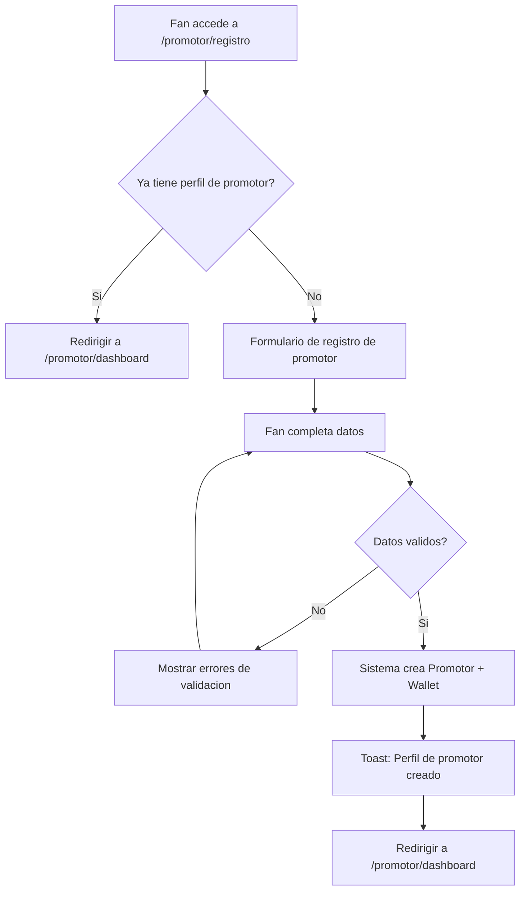
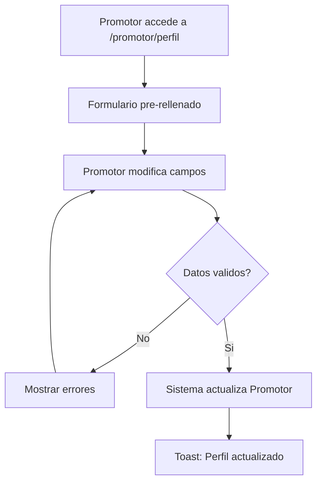
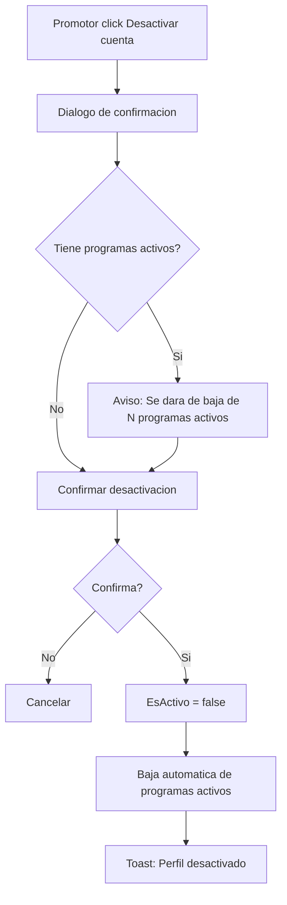

# US-CP-01: Registro y Gestion del Perfil de Promotor

> **ID:** US-CP-01
> **Feature Name:** `cp-perfil-promotor`
> **Prioridad:** Alta
> **Estimacion:** M (Medium)
> **Modulo:** Crowdpromotion
> **Dependencias:** Ninguna (punto de entrada al modulo)

---

## Historia de Usuario

**Como** fan registrado en la plataforma,
**Quiero** crear mi perfil de promotor indicando mi nombre publico, redes sociales y tipo de promotor (Fan Embajador, Influencer, Medio/Blog),
**Para** poder postularme a programas de promocion de artistas y ganar comisiones difundiendo sus campanas.

---

## Actores

| Actor | Descripcion |
|-------|-------------|
| Fan | Usuario autenticado con cuenta activa que desea convertirse en promotor |

---

## Precondiciones

- Usuario tiene cuenta activa en la plataforma
- Usuario esta autenticado
- Existen datos seed de `Maestra_TipoPromotor`

## Postcondiciones

- Se crea un registro `Promotor` vinculado al UserId del usuario autenticado
- El promotor queda en estado `EsActivo = true`
- Se crea automaticamente una `PromotorWallet` en la moneda por defecto (EUR)

---

## Justificacion

Para que el sistema de CrowdPromotion funcione, los fans e influencers necesitan un perfil especifico de promotor que contenga sus redes sociales y datos de contacto. Este perfil es independiente del perfil de Fan y es el punto de entrada obligatorio para participar en cualquier programa de promocion.

---

## Flujo Principal: Registrarse como Promotor



### Campos del Formulario

| Campo | Tipo | Obligatorio | Validacion |
|-------|------|-------------|------------|
| Nombre publico | Texto (max 200) | Si | Min 3 caracteres |
| Tipo de promotor | Select (MaestraTipoPromotor) | Si | Debe existir en maestras |
| Email de contacto | Email (max 200) | No | Formato email valido |
| URL sitio web | URL (max 300) | No | Formato URL valido |
| URL Instagram | URL (max 300) | No | Formato URL valido |
| URL TikTok | URL (max 300) | No | Formato URL valido |
| URL YouTube | URL (max 300) | No | Formato URL valido |
| URL Twitter/X | URL (max 300) | No | Formato URL valido |

---

## Flujo Secundario: Editar Perfil de Promotor



**Reglas de edicion:**
- Todos los campos son editables excepto el tipo de promotor
- Al guardar, se actualiza `FechaActualizacion`

---

## Flujo Secundario: Desactivar Perfil de Promotor



---

## Flujos Alternativos

| ID | Condicion | Accion |
|----|-----------|--------|
| FA-01 | Fan ya tiene perfil de promotor | Redirigir a dashboard |
| FA-02 | Fan no tiene FanProfile | Crear perfil de promotor sin vincular FanProfileId |
| FA-03 | Ninguna red social indicada | Permitir registro, mostrar aviso recomendando agregar al menos una |

---

## Criterios de Aceptacion

| ID | Criterio | Metodo de Prueba |
|----|----------|------------------|
| AC-CP01-1 | Un fan autenticado puede crear su perfil de promotor con nombre publico y tipo de promotor | Completar formulario, verificar en BD |
| AC-CP01-2 | El sistema vincula automaticamente el UserId y FanProfileId (si existe) al perfil creado | Verificar FKs en BD tras creacion |
| AC-CP01-3 | El perfil se crea con EsActivo = true | Verificar campo en BD |
| AC-CP01-4 | Se crea automaticamente una PromotorWallet en EUR al crear el perfil | Verificar wallet en BD |
| AC-CP01-5 | Un usuario no puede crear dos perfiles de promotor (uno por UserId) | Intentar crear duplicado, verificar error |
| AC-CP01-6 | El promotor puede editar su perfil (excepto tipo de promotor) y se actualiza FechaActualizacion | Editar perfil, verificar cambios |
| AC-CP01-7 | Al desactivar el perfil, se da de baja automatica de programas activos | Desactivar con programas, verificar bajas |
| AC-CP01-8 | Las URLs de redes sociales se validan con formato URL correcto | Enviar URL invalida, verificar error de validacion |

---

## Especificacion Tecnica

### API Endpoints

#### POST /api/crowdpromotion/promotor

Crear perfil de promotor.

**Auth:** Fan (autenticado)

**Request:**
```json
{
  "nombrePublico": "DJ Marketing Pro",
  "tipoPromotorId": 2,
  "emailContacto": "contacto@djmarketing.com",
  "urlSitioWeb": "https://djmarketing.com",
  "urlInstagram": "https://instagram.com/djmarketing",
  "urlTikTok": "https://tiktok.com/@djmarketing",
  "urlYouTube": null,
  "urlTwitter": null
}
```

**Response 201 Created:**
```json
{
  "data": {
    "id": "guid",
    "nombrePublico": "DJ Marketing Pro",
    "tipoPromotorNombre": "Influencer",
    "esActivo": true,
    "fechaCreacion": "2026-02-17T10:00:00Z"
  },
  "messages": [
    { "message": "Perfil de promotor creado", "errorCode": "0001" }
  ]
}
```

**Errores:**
- `400 Bad Request` - Validacion fallida o ya tiene perfil de promotor
- `401 Unauthorized` - No autenticado

---

#### GET /api/crowdpromotion/promotor/me

Obtener perfil del promotor autenticado.

**Auth:** Promotor (autenticado)

**Response 200 OK:**
```json
{
  "data": {
    "id": "guid",
    "nombrePublico": "DJ Marketing Pro",
    "tipoPromotorId": 2,
    "tipoPromotorNombre": "Influencer",
    "emailContacto": "contacto@djmarketing.com",
    "urlSitioWeb": "https://djmarketing.com",
    "urlInstagram": "https://instagram.com/djmarketing",
    "urlTikTok": "https://tiktok.com/@djmarketing",
    "urlYouTube": null,
    "urlTwitter": null,
    "esActivo": true,
    "fechaCreacion": "2026-02-17T10:00:00Z",
    "totalProgramasActivos": 3,
    "totalComisionesGanadas": 150.50,
    "monedaComisiones": "EUR"
  },
  "messages": []
}
```

---

#### PUT /api/crowdpromotion/promotor/me

Editar perfil del promotor autenticado.

**Auth:** Promotor (autenticado)

**Request:**
```json
{
  "nombrePublico": "DJ Marketing Pro (Updated)",
  "emailContacto": "nuevo@djmarketing.com",
  "urlSitioWeb": "https://djmarketing.com",
  "urlInstagram": "https://instagram.com/djmarketing",
  "urlTikTok": "https://tiktok.com/@djmarketing",
  "urlYouTube": "https://youtube.com/@djmarketing",
  "urlTwitter": null
}
```

**Response 200 OK:**
```json
{
  "data": {
    "id": "guid",
    "nombrePublico": "DJ Marketing Pro (Updated)",
    "fechaActualizacion": "2026-02-18T09:00:00Z"
  },
  "messages": [
    { "message": "Perfil actualizado", "errorCode": "0002" }
  ]
}
```

---

#### PATCH /api/crowdpromotion/promotor/me/desactivar

Desactivar perfil de promotor.

**Auth:** Promotor (autenticado)

**Response 200 OK:**
```json
{
  "data": {
    "id": "guid",
    "esActivo": false,
    "programasDadosDeBaja": 2
  },
  "messages": [
    { "message": "Perfil desactivado", "errorCode": "0002" }
  ]
}
```

---

### Modelo de Datos

Entidad principal: `Promotor` (ya definida en dominio)

```csharp
public class Promotor
{
    public PromotorId Id { get; set; }
    public int TipoPromotorId { get; set; }           // FK -> MaestraTipoPromotor
    public string UserId { get; set; } = null!;        // FK -> Identity User
    public FanProfileId? FanProfileId { get; set; }    // FK -> FanProfile (opcional)
    public string NombrePublico { get; set; } = null!;
    public string? EmailContacto { get; set; }
    public string? UrlSitioWeb { get; set; }
    public string? UrlInstagram { get; set; }
    public string? UrlTikTok { get; set; }
    public string? UrlYouTube { get; set; }
    public string? UrlTwitter { get; set; }
    public bool EsActivo { get; set; }
    public DateTime FechaCreacion { get; set; }
    public DateTime? FechaActualizacion { get; set; }
}
```

### Validaciones

```csharp
// CreatePromotorValidator
RuleFor(x => x.NombrePublico)
    .NotEmpty()
    .WithMessage("El nombre publico es obligatorio")
    .WithErrorCode(ServiceResponseMessageType.Validation_Required)
    .MinimumLength(3)
    .WithMessage("El nombre debe tener al menos 3 caracteres")
    .WithErrorCode(ServiceResponseMessageType.Validation_MinLength)
    .MaximumLength(200)
    .WithMessage("Maximo 200 caracteres")
    .WithErrorCode(ServiceResponseMessageType.Validation_MaxLength);

RuleFor(x => x.TipoPromotorId)
    .NotEmpty()
    .WithMessage("El tipo de promotor es obligatorio")
    .WithErrorCode(ServiceResponseMessageType.Validation_Required);

RuleFor(x => x.EmailContacto)
    .EmailAddress()
    .When(x => !string.IsNullOrEmpty(x.EmailContacto))
    .WithMessage("El email no tiene formato valido")
    .WithErrorCode(ServiceResponseMessageType.Validation_InvalidEmail);

RuleFor(x => x.UrlInstagram)
    .Must(BeAValidUrl)
    .When(x => !string.IsNullOrEmpty(x.UrlInstagram))
    .WithMessage("La URL de Instagram no tiene formato valido")
    .WithErrorCode(ServiceResponseMessageType.Validation_InvalidUrl);

// Idem para UrlTikTok, UrlYouTube, UrlTwitter, UrlSitioWeb
```

---

## Datos Seed: Maestra_TipoPromotor

| Id | Nombre | Descripcion |
|----|--------|-------------|
| 1 | Fan Embajador | Fan que promueve artistas por pasion y por recompensas |
| 2 | Influencer | Creador de contenido con audiencia en redes sociales |
| 3 | Medio / Blog | Medio de comunicacion, blog o podcast musical |
| 4 | Profesional Marketing | Profesional del marketing digital o musical |

---

## Mockups / UI

### Formulario de Registro de Promotor
```
+------------------------------------------+
|  Conviertete en Promotor                 |
+------------------------------------------+
|                                          |
|  Nombre publico *                        |
|  [_____________________________________] |
|                                          |
|  Tipo de promotor *                      |
|  [Fan Embajador              v]          |
|                                          |
|  Email de contacto                       |
|  [_____________________________________] |
|                                          |
|  Sitio web                               |
|  [_____________________________________] |
|                                          |
|  Redes sociales                          |
|  Instagram  [_________________________]  |
|  TikTok     [_________________________]  |
|  YouTube    [_________________________]  |
|  Twitter/X  [_________________________]  |
|                                          |
|  [Cancelar]          [Crear perfil]      |
+------------------------------------------+
```

### Dashboard del Promotor (vista basica)
```
+------------------------------------------+
|  Mi perfil de Promotor                   |
+------------------------------------------+
|                                          |
|  DJ Marketing Pro          ACTIVO        |
|  Influencer                              |
|                                          |
|  +----------+ +----------+ +----------+  |
|  | Programas| | Tareas   | | Wallet   |  |
|  |     3    | |    12    | | 150.50 E |  |
|  | activos  | | pendient | | saldo    |  |
|  +----------+ +----------+ +----------+  |
|                                          |
|  [Editar perfil]  [Ver programas]        |
+------------------------------------------+
```

---

## Notas de Implementacion

- Un usuario solo puede tener un perfil de promotor (constraint unico por UserId)
- La wallet se crea automaticamente en EUR al crear el perfil
- El perfil de promotor es independiente del perfil de artista: un usuario puede ser ambos
- La desactivacion es logica (EsActivo = false), no se borra el registro
- Handler CQRS: Command + Handler en mismo archivo, inyectar Service (no DbContext)
