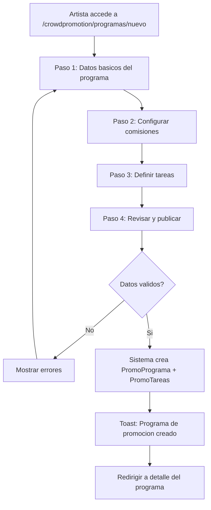
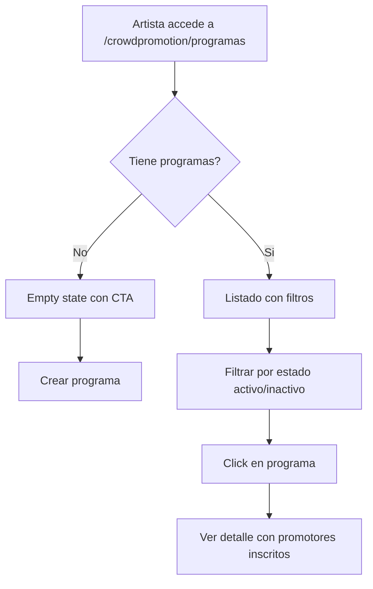
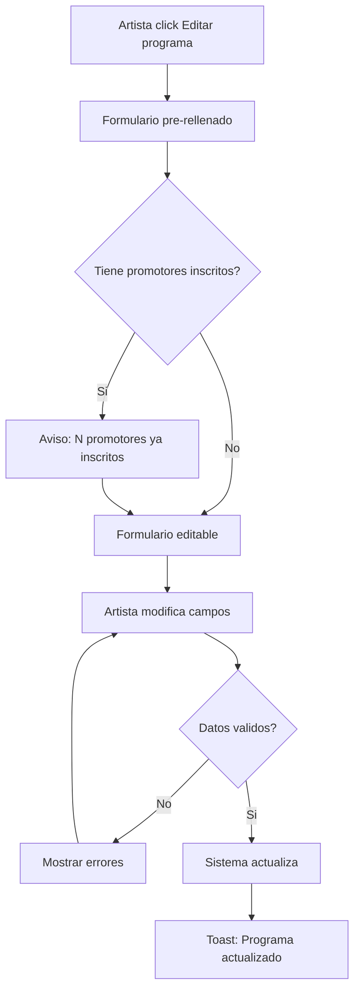
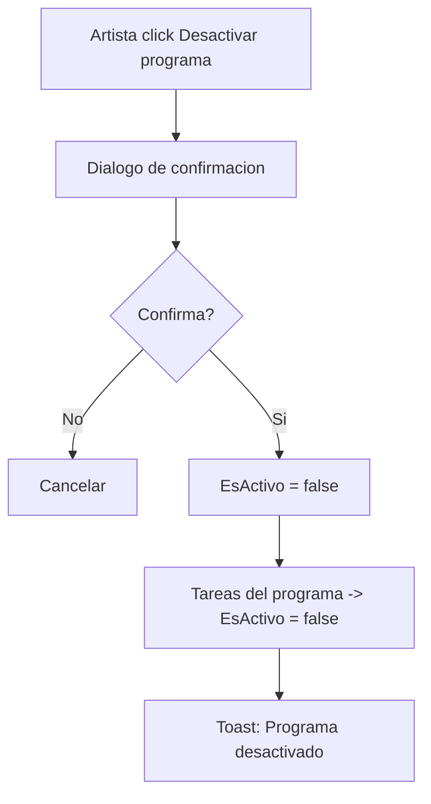

# US-CP-02: Crear y Gestionar Programas de Promocion

> **ID:** US-CP-02
> **Feature Name:** `cp-programas-promocion`
> **Prioridad:** Alta
> **Estimacion:** XL (Extra Large)
> **Modulo:** Crowdpromotion
> **Dependencias:** US-CP-01

---

## Historia de Usuario

**Como** artista con una campana de crowdfunding activa,
**Quiero** crear un programa de promocion donde defina el tipo de programa (referral, afiliado, influencer), las comisiones por conversion, la URL de destino, y las tareas que deben completar los promotores,
**Para** que fans e influencers difundan mi campana a cambio de recompensas claras y medibles.

---

## Actores

| Actor | Descripcion |
|-------|-------------|
| Artista | Usuario autenticado con perfil de artista y al menos una campana de crowdfunding |

---

## Precondiciones

- Usuario tiene cuenta activa y perfil de Artista
- Existe al menos una CampaniaCrowdfunding o ProyectoArtistico del artista
- Existen datos seed de `Maestra_TipoPromo`, `Maestra_TipoEventoPromo`, `Maestra_TipoReward`

## Postcondiciones

- Se crea un `PromoPrograma` vinculado al artista
- Se crean N `PromoTarea` asociadas al programa
- El programa queda en estado `EsActivo = true`

---

## Justificacion

El programa de promocion es el nucleo del modulo CrowdPromotion. El artista necesita definir las "reglas del juego": que tipo de promocion ofrece, cuanto paga por conversion, que tareas deben hacer los promotores, y durante cuanto tiempo. Sin programas, los promotores no tienen nada a lo que inscribirse.

---

## Flujo Principal: Crear Programa de Promocion



### Paso 1: Datos Basicos

| Campo | Tipo | Obligatorio | Validacion |
|-------|------|-------------|------------|
| Titulo | Texto (max 200) | Si | Min 5 caracteres |
| Descripcion | Texto largo | No | Max 4000 caracteres |
| Tipo de programa | Select (MaestraTipoPromo) | Si | Debe existir en maestras |
| Campana de crowdfunding | Select | No | FK a CampaniaCrowdfunding del artista |
| Proyecto artistico | Select | No | FK a ProyectoArtistico del artista |
| URL landing | URL (max 500) | No | Formato URL valido |
| Codigo tracking base | Texto (max 50) | No | Solo alfanumerico y guiones |
| Fecha inicio | Date | No | >= hoy |
| Fecha fin | Date | No | > fecha inicio |

### Paso 2: Configurar Comisiones

| Campo | Tipo | Obligatorio | Validacion |
|-------|------|-------------|------------|
| Moneda | Select (MaestraMoneda) | Si | Debe existir en maestras |
| Comision por porcentaje | Decimal (max 5,2) | No | 0-100% |
| Comision fija por conversion | Decimal (max 18,2) | No | >= 0 |

**Regla:** Al menos una de las dos comisiones debe estar definida (porcentaje o fija).

### Paso 3: Definir Tareas

El artista puede agregar N tareas al programa. Cada tarea:

| Campo | Tipo | Obligatorio | Validacion |
|-------|------|-------------|------------|
| Nombre | Texto (max 200) | Si | Min 3 caracteres |
| Descripcion | Texto largo | No | Max 4000 caracteres |
| Tipo de evento | Select (MaestraTipoEventoPromo) | Si | Click, Share, Post, etc. |
| Tipo de recompensa | Select (MaestraTipoReward) | Si | Dinero, Puntos, Mixto |
| Importe recompensa | Decimal | No | >= 0 (requerido si tipo = Dinero o Mixto) |
| Moneda recompensa | Select | No | Requerido si importe > 0 |
| Puntos recompensa | Entero | No | >= 0 (requerido si tipo = Puntos o Mixto) |
| URL instrucciones | URL (max 500) | No | Formato URL valido |
| Es repetible | Boolean | Si | Default: true |
| Max repeticiones | Entero | No | >= 1 (requerido si es repetible) |
| Fecha inicio | Date | No | >= fecha inicio programa |
| Fecha fin | Date | No | <= fecha fin programa |

### Paso 4: Revisar y Publicar

- Resumen del programa: datos basicos + comisiones + tareas
- Confirmar creacion

---

## Flujo Secundario: Listar Mis Programas



**Datos por programa en listado:**

| Dato | Fuente |
|------|--------|
| Titulo | PromoPrograma.Titulo |
| Tipo de programa | MaestraTipoPromo.Nombre |
| Estado (badge) | EsActivo: Activo (verde) / Inactivo (gris) |
| Campana vinculada | CampaniaCrowdfunding.Titulo |
| Numero de promotores | COUNT(PromoProgramaPromotor WHERE EsAprobado) |
| Numero de tareas | COUNT(PromoTarea WHERE EsActivo) |
| Comision | ImporteComisionPorcentaje% o ImporteComisionFija EUR |
| Fechas | FechaInicio - FechaFin |

---

## Flujo Secundario: Editar Programa



**Reglas de edicion:**
- Se pueden editar todos los campos del programa
- Se pueden agregar nuevas tareas
- Se pueden editar/desactivar tareas existentes
- No se pueden eliminar tareas que ya tienen completados (PromoTareaPromotor)
- Si tiene promotores, mostrar aviso informativo

---

## Flujo Secundario: Desactivar Programa



**Reglas:**
- Los promotores inscritos mantienen sus registros historicos
- El programa ya no aparece en el listado publico para nuevas inscripciones
- Los eventos existentes siguen siendo rastreables

---

## Flujos Alternativos

| ID | Condicion | Accion |
|----|-----------|--------|
| FA-01 | Artista no tiene campanas de crowdfunding | Permitir crear programa sin vincular campana |
| FA-02 | Artista no define ninguna tarea | Permitir crear programa solo con comisiones por conversion |
| FA-03 | Fecha fin < fecha inicio | Mostrar error de validacion |
| FA-04 | Ni comision porcentaje ni fija definidas | Mostrar error: al menos una comision requerida |
| FA-05 | Codigo tracking base duplicado | Mostrar error de unicidad |

---

## Criterios de Aceptacion

| ID | Criterio | Metodo de Prueba |
|----|----------|------------------|
| AC-CP02-1 | El artista puede crear un programa con datos basicos, comisiones y al menos una tarea | Completar wizard, verificar en BD |
| AC-CP02-2 | El programa se crea con EsActivo = true y las tareas con EsActivo = true | Verificar campos en BD |
| AC-CP02-3 | El ArtistaId se asigna automaticamente desde el contexto del usuario | Verificar FK en BD |
| AC-CP02-4 | Se valida que al menos una comision (porcentaje o fija) este definida | Enviar sin comisiones, verificar error |
| AC-CP02-5 | El artista ve un listado de sus programas con badge de estado y contadores | Crear programas, verificar listado |
| AC-CP02-6 | Se puede editar un programa y sus tareas. Si tiene promotores, se muestra aviso | Editar con/sin promotores |
| AC-CP02-7 | Al desactivar un programa, sus tareas se desactivan tambien | Desactivar, verificar tareas |
| AC-CP02-8 | El codigo tracking base es unico por artista | Intentar duplicado, verificar error |
| AC-CP02-9 | Las tareas repetibles requieren max repeticiones | Crear tarea repetible sin max, verificar error |
| AC-CP02-10 | Se puede crear un programa sin vincular campana de crowdfunding | Crear sin campana, verificar exito |

---

## Especificacion Tecnica

### API Endpoints

#### POST /api/crowdpromotion/programas

Crear programa de promocion con tareas.

**Auth:** Artista (autenticado)

**Request:**
```json
{
  "titulo": "Promociona mi nuevo album",
  "descripcion": "Ayudanos a difundir nuestro nuevo album...",
  "tipoPromoId": 1,
  "campaniaCrowdfundingId": "guid",
  "proyectoArtisticoId": "guid",
  "urlLanding": "https://weplay.com/campanias/mi-album",
  "codigoTrackingBase": "album-2026",
  "monedaId": 1,
  "importeComisionPorcentaje": 10.00,
  "importeComisionFija": null,
  "fechaInicio": "2026-03-01",
  "fechaFin": "2026-06-01",
  "tareas": [
    {
      "nombre": "Comparte en Instagram Stories",
      "descripcion": "Sube una story mencionando la campana...",
      "tipoEventoPromoId": 3,
      "tipoRewardId": 1,
      "importeReward": 5.00,
      "monedaId": 1,
      "puntosReward": null,
      "urlInstrucciones": "https://docs.example.com/instrucciones-ig",
      "esRepetible": true,
      "maxRepeticiones": 10,
      "fechaInicio": "2026-03-01",
      "fechaFin": "2026-06-01"
    }
  ]
}
```

**Response 201 Created:**
```json
{
  "data": {
    "id": "guid",
    "titulo": "Promociona mi nuevo album",
    "tipoPromoNombre": "Referral",
    "esActivo": true,
    "tareasCreadas": 1,
    "fechaCreacion": "2026-02-17T10:00:00Z"
  },
  "messages": [
    { "message": "Programa de promocion creado", "errorCode": "0001" }
  ]
}
```

**Errores:**
- `400 Bad Request` - Validacion fallida
- `403 Forbidden` - La campana no pertenece al artista
- `404 Not Found` - Campana o proyecto no existe

---

#### GET /api/crowdpromotion/programas/mis-programas

Listar programas del artista autenticado.

**Auth:** Artista (autenticado)

**Query params:** `esActivo`, `page`, `pageSize`

**Response 200 OK:**
```json
{
  "data": {
    "items": [
      {
        "id": "guid",
        "titulo": "Promociona mi nuevo album",
        "tipoPromoId": 1,
        "tipoPromoNombre": "Referral",
        "campaniaTitulo": "Mi Album Debut",
        "esActivo": true,
        "importeComisionPorcentaje": 10.00,
        "importeComisionFija": null,
        "monedaNombre": "EUR",
        "numeroPromotores": 5,
        "numeroTareas": 3,
        "fechaInicio": "2026-03-01",
        "fechaFin": "2026-06-01",
        "fechaCreacion": "2026-02-17T10:00:00Z"
      }
    ],
    "totalCount": 2,
    "page": 1,
    "pageSize": 10
  },
  "messages": []
}
```

---

#### GET /api/crowdpromotion/programas/{id}

Detalle de programa (propietario artista).

**Auth:** Artista (propietario)

**Response 200 OK:**
```json
{
  "data": {
    "id": "guid",
    "titulo": "Promociona mi nuevo album",
    "descripcion": "Ayudanos a difundir...",
    "tipoPromoId": 1,
    "tipoPromoNombre": "Referral",
    "campaniaCrowdfundingId": "guid",
    "campaniaTitulo": "Mi Album Debut",
    "proyectoArtisticoId": "guid",
    "urlLanding": "https://weplay.com/campanias/mi-album",
    "codigoTrackingBase": "album-2026",
    "monedaId": 1,
    "monedaNombre": "EUR",
    "importeComisionPorcentaje": 10.00,
    "importeComisionFija": null,
    "esActivo": true,
    "fechaInicio": "2026-03-01",
    "fechaFin": "2026-06-01",
    "fechaCreacion": "2026-02-17T10:00:00Z",
    "tareas": [
      {
        "id": "guid",
        "nombre": "Comparte en Instagram Stories",
        "descripcion": "Sube una story mencionando la campana...",
        "tipoEventoPromoNombre": "Share",
        "tipoRewardNombre": "Dinero",
        "importeReward": 5.00,
        "monedaNombre": "EUR",
        "puntosReward": null,
        "esRepetible": true,
        "maxRepeticiones": 10,
        "esActivo": true,
        "completadosPorPromotores": 23
      }
    ],
    "promotores": [
      {
        "id": "guid",
        "promotorNombre": "DJ Marketing Pro",
        "tipoPromotorNombre": "Influencer",
        "esAprobado": true,
        "esBloqueado": false,
        "fechaAlta": "2026-03-05T14:00:00Z"
      }
    ],
    "resumen": {
      "totalPromotoresAprobados": 5,
      "totalPromotoresPendientes": 2,
      "totalEventos": 150,
      "totalConversiones": 12,
      "valorTotalGenerado": 1200.00
    }
  },
  "messages": []
}
```

---

#### PUT /api/crowdpromotion/programas/{id}

Editar programa.

**Auth:** Artista (propietario)

**Request:** Mismos campos que POST.

**Response 200 OK:**
```json
{
  "data": {
    "id": "guid",
    "titulo": "Promociona mi nuevo album (actualizado)",
    "fechaActualizacion": "2026-02-18T09:00:00Z"
  },
  "messages": [
    { "message": "Programa actualizado", "errorCode": "0002" }
  ]
}
```

---

#### PATCH /api/crowdpromotion/programas/{id}/desactivar

Desactivar programa.

**Auth:** Artista (propietario)

**Response 200 OK:**
```json
{
  "data": {
    "id": "guid",
    "esActivo": false,
    "tareasDesactivadas": 3
  },
  "messages": [
    { "message": "Programa desactivado", "errorCode": "0002" }
  ]
}
```

---

### Modelo de Datos

Entidades principales: `PromoPrograma` y `PromoTarea` (ya definidas en dominio)

### Validaciones

```csharp
// CreatePromoProgramaValidator
RuleFor(x => x.Titulo)
    .NotEmpty()
    .WithMessage("El titulo es obligatorio")
    .WithErrorCode(ServiceResponseMessageType.Validation_Required)
    .MaximumLength(200)
    .WithMessage("Maximo 200 caracteres")
    .WithErrorCode(ServiceResponseMessageType.Validation_MaxLength);

RuleFor(x => x.TipoPromoId)
    .NotEmpty()
    .WithMessage("El tipo de programa es obligatorio")
    .WithErrorCode(ServiceResponseMessageType.Validation_Required);

RuleFor(x => x.MonedaId)
    .NotEmpty()
    .WithMessage("La moneda es obligatoria")
    .WithErrorCode(ServiceResponseMessageType.Validation_Required);

RuleFor(x => x)
    .Must(x => x.ImporteComisionPorcentaje.HasValue || x.ImporteComisionFija.HasValue)
    .WithMessage("Debe definir al menos una comision (porcentaje o fija)")
    .WithErrorCode(ServiceResponseMessageType.Validation_Required);

RuleFor(x => x.ImporteComisionPorcentaje)
    .InclusiveBetween(0, 100)
    .When(x => x.ImporteComisionPorcentaje.HasValue)
    .WithMessage("La comision porcentaje debe estar entre 0 y 100")
    .WithErrorCode(ServiceResponseMessageType.Validation_InvalidRange);

RuleFor(x => x.FechaFin)
    .GreaterThan(x => x.FechaInicio)
    .When(x => x.FechaFin.HasValue && x.FechaInicio.HasValue)
    .WithMessage("La fecha fin debe ser posterior a la fecha inicio")
    .WithErrorCode(ServiceResponseMessageType.Validation_InvalidDate);

RuleForEach(x => x.Tareas).ChildRules(t =>
{
    t.RuleFor(x => x.Nombre)
        .NotEmpty()
        .WithMessage("El nombre de la tarea es obligatorio")
        .WithErrorCode(ServiceResponseMessageType.Validation_Required)
        .MaximumLength(200)
        .WithMessage("Maximo 200 caracteres")
        .WithErrorCode(ServiceResponseMessageType.Validation_MaxLength);

    t.RuleFor(x => x.TipoEventoPromoId)
        .NotEmpty()
        .WithMessage("El tipo de evento es obligatorio")
        .WithErrorCode(ServiceResponseMessageType.Validation_Required);

    t.RuleFor(x => x.TipoRewardId)
        .NotEmpty()
        .WithMessage("El tipo de recompensa es obligatorio")
        .WithErrorCode(ServiceResponseMessageType.Validation_Required);

    t.RuleFor(x => x.MaxRepeticiones)
        .GreaterThanOrEqualTo(1)
        .When(x => x.EsRepetible)
        .WithMessage("Las tareas repetibles requieren max repeticiones >= 1")
        .WithErrorCode(ServiceResponseMessageType.Validation_InvalidRange);
});
```

---

## Datos Seed

### Maestra_TipoPromo

| Id | Nombre | Descripcion |
|----|--------|-------------|
| 1 | Referral | Programa de referidos: comision por cada nuevo backer referido |
| 2 | Afiliado | Programa de afiliados: comision por ventas generadas |
| 3 | Influencer | Programa para influencers: tareas de contenido con recompensa |
| 4 | Mixto | Combinacion de referral + tareas de contenido |

### Maestra_TipoEventoPromo

| Id | Nombre | Descripcion |
|----|--------|-------------|
| 1 | Click | Click en enlace de referido |
| 2 | PageView | Visita a la pagina de la campana |
| 3 | Share | Compartir en redes sociales |
| 4 | Post | Publicacion original sobre la campana |
| 5 | Signup | Registro de nuevo usuario referido |
| 6 | Backing | Aportacion/backing a la campana (conversion) |

### Maestra_TipoReward

| Id | Nombre | Descripcion |
|----|--------|-------------|
| 1 | Dinero | Recompensa monetaria |
| 2 | Puntos | Recompensa en puntos canjeables |
| 3 | Mixto | Dinero + puntos |

---

## Mockups / UI

### Wizard - Paso 1: Datos Basicos
```
+------------------------------------------+
|  Crear programa de promocion    [1/4]    |
+------------------------------------------+
|                                          |
|  Titulo *                                |
|  [_____________________________________] |
|                                          |
|  Descripcion                             |
|  [_____________________________________] |
|                                          |
|  Tipo de programa *                      |
|  [Referral                    v]         |
|                                          |
|  Campana de crowdfunding                 |
|  [Mi Album Debut              v]         |
|                                          |
|  URL landing          Codigo tracking    |
|  [________________]   [album-2026___]    |
|                                          |
|  Fecha inicio          Fecha fin         |
|  [2026-03-01]          [2026-06-01]      |
|                                          |
|                        [Siguiente >]     |
+------------------------------------------+
```

### Wizard - Paso 3: Tareas
```
+------------------------------------------+
|  Definir tareas               [3/4]      |
+------------------------------------------+
|                                          |
|  +------------------------------------+ |
|  | Comparte en Instagram Stories       | |
|  | Share | Dinero: 5 EUR | Repetible x10 |
|  | [Editar] [Eliminar]                | |
|  +------------------------------------+ |
|                                          |
|  +------------------------------------+ |
|  | Publica un TikTok                   | |
|  | Post | Dinero: 10 EUR | Repetible x5 |
|  | [Editar] [Eliminar]                | |
|  +------------------------------------+ |
|                                          |
|  [+ Agregar tarea]                       |
|                                          |
|  [< Atras]             [Siguiente >]     |
+------------------------------------------+
```

### Listado de Mis Programas
```
+------------------------------------------+
|  Mis programas de promocion   [+ Nuevo]  |
+------------------------------------------+
|  Filtros: [Todos v]                      |
+------------------------------------------+
|                                          |
|  +------------------------------------+ |
|  | Promociona mi nuevo album  ACTIVO  | |
|  | Referral | Mi Album Debut          | |
|  | 10% comision | 5 promotores        | |
|  | 3 tareas | Mar 2026 - Jun 2026     | |
|  +------------------------------------+ |
|                                          |
+------------------------------------------+
```

---

## Notas de Implementacion

- La creacion del programa y sus tareas debe ser transaccional (todo o nada)
- El wizard persiste estado en React (useState/useReducer), no en servidor
- El `CodigoTrackingBase` se usa como prefijo para generar los codigos referidos individuales de promotores
- Las tareas se crean en una sola operacion junto con el programa
- Handler CQRS: Command + Handler en mismo archivo, inyectar Service (no DbContext)
