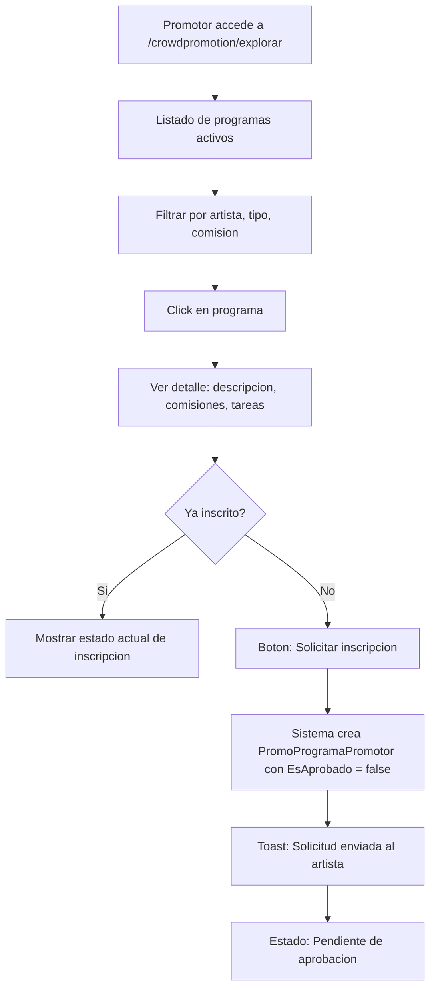
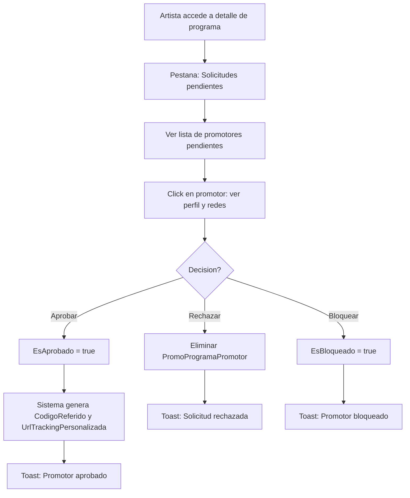
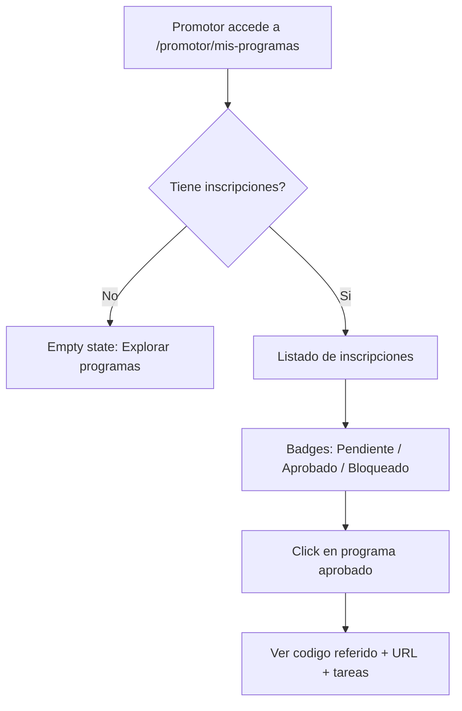
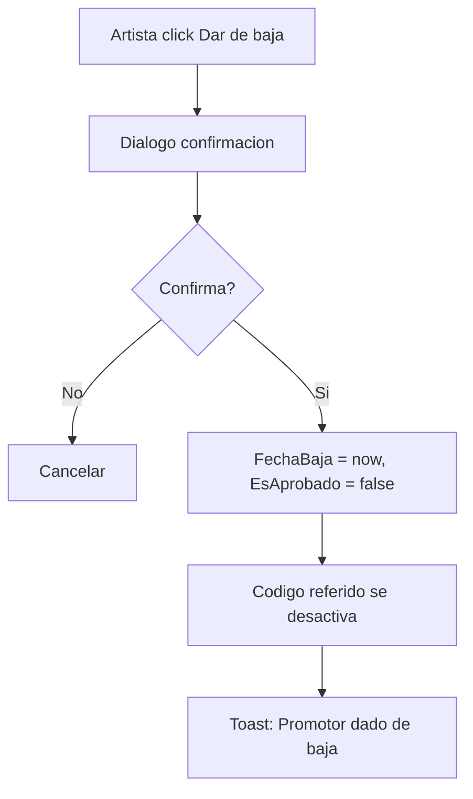

# US-CP-03: Inscripcion en Programa - Solicitud y Aprobacion

> **ID:** US-CP-03
> **Feature Name:** `cp-inscripcion-programa`
> **Prioridad:** Alta
> **Estimacion:** L (Large)
> **Modulo:** Crowdpromotion
> **Dependencias:** US-CP-01, US-CP-02

---

## Historia de Usuario

**Como** promotor registrado,
**Quiero** explorar los programas de promocion disponibles, solicitar mi inscripcion en los que me interesen, y recibir un codigo referido unico y URL de tracking personalizada al ser aprobado por el artista,
**Para** comenzar a difundir la campana con enlaces rastreables que acrediten mis resultados.

---

## Actores

| Actor | Descripcion |
|-------|-------------|
| Promotor | Usuario con perfil de promotor activo |
| Artista | Propietario del programa de promocion |

---

## Precondiciones

- Promotor tiene perfil activo (EsActivo = true)
- Existen programas de promocion activos creados por artistas

## Postcondiciones

- Se crea un `PromoProgramaPromotor` con `EsAprobado = false` (solicitud pendiente)
- Al aprobar: se genera `CodigoReferido` unico y `UrlTrackingPersonalizada`

---

## Justificacion

El modelo de CrowdPromotion requiere que los artistas aprueben a los promotores que van a representar su campana. Esto garantiza calidad y confianza. El promotor necesita un codigo referido unico y URL personalizada para que el sistema pueda atribuir conversiones a su esfuerzo.

---

## Flujo Principal: Explorar y Solicitar Inscripcion (Promotor)



### Datos del Listado Publico de Programas

| Dato | Fuente |
|------|--------|
| Titulo del programa | PromoPrograma.Titulo |
| Artista | Artista.NombreArtistico |
| Tipo de programa | MaestraTipoPromo.Nombre |
| Comision | ImporteComisionPorcentaje% y/o ImporteComisionFija |
| Moneda | MaestraMoneda.Nombre |
| Numero de tareas | COUNT(PromoTarea WHERE EsActivo) |
| Campana vinculada | CampaniaCrowdfunding.Titulo |
| Fechas vigencia | FechaInicio - FechaFin |
| Mi estado | No inscrito / Pendiente / Aprobado / Bloqueado |

---

## Flujo Secundario: Gestionar Solicitudes (Artista)



### Generacion de Codigo Referido y URL

Al aprobar:
1. **CodigoReferido:** `{CodigoTrackingBase}-{ShortId}` (ej: `album-2026-x7k9m`)
2. **UrlTrackingPersonalizada:** `{UrlLanding}?utm_source=weplay&utm_medium=referral&utm_campaign={CodigoTrackingBase}&ref={CodigoReferido}`

---

## Flujo Secundario: Mis Programas (Promotor)



**Datos por inscripcion:**

| Dato | Fuente |
|------|--------|
| Programa | PromoPrograma.Titulo |
| Artista | Artista.NombreArtistico |
| Estado | EsAprobado + EsBloqueado -> Pendiente / Aprobado / Bloqueado |
| Codigo referido | PromoProgramaPromotor.CodigoReferido (solo si aprobado) |
| URL tracking | PromoProgramaPromotor.UrlTrackingPersonalizada (solo si aprobado) |
| Fecha inscripcion | PromoProgramaPromotor.FechaAlta |

---

## Flujo Secundario: Dar de Baja a Promotor (Artista)



---

## Flujos Alternativos

| ID | Condicion | Accion |
|----|-----------|--------|
| FA-01 | Promotor ya inscrito en el programa | No mostrar boton de solicitud, mostrar estado actual |
| FA-02 | Promotor bloqueado intenta re-solicitar | Mostrar mensaje: "No puedes inscribirte en este programa" |
| FA-03 | Programa inactivo o fuera de fechas | No aparece en listado publico |
| FA-04 | Promotor desactivado solicita inscripcion | API retorna error 400 |
| FA-05 | Artista aprueba promotor pero programa se desactivo | Permitir aprobacion pero URL no funcional |

---

## Criterios de Aceptacion

| ID | Criterio | Metodo de Prueba |
|----|----------|------------------|
| AC-CP03-1 | El promotor puede ver un listado de programas activos con filtros por artista, tipo y comision | Navegar a explorar, verificar listado |
| AC-CP03-2 | El promotor puede solicitar inscripcion, creando un registro con EsAprobado = false | Solicitar, verificar en BD |
| AC-CP03-3 | Un promotor solo puede inscribirse una vez por programa (constraint unico) | Intentar doble inscripcion, verificar error |
| AC-CP03-4 | El artista ve solicitudes pendientes en el detalle de su programa | Verificar listado de pendientes |
| AC-CP03-5 | Al aprobar, el sistema genera automaticamente CodigoReferido unico y UrlTrackingPersonalizada | Aprobar, verificar codigo y URL en BD |
| AC-CP03-6 | El CodigoReferido sigue el patron {CodigoTrackingBase}-{ShortId} | Verificar formato del codigo generado |
| AC-CP03-7 | La UrlTrackingPersonalizada incluye parametros UTM correctos | Verificar URL generada |
| AC-CP03-8 | El artista puede rechazar (elimina registro) o bloquear (EsBloqueado = true) promotores | Rechazar y bloquear, verificar en BD |
| AC-CP03-9 | Un promotor bloqueado no puede re-solicitar inscripcion | Intentar solicitud con promotor bloqueado |
| AC-CP03-10 | El promotor ve su codigo referido y URL solo cuando esta aprobado | Verificar visibilidad por estado |
| AC-CP03-11 | El artista puede dar de baja a un promotor aprobado (FechaBaja + EsAprobado = false) | Dar de baja, verificar en BD |

---

## Especificacion Tecnica

### API Endpoints

#### GET /api/crowdpromotion/programas/explorar

Listar programas activos para promotores.

**Auth:** Promotor (autenticado)

**Query params:** `artistaNombre`, `tipoPromoId`, `page`, `pageSize`

**Response 200 OK:**
```json
{
  "data": {
    "items": [
      {
        "id": "guid",
        "titulo": "Promociona mi nuevo album",
        "artistaNombre": "Luna Nova",
        "tipoPromoNombre": "Referral",
        "importeComisionPorcentaje": 10.00,
        "importeComisionFija": null,
        "monedaNombre": "EUR",
        "numeroTareas": 3,
        "campaniaTitulo": "Mi Album Debut",
        "fechaInicio": "2026-03-01",
        "fechaFin": "2026-06-01",
        "miEstado": null
      }
    ],
    "totalCount": 5,
    "page": 1,
    "pageSize": 10
  },
  "messages": []
}
```

**miEstado valores:** `null` (no inscrito), `"Pendiente"`, `"Aprobado"`, `"Bloqueado"`

---

#### POST /api/crowdpromotion/programas/{programaId}/inscripcion

Solicitar inscripcion en programa.

**Auth:** Promotor (autenticado)

**Response 201 Created:**
```json
{
  "data": {
    "id": "guid",
    "programaId": "guid",
    "programaTitulo": "Promociona mi nuevo album",
    "esAprobado": false,
    "fechaAlta": "2026-03-05T10:00:00Z"
  },
  "messages": [
    { "message": "Solicitud enviada al artista", "errorCode": "0001" }
  ]
}
```

**Errores:**
- `400 Bad Request` - Ya inscrito, promotor inactivo, o programa inactivo
- `403 Forbidden` - Promotor bloqueado en este programa

---

#### PATCH /api/crowdpromotion/programas/{programaId}/inscripciones/{inscripcionId}/aprobar

Aprobar promotor.

**Auth:** Artista (propietario del programa)

**Response 200 OK:**
```json
{
  "data": {
    "id": "guid",
    "promotorNombre": "DJ Marketing Pro",
    "esAprobado": true,
    "codigoReferido": "album-2026-x7k9m",
    "urlTrackingPersonalizada": "https://weplay.com/campanias/mi-album?utm_source=weplay&utm_medium=referral&utm_campaign=album-2026&ref=album-2026-x7k9m"
  },
  "messages": [
    { "message": "Promotor aprobado", "errorCode": "0002" }
  ]
}
```

---

#### PATCH /api/crowdpromotion/programas/{programaId}/inscripciones/{inscripcionId}/rechazar

Rechazar solicitud (elimina registro).

**Auth:** Artista (propietario del programa)

**Response 200 OK:**
```json
{
  "data": {
    "promotorNombre": "Spammer123"
  },
  "messages": [
    { "message": "Solicitud rechazada", "errorCode": "0003" }
  ]
}
```

---

#### PATCH /api/crowdpromotion/programas/{programaId}/inscripciones/{inscripcionId}/bloquear

Bloquear promotor.

**Auth:** Artista (propietario del programa)

**Response 200 OK:**
```json
{
  "data": {
    "id": "guid",
    "promotorNombre": "Spammer123",
    "esBloqueado": true
  },
  "messages": [
    { "message": "Promotor bloqueado", "errorCode": "0002" }
  ]
}
```

---

#### GET /api/crowdpromotion/promotor/mis-programas

Listar inscripciones del promotor autenticado.

**Auth:** Promotor (autenticado)

**Response 200 OK:**
```json
{
  "data": {
    "items": [
      {
        "id": "guid",
        "programaId": "guid",
        "programaTitulo": "Promociona mi nuevo album",
        "artistaNombre": "Luna Nova",
        "esAprobado": true,
        "esBloqueado": false,
        "codigoReferido": "album-2026-x7k9m",
        "urlTrackingPersonalizada": "https://weplay.com/campanias/mi-album?utm_source=weplay&utm_medium=referral&utm_campaign=album-2026&ref=album-2026-x7k9m",
        "fechaAlta": "2026-03-05T10:00:00Z"
      }
    ],
    "totalCount": 3,
    "page": 1,
    "pageSize": 10
  },
  "messages": []
}
```

---

### Modelo de Datos

Entidad principal: `PromoProgramaPromotor` (ya definida en dominio)

### Validaciones

```csharp
// SolicitarInscripcionValidator
RuleFor(x => x.ProgramaId)
    .NotEmpty()
    .WithMessage("El programa es obligatorio")
    .WithErrorCode(ServiceResponseMessageType.Validation_Required);

// Validaciones en Service:
// - Promotor activo
// - Programa activo
// - No existe inscripcion previa (unica por programa + promotor)
// - Promotor no bloqueado en este programa
```

---

## Mockups / UI

### Explorar Programas (Promotor)
```
+------------------------------------------+
|  Programas de promocion disponibles      |
+------------------------------------------+
|  Filtros: [Artista...] [Tipo v]          |
+------------------------------------------+
|                                          |
|  +------------------------------------+ |
|  | Promociona mi nuevo album          | |
|  | Luna Nova | Referral | 10% comision| |
|  | 3 tareas | EUR | Mar-Jun 2026      | |
|  | [Solicitar inscripcion]             | |
|  +------------------------------------+ |
|                                          |
|  +------------------------------------+ |
|  | Difunde mi gira de verano          | |
|  | The Waves | Afiliado | 5 EUR/conv  | |
|  | 5 tareas | EUR | Abr-Sep 2026      | |
|  | PENDIENTE DE APROBACION             | |
|  +------------------------------------+ |
|                                          |
+------------------------------------------+
```

### Solicitudes Pendientes (Artista)
```
+------------------------------------------+
|  Programa: Promociona mi nuevo album     |
|  Solicitudes pendientes (3)              |
+------------------------------------------+
|                                          |
|  +------------------------------------+ |
|  | DJ Marketing Pro                    | |
|  | Influencer | IG: 15k seguidores    | |
|  | Solicito: hace 2 dias              | |
|  | [Aprobar] [Rechazar] [Bloquear]    | |
|  +------------------------------------+ |
|                                          |
|  +------------------------------------+ |
|  | MusicBlog.es                        | |
|  | Medio/Blog | Web: musicblog.es     | |
|  | Solicito: hace 1 dia               | |
|  | [Aprobar] [Rechazar] [Bloquear]    | |
|  +------------------------------------+ |
|                                          |
+------------------------------------------+
```

### Mi Programa Aprobado (Promotor)
```
+------------------------------------------+
|  Promociona mi nuevo album     APROBADO  |
+------------------------------------------+
|                                          |
|  Tu codigo referido:                     |
|  +------------------------------------+ |
|  | album-2026-x7k9m          [Copiar] | |
|  +------------------------------------+ |
|                                          |
|  Tu URL de tracking:                     |
|  +------------------------------------+ |
|  | https://weplay.com/...ref=album... | |
|  |                            [Copiar] | |
|  +------------------------------------+ |
|                                          |
|  Comision: 10% por cada backing referido |
|                                          |
|  Tareas del programa:                    |
|  [ ] Comparte en Instagram Stories       |
|  [ ] Publica un TikTok                   |
|  [ ] Escribe una resena en tu blog       |
|                                          |
+------------------------------------------+
```

---

## Notas de Implementacion

- El indice unico en BD garantiza un promotor por programa: `IX_PromoPrograma_Promotor_Programa_Promotor`
- La generacion del ShortId para el codigo referido puede usar un hash corto o nanoid
- La URL tracking se construye server-side al aprobar y se almacena en BD
- Al rechazar se elimina fisicamente el registro (no soft-delete)
- Al bloquear se mantiene el registro con EsBloqueado = true para evitar re-solicitudes
- Handler CQRS: Command + Handler en mismo archivo, inyectar Service (no DbContext)
