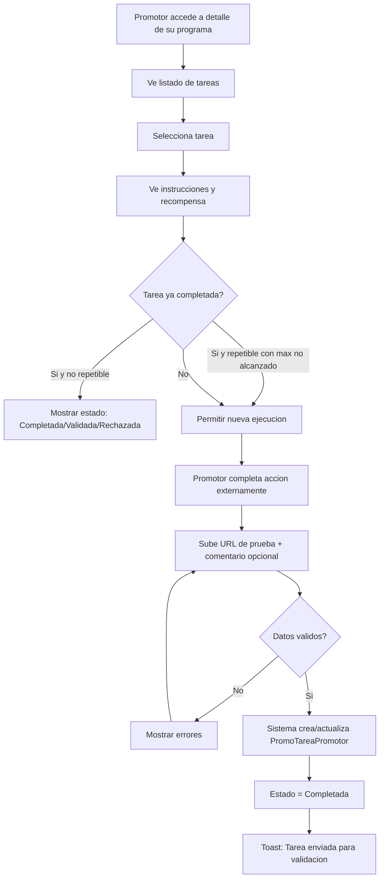
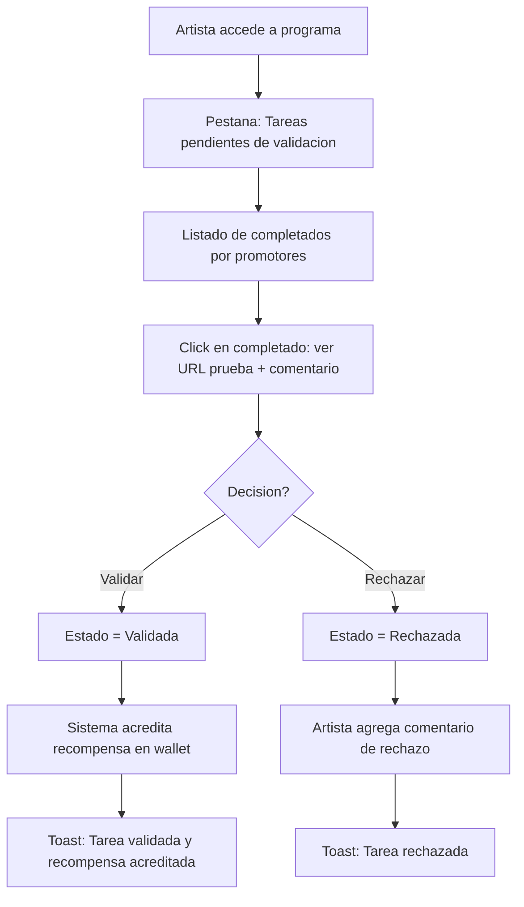

# US-CP-04: Ejecucion de Tareas de Promocion y Validacion

> **ID:** US-CP-04
> **Feature Name:** `cp-tareas-promocion`
> **Prioridad:** Media
> **Estimacion:** L (Large)
> **Modulo:** Crowdpromotion
> **Dependencias:** US-CP-03

---

## Historia de Usuario

**Como** promotor aprobado en un programa de promocion,
**Quiero** ver las tareas asignadas, marcarlas como completadas aportando una URL de prueba, y que el artista valide mi trabajo,
**Para** acumular recompensas (dinero o puntos) por cada tarea verificada.

---

## Actores

| Actor | Descripcion |
|-------|-------------|
| Promotor | Usuario con perfil de promotor aprobado en un programa |
| Artista | Propietario del programa que valida las tareas completadas |

---

## Precondiciones

- Promotor esta aprobado en el programa (EsAprobado = true, EsBloqueado = false)
- El programa tiene tareas activas (PromoTarea con EsActivo = true)
- Existen datos seed de `Maestra_EstadoTareaPromo`

## Postcondiciones

- Se crea/actualiza un `PromoTareaPromotor` con el estado correspondiente
- Al validar: se acredita la recompensa en la wallet del promotor (US-CP-06)

---

## Justificacion

Las tareas son la guia operativa para los promotores. Permiten al artista definir acciones concretas (compartir en redes, escribir resenas) y verificar que se realizaron. El ciclo completar-validar-recompensar cierra el loop de incentivos del sistema.

---

## Flujo Principal: Ver y Completar Tareas (Promotor)



### Datos por Tarea (vista Promotor)

| Dato | Fuente |
|------|--------|
| Nombre | PromoTarea.Nombre |
| Descripcion | PromoTarea.Descripcion |
| Instrucciones | PromoTarea.UrlInstrucciones |
| Tipo de evento | MaestraTipoEventoPromo.Nombre |
| Recompensa | ImporteReward + MonedaNombre y/o PuntosReward |
| Es repetible | PromoTarea.EsRepetible |
| Max repeticiones | PromoTarea.MaxRepeticiones |
| Mi estado | MaestraEstadoTareaPromo.Nombre |
| Veces completada | PromoTareaPromotor.VecesCompletada |
| Fecha primera/ultima | PromoTareaPromotor.FechaPrimeraCompletada / FechaUltimaCompletada |

---

## Flujo Secundario: Validar Tareas (Artista)



### Datos por Completado (vista Artista)

| Dato | Fuente |
|------|--------|
| Tarea | PromoTarea.Nombre |
| Promotor | Promotor.NombrePublico |
| URL prueba | PromoTareaPromotor.UrlPruebaCompletado |
| Comentario promotor | PromoTareaPromotor.ComentarioPromotor |
| Veces completada | PromoTareaPromotor.VecesCompletada |
| Fecha completado | PromoTareaPromotor.FechaUltimaCompletada |
| Estado | MaestraEstadoTareaPromo.Nombre |

---

## Flujos Alternativos

| ID | Condicion | Accion |
|----|-----------|--------|
| FA-01 | Tarea no repetible ya completada | No mostrar boton de completar, solo estado |
| FA-02 | Tarea repetible con max alcanzado | No permitir mas ejecuciones, mostrar aviso |
| FA-03 | Tarea fuera de fechas (FechaFin pasada) | No permitir completar, mostrar aviso |
| FA-04 | Tarea desactivada por artista | No mostrar en listado activo |
| FA-05 | Promotor rechazado intenta re-enviar | Permitir re-envio con nueva URL (estado vuelve a Completada) |
| FA-06 | Programa desactivado | Mostrar tareas como solo lectura, sin accion |

---

## Criterios de Aceptacion

| ID | Criterio | Metodo de Prueba |
|----|----------|------------------|
| AC-CP04-1 | El promotor aprobado ve las tareas del programa con instrucciones y recompensa | Acceder a programa aprobado, verificar tareas |
| AC-CP04-2 | El promotor puede marcar una tarea como completada enviando URL de prueba | Completar tarea, verificar en BD |
| AC-CP04-3 | Se crea un PromoTareaPromotor con EstadoTarea = Completada y VecesCompletada incrementado | Verificar registro en BD |
| AC-CP04-4 | Para tareas repetibles, el promotor puede completar multiples veces hasta MaxRepeticiones | Completar N veces, verificar contador |
| AC-CP04-5 | El artista ve tareas completadas pendientes de validacion agrupadas por promotor | Verificar listado del artista |
| AC-CP04-6 | Al validar, el estado cambia a Validada y se acredita la recompensa en la wallet del promotor | Validar, verificar estado y wallet |
| AC-CP04-7 | Al rechazar, el estado cambia a Rechazada con comentario del artista | Rechazar, verificar en BD |
| AC-CP04-8 | Un promotor rechazado puede re-enviar la tarea con nueva URL de prueba | Re-enviar, verificar estado vuelve a Completada |
| AC-CP04-9 | No se puede completar una tarea de un programa desactivado | Intentar completar, verificar error |
| AC-CP04-10 | No se puede completar una tarea repetible que alcanzo MaxRepeticiones | Intentar exceder max, verificar error |

---

## Especificacion Tecnica

### API Endpoints

#### GET /api/crowdpromotion/programas/{programaId}/mis-tareas

Listar tareas del programa con estado del promotor autenticado.

**Auth:** Promotor (aprobado en el programa)

**Response 200 OK:**
```json
{
  "data": {
    "items": [
      {
        "tareaId": "guid",
        "nombre": "Comparte en Instagram Stories",
        "descripcion": "Sube una story mencionando la campana...",
        "urlInstrucciones": "https://docs.example.com/instrucciones-ig",
        "tipoEventoPromoNombre": "Share",
        "tipoRewardNombre": "Dinero",
        "importeReward": 5.00,
        "monedaNombre": "EUR",
        "puntosReward": null,
        "esRepetible": true,
        "maxRepeticiones": 10,
        "miEstado": {
          "estadoTareaNombre": "Validada",
          "vecesCompletada": 3,
          "fechaPrimeraCompletada": "2026-03-10T10:00:00Z",
          "fechaUltimaCompletada": "2026-03-20T15:30:00Z",
          "urlPruebaCompletado": "https://instagram.com/stories/xxx",
          "comentarioValidacion": null
        }
      },
      {
        "tareaId": "guid",
        "nombre": "Publica un TikTok",
        "descripcion": "Crea un TikTok sobre la campana...",
        "urlInstrucciones": null,
        "tipoEventoPromoNombre": "Post",
        "tipoRewardNombre": "Dinero",
        "importeReward": 10.00,
        "monedaNombre": "EUR",
        "puntosReward": null,
        "esRepetible": false,
        "maxRepeticiones": null,
        "miEstado": null
      }
    ]
  },
  "messages": []
}
```

---

#### POST /api/crowdpromotion/programas/{programaId}/tareas/{tareaId}/completar

Marcar tarea como completada.

**Auth:** Promotor (aprobado en el programa)

**Request:**
```json
{
  "urlPruebaCompletado": "https://instagram.com/stories/my-promo-story",
  "comentarioPromotor": "Story publicada con mencion a la campana"
}
```

**Response 200 OK:**
```json
{
  "data": {
    "tareaPromotorId": "guid",
    "estadoTareaNombre": "Completada",
    "vecesCompletada": 4,
    "fechaUltimaCompletada": "2026-03-20T15:30:00Z"
  },
  "messages": [
    { "message": "Tarea enviada para validacion", "errorCode": "0002" }
  ]
}
```

**Errores:**
- `400 Bad Request` - Tarea no repetible ya completada, max alcanzado, programa inactivo
- `403 Forbidden` - Promotor no aprobado en el programa
- `404 Not Found` - Tarea o programa no existe

---

#### GET /api/crowdpromotion/programas/{programaId}/tareas-pendientes

Listar tareas completadas pendientes de validacion (vista artista).

**Auth:** Artista (propietario del programa)

**Response 200 OK:**
```json
{
  "data": {
    "items": [
      {
        "tareaPromotorId": "guid",
        "tareaNombre": "Comparte en Instagram Stories",
        "promotorNombre": "DJ Marketing Pro",
        "promotorTipo": "Influencer",
        "urlPruebaCompletado": "https://instagram.com/stories/xxx",
        "comentarioPromotor": "Story publicada con mencion",
        "vecesCompletada": 4,
        "fechaUltimaCompletada": "2026-03-20T15:30:00Z"
      }
    ],
    "totalCount": 8,
    "page": 1,
    "pageSize": 10
  },
  "messages": []
}
```

---

#### PATCH /api/crowdpromotion/programas/{programaId}/tareas-promotor/{tareaPromotorId}/validar

Validar tarea completada.

**Auth:** Artista (propietario del programa)

**Request:**
```json
{
  "comentarioValidacion": "Verificado, story publicada correctamente"
}
```

**Response 200 OK:**
```json
{
  "data": {
    "tareaPromotorId": "guid",
    "estadoTareaNombre": "Validada",
    "recompensaAcreditada": 5.00,
    "monedaNombre": "EUR"
  },
  "messages": [
    { "message": "Tarea validada y recompensa acreditada", "errorCode": "0002" }
  ]
}
```

---

#### PATCH /api/crowdpromotion/programas/{programaId}/tareas-promotor/{tareaPromotorId}/rechazar

Rechazar tarea completada.

**Auth:** Artista (propietario del programa)

**Request:**
```json
{
  "comentarioValidacion": "La story no menciona la campana correctamente"
}
```

**Response 200 OK:**
```json
{
  "data": {
    "tareaPromotorId": "guid",
    "estadoTareaNombre": "Rechazada"
  },
  "messages": [
    { "message": "Tarea rechazada", "errorCode": "0002" }
  ]
}
```

---

### Modelo de Datos

Entidad principal: `PromoTareaPromotor` (ya definida en dominio)

### Validaciones

```csharp
// CompletarTareaValidator
RuleFor(x => x.UrlPruebaCompletado)
    .NotEmpty()
    .WithMessage("La URL de prueba es obligatoria")
    .WithErrorCode(ServiceResponseMessageType.Validation_Required)
    .Must(BeAValidUrl)
    .WithMessage("La URL de prueba no tiene formato valido")
    .WithErrorCode(ServiceResponseMessageType.Validation_InvalidUrl);

RuleFor(x => x.ComentarioPromotor)
    .MaximumLength(500)
    .WithMessage("Maximo 500 caracteres")
    .WithErrorCode(ServiceResponseMessageType.Validation_MaxLength);

// Validaciones en Service:
// - Promotor aprobado en el programa
// - Programa activo
// - Tarea activa
// - Si no repetible: no tener completado previo
// - Si repetible: VecesCompletada < MaxRepeticiones
```

---

## Datos Seed: Maestra_EstadoTareaPromo

| Id | Nombre | Descripcion |
|----|--------|-------------|
| 1 | Pendiente | Tarea asignada pero no completada |
| 2 | Completada | Promotor marco como completada, pendiente de validacion |
| 3 | Validada | Artista valido la tarea, recompensa acreditada |
| 4 | Rechazada | Artista rechazo la tarea |

---

## Mockups / UI

### Mis Tareas (Promotor)
```
+------------------------------------------+
|  Tareas: Promociona mi nuevo album       |
+------------------------------------------+
|                                          |
|  +------------------------------------+ |
|  | Comparte en Instagram Stories       | |
|  | Share | 5 EUR por ejecucion        | |
|  | Repetible: 3/10 completadas        | |
|  | Estado: VALIDADA (ultima)           | |
|  | [Completar de nuevo]               | |
|  +------------------------------------+ |
|                                          |
|  +------------------------------------+ |
|  | Publica un TikTok                   | |
|  | Post | 10 EUR                       | |
|  | No completada                       | |
|  | [Completar tarea]                   | |
|  +------------------------------------+ |
|                                          |
|  +------------------------------------+ |
|  | Escribe una resena en tu blog       | |
|  | Post | 15 EUR                       | |
|  | Estado: RECHAZADA                   | |
|  | Motivo: "La resena no menciona..."  | |
|  | [Re-enviar con nueva prueba]        | |
|  +------------------------------------+ |
|                                          |
+------------------------------------------+
```

### Completar Tarea (Dialogo)
```
+------------------------------------------+
|  Completar: Comparte en Instagram Stories|
+------------------------------------------+
|                                          |
|  Instrucciones:                          |
|  Sube una story mencionando la campana   |
|  y etiquetando @weplay_rises            |
|                                          |
|  URL de prueba *                         |
|  [https://instagram.com/stories/...]     |
|                                          |
|  Comentario (opcional)                   |
|  [Story publicada con mencion y tag]     |
|                                          |
|  [Cancelar]            [Enviar]          |
+------------------------------------------+
```

### Validar Tareas (Artista)
```
+------------------------------------------+
|  Tareas pendientes de validacion (8)     |
+------------------------------------------+
|                                          |
|  +------------------------------------+ |
|  | DJ Marketing Pro                    | |
|  | Comparte en IG Stories (4ta vez)    | |
|  | Prueba: instagram.com/stories/xxx   | |
|  | "Story publicada con mencion"       | |
|  | Hace 2 horas                        | |
|  | [Validar] [Rechazar]               | |
|  +------------------------------------+ |
|                                          |
+------------------------------------------+
```

---

## Notas de Implementacion

- La acreditacion de recompensa al validar es transaccional: actualizar estado + crear transaccion wallet
- Para tareas repetibles, el primer completado crea el PromoTareaPromotor; los siguientes incrementan VecesCompletada
- Al re-enviar una tarea rechazada, el estado vuelve a Completada y se actualiza la URL de prueba
- La validacion del artista es manual en MVP; en futuro se podria automatizar via API de redes sociales
- Handler CQRS: Command + Handler en mismo archivo, inyectar Service (no DbContext)
