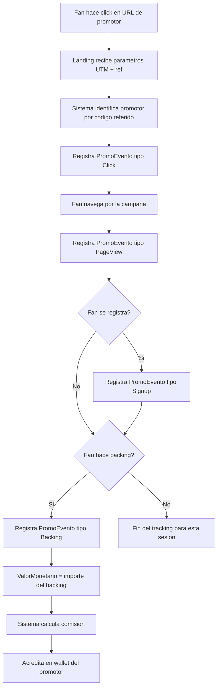
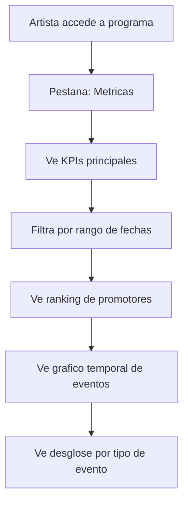
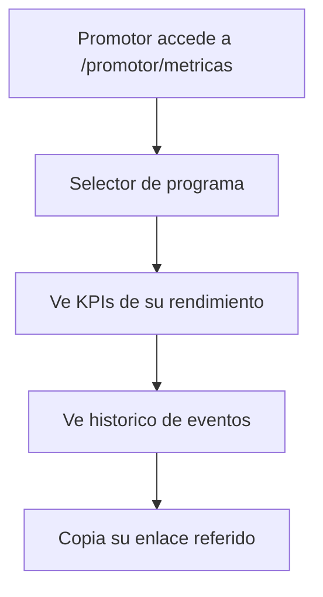
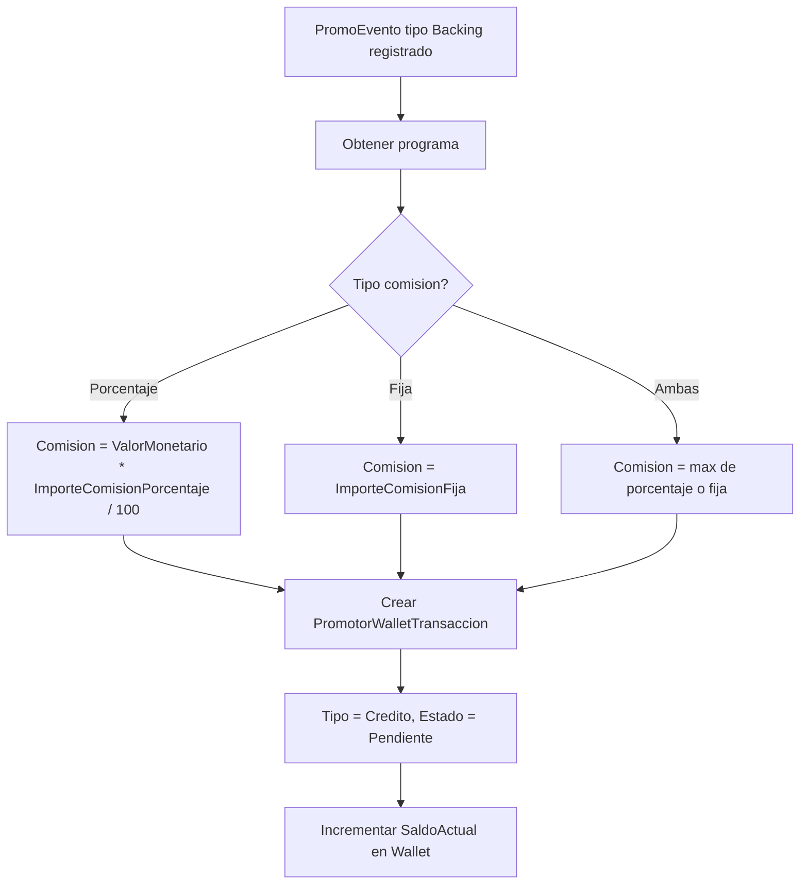

# US-CP-05: Tracking de Eventos, Conversiones y Dashboard de Metricas

> **ID:** US-CP-05
> **Feature Name:** `cp-tracking-metricas`
> **Prioridad:** Alta
> **Estimacion:** XL (Extra Large)
> **Modulo:** Crowdpromotion
> **Dependencias:** US-CP-03

---

## Historia de Usuario

**Como** artista que tiene un programa de promocion activo (y como promotor inscrito),
**Quiero** que el sistema registre automaticamente los eventos generados por los enlaces de los promotores (clicks, visitas, signups, backings) y ver un dashboard con metricas de rendimiento,
**Para** medir el impacto real de la promocion y saber que promotores generan mas resultados.

---

## Actores

| Actor | Descripcion |
|-------|-------------|
| Sistema | Registra eventos automaticamente al detectar codigo referido o UTM |
| Artista | Ve metricas de rendimiento de sus programas |
| Promotor | Ve metricas de sus propios resultados |
| Fan/Visitante | Genera eventos al navegar via enlaces de promotores |

---

## Precondiciones

- Existen programas con promotores aprobados que tienen codigos referidos activos
- Existen datos seed de `Maestra_TipoEventoPromo`

## Postcondiciones

- Se registran `PromoEvento` con trazabilidad completa (programa, promotor, campana, UTMs)
- Las metricas se agregan y muestran en dashboards para artista y promotor

---

## Justificacion

El tracking es el corazon de CrowdPromotion. Sin el, no se puede saber que promotor genero que conversion, ni calcular comisiones. El sistema debe interceptar los parametros UTM y codigos referidos en cada visita a la plataforma y registrar una cadena de eventos: click → visita → registro → backing (conversion).

---

## Flujo Principal: Tracking Automatico de Eventos



### Parametros de Tracking

| Parametro | Origen | Uso |
|-----------|--------|-----|
| `ref` | URL query param | Codigo referido del promotor |
| `utm_source` | URL query param | Siempre "weplay" |
| `utm_medium` | URL query param | "referral" para CrowdPromotion |
| `utm_campaign` | URL query param | CodigoTrackingBase del programa |
| Cookie/Session | Frontend | Persistir ref durante la sesion del usuario |

### Tipos de Eventos

| Tipo | Trigger | Datos adicionales |
|------|---------|-------------------|
| Click | Fan hace click en URL del promotor | UrlOrigen, UrlReferer |
| PageView | Fan visita la pagina de la campana | CampaniaCrowdfundingId |
| Signup | Fan se registra en la plataforma | UserIdAfectado |
| Backing | Fan hace un backing/aportacion | AportacionCrowdfundingId, ValorMonetario |
| Share | Promotor comparte (via boton de la app) | UrlOrigen |

---

## Flujo Secundario: Dashboard del Artista



### KPIs del Programa (Artista)

| KPI | Calculo |
|-----|---------|
| Total clicks | COUNT(PromoEvento WHERE TipoEventoPromoId = Click) |
| Total page views | COUNT(PromoEvento WHERE TipoEventoPromoId = PageView) |
| Total signups | COUNT(PromoEvento WHERE TipoEventoPromoId = Signup) |
| Total conversiones (backings) | COUNT(PromoEvento WHERE TipoEventoPromoId = Backing) |
| Valor total generado | SUM(PromoEvento.ValorMonetario WHERE TipoEventoPromoId = Backing) |
| Tasa de conversion | Conversiones / Clicks * 100 |
| Comisiones generadas | SUM de comisiones calculadas |

### Ranking de Promotores

| Dato | Fuente |
|------|--------|
| Nombre promotor | Promotor.NombrePublico |
| Tipo | MaestraTipoPromotor.Nombre |
| Clicks generados | COUNT(PromoEvento) por promotor |
| Conversiones | COUNT(PromoEvento tipo Backing) por promotor |
| Valor generado | SUM(ValorMonetario) por promotor |
| Comision acumulada | Calculado |

---

## Flujo Secundario: Dashboard del Promotor



### KPIs del Promotor (por programa)

| KPI | Calculo |
|-----|---------|
| Mis clicks | COUNT(PromoEvento WHERE PromotorId = me AND Tipo = Click) |
| Mis conversiones | COUNT(PromoEvento WHERE PromotorId = me AND Tipo = Backing) |
| Valor generado | SUM(ValorMonetario) por mis eventos tipo Backing |
| Mi comision acumulada | Calculado segun comision del programa |
| Tasa de conversion | Mis conversiones / Mis clicks * 100 |

---

## Flujo de Calculo de Comisiones



---

## Flujos Alternativos

| ID | Condicion | Accion |
|----|-----------|--------|
| FA-01 | Codigo referido invalido o no encontrado | Registrar evento sin vinculo a promotor (tracking anonimo) |
| FA-02 | Programa inactivo pero codigo aun en circulacion | Registrar evento pero no calcular comision |
| FA-03 | Promotor dado de baja | Registrar evento pero no calcular comision |
| FA-04 | Mismo usuario hace multiples clicks seguidos | Rate limiting: max 1 click cada 5 minutos por IP+ref |
| FA-05 | Backing cancelado despues de registrar conversion | No implementar en MVP (ajuste manual) |
| FA-06 | Fan llega sin parametro ref pero con UTMs | Registrar evento con UTMs pero sin vinculo a promotor |

---

## Criterios de Aceptacion

| ID | Criterio | Metodo de Prueba |
|----|----------|------------------|
| AC-CP05-1 | Al visitar una URL con parametro ref valido, se registra un PromoEvento tipo Click | Visitar URL con ref, verificar en BD |
| AC-CP05-2 | El codigo referido se persiste en la sesion del usuario para atribuir eventos posteriores | Navegar sin ref despues de click inicial, verificar atribucion |
| AC-CP05-3 | Al hacer un backing con codigo referido activo, se registra PromoEvento tipo Backing con ValorMonetario | Hacer backing referido, verificar evento |
| AC-CP05-4 | Se calcula la comision correctamente segun tipo (porcentaje o fija) y se acredita en wallet | Verificar calculo y transaccion en wallet |
| AC-CP05-5 | El artista ve un dashboard con KPIs: clicks, conversiones, valor generado, tasa de conversion | Verificar dashboard con datos |
| AC-CP05-6 | El artista ve un ranking de promotores ordenado por conversiones | Verificar ranking |
| AC-CP05-7 | El promotor ve sus metricas individuales por programa | Verificar dashboard promotor |
| AC-CP05-8 | Los eventos registran UTMs (source, medium, campaign), URL origen y referer | Verificar campos en BD |
| AC-CP05-9 | Rate limiting previene multiples clicks del mismo IP en ventana de 5 minutos | Enviar clicks rapidos, verificar deduplicacion |
| AC-CP05-10 | Eventos de programa inactivo se registran pero no generan comision | Desactivar programa, verificar evento sin comision |
| AC-CP05-11 | El dashboard soporta filtro por rango de fechas | Filtrar por fechas, verificar resultados |

---

## Especificacion Tecnica

### API Endpoints

#### POST /api/crowdpromotion/tracking/evento

Registrar evento de tracking (llamado por el frontend).

**Auth:** Publico (puede ser anonimo)

**Request:**
```json
{
  "codigoReferido": "album-2026-x7k9m",
  "tipoEventoPromoId": 1,
  "campaniaCrowdfundingId": "guid",
  "urlOrigen": "https://instagram.com/stories/xxx",
  "urlReferer": "https://instagram.com",
  "utmSource": "weplay",
  "utmMedium": "referral",
  "utmCampaign": "album-2026"
}
```

**Response 201 Created:**
```json
{
  "data": {
    "eventoId": "guid",
    "registrado": true
  },
  "messages": []
}
```

**Errores:**
- `400 Bad Request` - Tipo de evento invalido
- `429 Too Many Requests` - Rate limit excedido

---

#### POST /api/crowdpromotion/tracking/conversion

Registrar conversion (backing referido). Llamado internamente al procesar un backing.

**Auth:** Sistema (interno)

**Request:**
```json
{
  "codigoReferido": "album-2026-x7k9m",
  "campaniaCrowdfundingId": "guid",
  "aportacionCrowdfundingId": "guid",
  "valorMonetario": 50.00,
  "monedaId": 1,
  "userIdAfectado": "user-guid"
}
```

**Response 201 Created:**
```json
{
  "data": {
    "eventoId": "guid",
    "comisionCalculada": 5.00,
    "monedaNombre": "EUR",
    "walletTransaccionId": "guid"
  },
  "messages": [
    { "message": "Conversion registrada y comision acreditada", "errorCode": "0001" }
  ]
}
```

---

#### GET /api/crowdpromotion/programas/{programaId}/metricas

Dashboard de metricas del programa (artista).

**Auth:** Artista (propietario del programa)

**Query params:** `fechaDesde`, `fechaHasta`

**Response 200 OK:**
```json
{
  "data": {
    "kpis": {
      "totalClicks": 1250,
      "totalPageViews": 890,
      "totalSignups": 45,
      "totalConversiones": 12,
      "valorTotalGenerado": 1200.00,
      "monedaNombre": "EUR",
      "tasaConversion": 0.96,
      "comisionesTotales": 120.00
    },
    "rankingPromotores": [
      {
        "promotorId": "guid",
        "promotorNombre": "DJ Marketing Pro",
        "tipoPromotorNombre": "Influencer",
        "clicks": 450,
        "conversiones": 5,
        "valorGenerado": 500.00,
        "comisionAcumulada": 50.00
      }
    ],
    "eventosPorDia": [
      {
        "fecha": "2026-03-15",
        "clicks": 45,
        "pageViews": 30,
        "signups": 2,
        "conversiones": 1
      }
    ]
  },
  "messages": []
}
```

---

#### GET /api/crowdpromotion/promotor/metricas

Dashboard de metricas del promotor.

**Auth:** Promotor (autenticado)

**Query params:** `programaId`, `fechaDesde`, `fechaHasta`

**Response 200 OK:**
```json
{
  "data": {
    "kpis": {
      "misClicks": 450,
      "misConversiones": 5,
      "miValorGenerado": 500.00,
      "miComisionAcumulada": 50.00,
      "monedaNombre": "EUR",
      "miTasaConversion": 1.11
    },
    "eventosRecientes": [
      {
        "id": "guid",
        "tipoEventoNombre": "Backing",
        "valorMonetario": 100.00,
        "comisionGenerada": 10.00,
        "fechaEvento": "2026-03-20T14:30:00Z"
      }
    ]
  },
  "messages": []
}
```

---

### Modelo de Datos

Entidad principal: `PromoEvento` (ya definida en dominio)

Campos clave del SQL:
```sql
[PromoPrograma_Id]          -- FK programa
[PromoPrograma_Promotor_Id] -- FK inscripcion del promotor
[TipoEventoPromo_Id]        -- FK tipo de evento
[CampaniaCrowdfunding_Id]   -- FK campana (si aplica)
[AportacionCrowdfunding_Id] -- FK backing (si es conversion)
[UserIdAfectado]             -- FK usuario que realizo la accion
[UrlOrigen]                  -- URL desde donde llego el click
[UrlReferer]                 -- HTTP referer
[UtmSource]                  -- UTM source
[UtmMedium]                  -- UTM medium
[UtmCampaign]                -- UTM campaign
[ValorMonetario]             -- Importe del backing (si conversion)
[Moneda_Id]                  -- FK moneda
[FechaEvento]                -- Cuando ocurrio el evento
```

### Validaciones

```csharp
// RegistrarEventoValidator
RuleFor(x => x.TipoEventoPromoId)
    .NotEmpty()
    .WithMessage("El tipo de evento es obligatorio")
    .WithErrorCode(ServiceResponseMessageType.Validation_Required);

RuleFor(x => x.CodigoReferido)
    .MaximumLength(50)
    .WithMessage("Maximo 50 caracteres")
    .WithErrorCode(ServiceResponseMessageType.Validation_MaxLength);

// Validaciones en Service:
// - Codigo referido valido y activo
// - Rate limiting por IP + codigo referido
// - Programa activo para calcular comision
```

---

## Mockups / UI

### Dashboard Artista - Metricas del Programa
```
+------------------------------------------+
|  Metricas: Promociona mi nuevo album     |
|  Periodo: [Mar 2026 v] - [Jun 2026 v]   |
+------------------------------------------+
|                                          |
|  +--------+ +--------+ +--------+ +----+|
|  | 1,250  | |   45   | |   12   | |1.2k||
|  | clicks | | signups| | backings| | EUR||
|  +--------+ +--------+ +--------+ +----+|
|                                          |
|  Tasa de conversion: 0.96%              |
|                                          |
|  +------------------------------------+ |
|  | RANKING DE PROMOTORES              | |
|  |------------------------------------| |
|  | 1. DJ Marketing Pro  | 5 conv 500E| |
|  | 2. MusicBlog.es      | 4 conv 400E| |
|  | 3. FanLuna           | 3 conv 300E| |
|  +------------------------------------+ |
|                                          |
|  [Grafico temporal de eventos]           |
|  |    *                                  |
|  |   * *    *                            |
|  |  *   *  * *   *                       |
|  | *     **   * * *                      |
|  +--+--+--+--+--+--+--+-->              |
|   Mar        Abr        May             |
|                                          |
+------------------------------------------+
```

### Dashboard Promotor - Mis Metricas
```
+------------------------------------------+
|  Mis metricas de promocion               |
|  Programa: [Promociona mi album  v]     |
+------------------------------------------+
|                                          |
|  +--------+ +--------+ +--------+       |
|  |  450   | |    5   | | 50 EUR |       |
|  | clicks | | backings| |comision|       |
|  +--------+ +--------+ +--------+       |
|                                          |
|  Tasa de conversion: 1.11%              |
|                                          |
|  Mi enlace:                              |
|  +------------------------------------+ |
|  | https://weplay.com/...ref=album..  | |
|  |                          [Copiar]  | |
|  +------------------------------------+ |
|                                          |
|  Eventos recientes:                      |
|  - Backing: 100 EUR -> 10 EUR comision  |
|    20 mar 2026, 14:30                    |
|  - Click desde instagram.com            |
|    20 mar 2026, 12:15                    |
|                                          |
+------------------------------------------+
```

---

## Notas de Implementacion

- El tracking de clicks se implementa en el frontend: al detectar `ref` en la URL, llamar al endpoint de tracking y persistir el codigo en cookie/sessionStorage
- La conversion se registra server-side al procesar un backing: si existe codigo referido en sesion, registrar evento tipo Backing
- Rate limiting: usar cache en memoria o Redis para deduplicar clicks (clave: IP + codigoReferido, TTL: 5 minutos)
- Los dashboards usan queries agregadas (GROUP BY) sobre PromoEvento
- Indices en BD ya estan definidos para consultas por programa+tipo+fecha y por promotor+fecha
- El calculo de comision es sincrono al registrar la conversion (no cola asinciona en MVP)
- Handler CQRS: Command + Handler en mismo archivo, inyectar Service (no DbContext)
