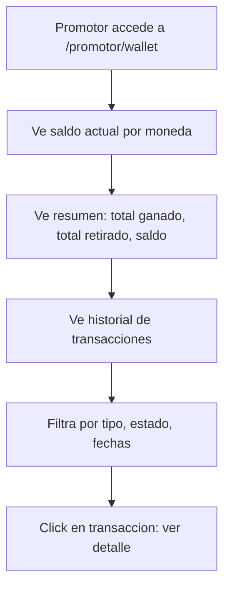
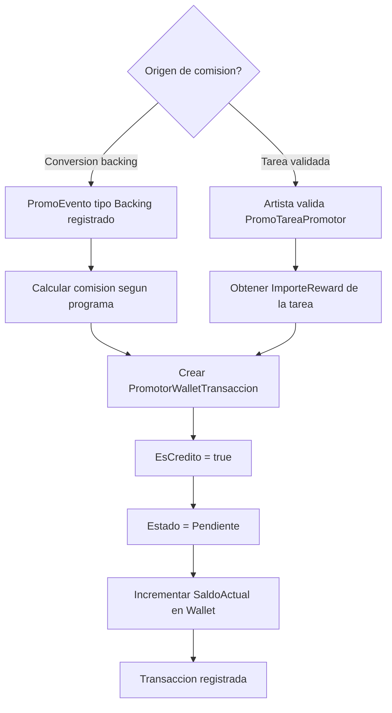
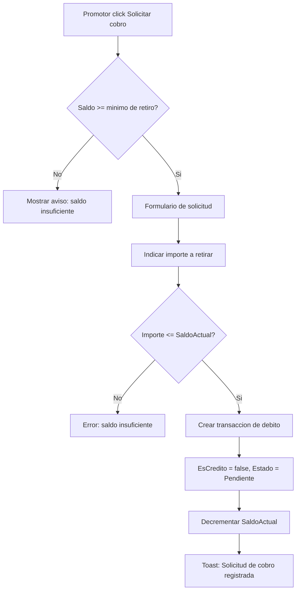
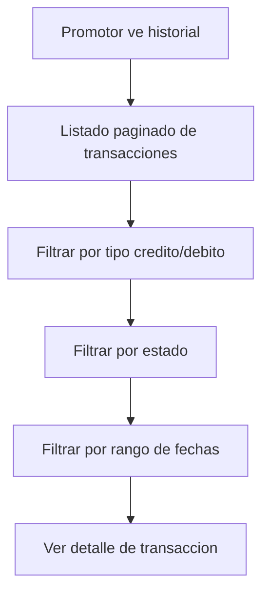

# US-CP-06: Wallet de Promotor, Comisiones y Cobros

> **ID:** US-CP-06
> **Feature Name:** `cp-wallet-comisiones`
> **Prioridad:** Media
> **Estimacion:** L (Large)
> **Modulo:** Crowdpromotion
> **Dependencias:** US-CP-04, US-CP-05

---

## Historia de Usuario

**Como** promotor que ha generado conversiones y completado tareas validadas,
**Quiero** ver mi saldo acumulado, el historial de transacciones (comisiones ganadas y retiros), y solicitar el cobro de mis ganancias,
**Para** cobrar las recompensas por mi trabajo de promocion.

---

## Actores

| Actor | Descripcion |
|-------|-------------|
| Promotor | Usuario con perfil de promotor que ha acumulado comisiones |
| Sistema | Acredita comisiones automaticamente al validar tareas o registrar conversiones |

---

## Precondiciones

- Promotor tiene perfil activo con wallet creada (creada en US-CP-01)
- Existen transacciones de credito por conversiones (US-CP-05) o tareas validadas (US-CP-04)
- Existen datos seed de `Maestra_EstadoWalletTransaccion`

## Postcondiciones

- El saldo de la wallet refleja creditos y debitos
- Las transacciones tienen trazabilidad completa (evento, tipo reward, estado)

---

## Justificacion

La wallet cierra el ciclo economico de CrowdPromotion. Los promotores necesitan visibilidad de cuanto han ganado, de donde viene cada comision, y poder solicitar el cobro. Sin este modulo, no hay incentivo real para los promotores.

---

## Flujo Principal: Ver Wallet y Saldo (Promotor)



### Datos de la Wallet

| Dato | Fuente |
|------|--------|
| Saldo actual | PromotorWallet.SaldoActual |
| Moneda | MaestraMoneda.Nombre |
| Total transacciones credito | SUM(Importe WHERE EsCredito = true) |
| Total transacciones debito | SUM(Importe WHERE EsCredito = false) |

---

## Flujo Secundario: Acreditacion Automatica de Comisiones



### Tipos de Credito

| Origen | Calculo | Referencia |
|--------|---------|------------|
| Conversion (backing) | ImporteComisionPorcentaje% del backing o ImporteComisionFija | FK PromoEvento |
| Tarea validada | ImporteReward de la PromoTarea | FK PromoEvento (creado al validar) |

---

## Flujo Secundario: Solicitar Cobro (Retiro)



### Datos de Solicitud de Cobro

| Campo | Tipo | Obligatorio | Validacion |
|-------|------|-------------|------------|
| Importe | Decimal | Si | > 0 y <= SaldoActual |
| Descripcion | Texto (max 500) | No | - |

**Minimo de retiro:** 10 EUR (configurable)

---

## Flujo Secundario: Historial de Transacciones



### Datos por Transaccion

| Dato | Fuente |
|------|--------|
| Importe | PromotorWalletTransaccion.Importe |
| Es credito | PromotorWalletTransaccion.EsCredito |
| Estado | MaestraEstadoWalletTransaccion.Nombre |
| Concepto/Descripcion | PromotorWalletTransaccion.Descripcion |
| Tipo recompensa | MaestraTipoReward.Nombre |
| Evento asociado | FK PromoEvento (si aplica) |
| Fecha | PromotorWalletTransaccion.FechaCreacion |

**Indicadores visuales:**
- Credito: verde con signo +
- Debito: rojo con signo -
- Estado Pendiente: badge amarillo
- Estado Procesada: badge verde
- Estado Pagada: badge azul
- Estado Cancelada: badge gris

---

## Flujos Alternativos

| ID | Condicion | Accion |
|----|-----------|--------|
| FA-01 | Promotor sin transacciones | Empty state con explicacion de como ganar |
| FA-02 | Solicitud de cobro con saldo 0 | Boton deshabilitado, mostrar aviso |
| FA-03 | Solicitud de cobro excede saldo | Mostrar error, permitir ajustar importe |
| FA-04 | Doble solicitud de cobro simultanea | Constraint de concurrencia, error 409 |
| FA-05 | Promotor desactivado solicita cobro | Permitir cobro del saldo existente |

---

## Criterios de Aceptacion

| ID | Criterio | Metodo de Prueba |
|----|----------|------------------|
| AC-CP06-1 | El promotor ve su saldo actual en la moneda de la wallet | Acceder a wallet, verificar saldo |
| AC-CP06-2 | Al registrar una conversion (backing referido), se crea automaticamente una transaccion de credito | Registrar conversion, verificar transaccion en BD |
| AC-CP06-3 | Al validar una tarea, se crea automaticamente una transaccion de credito por el ImporteReward | Validar tarea, verificar transaccion |
| AC-CP06-4 | El saldo se actualiza correctamente al acreditar (incrementa) y al solicitar cobro (decrementa) | Verificar SaldoActual tras operaciones |
| AC-CP06-5 | El promotor ve el historial de transacciones con filtros por tipo (credito/debito), estado y fechas | Verificar listado con filtros |
| AC-CP06-6 | El promotor puede solicitar cobro si saldo >= minimo (10 EUR). Se crea transaccion de debito | Solicitar cobro, verificar transaccion |
| AC-CP06-7 | No se puede solicitar cobro por importe > SaldoActual | Intentar exceder saldo, verificar error |
| AC-CP06-8 | Cada transaccion tiene referencia al PromoEvento que la origino (si aplica) | Verificar FK en BD |
| AC-CP06-9 | Las transacciones de credito inician con estado Pendiente | Verificar estado en BD |
| AC-CP06-10 | Sin transacciones, se muestra empty state explicativo | Acceder sin datos, verificar empty state |

---

## Especificacion Tecnica

### API Endpoints

#### GET /api/crowdpromotion/promotor/wallet

Obtener wallet y saldo del promotor autenticado.

**Auth:** Promotor (autenticado)

**Response 200 OK:**
```json
{
  "data": {
    "walletId": "guid",
    "monedaId": 1,
    "monedaNombre": "EUR",
    "saldoActual": 150.50,
    "totalCreditos": 200.00,
    "totalDebitos": 49.50,
    "minimoRetiro": 10.00
  },
  "messages": []
}
```

---

#### GET /api/crowdpromotion/promotor/wallet/transacciones

Historial de transacciones.

**Auth:** Promotor (autenticado)

**Query params:** `esCredito` (bool), `estadoTransaccionId`, `fechaDesde`, `fechaHasta`, `page`, `pageSize`

**Response 200 OK:**
```json
{
  "data": {
    "items": [
      {
        "id": "guid",
        "esCredito": true,
        "importe": 10.00,
        "descripcion": "Comision por backing referido: Mi Album Debut",
        "estadoTransaccionId": 2,
        "estadoTransaccionNombre": "Procesada",
        "tipoRewardId": 1,
        "tipoRewardNombre": "Dinero",
        "promoEventoId": "guid",
        "fechaCreacion": "2026-03-20T14:30:00Z",
        "fechaActualizacion": "2026-03-21T10:00:00Z"
      },
      {
        "id": "guid",
        "esCredito": true,
        "importe": 5.00,
        "descripcion": "Recompensa por tarea: Comparte en IG Stories",
        "estadoTransaccionId": 1,
        "estadoTransaccionNombre": "Pendiente",
        "tipoRewardId": 1,
        "tipoRewardNombre": "Dinero",
        "promoEventoId": "guid",
        "fechaCreacion": "2026-03-19T11:00:00Z",
        "fechaActualizacion": null
      },
      {
        "id": "guid",
        "esCredito": false,
        "importe": 49.50,
        "descripcion": "Solicitud de cobro",
        "estadoTransaccionId": 3,
        "estadoTransaccionNombre": "Pagada",
        "tipoRewardId": null,
        "tipoRewardNombre": null,
        "promoEventoId": null,
        "fechaCreacion": "2026-03-15T09:00:00Z",
        "fechaActualizacion": "2026-03-16T12:00:00Z"
      }
    ],
    "totalCount": 15,
    "page": 1,
    "pageSize": 10
  },
  "messages": []
}
```

---

#### POST /api/crowdpromotion/promotor/wallet/cobro

Solicitar cobro/retiro.

**Auth:** Promotor (autenticado)

**Request:**
```json
{
  "importe": 50.00,
  "descripcion": "Retiro mensual"
}
```

**Response 201 Created:**
```json
{
  "data": {
    "transaccionId": "guid",
    "importe": 50.00,
    "monedaNombre": "EUR",
    "estadoTransaccionNombre": "Pendiente",
    "saldoRestante": 100.50,
    "fechaCreacion": "2026-03-20T15:00:00Z"
  },
  "messages": [
    { "message": "Solicitud de cobro registrada", "errorCode": "0001" }
  ]
}
```

**Errores:**
- `400 Bad Request` - Importe <= 0, importe > saldo, saldo < minimo de retiro
- `409 Conflict` - Solicitud concurrente

---

### Modelo de Datos

Entidades principales: `PromotorWallet` y `PromotorWalletTransaccion` (ya definidas en dominio)

Campos clave del SQL:
```sql
-- PromotorWallet
[SaldoActual]           -- Saldo neto actual
-- Constraint: un wallet por promotor+moneda

-- PromotorWalletTransaccion
[EsCredito]             -- true = ingreso, false = retiro
[Importe]               -- Siempre positivo
[EstadoWalletTransaccion_Id] -- FK estado
[TipoReward_Id]         -- FK tipo reward (null si es retiro)
[PromoEvento_Id]        -- FK evento que origino (null si es retiro)
[CampaniaPayout_Id]     -- FK payout (para trazabilidad de pagos)
```

### Validaciones

```csharp
// SolicitarCobroValidator
RuleFor(x => x.Importe)
    .GreaterThan(0)
    .WithMessage("El importe debe ser mayor a 0")
    .WithErrorCode(ServiceResponseMessageType.Validation_InvalidRange);

RuleFor(x => x.Descripcion)
    .MaximumLength(500)
    .WithMessage("Maximo 500 caracteres")
    .WithErrorCode(ServiceResponseMessageType.Validation_MaxLength);

// Validaciones en Service:
// - Wallet existe y activa
// - SaldoActual >= Importe solicitado
// - SaldoActual >= Minimo de retiro (10 EUR)
// - Concurrencia: lock optimista sobre SaldoActual
```

---

## Datos Seed: Maestra_EstadoWalletTransaccion

| Id | Nombre | Descripcion |
|----|--------|-------------|
| 1 | Pendiente | Transaccion registrada, pendiente de procesamiento |
| 2 | Procesada | Transaccion procesada por el sistema |
| 3 | Pagada | Pago realizado al promotor (solo debitos) |
| 4 | Cancelada | Transaccion cancelada |

---

## Mockups / UI

### Mi Wallet
```
+------------------------------------------+
|  Mi Wallet                               |
+------------------------------------------+
|                                          |
|  +------------------------------------+ |
|  |      SALDO DISPONIBLE              | |
|  |          150.50 EUR                 | |
|  |                                     | |
|  |  Ganado: 200.00  Retirado: 49.50   | |
|  |                                     | |
|  |  [Solicitar cobro]                  | |
|  +------------------------------------+ |
|                                          |
|  Historial de transacciones              |
|  Filtros: [Tipo v] [Estado v] [Fechas]  |
+------------------------------------------+
|                                          |
|  +------------------------------------+ |
|  | + 10.00 EUR           PROCESADA    | |
|  | Comision por backing referido      | |
|  | Mi Album Debut | 20 mar 2026       | |
|  +------------------------------------+ |
|                                          |
|  +------------------------------------+ |
|  | + 5.00 EUR             PENDIENTE   | |
|  | Recompensa: Comparte en IG Stories | |
|  | 19 mar 2026                         | |
|  +------------------------------------+ |
|                                          |
|  +------------------------------------+ |
|  | - 49.50 EUR               PAGADA   | |
|  | Solicitud de cobro                  | |
|  | 15 mar 2026                         | |
|  +------------------------------------+ |
|                                          |
|  [1] [2] [3]  (paginacion)              |
+------------------------------------------+
```

### Solicitar Cobro (Dialogo)
```
+------------------------------------------+
|  Solicitar cobro                         |
+------------------------------------------+
|                                          |
|  Saldo disponible: 150.50 EUR           |
|  Minimo de retiro: 10.00 EUR            |
|                                          |
|  Importe a retirar *                     |
|  [50.00_______] EUR                      |
|                                          |
|  Descripcion (opcional)                  |
|  [Retiro mensual___________________]    |
|                                          |
|  [Cancelar]         [Solicitar cobro]    |
+------------------------------------------+
```

### Empty State
```
+------------------------------------------+
|  Mi Wallet                               |
+------------------------------------------+
|                                          |
|          [icono wallet vacia]            |
|                                          |
|     Aun no tienes transacciones          |
|                                          |
|  Completa tareas de promocion o genera   |
|  backings referidos para ganar           |
|  comisiones.                             |
|                                          |
|  [Explorar programas]                    |
+------------------------------------------+
```

---

## Notas de Implementacion

- La acreditacion de credito (por conversion o tarea validada) es transaccional con la operacion que la origina
- Para evitar race conditions en SaldoActual, usar concurrencia optimista (RowVersion) o lock pesimista en la query
- El minimo de retiro (10 EUR) debe ser configurable (appsettings o variable de entorno)
- En MVP, el paso de Pendiente a Pagada es manual (admin marca como pagada)
- En futuro, integrar con Stripe Connect o similar para pagos automaticos
- El campo CampaniaPayout_Id permite vincular retiros con payouts de campanas para trazabilidad
- Handler CQRS: Command + Handler en mismo archivo, inyectar Service (no DbContext)
