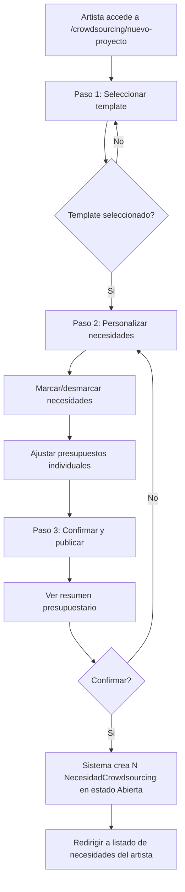

# US-CS-01: Templates y Guia para Artistas Noveles

> **ID:** US-CS-01
> **Feature Name:** `cs-templates-guia`
> **Prioridad:** Alta
> **Estimacion:** XL (Extra Large)
> **Modulo:** Crowdsourcing
> **Dependencias:** Ninguna (punto de entrada al modulo)

---

## Historia de Usuario

**Como** artista novel que no conoce la industria musical,
**Quiero** seleccionar un tipo de proyecto (ej: "Grabar un album") y ver automaticamente un desglose de todas las necesidades profesionales que tendre, con roles recomendados y precios orientativos,
**Para** poder planificar mi presupuesto y publicar las necesidades que me interesen directamente en la plataforma sin necesidad de saber como funciona la industria.

---

## Actores

| Actor | Descripcion |
|-------|-------------|
| Artista | Usuario autenticado con perfil de artista, tipicamente novel |
| Admin | Gestiona y actualiza templates y precios desde backoffice |

---

## Precondiciones

- Usuario tiene cuenta activa y perfil de Artista
- Existen templates de proyecto pre-cargados en la BD (datos de seed)

## Postcondiciones

- Se crean N necesidades de tipo `NecesidadCrowdsourcing` vinculadas al proyecto del artista
- Las necesidades quedan en estado `Abierta` y visibles para profesionales

---

## Justificacion

Los artistas noveles no saben:
- Que profesionales necesitan para cada tipo de proyecto
- Cuanto cuestan esos servicios en el mercado
- En que orden deben contratarlos
- Que fases tiene un proyecto musical

La plataforma debe actuar como un **mentor digital** que les guia paso a paso. Esto diferencia a WePlay Rises de un marketplace generico tipo Fiverr o Upwork.

---

## Flujo Principal



### Pasos Detallados

1. Artista accede a `/crowdsourcing/nuevo-proyecto`
2. **Paso 1 - Seleccionar template de proyecto:**
   - Ve galeria de templates como cards (icono, nombre, descripcion, rango de precio total)
   - Selecciona uno de los 6 templates disponibles
3. **Paso 2 - Personalizar necesidades:**
   - Ve desglose por fases con cada necesidad
   - Cada necesidad muestra: titulo, rol profesional recomendado, rango de precio orientativo, prioridad
   - Puede marcar/desmarcar necesidades (las "Esencial" vienen seleccionadas por defecto)
   - Puede ajustar el presupuesto de cada necesidad (el precio orientativo es solo una guia)
   - Cada rol profesional tiene tooltip con descripcion de "que hace y por que lo necesitas"
4. **Paso 3 - Confirmar y publicar:**
   - Ve resumen con coste total estimado (suma de rangos min y max de necesidades seleccionadas)
   - Confirma la creacion
5. Sistema crea automaticamente las `NecesidadCrowdsourcing` correspondientes, pre-rellenadas con titulo, descripcion, tipo de necesidad, rango de presupuesto y modalidad de trabajo derivados del template
6. Todas las necesidades generadas se vinculan al mismo `ProyectoArtistico` del artista

---

## Flujos Alternativos

| ID | Condicion | Accion |
|----|-----------|--------|
| FA-01 | Artista no tiene ProyectoArtistico | Crear uno automaticamente o redirigir a creacion |
| FA-02 | Artista deselecciona todas las necesidades | Deshabilitar boton de confirmar, mostrar aviso |
| FA-03 | Artista quiere volver a paso anterior | Permitir navegacion entre pasos sin perder datos |
| FA-04 | Suma de presupuestos excede lo razonable | Solo informativo, no bloquear |
| FA-05 | Template no tiene necesidades activas | No mostrar template en galeria |

---

## Criterios de Aceptacion

| ID | Criterio | Metodo de Prueba |
|----|----------|------------------|
| AC-CS01-1 | El artista ve una galeria de templates con cards (icono, nombre, descripcion, rango de precio total) y puede seleccionar uno | Navegar a /crowdsourcing/nuevo-proyecto, verificar cards |
| AC-CS01-2 | Al seleccionar un template, se muestra un desglose por fases con cada necesidad, el rol profesional recomendado, el rango de precio orientativo y la prioridad (Esencial / Recomendado / Opcional) | Seleccionar template, verificar desglose |
| AC-CS01-3 | El artista puede marcar/desmarcar las necesidades que le interesan. Las marcadas como "Esencial" vienen seleccionadas por defecto | Verificar checkboxes y defaults |
| AC-CS01-4 | El artista puede ajustar el presupuesto de cada necesidad seleccionada (el precio orientativo es solo una guia, no un limite) | Modificar presupuesto, verificar que se guarda |
| AC-CS01-5 | Al confirmar, se crean automaticamente las NecesidadCrowdsourcing correspondientes, pre-rellenadas con titulo, descripcion, tipo de necesidad, rango de presupuesto y modalidad de trabajo derivados del template | Confirmar y verificar en BD |
| AC-CS01-6 | Todas las necesidades generadas se vinculan al mismo ProyectoArtistico del artista | Verificar FK en BD |
| AC-CS01-7 | Antes de confirmar, se muestra un resumen con el coste total estimado (suma de rangos min y max de las necesidades seleccionadas) | Verificar resumen en paso 3 |
| AC-CS01-8 | Las 6 plantillas descritas, con sus necesidades, roles y precios, vienen pre-cargadas como datos de seed en la base de datos | Verificar datos seed tras migracion |
| AC-CS01-9 | Cada rol profesional tiene un icono de ayuda (tooltip) que muestra una descripcion de "que hace este profesional y por que lo necesitas" | Hover sobre icono, verificar tooltip |

---

## Especificacion Tecnica

### API Endpoints

#### GET /api/crowdsourcing/templates

Listar templates activos con sus necesidades.

**Auth:** Artista (autenticado)

**Response 200 OK:**
```json
{
  "items": [
    {
      "id": "guid",
      "nombre": "Grabar un Album / EP",
      "descripcion": "Todas las fases para grabar tu primer disco...",
      "icono": "music",
      "orden": 1,
      "precioMinTotal": 1920,
      "precioMaxTotal": 10400,
      "moneda": "EUR",
      "cantidadNecesidades": 11,
      "fases": ["Pre-produccion", "Grabacion", "Post-produccion", "Arte", "Distribucion", "Legal"]
    }
  ]
}
```

---

#### GET /api/crowdsourcing/templates/{id}

Detalle de un template con necesidades y roles.

**Auth:** Artista (autenticado)

**Response 200 OK:**
```json
{
  "id": "guid",
  "nombre": "Grabar un Album / EP",
  "descripcion": "Todas las fases para grabar tu primer disco...",
  "icono": "music",
  "necesidades": [
    {
      "id": "guid",
      "fase": "Pre-produccion",
      "titulo": "Composicion y arreglos musicales",
      "descripcion": "Crear arreglos instrumentales y vocales...",
      "rolProfesional": {
        "id": 1,
        "nombre": "Arreglista / Compositor",
        "descripcion": "Crea arreglos instrumentales y vocales a partir de una composicion basica...",
        "categoriaRol": "Produccion Musical",
        "modalidadCobro": "Por cancion"
      },
      "precioMinOrientativo": 200.00,
      "precioMaxOrientativo": 1500.00,
      "moneda": "EUR",
      "prioridad": "Esencial",
      "orden": 1
    }
  ],
  "resumen": {
    "precioMinTotal": 1920,
    "precioMaxTotal": 10400,
    "necesidadesEsenciales": 9,
    "necesidadesRecomendadas": 0,
    "necesidadesOpcionales": 1
  }
}
```

---

#### POST /api/crowdsourcing/templates/{id}/generar

Generar necesidades desde template.

**Auth:** Artista (autenticado)

**Request:**
```json
{
  "proyectoArtisticoId": "guid",
  "necesidadesSeleccionadas": [
    {
      "plantillaNecesidadId": "guid",
      "presupuestoMin": 200.00,
      "presupuestoMax": 1500.00,
      "monedaId": 1
    },
    {
      "plantillaNecesidadId": "guid",
      "presupuestoMin": 500.00,
      "presupuestoMax": 3000.00,
      "monedaId": 1
    }
  ]
}
```

**Response 201 Created:**
```json
{
  "necesidadesCreadas": 8,
  "necesidadIds": ["guid1", "guid2", "guid3", "..."],
  "presupuestoTotalMin": 1920.00,
  "presupuestoTotalMax": 10400.00,
  "moneda": "EUR"
}
```

**Errores:**
- `400 Bad Request` - Validacion fallida (sin necesidades seleccionadas, IDs invalidos)
- `404 Not Found` - Template o ProyectoArtistico no existe
- `403 Forbidden` - El proyecto artistico no pertenece al artista

---

#### GET /api/crowdsourcing/maestras/roles-profesionales

Catalogo de roles con categoria.

**Auth:** Publico (autenticado)

**Response 200 OK:**
```json
{
  "items": [
    {
      "id": 1,
      "nombre": "Productor musical",
      "descripcion": "Dirige la vision sonora del proyecto completo...",
      "categoriaRol": {
        "id": 1,
        "nombre": "Produccion Musical",
        "icono": "music"
      },
      "modalidadCobro": "Por proyecto o por cancion"
    }
  ]
}
```

---

#### GET /api/crowdsourcing/maestras/categorias-rol

Categorias de roles profesionales.

**Auth:** Publico (autenticado)

**Response 200 OK:**
```json
{
  "items": [
    { "id": 1, "nombre": "Produccion Musical", "icono": "music", "orden": 1 },
    { "id": 2, "nombre": "Audiovisual", "icono": "video", "orden": 2 },
    { "id": 3, "nombre": "Diseno y Branding", "icono": "palette", "orden": 3 },
    { "id": 4, "nombre": "Marketing y Comunicacion", "icono": "megaphone", "orden": 4 },
    { "id": 5, "nombre": "Gestion y Legal", "icono": "briefcase", "orden": 5 },
    { "id": 6, "nombre": "Produccion de Eventos / Live", "icono": "mic", "orden": 6 }
  ]
}
```

---

### Modelo de Datos

#### Nuevas Entidades

```csharp
public class PlantillaProyecto
{
    public Guid Id { get; set; }
    public string Nombre { get; set; } = null!;           // "Grabar un Album"
    public string? Descripcion { get; set; }               // Texto explicativo para el artista
    public string? Icono { get; set; }                     // Nombre del icono (ej: "music", "video")
    public int Orden { get; set; }                         // Orden de presentacion en UI
    public bool Activo { get; set; } = true;               // Para ocultar templates sin borrar
    public DateTime FechaCreacion { get; set; }

    // Navigation
    public ICollection<PlantillaProyectoNecesidad> Necesidades { get; set; } = new List<PlantillaProyectoNecesidad>();
}

public class PlantillaProyectoNecesidad
{
    public Guid Id { get; set; }
    public Guid PlantillaProyectoId { get; set; }          // FK -> PlantillaProyecto
    public string Fase { get; set; } = null!;              // "Pre-produccion", "Grabacion", etc.
    public string Titulo { get; set; } = null!;            // "Mezcla de pistas"
    public string? Descripcion { get; set; }               // Explicacion para el artista novel
    public int RolProfesionalId { get; set; }              // FK -> MaestraRolProfesional
    public decimal? PrecioMinOrientativo { get; set; }     // Precio minimo de mercado
    public decimal? PrecioMaxOrientativo { get; set; }     // Precio maximo de mercado
    public int MonedaId { get; set; }                      // FK -> MaestraMoneda
    public string Prioridad { get; set; } = null!;         // 'Esencial', 'Recomendado', 'Opcional'
    public int Orden { get; set; }                         // Orden dentro de la plantilla
    public DateTime FechaCreacion { get; set; }

    // Navigation
    public PlantillaProyecto PlantillaProyecto { get; set; } = null!;
    public MaestraRolProfesional RolProfesional { get; set; } = null!;
}

public class MaestraRolProfesional
{
    public int Id { get; set; }
    public string Nombre { get; set; } = null!;            // "Productor musical"
    public string? Descripcion { get; set; }               // Que hace este rol
    public int CategoriaRolId { get; set; }                // FK -> MaestraCategoriaRol
    public string? ModalidadCobro { get; set; }            // "Por cancion", "Por dia", "Mensual"
    public bool Activo { get; set; } = true;

    // Navigation
    public MaestraCategoriaRol CategoriaRol { get; set; } = null!;
}

public class MaestraCategoriaRol
{
    public int Id { get; set; }
    public string Nombre { get; set; } = null!;            // "Produccion Musical", "Audiovisual"
    public string? Icono { get; set; }
    public int Orden { get; set; }

    // Navigation
    public ICollection<MaestraRolProfesional> Roles { get; set; } = new List<MaestraRolProfesional>();
}

public class MaestraTipoEmpresa
{
    public int Id { get; set; }
    public string Nombre { get; set; } = null!;            // "Estudio de grabacion"
    public string? Descripcion { get; set; }
    public bool Activo { get; set; } = true;
}
```

### Validaciones

```csharp
// GenerarNecesidadesDesdeTemplateValidator
RuleFor(x => x.ProyectoArtisticoId)
    .NotEmpty()
    .WithMessage("El proyecto artistico es obligatorio")
    .WithErrorCode(ServiceResponseMessageType.Validation_Required);

RuleFor(x => x.NecesidadesSeleccionadas)
    .NotEmpty()
    .WithMessage("Debe seleccionar al menos una necesidad")
    .WithErrorCode(ServiceResponseMessageType.Validation_Required);

RuleForEach(x => x.NecesidadesSeleccionadas).ChildRules(n =>
{
    n.RuleFor(x => x.PlantillaNecesidadId)
        .NotEmpty()
        .WithMessage("El ID de la necesidad del template es obligatorio")
        .WithErrorCode(ServiceResponseMessageType.Validation_Required);

    n.RuleFor(x => x.PresupuestoMin)
        .GreaterThanOrEqualTo(0)
        .When(x => x.PresupuestoMin.HasValue)
        .WithMessage("El presupuesto minimo debe ser >= 0")
        .WithErrorCode(ServiceResponseMessageType.Validation_InvalidRange);

    n.RuleFor(x => x.PresupuestoMax)
        .GreaterThanOrEqualTo(x => x.PresupuestoMin ?? 0)
        .When(x => x.PresupuestoMax.HasValue)
        .WithMessage("El presupuesto maximo debe ser >= al minimo")
        .WithErrorCode(ServiceResponseMessageType.Validation_InvalidRange);
});
```

---

## Templates de Proyecto Predefinidos (Datos Seed)

### Template 1: Grabar un Album / EP

| Fase | Necesidad | Rol profesional | Precio min (EUR) | Precio max (EUR) | Prioridad |
|------|-----------|----------------|-------------------|-------------------|-----------|
| Pre-produccion | Composicion y arreglos musicales | Arreglista / Compositor | 200 | 1.500 | Esencial |
| Pre-produccion | Produccion musical (direccion artistica del sonido) | Productor musical | 500 | 3.000 | Esencial |
| Grabacion | Alquiler de estudio de grabacion | Estudio de grabacion | 200 | 800 | Esencial |
| Grabacion | Ingeniero de grabacion (captura de audio) | Ingeniero de sonido | 200 | 600 | Esencial |
| Grabacion | Musicos de sesion (instrumentos adicionales) | Musico de sesion | 100 | 400 | Opcional |
| Post-produccion | Mezcla de pistas | Ingeniero de mezcla | 150 | 800 | Esencial |
| Post-produccion | Mastering final para distribucion | Ingeniero de mastering | 50 | 150 | Esencial |
| Arte | Portada del album / EP | Disenador grafico | 200 | 2.000 | Esencial |
| Arte | Sesion de fotos promocionales | Fotografo musical | 200 | 600 | Esencial |
| Distribucion | Distribucion digital (Spotify, Apple Music, etc.) | Distribuidora digital | 20 | 50 | Esencial |
| Legal | Registro de obras en SGAE / PRO | Abogado musical / Gestor | 100 | 500 | Esencial |

**Precio total orientativo:** EP (5 canciones): 3.000 - 15.000 EUR / Album (10-12 canciones): 8.000 - 40.000 EUR

### Template 2: Produccion de Videoclip

| Fase | Necesidad | Rol profesional | Precio min (EUR) | Precio max (EUR) | Prioridad |
|------|-----------|----------------|-------------------|-------------------|-----------|
| Pre-produccion | Guion y storyboard | Guionista / Director creativo | 300 | 1.500 | Esencial |
| Pre-produccion | Casting de actores/modelos | Director de casting | 200 | 800 | Opcional |
| Pre-produccion | Busqueda de localizaciones | Location scout | 100 | 500 | Opcional |
| Produccion | Direccion del videoclip | Director audiovisual | 500 | 5.000 | Esencial |
| Produccion | Operador de camara / DOP | Camarografo | 200 | 600 | Esencial |
| Produccion | Tecnico de iluminacion | Iluminador | 150 | 400 | Recomendado |
| Produccion | Estilismo y maquillaje | Estilista + Maquillador | 150 | 500 | Recomendado |
| Produccion | Alquiler de equipo audiovisual | Rental audiovisual | 300 | 2.000 | Esencial |
| Post-produccion | Edicion y montaje | Editor de video | 400 | 2.000 | Esencial |
| Post-produccion | Correccion de color (color grading) | Colorista | 200 | 1.000 | Recomendado |
| Post-produccion | Efectos visuales y motion graphics | Artista VFX | 300 | 3.000 | Opcional |

**Precio total orientativo:** Basico: 2.000 - 5.000 EUR / Profesional: 5.000 - 20.000 EUR

### Template 3: Organizar una Gira / Tour

| Fase | Necesidad | Rol profesional | Precio min (EUR) | Precio max (EUR) | Prioridad |
|------|-----------|----------------|-------------------|-------------------|-----------|
| Planificacion | Booking de venues / salas | Agente de booking | 10% cachet | 15% cachet | Esencial |
| Planificacion | Gestion logistica del tour | Tour manager | 300 | 800 | Recomendado |
| Logistica | Transporte (alquiler furgoneta) | - | 100 | 300 | Esencial |
| Logistica | Alojamiento por noche y persona | - | 50 | 150 | Esencial |
| Logistica | Alquiler de backline / equipo de sonido | Rental de backline | 200 | 800 | Variable |
| Tecnica | Tecnico de sonido en directo (FOH) | Tecnico de sonido | 150 | 400 | Esencial |
| Tecnica | Tecnico de iluminacion en directo | Tecnico de luces | 100 | 300 | Opcional |
| Merch | Diseno de merchandising (camisetas, posters) | Disenador grafico | 200 | 800 | Recomendado |
| Merch | Produccion de merchandising (impresion, serigrafia) | Imprenta / Serigrafia | 500 | 2.000 | Recomendado |
| Promo | Carteleria y flyers para cada fecha | Disenador grafico | 100 | 400 | Recomendado |
| Legal | Permisos, seguros y licencias | Gestor / Abogado | 200 | 1.000 | Esencial |

**Precio total orientativo:** Tour regional (7-10 fechas): 5.000 - 10.000 EUR

### Template 4: Campana de Marketing y Promocion

| Fase | Necesidad | Rol profesional | Precio min (EUR) | Precio max (EUR) | Prioridad |
|------|-----------|----------------|-------------------|-------------------|-----------|
| Estrategia | Plan de marketing para lanzamiento | Consultor de marketing musical | 500 | 2.000 | Esencial |
| Branding | Identidad visual completa (logo, colores, tipografia) | Disenador grafico / Branding | 500 | 3.000 | Esencial |
| Digital | Gestion de redes sociales (mensual) | Community manager | 500 | 1.500 | Esencial |
| Digital | Creacion de contenido para redes (mensual) | Content creator / Videografo | 300 | 1.500 | Esencial |
| PR | Campana de prensa y medios | Publicista musical / PR | 1.000 | 5.000 | Recomendado |
| PR | EPK (Electronic Press Kit): bio, fotos, links | Disenador + Fotografo + Copywriter | 300 | 1.000 | Esencial |
| Ads | Publicidad digital en Meta, TikTok, Google (mensual + presupuesto) | Media buyer / Ads specialist | 250 | 1.000 | Recomendado |
| Playlist | Pitching a playlists de Spotify, Apple Music, Deezer | Promotor de playlists | 200 | 1.000 | Recomendado |
| Radio | Promocion en emisoras de radio | Promotor radiofonico | 500 | 3.000 | Opcional |

**Precio total orientativo:** Lanzamiento de single: 2.000 - 8.000 EUR / Lanzamiento de album: 5.000 - 20.000 EUR

### Template 5: Lanzamiento de Single

| Fase | Necesidad | Rol profesional | Precio min (EUR) | Precio max (EUR) | Prioridad |
|------|-----------|----------------|-------------------|-------------------|-----------|
| Produccion | Produccion musical + grabacion en estudio | Productor + Estudio | 500 | 3.000 | Esencial |
| Post-produccion | Mezcla + mastering | Ingeniero mezcla + mastering | 200 | 800 | Esencial |
| Arte | Cover art para plataformas digitales | Disenador grafico | 100 | 500 | Esencial |
| Arte | Sesion de fotos promocionales | Fotografo | 150 | 400 | Esencial |
| Video | Lyric video o visualizer animado | Editor video / Motion designer | 200 | 1.000 | Recomendado |
| Distribucion | Alta en distribucion digital | Distribuidora | 10 | 30 | Esencial |
| Legal | Registro de la obra en SGAE / PRO | - | 50 | 100 | Esencial |
| Promo | Campana de PR + pitching a playlists | Publicista | 500 | 2.000 | Recomendado |

**Precio total orientativo:** 1.500 - 5.000 EUR

### Template 6: Crear Presencia Online (Branding Inicial)

| Fase | Necesidad | Rol profesional | Precio min (EUR) | Precio max (EUR) | Prioridad |
|------|-----------|----------------|-------------------|-------------------|-----------|
| Branding | Logo e identidad visual | Disenador grafico | 300 | 1.500 | Esencial |
| Web | Pagina web / landing page del artista | Desarrollador web | 500 | 3.000 | Recomendado |
| Foto | Sesion fotografica profesional | Fotografo | 200 | 600 | Esencial |
| Bio | Biografia profesional y storytelling | Copywriter musical | 100 | 400 | Esencial |
| Perfiles | Setup y optimizacion de perfiles (Spotify, Apple, YouTube, etc.) | Consultor digital | 100 | 300 | Esencial |

**Precio total orientativo:** 1.000 - 5.000 EUR

---

## Catalogo de Roles Profesionales (Datos Seed)

### Produccion Musical

| Rol | Descripcion | Modalidad de cobro |
|-----|-------------|-------------------|
| Productor musical | Dirige la vision sonora del proyecto completo | Por proyecto o por cancion |
| Arreglista | Crea arreglos instrumentales y vocales | Por cancion |
| Compositor / Songwriter | Crea letras, melodias y/o armonias originales | Por cancion + % royalties |
| Ingeniero de grabacion | Opera el equipo tecnico del estudio | Por hora o por dia |
| Ingeniero de mezcla | Equilibra pistas en un mix estereo cohesivo | Por cancion |
| Ingeniero de mastering | Procesamiento final del mix para distribucion | Por cancion |
| Musico de sesion | Interpreta instrumentos adicionales | Por sesion o por cancion |
| Programador musical / Beatmaker | Crea bases ritmicas y texturas electronicas | Por beat o por cancion |
| Director musical | Coordina ensayos, adapta arreglos para directo | Por proyecto o por evento |

### Audiovisual

| Rol | Descripcion | Modalidad de cobro |
|-----|-------------|-------------------|
| Director de videoclip | Dirige produccion completa del video musical | Por proyecto |
| Camarografo / DOP | Opera camara y decide composicion visual | Por dia de rodaje |
| Editor de video | Montaje del material grabado | Por proyecto |
| Colorista | Correccion de color y look cinematografico | Por proyecto |
| Artista VFX / Motion graphics | Crea efectos visuales y graficos animados | Por proyecto |
| Fotografo musical | Sesiones de fotos promocionales y conciertos | Por sesion |

### Diseno y Branding

| Rol | Descripcion | Modalidad de cobro |
|-----|-------------|-------------------|
| Disenador grafico | Portadas, carteleria, flyers, banners | Por proyecto o por pieza |
| Ilustrador | Ilustraciones originales para portadas y merch | Por pieza |
| Disenador web | Pagina web del artista: landing, EPK online | Por proyecto |
| Disenador de merchandising | Disena piezas de merch para imprenta | Por pieza |

### Marketing y Comunicacion

| Rol | Descripcion | Modalidad de cobro |
|-----|-------------|-------------------|
| Publicista musical / PR | Relaciones con prensa, blogs, medios | Por campana o mensual |
| Community manager | Gestion diaria de redes sociales | Mensual |
| Content creator | Contenido para redes: Reels, TikTok, stories | Mensual o por pieza |
| Consultor de marketing musical | Estrategia global de lanzamiento | Por proyecto |
| Promotor de playlists | Pitching a playlists editoriales e independientes | Por cancion o campana |
| Promotor radiofonico | Relaciones con emisoras de radio | Por campana |
| Media buyer / Ads specialist | Campanas de publicidad digital | Mensual + % inversion |
| Copywriter musical | Textos profesionales: bio, notas de prensa, EPK | Por proyecto o pieza |

### Gestion y Legal

| Rol | Descripcion | Modalidad de cobro |
|-----|-------------|-------------------|
| Manager artistico | Gestion integral de carrera del artista | % ingresos (15-20%) |
| Agente de booking | Conseguir y negociar conciertos y festivales | % cachet (10-15%) |
| Tour manager | Logistica completa de gira | Por dia o por tour |
| Abogado musical | Contratos, derechos de autor, propiedad intelectual | Por hora o proyecto |
| Contable / Gestor fiscal | Facturacion, impuestos, royalties | Mensual |
| Distribuidor digital | Sube musica a plataformas de streaming | Anual o % royalties |

### Produccion de Eventos / Live

| Rol | Descripcion | Modalidad de cobro |
|-----|-------------|-------------------|
| Tecnico de sonido (FOH) | Controla mesa de mezclas en directo | Por evento |
| Tecnico de monitores | Controla monitores en escenario | Por evento |
| Tecnico de luces | Disena y opera iluminacion del espectaculo | Por evento |
| Roadie / Stage hand | Asistente tecnico de escenario | Por evento |

---

## Mockups / UI

### Paso 1: Galeria de Templates
```
+------------------------------------------+
|  Selecciona tu tipo de proyecto          |
+------------------------------------------+
|                                          |
|  +----------+  +----------+  +---------+ |
|  |  [music] |  |  [video] |  | [route] | |
|  | Grabar   |  | Video-   |  | Gira /  | |
|  | Album/EP |  | clip     |  | Tour    | |
|  | 3k-40k   |  | 2k-20k  |  | 5k-10k  | |
|  +----------+  +----------+  +---------+ |
|                                          |
|  +----------+  +----------+  +---------+ |
|  | [speaker]|  | [single] |  |[palette]| |
|  | Marketing|  | Lanzar   |  | Branding| |
|  | y Promo  |  | Single   |  | Online  | |
|  | 2k-20k   |  | 1.5k-5k |  | 1k-5k   | |
|  +----------+  +----------+  +---------+ |
+------------------------------------------+
```

### Paso 2: Personalizar Necesidades
```
+------------------------------------------+
|  Grabar un Album / EP                    |
|  Personaliza las necesidades de tu proyecto |
+------------------------------------------+
|                                          |
|  PRE-PRODUCCION                          |
|  [x] Composicion y arreglos    ESENCIAL  |
|      Arreglista / Compositor  [?]        |
|      Presupuesto: [200] - [1500] EUR     |
|                                          |
|  [x] Produccion musical        ESENCIAL  |
|      Productor musical         [?]       |
|      Presupuesto: [500] - [3000] EUR     |
|                                          |
|  GRABACION                               |
|  [x] Alquiler estudio          ESENCIAL  |
|      Estudio de grabacion      [?]       |
|      Presupuesto: [200] - [800] EUR      |
|                                          |
|  [ ] Musicos de sesion          OPCIONAL  |
|      Musico de sesion           [?]      |
|      Presupuesto: [100] - [400] EUR      |
|                                          |
|  +------------------------------------+  |
|  | Presupuesto total estimado:        |  |
|  | Min: 1,920 EUR  -  Max: 10,400 EUR|  |
|  +------------------------------------+  |
|                                          |
|  [< Atras]              [Siguiente >]    |
+------------------------------------------+
```

### Paso 3: Confirmar y Publicar
```
+------------------------------------------+
|  Resumen de tu proyecto                  |
+------------------------------------------+
|                                          |
|  Template: Grabar un Album / EP          |
|  Necesidades seleccionadas: 8 de 11      |
|                                          |
|  +------------------------------------+  |
|  | RESUMEN PRESUPUESTARIO             |  |
|  | Min total: 1,920 EUR               |  |
|  | Max total: 10,400 EUR              |  |
|  +------------------------------------+  |
|                                          |
|  Necesidades a publicar:                 |
|  - Composicion y arreglos (200-1500)     |
|  - Produccion musical (500-3000)         |
|  - Alquiler estudio (200-800)            |
|  - ...                                   |
|                                          |
|  [< Atras]          [Confirmar y publicar]|
+------------------------------------------+
```

---

## Consideraciones de UI/UX

- **Wizard de 3 pasos** con navegacion prev/next y indicador de paso actual
- **Indicador visual de prioridad:** Esencial (rojo/obligatorio), Recomendado (amarillo), Opcional (gris)
- **Barra de progreso de presupuesto:** Suma acumulada en tiempo real al marcar/desmarcar
- **Tooltips informativos** en cada rol profesional explicando que hace y por que se necesita
- Los templates y precios se gestionan desde Admin y son editables sin despliegue de codigo
- Responsive: en mobile, cards de templates en 1 columna; wizard en vertical

---

## Notas de Implementacion

- Templates y roles profesionales se cargan como datos seed en la migracion
- Usar EF Core fluent API para configurar relaciones FK
- El wizard persiste estado en React (useState/useReducer), no en servidor
- Las necesidades se crean en una sola transaccion (atomicidad)
- Considerar lazy loading de roles profesionales (solo cargar al expandir tooltip)
- Las categorias de roles se cachean en el frontend (datos que cambian poco)
- En futuro, se podria permitir a proveedores validar/sugerir precios de mercado
