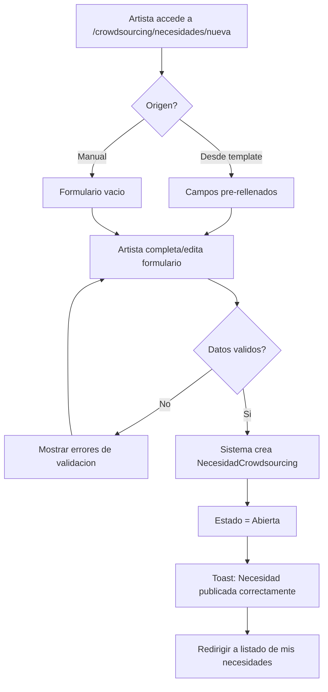
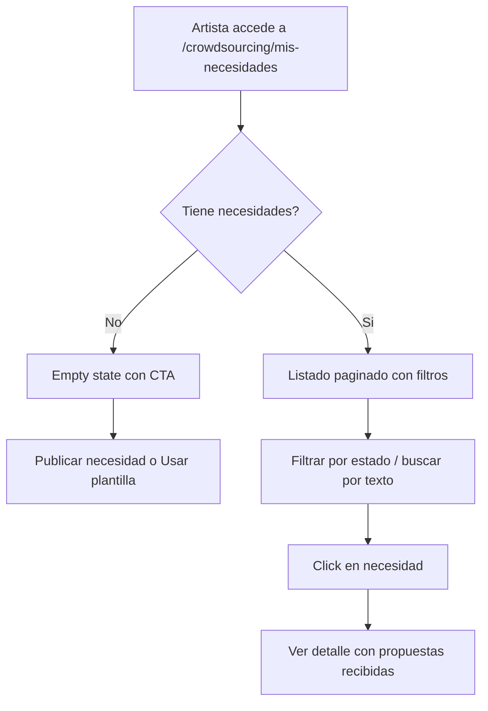
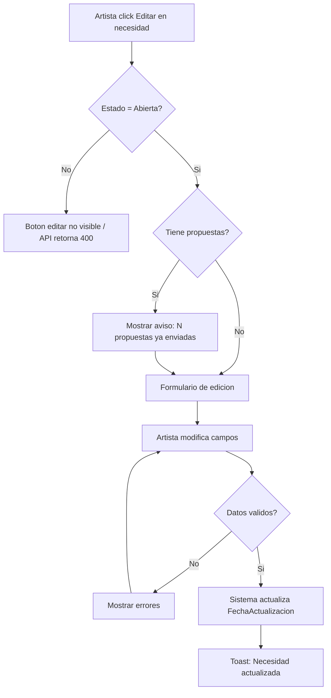
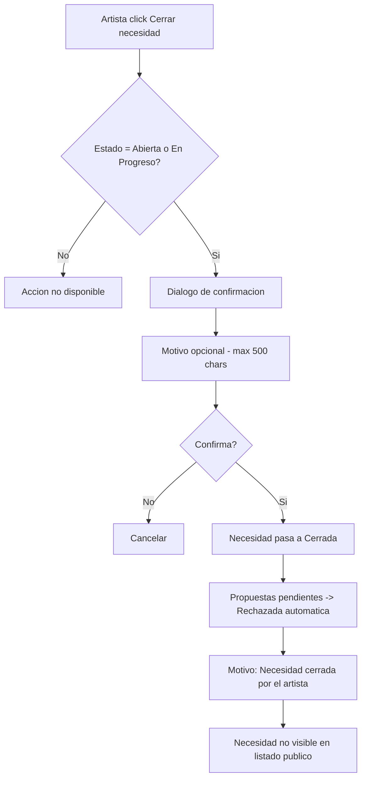

# US-CS-02: Publicar y Gestionar Necesidades

> **ID:** US-CS-02
> **Feature Name:** `cs-gestionar-necesidades`
> **Prioridad:** Alta
> **Estimacion:** L (Large)
> **Modulo:** Crowdsourcing
> **Dependencias:** US-CS-01 (las necesidades pueden venir de templates o crearse manualmente)

---

## Historia de Usuario

**Como** artista registrado en la plataforma,
**Quiero** publicar, listar, editar y cerrar necesidades de servicios profesionales,
**Para** gestionar mis solicitudes de crowdsourcing y atraer propuestas de profesionales cualificados.

---

## Actores

| Actor | Descripcion |
|-------|-------------|
| Artista | Usuario autenticado con perfil de artista |

---

## Precondiciones

- Usuario tiene cuenta activa y perfil de Artista
- Existe al menos un ProyectoArtistico asociado al artista

## Postcondiciones

- Necesidades creadas en estado `Abierta` y visibles para profesionales
- Necesidades editadas/cerradas reflejan su nuevo estado

---

## Flujo Principal: Publicar Necesidad

Un artista puede crear necesidades de dos formas:
1. **Desde un template** (US-CS-01): las necesidades se pre-rellenan automaticamente.
2. **Manualmente**: el artista crea la necesidad desde cero rellenando todos los campos.



### Campos del Formulario

| Campo | Tipo | Obligatorio | Validacion | Origen |
|-------|------|-------------|------------|--------|
| Titulo | Texto (max 200) | Si | Min 5 caracteres | Manual o template |
| Descripcion | Texto largo | No | Max 4000 caracteres | Manual o template |
| Tipo de necesidad | Select (MaestraTipoNecesidad) | Si | Debe existir en maestras | Manual o template |
| Estado | Automatico | - | Se crea como "Abierta" | Sistema |
| Modalidad de trabajo | Select (MaestraModalidadTrabajo) | Si | Presencial / Remoto / Hibrido | Manual o template |
| Presupuesto minimo | Decimal | No | >= 0 | Manual o template |
| Presupuesto maximo | Decimal | No | >= presupuesto minimo | Manual o template |
| Moneda | Select (MaestraMoneda) | Si (si hay presupuesto) | - | Manual o template |
| Ubicacion (ciudad) | Texto (max 100) | No | Solo si modalidad = Presencial/Hibrido | Manual |
| Ubicacion (pais) | Texto (max 100) | No | Solo si modalidad = Presencial/Hibrido | Manual |
| Fecha limite de propuestas | Date | No | >= hoy + 1 dia | Manual |
| Fecha inicio prevista | Date | No | >= hoy | Manual |
| Proyecto artistico | Select | Si | FK a ProyectoArtistico del artista | Automatico o manual |

---

## Flujo Secundario: Listar Mis Necesidades



**Datos a mostrar por necesidad:**

| Dato | Fuente |
|------|--------|
| Titulo | NecesidadCrowdsourcing.Titulo |
| Estado (badge de color) | MaestraEstadoNecesidad.Nombre |
| Tipo de necesidad | MaestraTipoNecesidad.Nombre |
| Rango de presupuesto | PresupuestoMin - PresupuestoMax + Moneda |
| Numero de propuestas recibidas | COUNT(PropuestaCrowdsourcing) |
| Fecha de publicacion | FechaCreacion |
| Fecha limite de propuestas | FechaLimitePropuestas (con indicador si esta proxima) |
| Modalidad de trabajo | MaestraModalidadTrabajo.Nombre |

**Badges de estado:**
- Abierta: verde
- En Progreso: azul
- Cerrada: gris
- Cancelada: rojo

---

## Flujo Secundario: Editar Necesidad



**Reglas de edicion:**
- Solo se puede editar una necesidad en estado `Abierta`
- Si tiene propuestas recibidas, se muestra aviso: "Esta necesidad ya tiene N propuestas. Los cambios seran visibles para los profesionales que ya enviaron propuestas."
- Todos los campos son editables **excepto** el tipo de necesidad (para no invalidar propuestas existentes)
- Al guardar, se actualiza `FechaActualizacion`
- Si estado != `Abierta`, el boton de editar no aparece y la API retorna error 400

---

## Flujo Secundario: Cerrar Necesidad



**Reglas de cierre:**
- El artista puede cerrar una necesidad en estado `Abierta` o `En Progreso`
- Se pide un motivo opcional (texto libre, max 500 caracteres)
- Se muestra confirmacion previa: "Al cerrar esta necesidad, las propuestas pendientes seran rechazadas automaticamente."
- Las propuestas pendientes pasan automaticamente a estado `Rechazada` con motivo "Necesidad cerrada por el artista"
- La necesidad cerrada ya no aparece en el listado publico (US-CS-03) pero sigue visible en el historial del artista

---

## Flujos Alternativos

| ID | Condicion | Accion |
|----|-----------|--------|
| FA-01 | Artista no tiene ProyectoArtistico | Redirigir a crear proyecto o crearlo automaticamente |
| FA-02 | Necesidad desde template con campos pre-rellenados | Mostrar formulario con datos editables |
| FA-03 | Modalidad Presencial/Hibrido sin ubicacion | Validacion: ubicacion requerida para esa modalidad |
| FA-04 | Presupuesto max < presupuesto min | Mostrar error de validacion |
| FA-05 | Fecha limite pasada al editar | No permitir guardar con fecha limite expirada |

---

## Criterios de Aceptacion

| ID | Criterio | Metodo de Prueba |
|----|----------|------------------|
| AC-CS02-1 | El artista autenticado puede crear una necesidad con todos los campos obligatorios validados | Crear necesidad con datos validos, verificar en BD |
| AC-CS02-2 | La necesidad se crea con estado `Abierta` y aparece inmediatamente en el listado del artista y en el listado publico. Se muestra toast: "Necesidad publicada correctamente" | Crear necesidad, verificar ambos listados y toast |
| AC-CS02-3 | El `ArtistaId` y `ProyectoArtisticoId` se asignan automaticamente desde el contexto del usuario | Verificar FKs en BD tras creacion |
| AC-CS02-4 | Si la necesidad viene de un template, los campos se pre-rellenan pero son editables | Generar desde template, verificar pre-fill y edicion |
| AC-CS02-5 | El artista ve un listado paginado de sus necesidades con badge de color segun estado: Abierta (verde), En Progreso (azul), Cerrada (gris), Cancelada (rojo) | Crear necesidades en varios estados, verificar badges |
| AC-CS02-6 | Se muestra un contador de propuestas recibidas en cada tarjeta | Enviar propuestas, verificar contador en listado |
| AC-CS02-7 | El artista puede filtrar por estado y buscar por texto libre | Aplicar filtros, verificar resultados |
| AC-CS02-8 | Si no hay necesidades, se muestra empty state con CTA hacia "Publicar necesidad" o "Usar una plantilla" | Acceder sin necesidades, verificar empty state |
| AC-CS02-9 | Solo se puede editar una necesidad en estado `Abierta`. Si tiene propuestas, se muestra aviso. Al guardar se actualiza `FechaActualizacion`. Si estado != Abierta, la API retorna 400 | Intentar editar en varios estados |
| AC-CS02-10 | Al cerrar una necesidad, las propuestas pendientes pasan automaticamente a `Rechazada` y se muestra confirmacion previa | Cerrar necesidad con propuestas, verificar estados |
| AC-CS02-11 | Click en una necesidad del listado navega al detalle con sus propuestas recibidas | Click en card, verificar navegacion |
| AC-CS02-12 | La necesidad cerrada ya no aparece en el listado publico pero sigue visible en el historial del artista | Cerrar necesidad, verificar ambos listados |

---

## Especificacion Tecnica

### API Endpoints

#### POST /api/crowdsourcing/necesidades

Crear necesidad.

**Auth:** Artista (autenticado)

**Request:**
```json
{
  "titulo": "Mezcla de pistas para EP de 5 canciones",
  "descripcion": "Buscamos un ingeniero de mezcla experimentado...",
  "tipoNecesidadId": 3,
  "modalidadTrabajoId": 2,
  "presupuestoMin": 150.00,
  "presupuestoMax": 800.00,
  "monedaId": 1,
  "ubicacionCiudad": null,
  "ubicacionPais": null,
  "fechaLimitePropuestas": "2026-03-15",
  "fechaInicioPrevista": "2026-04-01",
  "proyectoArtisticoId": "guid"
}
```

**Response 201 Created:**
```json
{
  "data": {
    "id": "guid",
    "titulo": "Mezcla de pistas para EP de 5 canciones",
    "estadoNecesidadNombre": "Abierta",
    "fechaCreacion": "2026-02-15T10:30:00Z"
  },
  "messages": [
    { "message": "Necesidad publicada correctamente", "errorCode": "0001" }
  ]
}
```

**Errores:**
- `400 Bad Request` - Validacion fallida
- `403 Forbidden` - El proyecto no pertenece al artista
- `404 Not Found` - ProyectoArtistico no existe

---

#### GET /api/crowdsourcing/necesidades/mis-necesidades

Listar necesidades del artista autenticado.

**Auth:** Artista (autenticado)

**Query params:** `estado`, `page`, `pageSize`, `search`

**Response 200 OK:**
```json
{
  "data": {
    "items": [
      {
        "id": "guid",
        "titulo": "Mezcla de pistas para EP de 5 canciones",
        "estadoNecesidadId": 1,
        "estadoNecesidadNombre": "Abierta",
        "tipoNecesidadNombre": "Post-produccion",
        "presupuestoMin": 150.00,
        "presupuestoMax": 800.00,
        "monedaNombre": "EUR",
        "modalidadTrabajoNombre": "Remoto",
        "numeroPropuestas": 3,
        "fechaCreacion": "2026-02-15T10:30:00Z",
        "fechaLimitePropuestas": "2026-03-15"
      }
    ],
    "totalCount": 5,
    "page": 1,
    "pageSize": 10
  },
  "messages": []
}
```

---

#### GET /api/crowdsourcing/necesidades/{id}

Detalle de necesidad (propietario).

**Auth:** Artista (propietario de la necesidad)

**Response 200 OK:**
```json
{
  "data": {
    "id": "guid",
    "titulo": "Mezcla de pistas para EP de 5 canciones",
    "descripcion": "Buscamos un ingeniero de mezcla experimentado...",
    "estadoNecesidadId": 1,
    "estadoNecesidadNombre": "Abierta",
    "tipoNecesidadId": 3,
    "tipoNecesidadNombre": "Post-produccion",
    "modalidadTrabajoId": 2,
    "modalidadTrabajoNombre": "Remoto",
    "presupuestoMin": 150.00,
    "presupuestoMax": 800.00,
    "monedaId": 1,
    "monedaNombre": "EUR",
    "ubicacionCiudad": null,
    "ubicacionPais": null,
    "fechaLimitePropuestas": "2026-03-15",
    "fechaInicioPrevista": "2026-04-01",
    "fechaCreacion": "2026-02-15T10:30:00Z",
    "fechaActualizacion": null,
    "propuestas": [
      {
        "id": "guid",
        "profesionalNombre": "Studio Mix Pro",
        "precioPropuesto": 450.00,
        "monedaNombre": "EUR",
        "diasEstimados": 14,
        "estadoPropuestaNombre": "Pendiente",
        "fechaCreacion": "2026-02-20T14:00:00Z"
      }
    ],
    "numeroPropuestas": 3
  },
  "messages": []
}
```

---

#### PUT /api/crowdsourcing/necesidades/{id}

Editar necesidad (solo si estado = Abierta).

**Auth:** Artista (propietario de la necesidad)

**Request:** (mismos campos que POST, sin proyectoArtisticoId)

**Response 200 OK:**
```json
{
  "data": {
    "id": "guid",
    "titulo": "Mezcla de pistas para EP (actualizado)",
    "fechaActualizacion": "2026-02-16T09:00:00Z"
  },
  "messages": [
    { "message": "Necesidad actualizada", "errorCode": "0002" }
  ]
}
```

**Errores:**
- `400 Bad Request` - Estado != Abierta o validacion fallida
- `403 Forbidden` - No es el propietario

---

#### PATCH /api/crowdsourcing/necesidades/{id}/cerrar

Cerrar necesidad.

**Auth:** Artista (propietario de la necesidad)

**Request:**
```json
{
  "motivo": "Ya encontre un profesional por otra via"
}
```

**Response 200 OK:**
```json
{
  "data": {
    "id": "guid",
    "estadoNecesidadNombre": "Cerrada",
    "propuestasRechazadas": 2
  },
  "messages": [
    { "message": "Necesidad cerrada", "errorCode": "0002" }
  ]
}
```

**Errores:**
- `400 Bad Request` - Estado no permite cierre
- `403 Forbidden` - No es el propietario

---

### Modelo de Datos

```csharp
public class NecesidadCrowdsourcing
{
    public Guid Id { get; set; }
    public Guid ArtistaId { get; set; }                    // FK -> Artista
    public Guid ProyectoArtisticoId { get; set; }          // FK -> ProyectoArtistico
    public string Titulo { get; set; } = null!;
    public string? Descripcion { get; set; }
    public int TipoNecesidadId { get; set; }               // FK -> MaestraTipoNecesidad
    public int EstadoNecesidadId { get; set; }             // FK -> MaestraEstadoNecesidad
    public int ModalidadTrabajoId { get; set; }            // FK -> MaestraModalidadTrabajo
    public decimal? PresupuestoMin { get; set; }
    public decimal? PresupuestoMax { get; set; }
    public int? MonedaId { get; set; }                     // FK -> MaestraMoneda
    public string? UbicacionCiudad { get; set; }
    public string? UbicacionPais { get; set; }
    public DateTime? FechaLimitePropuestas { get; set; }
    public DateTime? FechaInicioPrevista { get; set; }
    public string? MotivoCierre { get; set; }
    public DateTime FechaCreacion { get; set; }
    public DateTime? FechaActualizacion { get; set; }

    // Navigation
    public Artista Artista { get; set; } = null!;
    public ICollection<PropuestaCrowdsourcing> Propuestas { get; set; } = new List<PropuestaCrowdsourcing>();
}
```

### Validaciones

```csharp
// CreateNecesidadValidator
RuleFor(x => x.Titulo)
    .NotEmpty()
    .WithMessage("El titulo es obligatorio")
    .WithErrorCode(ServiceResponseMessageType.Validation_Required)
    .MinimumLength(5)
    .WithMessage("El titulo debe tener al menos 5 caracteres")
    .WithErrorCode(ServiceResponseMessageType.Validation_MinLength)
    .MaximumLength(200)
    .WithMessage("Maximo 200 caracteres")
    .WithErrorCode(ServiceResponseMessageType.Validation_MaxLength);

RuleFor(x => x.Descripcion)
    .MaximumLength(4000)
    .WithMessage("Maximo 4000 caracteres")
    .WithErrorCode(ServiceResponseMessageType.Validation_MaxLength);

RuleFor(x => x.TipoNecesidadId)
    .NotEmpty()
    .WithMessage("El tipo de necesidad es obligatorio")
    .WithErrorCode(ServiceResponseMessageType.Validation_Required);

RuleFor(x => x.ModalidadTrabajoId)
    .NotEmpty()
    .WithMessage("La modalidad de trabajo es obligatoria")
    .WithErrorCode(ServiceResponseMessageType.Validation_Required);

RuleFor(x => x.PresupuestoMax)
    .GreaterThanOrEqualTo(x => x.PresupuestoMin ?? 0)
    .When(x => x.PresupuestoMax.HasValue && x.PresupuestoMin.HasValue)
    .WithMessage("El presupuesto maximo debe ser >= al minimo")
    .WithErrorCode(ServiceResponseMessageType.Validation_InvalidRange);

RuleFor(x => x.FechaLimitePropuestas)
    .GreaterThan(DateTime.Today)
    .When(x => x.FechaLimitePropuestas.HasValue)
    .WithMessage("La fecha limite debe ser posterior a hoy")
    .WithErrorCode(ServiceResponseMessageType.Validation_InvalidDate);

RuleFor(x => x.UbicacionCiudad)
    .NotEmpty()
    .When(x => x.ModalidadTrabajoId == 1 || x.ModalidadTrabajoId == 3) // Presencial o Hibrido
    .WithMessage("La ubicacion es requerida para modalidad presencial/hibrido")
    .WithErrorCode(ServiceResponseMessageType.Validation_Required);

RuleFor(x => x.MotivoCierre)
    .MaximumLength(500)
    .WithMessage("Maximo 500 caracteres")
    .WithErrorCode(ServiceResponseMessageType.Validation_MaxLength);
```

---

## Mockups / UI

### Formulario de Crear/Editar Necesidad
```
+------------------------------------------+
|  Publicar nueva necesidad                |
+------------------------------------------+
|                                          |
|  Titulo *                                |
|  [_____________________________________] |
|                                          |
|  Descripcion                             |
|  [_____________________________________] |
|  [_____________________________________] |
|                                          |
|  Tipo de necesidad *   Modalidad *       |
|  [Produccion     v]   [Remoto      v]   |
|                                          |
|  Presupuesto            Moneda           |
|  [150] - [800]          [EUR  v]         |
|                                          |
|  Ubicacion (si presencial/hibrido)       |
|  Ciudad [________]  Pais [________]      |
|                                          |
|  Fecha limite propuestas  Fecha inicio   |
|  [2026-03-15]             [2026-04-01]   |
|                                          |
|  Proyecto artistico *                    |
|  [Mi primer EP        v]                |
|                                          |
|  [Cancelar]             [Publicar]       |
+------------------------------------------+
```

### Listado de Mis Necesidades
```
+------------------------------------------+
|  Mis necesidades       [+ Nueva] [Plantilla] |
+------------------------------------------+
|  Filtros: [Todos estados v] [Buscar...  ]|
+------------------------------------------+
|                                          |
|  +------------------------------------+ |
|  | Mezcla de pistas para EP   ABIERTA | |
|  | Post-produccion | Remoto           | |
|  | 150 - 800 EUR | 3 propuestas       | |
|  | Publicada hace 2 dias | Limite: 15 mar |
|  +------------------------------------+ |
|                                          |
|  +------------------------------------+ |
|  | Produccion musical       EN PROGRESO | |
|  | Pre-produccion | Presencial - Madrid | |
|  | 500 - 3000 EUR | 5 propuestas      | |
|  | Publicada hace 5 dias              | |
|  +------------------------------------+ |
|                                          |
|  [1] [2] [3]  (paginacion)              |
+------------------------------------------+
```

### Empty State
```
+------------------------------------------+
|  Mis necesidades                         |
+------------------------------------------+
|                                          |
|          [icono ilustrativo]             |
|                                          |
|     No tienes necesidades publicadas     |
|                                          |
|  Publica lo que necesitas y recibe       |
|  propuestas de profesionales             |
|                                          |
|  [Publicar necesidad] [Usar plantilla]   |
+------------------------------------------+
```

---

## Notas de Implementacion

- La creacion desde template (US-CS-01) pre-rellena el formulario pero usa el mismo endpoint POST
- El cierre de necesidad con rechazo automatico de propuestas debe ser transaccional
- El listado de mis necesidades usa paginacion server-side con filtros como query params
- El contador de propuestas se calcula con un COUNT en el query (no stored en la entidad)
- Al editar, solo enviar campos modificados (PUT con todos los campos o PATCH con parciales)
- Handler CQRS: Command + Handler en mismo archivo, inyectar Service (no DbContext)
