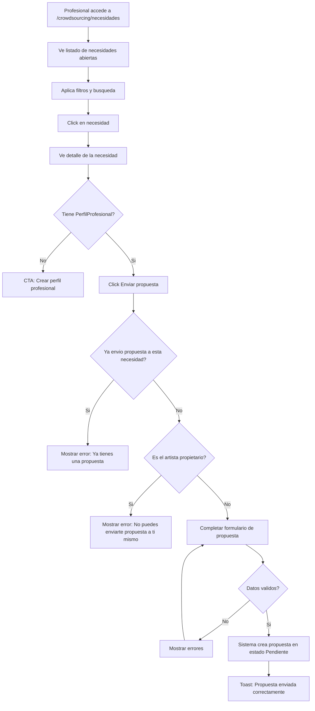
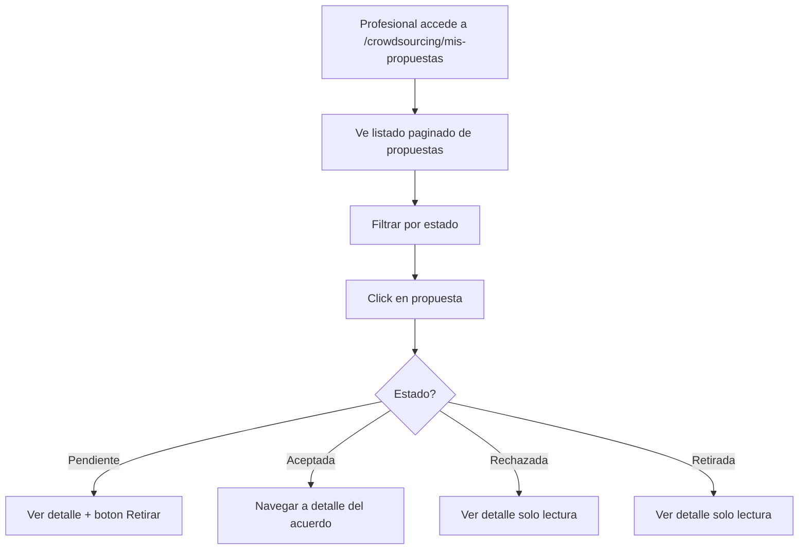
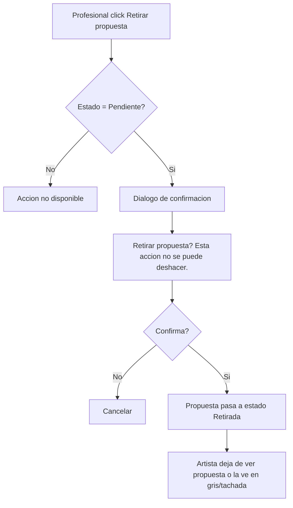

# US-CS-03: Explorar Necesidades y Enviar Propuestas

> **ID:** US-CS-03
> **Feature Name:** `cs-explorar-propuestas`
> **Prioridad:** Alta
> **Estimacion:** L (Large)
> **Modulo:** Crowdsourcing
> **Dependencias:** US-CS-02

---

## Historia de Usuario

**Como** profesional de la industria musical (productor, disenador, fotografo, etc.),
**Quiero** buscar necesidades abiertas, enviar propuestas con mi precio y condiciones, hacer seguimiento de mis propuestas y poder retirarlas si es necesario,
**Para** encontrar oportunidades de trabajo y ofrecer mis servicios a artistas en la plataforma.

---

## Actores

| Actor | Descripcion |
|-------|-------------|
| Profesional | Usuario autenticado con perfil profesional (PerfilProfesional) |

---

## Precondiciones

- Usuario tiene cuenta activa
- Para enviar propuestas: debe tener PerfilProfesional creado

## Postcondiciones

- Propuestas creadas en estado `Pendiente`
- Artista puede ver y evaluar las propuestas recibidas

---

## Flujo Principal: Explorar Necesidades Abiertas



### Filtros Disponibles

| Filtro | Tipo | Descripcion |
|--------|------|-------------|
| Tipo de necesidad | Multi-select | Filtrar por categoria (Produccion, Diseno, Marketing, etc.) |
| Modalidad de trabajo | Select | Presencial, Remoto, Hibrido |
| Rango de presupuesto | Range slider | Min - Max en moneda seleccionada |
| Ubicacion (pais) | Select/Autocomplete | Solo para presencial/hibrido |
| Ubicacion (ciudad) | Texto | Filtrar por ciudad |
| Ordenar por | Select | Mas recientes, Mayor presupuesto, Fecha limite proxima |
| Busqueda por texto | Input | Busca en titulo y descripcion |

### Datos a Mostrar por Necesidad

| Dato | Fuente |
|------|--------|
| Titulo | NecesidadCrowdsourcing.Titulo |
| Descripcion (truncada a 150 chars) | NecesidadCrowdsourcing.Descripcion |
| Tipo de necesidad (badge) | MaestraTipoNecesidad.Nombre |
| Rango de presupuesto | PresupuestoMin - PresupuestoMax + Moneda |
| Modalidad (icono) | MaestraModalidadTrabajo.Nombre |
| Ubicacion | UbicacionCiudad, UbicacionPais |
| Nombre del artista | Artista.NombreArtistico |
| Fecha publicacion | FechaCreacion (hace X dias) |
| Fecha limite propuestas | FechaLimitePropuestas (con urgencia si < 3 dias) |
| Numero de propuestas | COUNT(PropuestaCrowdsourcing) |

---

## Flujo Secundario: Enviar Propuesta

### Campos del Formulario

| Campo | Tipo | Obligatorio | Validacion |
|-------|------|-------------|------------|
| Precio propuesto | Decimal | Si | > 0 |
| Moneda | Select | Si | Debe existir en maestras |
| Tiempo estimado de entrega (dias) | Entero | No | > 0, max 365 |
| Mensaje de propuesta | Texto largo | Si | Min 20 caracteres, max 2000 |
| Perfil profesional | Automatico | Si | Debe tener PerfilProfesional activo |

**Nota:** El precio propuesto puede estar fuera del rango del presupuesto de la necesidad (el profesional decide su precio libremente), pero se muestra una nota informativa si el precio esta fuera del rango: "Tu precio esta por encima/debajo del presupuesto indicado por el artista."

---

## Flujo Secundario: Ver Mis Propuestas



### Datos a Mostrar por Propuesta

| Dato | Fuente |
|------|--------|
| Titulo de la necesidad | NecesidadCrowdsourcing.Titulo |
| Nombre del artista | Artista.NombreArtistico |
| Mi precio propuesto | PropuestaCrowdsourcing.PrecioPropuesto + Moneda |
| Estado (badge) | MaestraEstadoPropuesta.Nombre |
| Fecha de envio | PropuestaCrowdsourcing.FechaCreacion |
| Fecha de respuesta | PropuestaCrowdsourcing.FechaActualizacion |

**Badges de estado:**
- Pendiente: amarillo
- Aceptada: verde
- Rechazada: rojo
- Retirada: gris

---

## Flujo Secundario: Retirar Propuesta



**Reglas de retirada:**
- Solo se puede retirar una propuesta en estado `Pendiente`
- Se muestra dialogo de confirmacion: "Retirar propuesta? Esta accion no se puede deshacer."
- La propuesta pasa a estado `Retirada`
- El artista deja de ver esta propuesta en su listado de candidatos (o la ve en gris/tachada)
- El profesional puede ver la propuesta retirada en su historial pero no puede re-enviarla (deberia crear una nueva)

---

## Flujos Alternativos

| ID | Condicion | Accion |
|----|-----------|--------|
| FA-01 | Profesional sin PerfilProfesional intenta enviar propuesta | Mostrar CTA para crear perfil |
| FA-02 | Profesional intenta enviar segunda propuesta a misma necesidad | Error: Ya tienes una propuesta para esta necesidad |
| FA-03 | Artista intenta enviarse propuesta a su propia necesidad | Error: No puedes enviar propuesta a tu propia necesidad |
| FA-04 | Necesidad con fecha limite expirada | No mostrar en listado publico |
| FA-05 | Precio propuesto fuera del rango de presupuesto | Mostrar nota informativa, permitir enviar |
| FA-06 | No hay resultados en busqueda | Empty state: "No hay necesidades que coincidan. Intenta ampliar tus filtros." |

---

## Criterios de Aceptacion

| ID | Criterio | Metodo de Prueba |
|----|----------|------------------|
| AC-CS03-1 | Solo se muestran necesidades en estado `Abierta` en el listado publico | Crear necesidades en varios estados, verificar filtrado |
| AC-CS03-2 | El listado es paginado (12 items por pagina) con filtros aplicados en tiempo real (debounce 300ms) | Aplicar filtros, verificar paginacion y debounce |
| AC-CS03-3 | Las necesidades cuya fecha limite esta a menos de 3 dias muestran badge de urgencia | Crear necesidad con fecha limite proxima, verificar badge |
| AC-CS03-4 | Las necesidades expiradas (fecha limite pasada) no se muestran | Crear necesidad expirada, verificar que no aparece |
| AC-CS03-5 | Un profesional no puede enviar mas de una propuesta por necesidad | Intentar enviar segunda propuesta, verificar error |
| AC-CS03-6 | El artista propietario de la necesidad no puede enviarse propuestas a si mismo | Intentar como artista propietario, verificar error |
| AC-CS03-7 | La propuesta se crea con estado `Pendiente` y se vincula automaticamente el `UserId` y `PerfilProfesionalId`. Se muestra toast: "Propuesta enviada correctamente. El artista sera notificado." | Enviar propuesta, verificar en BD y toast |
| AC-CS03-8 | Si el profesional no tiene perfil profesional, se muestra CTA para crear uno antes de poder enviar la propuesta | Acceder sin perfil, verificar CTA |
| AC-CS03-9 | El profesional ve un listado paginado de sus propuestas con badge de estado: Pendiente (amarillo), Aceptada (verde), Rechazada (rojo), Retirada (gris). Se puede filtrar por estado | Verificar badges y filtro |
| AC-CS03-10 | Click en propuesta aceptada navega al detalle del acuerdo generado. Las propuestas pendientes muestran boton para retirar | Verificar navegacion y boton |
| AC-CS03-11 | Solo se puede retirar una propuesta en estado `Pendiente`, con dialogo de confirmacion previo. El artista deja de verla o la ve en gris/tachada | Retirar propuesta, verificar cambio de estado |
| AC-CS03-12 | Si no hay resultados en la busqueda de necesidades, se muestra empty state con sugerencia de ampliar filtros | Buscar sin resultados, verificar empty state |
| AC-CS03-13 | El profesional puede ver el detalle de una necesidad aunque no tenga perfil profesional, pero necesita perfil para enviar propuesta | Acceder sin perfil, verificar detalle visible pero envio bloqueado |

---

## Especificacion Tecnica

### API Endpoints

#### GET /api/crowdsourcing/necesidades

Listar necesidades abiertas (listado publico).

**Auth:** Autenticado

**Query params:** `tipoNecesidadId`, `modalidad`, `presupuestoMin`, `presupuestoMax`, `pais`, `orderBy`, `page`, `pageSize`, `search`

**Response 200 OK:**
```json
{
  "data": {
    "items": [
      {
        "id": "guid",
        "titulo": "Mezcla de pistas para EP de 5 canciones",
        "descripcion": "Buscamos un ingeniero de mezcla experiment...",
        "tipoNecesidadNombre": "Post-produccion",
        "presupuestoMin": 150.00,
        "presupuestoMax": 800.00,
        "monedaNombre": "EUR",
        "modalidadTrabajoNombre": "Remoto",
        "modalidadTrabajoIcono": "wifi",
        "ubicacionCiudad": null,
        "ubicacionPais": null,
        "artistaNombre": "Los Rockeros",
        "fechaCreacion": "2026-02-15T10:30:00Z",
        "fechaRelativa": "hace 2 dias",
        "fechaLimitePropuestas": "2026-03-15",
        "esUrgente": false,
        "numeroPropuestas": 3
      }
    ],
    "totalCount": 25,
    "page": 1,
    "pageSize": 12
  },
  "messages": []
}
```

---

#### GET /api/crowdsourcing/necesidades/{id}

Detalle de necesidad (publico para autenticados).

**Auth:** Autenticado

**Response 200 OK:**
```json
{
  "data": {
    "id": "guid",
    "titulo": "Mezcla de pistas para EP de 5 canciones",
    "descripcion": "Buscamos un ingeniero de mezcla experimentado para un EP de 5 canciones de rock alternativo...",
    "tipoNecesidadNombre": "Post-produccion",
    "presupuestoMin": 150.00,
    "presupuestoMax": 800.00,
    "monedaNombre": "EUR",
    "modalidadTrabajoNombre": "Remoto",
    "ubicacionCiudad": null,
    "ubicacionPais": null,
    "artista": {
      "id": "guid",
      "nombreArtistico": "Los Rockeros",
      "imagenUrl": "https://..."
    },
    "fechaCreacion": "2026-02-15T10:30:00Z",
    "fechaLimitePropuestas": "2026-03-15",
    "fechaInicioPrevista": "2026-04-01",
    "numeroPropuestas": 3,
    "yaPropuso": false,
    "esPropietario": false,
    "tienePerfilProfesional": true
  },
  "messages": []
}
```

---

#### POST /api/crowdsourcing/necesidades/{necesidadId}/propuestas

Enviar propuesta a una necesidad.

**Auth:** Autenticado + PerfilProfesional

**Request:**
```json
{
  "precioPropuesto": 450.00,
  "monedaId": 1,
  "diasEstimados": 14,
  "mensajePropuesta": "Soy ingeniero de mezcla con 10 anos de experiencia en rock alternativo. He trabajado con bandas como..."
}
```

**Response 201 Created:**
```json
{
  "data": {
    "id": "guid",
    "necesidadTitulo": "Mezcla de pistas para EP de 5 canciones",
    "precioPropuesto": 450.00,
    "estadoPropuestaNombre": "Pendiente",
    "fechaCreacion": "2026-02-20T14:00:00Z"
  },
  "messages": [
    { "message": "Propuesta enviada correctamente. El artista sera notificado.", "errorCode": "0001" }
  ]
}
```

**Errores:**
- `400 Bad Request` - Validacion fallida o ya tiene propuesta para esta necesidad
- `403 Forbidden` - No tiene PerfilProfesional o es propietario de la necesidad
- `404 Not Found` - Necesidad no existe o no esta abierta

---

#### GET /api/crowdsourcing/propuestas/mis-propuestas

Listar propuestas del profesional autenticado.

**Auth:** Autenticado

**Query params:** `estado`, `page`, `pageSize`

**Response 200 OK:**
```json
{
  "data": {
    "items": [
      {
        "id": "guid",
        "necesidadTitulo": "Mezcla de pistas para EP de 5 canciones",
        "artistaNombre": "Los Rockeros",
        "precioPropuesto": 450.00,
        "monedaNombre": "EUR",
        "estadoPropuestaId": 1,
        "estadoPropuestaNombre": "Pendiente",
        "fechaCreacion": "2026-02-20T14:00:00Z",
        "fechaActualizacion": null,
        "acuerdoId": null
      }
    ],
    "totalCount": 8,
    "page": 1,
    "pageSize": 10
  },
  "messages": []
}
```

---

#### PATCH /api/crowdsourcing/propuestas/{id}/retirar

Retirar propuesta pendiente.

**Auth:** Autenticado (propietario de la propuesta)

**Response 200 OK:**
```json
{
  "data": {
    "id": "guid",
    "estadoPropuestaNombre": "Retirada"
  },
  "messages": [
    { "message": "Propuesta retirada", "errorCode": "0002" }
  ]
}
```

**Errores:**
- `400 Bad Request` - Estado != Pendiente
- `403 Forbidden` - No es el propietario

---

### Modelo de Datos

```csharp
public class PropuestaCrowdsourcing
{
    public Guid Id { get; set; }
    public Guid NecesidadId { get; set; }                  // FK -> NecesidadCrowdsourcing
    public string UserId { get; set; } = null!;            // FK -> Identity.User
    public Guid PerfilProfesionalId { get; set; }          // FK -> PerfilProfesional
    public decimal PrecioPropuesto { get; set; }
    public int MonedaId { get; set; }                      // FK -> MaestraMoneda
    public int? DiasEstimados { get; set; }
    public string MensajePropuesta { get; set; } = null!;
    public int EstadoPropuestaId { get; set; }             // FK -> MaestraEstadoPropuesta
    public string? MotivoRechazo { get; set; }
    public DateTime FechaCreacion { get; set; }
    public DateTime? FechaActualizacion { get; set; }

    // Navigation
    public NecesidadCrowdsourcing Necesidad { get; set; } = null!;
    public AcuerdoCrowdsourcing? Acuerdo { get; set; }
}
```

### Validaciones

```csharp
// CreatePropuestaValidator
RuleFor(x => x.PrecioPropuesto)
    .GreaterThan(0)
    .WithMessage("El precio propuesto debe ser mayor a 0")
    .WithErrorCode(ServiceResponseMessageType.Validation_Required);

RuleFor(x => x.MonedaId)
    .NotEmpty()
    .WithMessage("La moneda es obligatoria")
    .WithErrorCode(ServiceResponseMessageType.Validation_Required);

RuleFor(x => x.DiasEstimados)
    .GreaterThan(0)
    .When(x => x.DiasEstimados.HasValue)
    .WithMessage("Los dias estimados deben ser mayor a 0")
    .WithErrorCode(ServiceResponseMessageType.Validation_InvalidRange)
    .LessThanOrEqualTo(365)
    .When(x => x.DiasEstimados.HasValue)
    .WithMessage("Maximo 365 dias")
    .WithErrorCode(ServiceResponseMessageType.Validation_MaxLength);

RuleFor(x => x.MensajePropuesta)
    .NotEmpty()
    .WithMessage("El mensaje de propuesta es obligatorio")
    .WithErrorCode(ServiceResponseMessageType.Validation_Required)
    .MinimumLength(20)
    .WithMessage("El mensaje debe tener al menos 20 caracteres")
    .WithErrorCode(ServiceResponseMessageType.Validation_MinLength)
    .MaximumLength(2000)
    .WithMessage("Maximo 2000 caracteres")
    .WithErrorCode(ServiceResponseMessageType.Validation_MaxLength);
```

---

## Mockups / UI

### Listado de Necesidades Abiertas
```
+------------------------------------------+
|  Explorar necesidades                    |
+------------------------------------------+
|  Filtros:                                |
|  Tipo [Produccion v] Modalidad [Todos v] |
|  Presupuesto [0]---[10000] Pais [____]   |
|  Ordenar por [Mas recientes v]           |
|  Buscar [________________________]       |
+------------------------------------------+
|                                          |
|  +------------------------------------+ |
|  | Mezcla de pistas para EP    [POST] | |
|  | Buscamos un ingeniero de mezcla... | |
|  | Los Rockeros | 150-800 EUR | Remoto | |
|  | hace 2 dias | 3 propuestas         | |
|  | Limite: 15 mar                      | |
|  +------------------------------------+ |
|                                          |
|  +------------------------------------+ |
|  | Produccion musical    [PRE-PROD]   | |
|  | Necesitamos productor para...      | |
|  | Indie Band | 500-3000 EUR          | |
|  | hace 5 dias | 1 propuesta | URGENTE| |
|  +------------------------------------+ |
|                                          |
|  [1] [2] [3]  (paginacion, 12/pagina)   |
+------------------------------------------+
```

### Formulario de Enviar Propuesta
```
+------------------------------------------+
|  Enviar propuesta                        |
|  Para: Mezcla de pistas para EP          |
|  Presupuesto artista: 150-800 EUR        |
+------------------------------------------+
|                                          |
|  Precio propuesto *        Moneda        |
|  [450]                     [EUR  v]      |
|                                          |
|  (i) Tu precio esta dentro del rango     |
|                                          |
|  Tiempo estimado (dias)                  |
|  [14]                                    |
|                                          |
|  Mensaje de propuesta *                  |
|  [Soy ingeniero de mezcla con 10 anos  ]|
|  [de experiencia en rock alternativo... ]|
|  Min 20 caracteres                       |
|                                          |
|  [Cancelar]           [Enviar propuesta] |
+------------------------------------------+
```

### Listado de Mis Propuestas
```
+------------------------------------------+
|  Mis propuestas      Filtro: [Todos  v]  |
+------------------------------------------+
|                                          |
|  +------------------------------------+ |
|  | Mezcla de pistas - Los Rockeros    | |
|  | Mi precio: 450 EUR  PENDIENTE      | |
|  | Enviada: 20 feb 2026               | |
|  | [Retirar propuesta]                | |
|  +------------------------------------+ |
|                                          |
|  +------------------------------------+ |
|  | Diseno de portada - Indie Band     | |
|  | Mi precio: 300 EUR   ACEPTADA      | |
|  | Enviada: 15 feb | Resp: 18 feb     | |
|  | [Ver acuerdo ->]                   | |
|  +------------------------------------+ |
+------------------------------------------+
```

---

## Notas de Implementacion

- El listado publico de necesidades excluye las del propio artista autenticado (no ve sus propias)
- La busqueda por texto usa LIKE en titulo y descripcion (considerar full-text search para escala)
- Los filtros se aplican con debounce 300ms en el frontend para evitar exceso de requests
- La unicidad propuesta-por-necesidad se valida tanto en frontend como en backend (constraint en BD)
- El campo `yaPropuso` y `esPropietario` en el detalle se calculan en el backend segun el user autenticado
- Necesidades expiradas (FechaLimitePropuestas < hoy) se filtran en el query del backend
- El badge de urgencia (< 3 dias) se calcula en el frontend comparando con la fecha actual
- Handler CQRS: Command + Handler en mismo archivo, inyectar Service (no DbContext)
