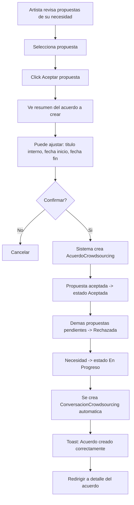
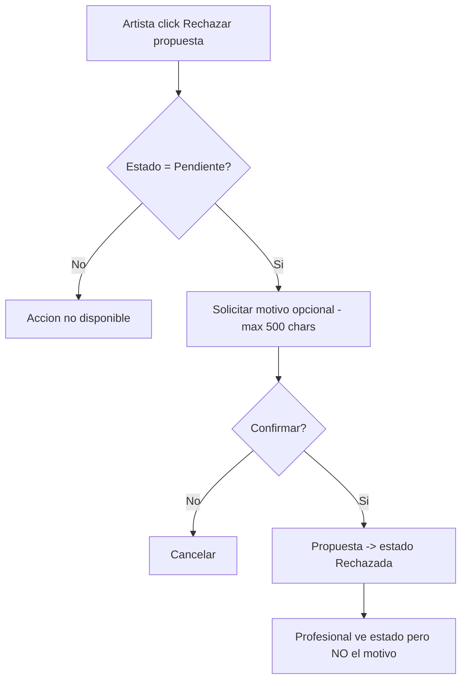
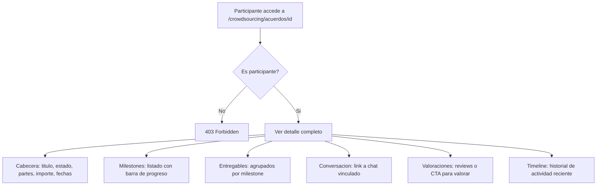
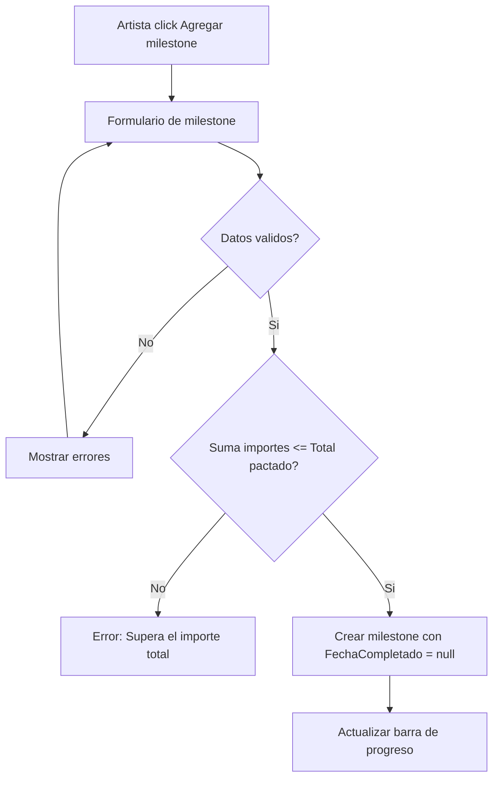
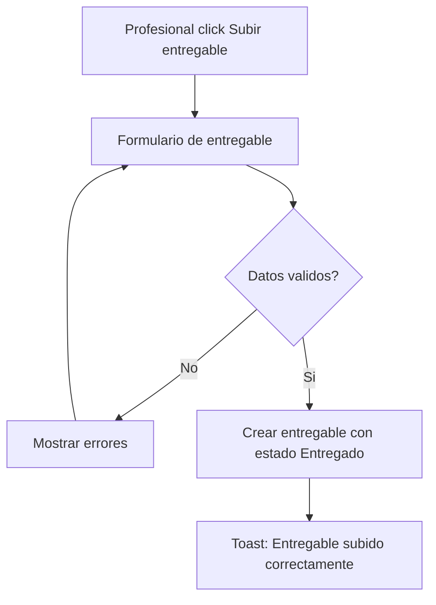
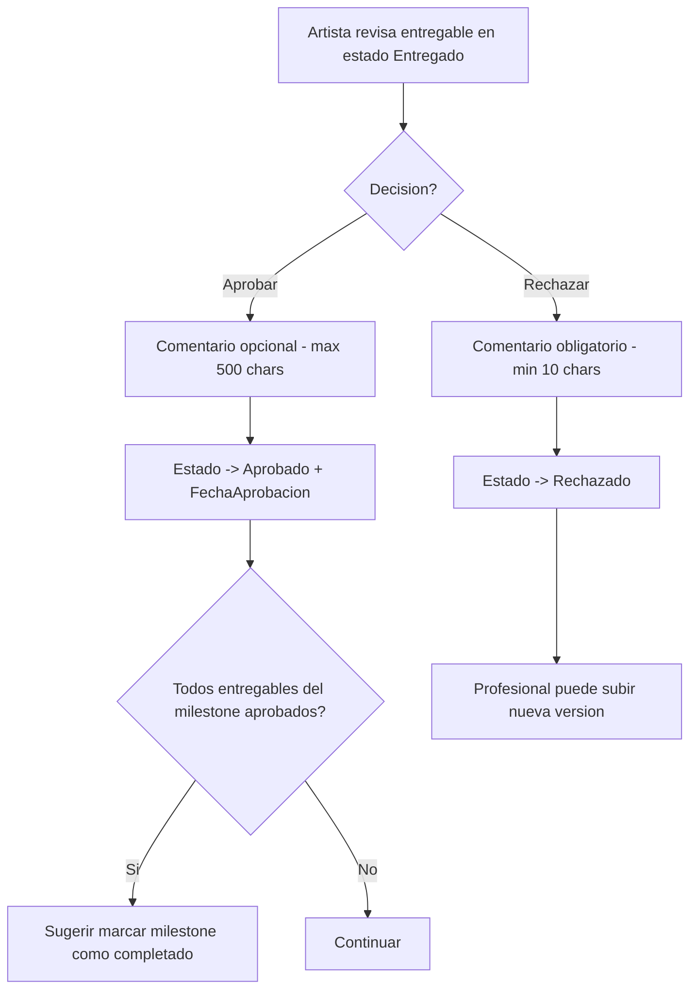
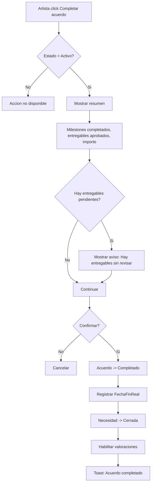
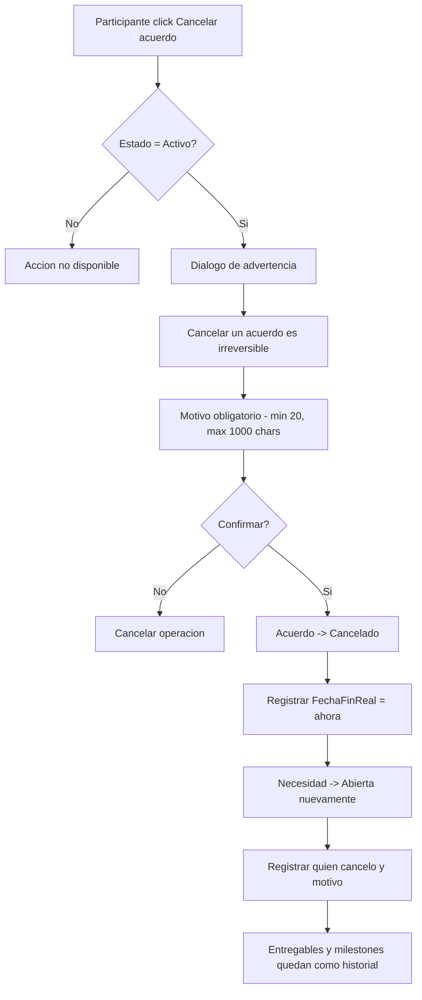

# US-CS-04: Acuerdos, Milestones y Entregables

> **ID:** US-CS-04
> **Feature Name:** `cs-acuerdos-entregables`
> **Prioridad:** Alta
> **Estimacion:** XL (Extra Large)
> **Modulo:** Crowdsourcing
> **Dependencias:** US-CS-03

---

## Historia de Usuario

**Como** artista o profesional participante de una contratacion,
**Quiero** gestionar el ciclo de vida completo del acuerdo de trabajo: aceptar/rechazar propuestas, definir milestones, subir y revisar entregables, y completar o cancelar el acuerdo,
**Para** llevar un control estructurado del trabajo contratado desde la formalizacion hasta la entrega final.

---

## Actores

| Actor | Descripcion |
|-------|-------------|
| Artista | Acepta/rechaza propuestas, define milestones, aprueba entregables, completa/cancela acuerdos |
| Profesional | Sube entregables, puede cancelar acuerdos |

---

## Precondiciones

- Existe al menos una propuesta en estado `Pendiente` para una necesidad del artista

## Postcondiciones

- Acuerdo creado, gestionado y completado/cancelado
- Entregables aprobados por el artista
- Necesidad actualizada segun estado del acuerdo

---

## Flujo Principal: Aceptar Propuesta y Crear Acuerdo



### Datos del Acuerdo Generado Automaticamente

| Campo del Acuerdo | Origen |
|-------------------|--------|
| NecesidadId | De la necesidad |
| PropuestaId | De la propuesta aceptada |
| ArtistaId | Del artista autenticado |
| UserIdProveedor | Del profesional que envio la propuesta |
| PerfilProfesionalId | Del perfil del profesional |
| ImporteTotalPactado | PrecioPropuesto de la propuesta |
| MonedaId | De la propuesta |
| EstadoAcuerdoId | "Activo" |
| TituloInterno | Editable (default: titulo de la necesidad) |
| FechaInicio | Editable (default: hoy) |
| FechaFinPrevista | Editable (default: hoy + DiasEstimados de la propuesta) |

### Efectos Colaterales (Transaccional)

1. Propuesta aceptada pasa a estado `Aceptada`
2. Demas propuestas pendientes pasan a `Rechazada` con motivo "Otra propuesta fue aceptada"
3. Necesidad pasa a estado `En Progreso`
4. Se crea automaticamente una `ConversacionCrowdsourcing` vinculada al acuerdo

---

## Flujo Secundario: Rechazar Propuesta



**Reglas:** Solo se puede rechazar una propuesta en estado `Pendiente`. Se solicita motivo opcional (max 500 chars). El profesional puede ver el estado pero **no** el motivo de rechazo.

---

## Flujo Secundario: Ver Detalle de Acuerdo



### Secciones de la Vista

| Seccion | Contenido |
|---------|-----------|
| Cabecera | Titulo, estado (badge), nombres de las partes, importe total, fechas, anticipo |
| Milestones | Listado ordenado con titulo, importe, fecha limite, estado. Barra de progreso visual |
| Entregables | Listado con titulo, estado, fecha, enlace al recurso. Agrupados por milestone |
| Conversacion | Link/boton para ir a la conversacion vinculada |
| Valoraciones | Reviews dejadas (si acuerdo completado) o CTA para valorar |

### Acciones por Rol y Estado

| Accion | Artista | Profesional | Estado requerido |
|--------|---------|-------------|------------------|
| Definir milestones | Si | No | Activo |
| Editar milestones | Si | No | Activo (milestone no completado) |
| Subir entregable | No | Si | Activo |
| Aprobar entregable | Si | No | Activo |
| Rechazar entregable | Si | No | Activo |
| Completar acuerdo | Si | No | Activo |
| Cancelar acuerdo | Si | Si | Activo |
| Dejar valoracion | Si | Si | Completado |

Se muestra un timeline/historial de actividad reciente del acuerdo.

---

## Flujo Secundario: Definir Milestones



### Campos por Milestone

| Campo | Tipo | Obligatorio | Validacion |
|-------|------|-------------|------------|
| Titulo | Texto (max 200) | Si | Min 3 caracteres |
| Descripcion | Texto largo | No | Max 1000 caracteres |
| Orden | Entero | Automatico | Secuencial, editable con drag & drop |
| Importe parcial | Decimal | Si | > 0 |
| Porcentaje parcial | Decimal | Calculado | Automatico sobre el total |
| Fecha limite | Date | No | >= fecha inicio del acuerdo |

**Reglas de milestones:**
- La suma de importes parciales debe ser <= ImporteTotalPactado
- Se muestra en tiempo real: "Asignado: X de Y EUR (Z% del total)"
- Solo el artista puede crear/editar milestones mientras el acuerdo esta `Activo`
- Cada milestone se crea con FechaCompletado = null (pendiente)
- Se pueden editar milestones existentes siempre que no esten marcados como completados
- No se puede eliminar un milestone con entregables asociados

---

## Flujo Secundario: Subir Entregable



### Campos del Formulario

| Campo | Tipo | Obligatorio | Validacion |
|-------|------|-------------|------------|
| Titulo | Texto (max 200) | Si | Min 3 caracteres |
| Descripcion | Texto largo | No | Max 1000 caracteres |
| URL del recurso | URL | No | URL valida (Dropbox, Drive, WeTransfer, etc.) |
| Milestone asociado | Select | No | Debe ser milestone del mismo acuerdo |

**Reglas:**
- Solo el profesional participante del acuerdo puede subir entregables
- Se crea con estado `Entregado`
- MVP: Solo URLs externas, no upload de archivos

---

## Flujo Secundario: Aprobar o Rechazar Entregable



**Reglas:**
- Solo el artista puede revisar entregables en estado `Entregado`
- **Aprobar**: Pasa a `Aprobado`. Se registra FechaAprobacion y ComentarioAprobacion (opcional, max 500 chars)
- **Rechazar**: Pasa a `Rechazado`. Comentario obligatorio (min 10 chars) para explicar que debe corregirse. El profesional puede subir nueva version
- Cuando todos los entregables de un milestone estan aprobados, se sugiere marcar el milestone como completado

---

## Flujo Secundario: Completar Acuerdo



**Reglas:**
- Solo el artista puede completar un acuerdo en estado `Activo`
- Se muestra resumen (milestones completados, entregables aprobados, importe)
- Si hay entregables pendientes de revision, se muestra aviso
- El acuerdo pasa a `Completado`, se registra FechaFinReal, y la necesidad pasa a `Cerrada`
- Se habilitan las valoraciones

---

## Flujo Secundario: Cancelar Acuerdo



**Reglas:**
- Tanto el artista como el profesional pueden cancelar un acuerdo `Activo`
- Se muestra dialogo de confirmacion con advertencia: "Cancelar un acuerdo es una accion irreversible. Ambas partes seran notificadas."
- Se requiere motivo obligatorio (min 20, max 1000 chars)
- El acuerdo pasa a `Cancelado`, se registra FechaFinReal = ahora
- La necesidad vuelve a `Abierta` (el artista puede buscar otro profesional)
- Entregables y milestones se conservan como historial pero no pueden modificarse
- Se registra quien cancelo y el motivo

---

## Diagrama de Estados del Acuerdo

```
                +-------------+
                |   ACTIVO    |
                +------+------+
                       |
           +-----------+-----------+
           |                       |
     [completar]              [cancelar]
           |                       |
           v                       v
    +-------------+         +-------------+
    | COMPLETADO  |         |  CANCELADO  |
    +-------------+         +-------------+
           |
    [habilitar valoraciones]
```

## Diagrama de Estados del Entregable

```
    +-------------+
    |  ENTREGADO  | <-- profesional sube
    +------+------+
           |
    +------+------+
    |             |
 [aprobar]   [rechazar]
    |             |
    v             v
+----------+ +----------+
| APROBADO | |RECHAZADO | --> profesional sube nueva version --> ENTREGADO
+----------+ +----------+
```

---

## Flujos Alternativos

| ID | Condicion | Accion |
|----|-----------|--------|
| FA-01 | Artista intenta aceptar propuesta y ya hay acuerdo activo para esa necesidad | Error: Ya existe un acuerdo para esta necesidad |
| FA-02 | Profesional intenta subir entregable en acuerdo cancelado | Error: El acuerdo no esta activo |
| FA-03 | Artista intenta eliminar milestone con entregables | Error: No se puede eliminar milestone con entregables |
| FA-04 | Suma de milestones supera importe total | Error en tiempo real: Asignado supera el total |
| FA-05 | Artista completa acuerdo sin milestones definidos | Permitir (milestones son opcionales) |
| FA-06 | Entregable rechazado: profesional sube nueva version | Nuevo entregable vinculado al mismo milestone |

---

## Criterios de Aceptacion

| ID | Criterio | Metodo de Prueba |
|----|----------|------------------|
| AC-CS04-1 | Al aceptar una propuesta, se crea un `AcuerdoCrowdsourcing` con todos los datos derivados y la propuesta pasa a `Aceptada` | Aceptar propuesta, verificar acuerdo en BD |
| AC-CS04-2 | Las demas propuestas pendientes de la misma necesidad pasan automaticamente a `Rechazada` | Verificar estado de otras propuestas |
| AC-CS04-3 | La necesidad pasa a estado `En Progreso` y se crea una conversacion automatica. Se muestra toast: "Acuerdo creado correctamente. Ya puedes comunicarte con el profesional." El artista es redirigido al detalle del acuerdo | Verificar estado necesidad, conversacion y redirect |
| AC-CS04-4 | Solo los dos participantes del acuerdo pueden ver su detalle | Intentar acceder con otro user, verificar 403 |
| AC-CS04-5 | La vista de detalle muestra cabecera, milestones (con barra de progreso), entregables (agrupados por milestone), acceso a conversacion y timeline/historial de actividad reciente | Verificar todas las secciones |
| AC-CS04-6 | Solo el artista puede definir milestones. La suma de importes parciales <= ImporteTotalPactado, con indicador visual en tiempo real. Cada milestone se crea con FechaCompletado = null | Crear milestones, verificar validacion y BD |
| AC-CS04-7 | Solo el profesional puede subir entregables (con URL externa). Se crean con estado `Entregado`. Se muestra toast: "Entregable subido correctamente. El artista sera notificado." | Subir entregable como profesional, verificar |
| AC-CS04-8 | Solo el artista puede aprobar (comentario opcional) o rechazar (comentario obligatorio min 10 chars) entregables | Probar ambas acciones, verificar validaciones |
| AC-CS04-9 | Un entregable rechazado permite al profesional subir nueva version | Rechazar, subir nueva version, verificar |
| AC-CS04-10 | Al completar un acuerdo, se registra FechaFinReal, la necesidad pasa a `Cerrada` y se habilitan valoraciones. Se muestra toast: "Acuerdo completado. Puedes dejar una valoracion al profesional." | Completar acuerdo, verificar todo el flujo |
| AC-CS04-11 | Al cancelar, se muestra dialogo de advertencia ("Cancelar un acuerdo es una accion irreversible"), se requiere motivo obligatorio, el acuerdo pasa a `Cancelado` y la necesidad vuelve a `Abierta` | Cancelar acuerdo, verificar estados |
| AC-CS04-12 | Se rechaza propuesta individualmente con motivo opcional. El profesional no ve el motivo de rechazo | Rechazar propuesta, verificar que motivo no es visible |

---

## Especificacion Tecnica

### API Endpoints

#### POST /api/crowdsourcing/propuestas/{id}/aceptar

Aceptar propuesta y crear acuerdo. **Transaccional:** actualiza propuesta, rechaza otras, actualiza necesidad, crea acuerdo y crea conversacion.

**Auth:** Artista (propietario de la necesidad)

**Request:**
```json
{
  "tituloInterno": "Mezcla EP Los Rockeros",
  "fechaInicio": "2026-03-01",
  "fechaFinPrevista": "2026-03-15"
}
```

**Response 201 Created:**
```json
{
  "data": {
    "acuerdoId": "guid",
    "tituloInterno": "Mezcla EP Los Rockeros",
    "estadoAcuerdoNombre": "Activo",
    "importeTotalPactado": 450.00,
    "monedaNombre": "EUR",
    "conversacionId": "guid",
    "propuestasRechazadas": 2
  },
  "messages": [
    { "message": "Acuerdo creado correctamente. Ya puedes comunicarte con el profesional.", "errorCode": "0001" }
  ]
}
```

**Errores:**
- `400 Bad Request` - Propuesta no esta Pendiente o ya hay acuerdo para esa necesidad
- `403 Forbidden` - No es el propietario de la necesidad
- `404 Not Found` - Propuesta no existe

---

#### PATCH /api/crowdsourcing/propuestas/{id}/rechazar

Rechazar propuesta individualmente.

**Auth:** Artista (propietario de la necesidad)

**Request:**
```json
{
  "motivo": "El presupuesto no se ajusta a nuestras posibilidades"
}
```

**Response 200 OK:**
```json
{
  "data": {
    "id": "guid",
    "estadoPropuestaNombre": "Rechazada"
  },
  "messages": [
    { "message": "Propuesta rechazada", "errorCode": "0002" }
  ]
}
```

---

#### GET /api/crowdsourcing/acuerdos/{id}

Detalle del acuerdo con milestones y entregables.

**Auth:** Participante del acuerdo

**Response 200 OK:**
```json
{
  "data": {
    "id": "guid",
    "tituloInterno": "Mezcla EP Los Rockeros",
    "estadoAcuerdoId": 1,
    "estadoAcuerdoNombre": "Activo",
    "importeTotalPactado": 450.00,
    "monedaNombre": "EUR",
    "fechaInicio": "2026-03-01",
    "fechaFinPrevista": "2026-03-15",
    "fechaFinReal": null,
    "artista": {
      "id": "guid",
      "nombreArtistico": "Los Rockeros"
    },
    "profesional": {
      "userId": "guid",
      "perfilProfesionalId": "guid",
      "nombre": "Studio Mix Pro"
    },
    "necesidad": {
      "id": "guid",
      "titulo": "Mezcla de pistas para EP"
    },
    "conversacionId": "guid",
    "milestones": [
      {
        "id": "guid",
        "titulo": "Mezcla de pistas 1-3",
        "descripcion": "Mezcla de las primeras 3 canciones",
        "orden": 1,
        "importeParcial": 270.00,
        "porcentajeParcial": 60,
        "fechaLimite": "2026-03-08",
        "fechaCompletado": null,
        "entregables": [
          {
            "id": "guid",
            "titulo": "Mezcla cancion 1 - v1",
            "descripcion": "Primera version de la mezcla",
            "urlRecurso": "https://drive.google.com/...",
            "estadoEntregableNombre": "Entregado",
            "fechaCreacion": "2026-03-05T14:00:00Z"
          }
        ]
      }
    ],
    "importeAsignado": 270.00,
    "porcentajeAsignado": 60,
    "miRol": "Artista",
    "timeline": [
      {
        "accion": "Acuerdo creado",
        "fecha": "2026-03-01T10:00:00Z",
        "actor": "Los Rockeros"
      },
      {
        "accion": "Milestone agregado: Mezcla de pistas 1-3",
        "fecha": "2026-03-02T09:00:00Z",
        "actor": "Los Rockeros"
      }
    ]
  },
  "messages": []
}
```

---

#### POST /api/crowdsourcing/acuerdos/{acuerdoId}/milestones

Crear milestone.

**Auth:** Artista (participante)

**Request:**
```json
{
  "titulo": "Mezcla de pistas 1-3",
  "descripcion": "Mezcla de las primeras 3 canciones del EP",
  "importeParcial": 270.00,
  "fechaLimite": "2026-03-08"
}
```

**Response 201 Created:**
```json
{
  "data": {
    "id": "guid",
    "titulo": "Mezcla de pistas 1-3",
    "orden": 1,
    "importeParcial": 270.00,
    "porcentajeParcial": 60,
    "importeAsignadoTotal": 270.00
  },
  "messages": [
    { "message": "Milestone creado", "errorCode": "0001" }
  ]
}
```

---

#### PUT /api/crowdsourcing/acuerdos/{acuerdoId}/milestones/{id}

Editar milestone (solo si no completado).

**Auth:** Artista (participante)

**Request:** (mismos campos que POST)

---

#### DELETE /api/crowdsourcing/acuerdos/{acuerdoId}/milestones/{id}

Eliminar milestone (solo si no tiene entregables).

**Auth:** Artista (participante)

**Response 204 No Content**

**Errores:**
- `400 Bad Request` - Milestone tiene entregables asociados o esta completado

---

#### POST /api/crowdsourcing/acuerdos/{acuerdoId}/entregables

Subir entregable.

**Auth:** Profesional (participante)

**Request:**
```json
{
  "titulo": "Mezcla cancion 1 - v1",
  "descripcion": "Primera version de la mezcla de la cancion 1",
  "urlRecurso": "https://drive.google.com/file/xyz",
  "milestoneId": "guid"
}
```

**Response 201 Created:**
```json
{
  "data": {
    "id": "guid",
    "titulo": "Mezcla cancion 1 - v1",
    "estadoEntregableNombre": "Entregado",
    "fechaCreacion": "2026-03-05T14:00:00Z"
  },
  "messages": [
    { "message": "Entregable subido correctamente. El artista sera notificado.", "errorCode": "0001" }
  ]
}
```

---

#### PATCH /api/crowdsourcing/entregables/{id}/aprobar

Aprobar entregable.

**Auth:** Artista (participante)

**Request:**
```json
{
  "comentario": "Excelente mezcla, me encanta el resultado"
}
```

**Response 200 OK:**
```json
{
  "data": {
    "id": "guid",
    "estadoEntregableNombre": "Aprobado",
    "fechaAprobacion": "2026-03-06T10:00:00Z",
    "todosAprobadosEnMilestone": true
  },
  "messages": [
    { "message": "Entregable aprobado", "errorCode": "0002" }
  ]
}
```

---

#### PATCH /api/crowdsourcing/entregables/{id}/rechazar

Rechazar entregable.

**Auth:** Artista (participante)

**Request:**
```json
{
  "comentario": "La voz esta demasiado baja en el coro, necesita mas presencia. Tambien ajustar el bajo en el puente."
}
```

**Response 200 OK:**
```json
{
  "data": {
    "id": "guid",
    "estadoEntregableNombre": "Rechazado"
  },
  "messages": [
    { "message": "Entregable rechazado. El profesional sera notificado.", "errorCode": "0002" }
  ]
}
```

---

#### PATCH /api/crowdsourcing/acuerdos/{id}/completar

Completar acuerdo.

**Auth:** Artista (participante)

**Response 200 OK:**
```json
{
  "data": {
    "id": "guid",
    "estadoAcuerdoNombre": "Completado",
    "fechaFinReal": "2026-03-14T16:00:00Z"
  },
  "messages": [
    { "message": "Acuerdo completado. Puedes dejar una valoracion al profesional.", "errorCode": "0002" }
  ]
}
```

---

#### PATCH /api/crowdsourcing/acuerdos/{id}/cancelar

Cancelar acuerdo.

**Auth:** Participante del acuerdo

**Request:**
```json
{
  "motivo": "No puedo continuar por motivos personales. Lamento las molestias causadas."
}
```

**Response 200 OK:**
```json
{
  "data": {
    "id": "guid",
    "estadoAcuerdoNombre": "Cancelado",
    "fechaFinReal": "2026-03-10T12:00:00Z",
    "necesidadEstadoNombre": "Abierta"
  },
  "messages": [
    { "message": "Acuerdo cancelado", "errorCode": "0002" }
  ]
}
```

---

### Modelo de Datos

```csharp
public class AcuerdoCrowdsourcing
{
    public Guid Id { get; set; }
    public Guid NecesidadId { get; set; }                  // FK -> NecesidadCrowdsourcing
    public Guid PropuestaId { get; set; }                  // FK -> PropuestaCrowdsourcing
    public Guid ArtistaId { get; set; }                    // FK -> Artista
    public string UserIdProveedor { get; set; } = null!;   // FK -> Identity.User
    public Guid PerfilProfesionalId { get; set; }          // FK -> PerfilProfesional
    public decimal ImporteTotalPactado { get; set; }
    public int MonedaId { get; set; }                      // FK -> MaestraMoneda
    public int EstadoAcuerdoId { get; set; }               // FK -> MaestraEstadoAcuerdo
    public string TituloInterno { get; set; } = null!;
    public DateTime FechaInicio { get; set; }
    public DateTime? FechaFinPrevista { get; set; }
    public DateTime? FechaFinReal { get; set; }
    public string? MotivoCancelacion { get; set; }
    public string? CanceladoPor { get; set; }              // UserId de quien cancelo
    public DateTime FechaCreacion { get; set; }
    public DateTime? FechaActualizacion { get; set; }

    // Navigation
    public NecesidadCrowdsourcing Necesidad { get; set; } = null!;
    public PropuestaCrowdsourcing Propuesta { get; set; } = null!;
    public ICollection<AcuerdoCrowdsourcingMilestone> Milestones { get; set; } = new List<AcuerdoCrowdsourcingMilestone>();
    public ICollection<AcuerdoCrowdsourcingEntregable> Entregables { get; set; } = new List<AcuerdoCrowdsourcingEntregable>();
    public ConversacionCrowdsourcing? Conversacion { get; set; }
    public ICollection<ValoracionCrowdsourcing> Valoraciones { get; set; } = new List<ValoracionCrowdsourcing>();
}

public class AcuerdoCrowdsourcingMilestone
{
    public Guid Id { get; set; }
    public Guid AcuerdoId { get; set; }                    // FK -> AcuerdoCrowdsourcing
    public string Titulo { get; set; } = null!;
    public string? Descripcion { get; set; }
    public int Orden { get; set; }
    public decimal ImporteParcial { get; set; }
    public DateTime? FechaLimite { get; set; }
    public DateTime? FechaCompletado { get; set; }
    public DateTime FechaCreacion { get; set; }

    // Navigation
    public AcuerdoCrowdsourcing Acuerdo { get; set; } = null!;
    public ICollection<AcuerdoCrowdsourcingEntregable> Entregables { get; set; } = new List<AcuerdoCrowdsourcingEntregable>();
}

public class AcuerdoCrowdsourcingEntregable
{
    public Guid Id { get; set; }
    public Guid AcuerdoId { get; set; }                    // FK -> AcuerdoCrowdsourcing
    public Guid? MilestoneId { get; set; }                 // FK -> AcuerdoCrowdsourcingMilestone (opcional)
    public string Titulo { get; set; } = null!;
    public string? Descripcion { get; set; }
    public string? UrlRecurso { get; set; }
    public int EstadoEntregableId { get; set; }            // FK -> MaestraEstadoEntregable
    public string? ComentarioAprobacion { get; set; }
    public string? ComentarioRechazo { get; set; }
    public DateTime? FechaAprobacion { get; set; }
    public DateTime FechaCreacion { get; set; }
    public DateTime? FechaActualizacion { get; set; }

    // Navigation
    public AcuerdoCrowdsourcing Acuerdo { get; set; } = null!;
    public AcuerdoCrowdsourcingMilestone? Milestone { get; set; }
}
```

### Validaciones

```csharp
// CreateMilestoneValidator
RuleFor(x => x.Titulo)
    .NotEmpty()
    .WithMessage("El titulo es obligatorio")
    .WithErrorCode(ServiceResponseMessageType.Validation_Required)
    .MinimumLength(3)
    .WithMessage("Minimo 3 caracteres")
    .WithErrorCode(ServiceResponseMessageType.Validation_MinLength)
    .MaximumLength(200)
    .WithMessage("Maximo 200 caracteres")
    .WithErrorCode(ServiceResponseMessageType.Validation_MaxLength);

RuleFor(x => x.ImporteParcial)
    .GreaterThan(0)
    .WithMessage("El importe parcial debe ser mayor a 0")
    .WithErrorCode(ServiceResponseMessageType.Validation_Required);

// CreateEntregableValidator
RuleFor(x => x.Titulo)
    .NotEmpty()
    .WithMessage("El titulo es obligatorio")
    .WithErrorCode(ServiceResponseMessageType.Validation_Required)
    .MinimumLength(3)
    .WithMessage("Minimo 3 caracteres")
    .WithErrorCode(ServiceResponseMessageType.Validation_MinLength);

RuleFor(x => x.UrlRecurso)
    .Must(BeAValidUrl)
    .When(x => !string.IsNullOrEmpty(x.UrlRecurso))
    .WithMessage("Debe ser una URL valida")
    .WithErrorCode(ServiceResponseMessageType.Validation_InvalidUrl);

// RechazarEntregableValidator
RuleFor(x => x.Comentario)
    .NotEmpty()
    .WithMessage("El comentario es obligatorio al rechazar")
    .WithErrorCode(ServiceResponseMessageType.Validation_Required)
    .MinimumLength(10)
    .WithMessage("Minimo 10 caracteres explicando que debe corregirse")
    .WithErrorCode(ServiceResponseMessageType.Validation_MinLength);

// CancelarAcuerdoValidator
RuleFor(x => x.Motivo)
    .NotEmpty()
    .WithMessage("El motivo es obligatorio")
    .WithErrorCode(ServiceResponseMessageType.Validation_Required)
    .MinimumLength(20)
    .WithMessage("Minimo 20 caracteres")
    .WithErrorCode(ServiceResponseMessageType.Validation_MinLength)
    .MaximumLength(1000)
    .WithMessage("Maximo 1000 caracteres")
    .WithErrorCode(ServiceResponseMessageType.Validation_MaxLength);
```

---

## Mockups / UI

### Detalle de Acuerdo
```
+------------------------------------------+
|  Mezcla EP Los Rockeros          ACTIVO  |
|  Los Rockeros <-> Studio Mix Pro         |
|  450 EUR | 1 mar - 15 mar 2026           |
+------------------------------------------+
|                                          |
|  MILESTONES         [+ Agregar]          |
|  Asignado: 270 de 450 EUR (60%)         |
|  [===========>            ] 60%          |
|                                          |
|  1. Mezcla pistas 1-3      270 EUR      |
|     Limite: 8 mar | Pendiente            |
|     Entregables:                         |
|     - Mezcla cancion 1 v1  ENTREGADO    |
|       [Aprobar] [Rechazar]               |
|                                          |
|  2. Mezcla pistas 4-5      (sin asignar)|
|     [Definir milestone]                  |
|                                          |
|  CONVERSACION                            |
|  [Ir al chat con Studio Mix Pro ->]      |
|                                          |
|  TIMELINE                                |
|  - Entregable subido (hace 1 dia)        |
|  - Milestone creado (hace 3 dias)        |
|  - Acuerdo creado (hace 5 dias)          |
|                                          |
|  [Completar acuerdo]  [Cancelar acuerdo] |
+------------------------------------------+
```

### Formulario de Milestone
```
+------------------------------------------+
|  Nuevo milestone                         |
+------------------------------------------+
|  Titulo *                                |
|  [Mezcla de pistas 1-3                 ]|
|                                          |
|  Descripcion                             |
|  [Mezcla de las primeras 3 canciones   ]|
|                                          |
|  Importe parcial *    Fecha limite       |
|  [270] EUR            [2026-03-08]       |
|                                          |
|  Asignado: 270 de 450 EUR (60%)         |
|                                          |
|  [Cancelar]             [Crear milestone]|
+------------------------------------------+
```

---

## Notas de Implementacion

- `POST /propuestas/{id}/aceptar` es la operacion mas compleja: debe ser transaccional (6 operaciones)
- Validar que no exista ya un acuerdo activo para esa necesidad antes de crear
- La barra de progreso de milestones se calcula: SUM(ImporteParcial) / ImporteTotalPactado
- Los entregables se agrupan por milestone en el frontend (algunos pueden no tener milestone)
- El timeline se construye a partir de los cambios de estado y las fechas de creacion
- MVP: Sin notificaciones push. Los participantes ven los cambios al acceder al detalle
- Handler CQRS: Command + Handler en mismo archivo, inyectar Service (no DbContext)
- Considerar optimistic concurrency en operaciones de milestone (evitar sumas que excedan total)
