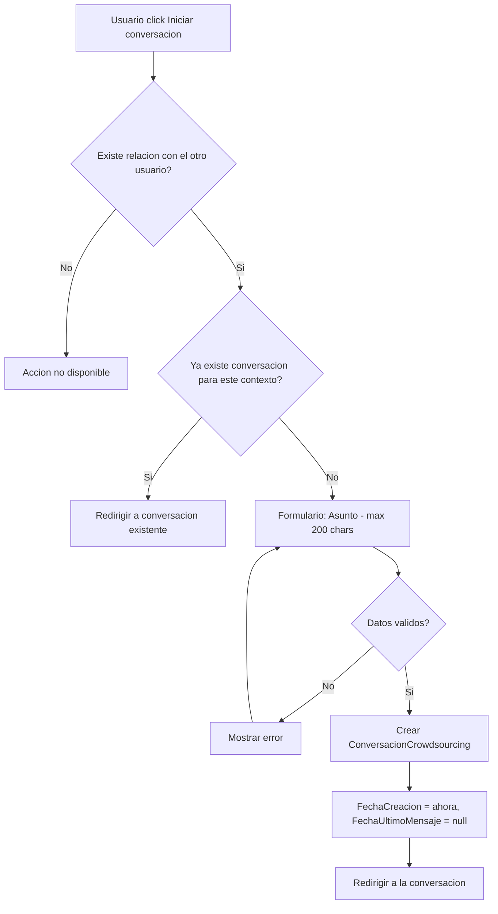
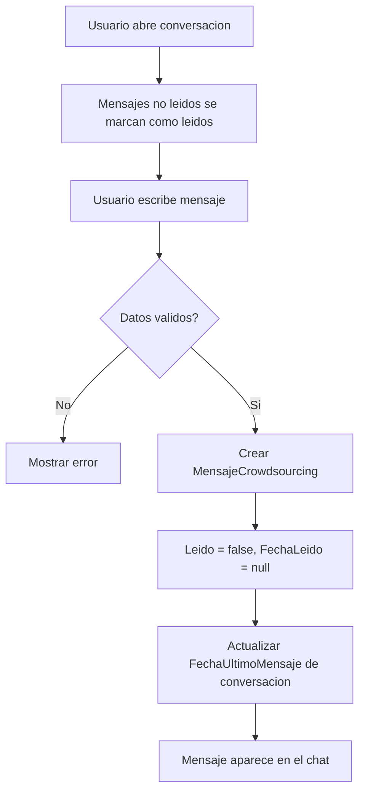
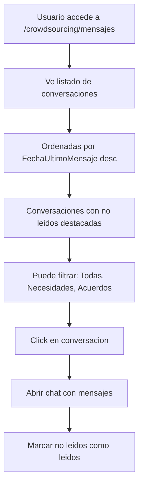

# US-CS-05: Mensajeria entre Partes

> **ID:** US-CS-05
> **Feature Name:** `cs-mensajeria`
> **Prioridad:** Media
> **Estimacion:** M (Medium)
> **Modulo:** Crowdsourcing
> **Dependencias:** US-CS-02 (conversaciones sobre necesidades), US-CS-04 (conversaciones sobre acuerdos)

---

## Historia de Usuario

**Como** artista o profesional participante de una necesidad o acuerdo,
**Quiero** comunicarme directamente con la otra parte mediante conversaciones con mensajes de texto y adjuntos,
**Para** aclarar dudas, negociar condiciones, coordinar el trabajo y no perder mensajes importantes.

---

## Actores

| Actor | Descripcion |
|-------|-------------|
| Artista | Inicia conversaciones sobre sus necesidades o acuerdos |
| Profesional | Inicia conversaciones sobre necesidades a las que envio propuesta o acuerdos |

---

## Precondiciones

- Ambos usuarios estan autenticados
- Existe relacion entre ambos (propuesta enviada o acuerdo activo)

## Postcondiciones

- Conversacion creada con mensajes intercambiados
- Mensajes marcados como leidos al ser vistos

---

## Flujo Principal: Iniciar Conversacion



**Reglas de inicio:**
- Un artista puede iniciar conversacion con un profesional que envio propuesta
- Un profesional puede iniciar conversacion con el artista de una necesidad a la que envio propuesta
- Se requiere un asunto para la conversacion (texto, max 200 chars)
- En el contexto de un acuerdo, la conversacion se crea automaticamente al aceptar la propuesta (US-CS-04)
- No se permiten conversaciones duplicadas entre las mismas partes para el mismo contexto; si ya existe, se redirige a la existente
- Se crea con FechaCreacion = ahora y FechaUltimoMensaje = null

---

## Flujo Secundario: Enviar Mensaje



### Campos del Mensaje

| Campo | Tipo | Obligatorio | Validacion |
|-------|------|-------------|------------|
| Contenido | Texto | Si | Min 1 caracter, max 5000 caracteres |
| URL adjunto | URL | No | URL valida |

**Reglas:**
- El mensaje se crea con Leido = false, FechaLeido = null
- Se actualiza FechaUltimoMensaje de la conversacion
- Los mensajes se muestran en orden cronologico (estilo chat)
- Mensajes propios a la derecha, del otro a la izquierda
- Al abrir una conversacion, los mensajes no leidos del otro usuario se marcan como leidos automaticamente
- MVP: Sin WebSocket/real-time. Polling cada 10 segundos o refresh manual

---

## Flujo Secundario: Ver Conversaciones y No Leidos



### Datos a Mostrar por Conversacion

| Dato | Fuente |
|------|--------|
| Nombre de la otra parte | User (artista o profesional segun perspectiva) |
| Asunto de la conversacion | ConversacionCrowdsourcing.Asunto |
| Contexto (necesidad o acuerdo) | NecesidadCrowdsourcing.Titulo o AcuerdoCrowdsourcing.TituloInterno |
| Ultimo mensaje (preview truncado) | MensajeCrowdsourcing.Contenido (max 80 chars) |
| Fecha ultimo mensaje | ConversacionCrowdsourcing.FechaUltimoMensaje |
| Mensajes no leidos (badge numerico) | COUNT(Mensajes WHERE Leido = false AND remitente != yo) |

**Navbar:** En el menu/navbar principal se muestra un icono de mensajeria con badge total de no leidos.

---

## Flujos Alternativos

| ID | Condicion | Accion |
|----|-----------|--------|
| FA-01 | Conversacion ya existe para el mismo contexto | Redirigir a la existente |
| FA-02 | No hay relacion entre los usuarios | Accion no disponible |
| FA-03 | No hay conversaciones | Empty state: "No tienes conversaciones activas" |
| FA-04 | URL adjunta invalida | Error de validacion |

---

## Criterios de Aceptacion

| ID | Criterio | Metodo de Prueba |
|----|----------|------------------|
| AC-CS05-1 | Un artista puede iniciar conversacion con un profesional que envio propuesta a su necesidad. Se requiere un asunto (max 200 chars) | Iniciar conversacion, verificar creacion |
| AC-CS05-2 | No se permiten conversaciones duplicadas entre las mismas partes para el mismo contexto | Intentar crear duplicada, verificar redireccion |
| AC-CS05-3 | Si ya existe conversacion, se redirige a la existente en vez de crear una nueva | Verificar redireccion |
| AC-CS05-4 | Solo los dos participantes de la conversacion pueden enviar mensajes | Intentar con tercer user, verificar 403 |
| AC-CS05-5 | Los mensajes se muestran en orden cronologico con estilo chat (propios a derecha, otros a izquierda) | Enviar mensajes, verificar layout |
| AC-CS05-6 | Al abrir una conversacion, los mensajes no leidos del otro se marcan como leidos automaticamente | Abrir conversacion con no leidos, verificar cambio |
| AC-CS05-7 | El listado de conversaciones muestra badge numerico de no leidos y se ordena por fecha del ultimo mensaje. Las conversaciones con mensajes no leidos aparecen primero o con indicador visual destacado | Verificar ordenamiento y badges |
| AC-CS05-8 | Se puede filtrar conversaciones por contexto: Todas, Sobre Necesidades, Sobre Acuerdos | Aplicar filtros, verificar resultados |
| AC-CS05-9 | En el navbar se muestra icono de mensajeria con badge total de mensajes no leidos | Verificar icono y badge |

---

## Especificacion Tecnica

### API Endpoints

#### POST /api/crowdsourcing/conversaciones

Iniciar conversacion.

**Auth:** Autenticado (con relacion)

**Request:**
```json
{
  "necesidadId": "guid",
  "acuerdoId": null,
  "userIdDestinatario": "guid",
  "asunto": "Consulta sobre la mezcla de pistas"
}
```

**Response 201 Created:**
```json
{
  "data": {
    "id": "guid",
    "asunto": "Consulta sobre la mezcla de pistas",
    "nombreDestinatario": "Studio Mix Pro",
    "contexto": "Mezcla de pistas para EP",
    "fechaCreacion": "2026-03-01T10:00:00Z"
  },
  "messages": [
    { "message": "Conversacion creada", "errorCode": "0001" }
  ]
}
```

**Errores:**
- `400 Bad Request` - Ya existe conversacion para este contexto o datos invalidos
- `403 Forbidden` - No tiene relacion con el destinatario

---

#### GET /api/crowdsourcing/conversaciones

Listar mis conversaciones (con count de no leidos).

**Auth:** Autenticado

**Query params:** `contexto` (todas | necesidades | acuerdos), `page`, `pageSize`

**Response 200 OK:**
```json
{
  "data": {
    "items": [
      {
        "id": "guid",
        "asunto": "Consulta sobre la mezcla de pistas",
        "nombreOtraParte": "Studio Mix Pro",
        "imagenOtraParte": "https://...",
        "contextoTipo": "necesidad",
        "contextoTitulo": "Mezcla de pistas para EP",
        "ultimoMensaje": "Perfecto, te envio los stems manana por la manana...",
        "fechaUltimoMensaje": "2026-03-02T15:30:00Z",
        "mensajesNoLeidos": 2
      }
    ],
    "totalCount": 5,
    "totalNoLeidos": 3,
    "page": 1,
    "pageSize": 20
  },
  "messages": []
}
```

---

#### GET /api/crowdsourcing/conversaciones/{id}/mensajes

Mensajes de una conversacion (paginados, cronologicos).

**Auth:** Participante

**Query params:** `page`, `pageSize`

**Response 200 OK:**
```json
{
  "data": {
    "items": [
      {
        "id": "guid",
        "contenido": "Hola, me interesa tu propuesta. Podrias contarme mas sobre tu experiencia?",
        "urlAdjunto": null,
        "remitenteNombre": "Los Rockeros",
        "esPropio": false,
        "leido": true,
        "fechaCreacion": "2026-03-01T10:05:00Z"
      },
      {
        "id": "guid",
        "contenido": "Claro! He trabajado con bandas como...",
        "urlAdjunto": "https://drive.google.com/portfolio",
        "remitenteNombre": "Studio Mix Pro",
        "esPropio": true,
        "leido": true,
        "fechaCreacion": "2026-03-01T10:15:00Z"
      }
    ],
    "totalCount": 15,
    "page": 1,
    "pageSize": 50
  },
  "messages": []
}
```

---

#### POST /api/crowdsourcing/conversaciones/{id}/mensajes

Enviar mensaje.

**Auth:** Participante

**Request:**
```json
{
  "contenido": "Perfecto, te envio los stems manana por la manana",
  "urlAdjunto": null
}
```

**Response 201 Created:**
```json
{
  "data": {
    "id": "guid",
    "contenido": "Perfecto, te envio los stems manana por la manana",
    "fechaCreacion": "2026-03-02T15:30:00Z"
  },
  "messages": [
    { "message": "Mensaje enviado", "errorCode": "0001" }
  ]
}
```

---

#### PATCH /api/crowdsourcing/conversaciones/{id}/marcar-leidos

Marcar mensajes como leidos.

**Auth:** Participante

**Response 200 OK:**
```json
{
  "data": {
    "mensajesMarcados": 3
  },
  "messages": []
}
```

---

### Modelo de Datos

```csharp
public class ConversacionCrowdsourcing
{
    public Guid Id { get; set; }
    public Guid? NecesidadId { get; set; }                 // FK -> NecesidadCrowdsourcing (opcional)
    public Guid? AcuerdoId { get; set; }                   // FK -> AcuerdoCrowdsourcing (opcional)
    public string UserIdCreador { get; set; } = null!;     // FK -> Identity.User
    public string UserIdDestinatario { get; set; } = null!;// FK -> Identity.User
    public string Asunto { get; set; } = null!;
    public DateTime FechaCreacion { get; set; }
    public DateTime? FechaUltimoMensaje { get; set; }

    // Navigation
    public NecesidadCrowdsourcing? Necesidad { get; set; }
    public AcuerdoCrowdsourcing? Acuerdo { get; set; }
    public ICollection<MensajeCrowdsourcing> Mensajes { get; set; } = new List<MensajeCrowdsourcing>();
}

public class MensajeCrowdsourcing
{
    public Guid Id { get; set; }
    public Guid ConversacionId { get; set; }               // FK -> ConversacionCrowdsourcing
    public string UserIdRemitente { get; set; } = null!;   // FK -> Identity.User
    public string Contenido { get; set; } = null!;
    public string? UrlAdjunto { get; set; }
    public bool Leido { get; set; } = false;
    public DateTime? FechaLeido { get; set; }
    public DateTime FechaCreacion { get; set; }

    // Navigation
    public ConversacionCrowdsourcing Conversacion { get; set; } = null!;
}
```

### Validaciones

```csharp
// CreateConversacionValidator
RuleFor(x => x.Asunto)
    .NotEmpty()
    .WithMessage("El asunto es obligatorio")
    .WithErrorCode(ServiceResponseMessageType.Validation_Required)
    .MaximumLength(200)
    .WithMessage("Maximo 200 caracteres")
    .WithErrorCode(ServiceResponseMessageType.Validation_MaxLength);

RuleFor(x => x.UserIdDestinatario)
    .NotEmpty()
    .WithMessage("El destinatario es obligatorio")
    .WithErrorCode(ServiceResponseMessageType.Validation_Required);

// CreateMensajeValidator
RuleFor(x => x.Contenido)
    .NotEmpty()
    .WithMessage("El mensaje no puede estar vacio")
    .WithErrorCode(ServiceResponseMessageType.Validation_Required)
    .MaximumLength(5000)
    .WithMessage("Maximo 5000 caracteres")
    .WithErrorCode(ServiceResponseMessageType.Validation_MaxLength);

RuleFor(x => x.UrlAdjunto)
    .Must(BeAValidUrl)
    .When(x => !string.IsNullOrEmpty(x.UrlAdjunto))
    .WithMessage("Debe ser una URL valida")
    .WithErrorCode(ServiceResponseMessageType.Validation_InvalidUrl);
```

---

## Mockups / UI

### Listado de Conversaciones
```
+------------------------------------------+
|  Mensajes  [3 no leidos]                |
|  Filtro: [Todas v] [Necesidades] [Acuerdos] |
+------------------------------------------+
|                                          |
|  +------------------------------------+ |
|  | Studio Mix Pro          [2]  15:30 | |
|  | Mezcla de pistas para EP           | |
|  | Perfecto, te envio los stems ma... | |
|  +------------------------------------+ |
|                                          |
|  +------------------------------------+ |
|  | Diseno Grafico Pro       [1] 10:00 | |
|  | Portada del album                  | |
|  | He preparado 3 bocetos para que... | |
|  +------------------------------------+ |
|                                          |
|  +------------------------------------+ |
|  | Fotografo Madrid                ayer| |
|  | Sesion de fotos                    | |
|  | Perfecto, confirmamos el sabado    | |
|  +------------------------------------+ |
+------------------------------------------+
```

### Vista de Chat
```
+------------------------------------------+
|  < Volver   Studio Mix Pro               |
|  Consulta sobre la mezcla de pistas      |
|  Contexto: Mezcla de pistas para EP      |
+------------------------------------------+
|                                          |
|  [Avatar] Los Rockeros          10:05    |
|  Hola, me interesa tu propuesta.         |
|  Podrias contarme mas sobre tu           |
|  experiencia?                            |
|                                          |
|           Studio Mix Pro [Avatar] 10:15  |
|           Claro! He trabajado con        |
|           bandas como... [Adjunto]       |
|                                          |
|  [Avatar] Los Rockeros          11:00    |
|  Genial, me convence. Cuando podrias     |
|  empezar?                                |
|                                          |
+------------------------------------------+
|  [Escribe un mensaje...        ] [Enviar]|
|  [Adjuntar URL]                          |
+------------------------------------------+
```

### Badge en Navbar
```
+------------------------------------------+
|  WePlay   [Home] [Mensajes (3)] [Perfil] |
+------------------------------------------+
```

---

## Notas de Implementacion

- MVP sin WebSocket: usar polling cada 10 segundos o refresh manual del chat
- Marcar como leidos se hace al abrir la conversacion (PATCH automatico)
- El badge total de no leidos se puede cachear y actualizar con cada peticion al listado
- La unicidad de conversacion por contexto se valida en backend (constraint: userIds + necesidadId/acuerdoId)
- Los mensajes se paginan de forma inversa (mas recientes primero, cargar mas antiguos con scroll up)
- Considerar un endpoint ligero GET /api/crowdsourcing/conversaciones/no-leidos para el badge del navbar
- Handler CQRS: Command + Handler en mismo archivo, inyectar Service (no DbContext)
