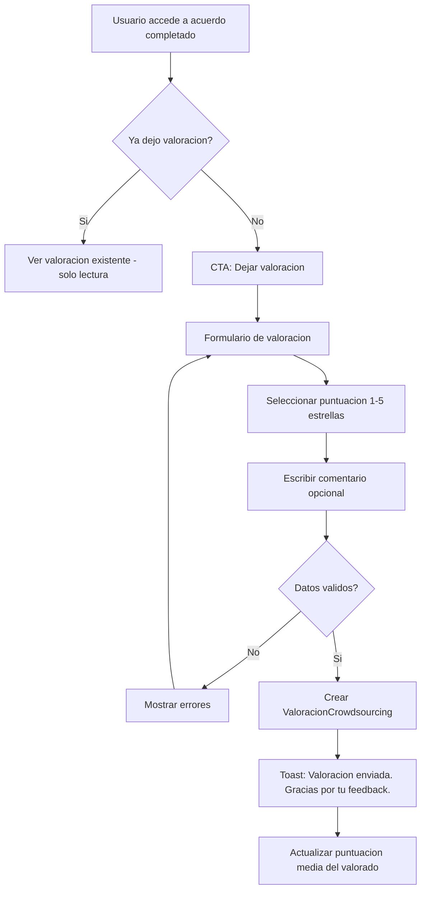
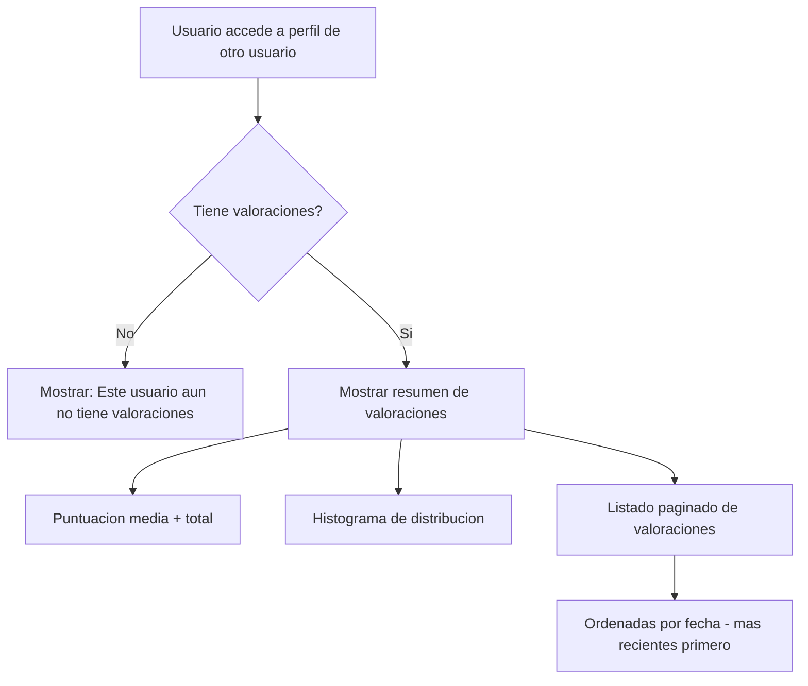

# US-CS-06: Valoraciones Bidireccionales

> **ID:** US-CS-06
> **Feature Name:** `cs-valoraciones`
> **Prioridad:** Baja
> **Estimacion:** S (Small)
> **Modulo:** Crowdsourcing
> **Dependencias:** US-CS-04 (requiere acuerdos completados)

---

## Historia de Usuario

**Como** artista o profesional que ha completado un acuerdo de trabajo,
**Quiero** dejar una valoracion (puntuacion 1-5 y comentario) a la otra parte y poder consultar las valoraciones de cualquier usuario,
**Para** compartir mi experiencia, contribuir a la reputacion en la plataforma y ayudar a otros a tomar decisiones informadas.

---

## Actores

| Actor | Descripcion |
|-------|-------------|
| Artista | Valora al profesional tras completar un acuerdo |
| Profesional | Valora al artista tras completar un acuerdo |
| Cualquier usuario | Consulta las valoraciones de otro usuario |

---

## Precondiciones

- Existe un acuerdo en estado `Completado` entre las partes
- El usuario no ha valorado previamente a la otra parte en ese acuerdo

## Postcondiciones

- Valoracion registrada y visible publicamente
- Puntuacion media del usuario valorado actualizada

---

## Flujo Principal: Dejar Valoracion



### Campos del Formulario

| Campo | Tipo | Obligatorio | Validacion |
|-------|------|-------------|------------|
| Puntuacion | Rating (1-5 estrellas) | Si | 1-5 |
| Tipo de valoracion | Automatico | - | Se asigna segun contexto |
| Comentario | Texto largo | No | Max 1000 caracteres |

**Reglas:**
- La valoracion del artista al profesional y la del profesional al artista son independientes y no se condicionan mutuamente
- Se puede valorar en cualquier momento despues de que el acuerdo se complete (sin fecha limite)
- No se puede editar una valoracion una vez enviada
- El comentario es opcional pero se incentiva con mensaje: "Tu comentario ayuda a otros artistas/profesionales"

---

## Flujo Secundario: Ver Valoraciones de un Usuario



### Datos a Mostrar

| Dato | Fuente |
|------|--------|
| Puntuacion media | AVG(ValoracionCrowdsourcing.Puntuacion) con 1 decimal |
| Numero total de valoraciones | COUNT(ValoracionCrowdsourcing) |
| Distribucion por estrellas | Histograma (cuantas de 5, 4, 3, 2, 1) |
| Listado de valoraciones | Puntuacion + Comentario + Nombre del autor + Fecha |

**Visibilidad adicional:**
- La puntuacion media tambien se muestra como badge en el perfil del profesional cuando aparece en propuestas y en listados

---

## Flujos Alternativos

| ID | Condicion | Accion |
|----|-----------|--------|
| FA-01 | Acuerdo no esta completado | CTA de valoracion no visible |
| FA-02 | Ya dejo valoracion para este acuerdo | Mostrar valoracion existente, no permitir editar |
| FA-03 | Usuario sin valoraciones | Mostrar mensaje: "Este usuario aun no tiene valoraciones" |
| FA-04 | Intento de editar valoracion ya enviada | No permitir, mostrar aviso |

---

## Criterios de Aceptacion

| ID | Criterio | Metodo de Prueba |
|----|----------|------------------|
| AC-CS06-1 | Solo se puede valorar a la otra parte de un acuerdo en estado `Completado` | Intentar valorar en acuerdo activo, verificar error |
| AC-CS06-2 | Cada parte solo puede dejar una valoracion por acuerdo | Intentar segunda valoracion, verificar error |
| AC-CS06-3 | La puntuacion es de 1 a 5 estrellas con seleccion visual (hover effect) | Verificar interaccion visual |
| AC-CS06-4 | El comentario es opcional pero se incentiva con mensaje: "Tu comentario ayuda a otros artistas/profesionales" | Verificar mensaje incentivo |
| AC-CS06-5 | No se puede editar una valoracion una vez enviada. Se muestra toast: "Valoracion enviada. Gracias por tu feedback." | Enviar valoracion, verificar no editable y toast |
| AC-CS06-6 | Cualquier usuario autenticado puede ver las valoraciones de otro usuario | Acceder a perfil de otro user, verificar visibilidad |
| AC-CS06-7 | Se muestra puntuacion media (1 decimal), total de valoraciones e histograma de distribucion | Verificar datos estadisticos |
| AC-CS06-8 | Las valoraciones se listan por fecha (mas recientes primero) con paginacion | Verificar ordenamiento y paginacion |
| AC-CS06-9 | Si el usuario no tiene valoraciones, se muestra: "Este usuario aun no tiene valoraciones" | Verificar empty state |

---

## Especificacion Tecnica

### API Endpoints

#### POST /api/crowdsourcing/acuerdos/{acuerdoId}/valoraciones

Crear valoracion.

**Auth:** Participante (acuerdo completado)

**Request:**
```json
{
  "puntuacion": 5,
  "comentario": "Excelente trabajo, muy profesional y puntual. Las mezclas quedaron increibles."
}
```

**Response 201 Created:**
```json
{
  "data": {
    "id": "guid",
    "puntuacion": 5,
    "comentario": "Excelente trabajo, muy profesional y puntual...",
    "fechaCreacion": "2026-03-16T10:00:00Z"
  },
  "messages": [
    { "message": "Valoracion enviada. Gracias por tu feedback.", "errorCode": "0001" }
  ]
}
```

**Errores:**
- `400 Bad Request` - Acuerdo no completado, ya valorado, o validacion fallida
- `403 Forbidden` - No es participante del acuerdo

---

#### GET /api/crowdsourcing/usuarios/{userId}/valoraciones

Ver valoraciones de un usuario.

**Auth:** Autenticado

**Query params:** `page`, `pageSize`

**Response 200 OK:**
```json
{
  "data": {
    "resumen": {
      "puntuacionMedia": 4.5,
      "totalValoraciones": 12,
      "distribucion": {
        "5": 7,
        "4": 3,
        "3": 1,
        "2": 1,
        "1": 0
      }
    },
    "valoraciones": {
      "items": [
        {
          "id": "guid",
          "puntuacion": 5,
          "comentario": "Excelente trabajo, muy profesional y puntual...",
          "autorNombre": "Los Rockeros",
          "autorImagenUrl": "https://...",
          "acuerdoTituloInterno": "Mezcla EP Los Rockeros",
          "fechaCreacion": "2026-03-16T10:00:00Z"
        },
        {
          "id": "guid",
          "puntuacion": 4,
          "comentario": "Buen trabajo aunque se paso un poco del plazo.",
          "autorNombre": "Indie Band",
          "autorImagenUrl": "https://...",
          "acuerdoTituloInterno": "Mastering Single",
          "fechaCreacion": "2026-02-28T16:00:00Z"
        }
      ],
      "totalCount": 12,
      "page": 1,
      "pageSize": 10
    }
  },
  "messages": []
}
```

---

### Modelo de Datos

```csharp
public class ValoracionCrowdsourcing
{
    public Guid Id { get; set; }
    public Guid AcuerdoId { get; set; }                    // FK -> AcuerdoCrowdsourcing
    public string UserIdAutor { get; set; } = null!;       // FK -> Identity.User (quien valora)
    public string UserIdValorado { get; set; } = null!;    // FK -> Identity.User (quien recibe la valoracion)
    public int Puntuacion { get; set; }                    // 1-5
    public int? TipoValoracionId { get; set; }             // FK -> MaestraTipoValoracion
    public string? Comentario { get; set; }
    public DateTime FechaCreacion { get; set; }

    // Navigation
    public AcuerdoCrowdsourcing Acuerdo { get; set; } = null!;
}
```

### Validaciones

```csharp
// CreateValoracionValidator
RuleFor(x => x.Puntuacion)
    .InclusiveBetween(1, 5)
    .WithMessage("La puntuacion debe ser entre 1 y 5")
    .WithErrorCode(ServiceResponseMessageType.Validation_InvalidRange);

RuleFor(x => x.Comentario)
    .MaximumLength(1000)
    .WithMessage("Maximo 1000 caracteres")
    .WithErrorCode(ServiceResponseMessageType.Validation_MaxLength);
```

### Logica de Negocio (Service)

```csharp
public async Task<ValoracionCrowdsourcing> CreateValoracion(CreateValoracionCommand command, CancellationToken ct)
{
    var acuerdo = await _acuerdoService.GetByIdAsync(command.AcuerdoId, ct);

    // Validar estado del acuerdo
    if (acuerdo.EstadoAcuerdoId != (int)EstadoAcuerdo.Completado)
        throw new BusinessRuleException("Solo se puede valorar acuerdos completados",
            ServiceResponseMessageType.BusinessRule_InvalidState);

    // Validar que el usuario es participante
    var esParticipante = acuerdo.ArtistaId.ToString() == command.UserId
                      || acuerdo.UserIdProveedor == command.UserId;
    if (!esParticipante)
        throw new BusinessRuleException("No eres participante de este acuerdo",
            ServiceResponseMessageType.Auth_Forbidden);

    // Validar que no ha valorado previamente
    var yaValoro = await _valoracionRepository.ExisteValoracion(
        command.AcuerdoId, command.UserId, ct);
    if (yaValoro)
        throw new BusinessRuleException("Ya has dejado una valoracion para este acuerdo",
            ServiceResponseMessageType.BusinessRule_DuplicateAction);

    // Determinar quien es el valorado
    var userIdValorado = acuerdo.ArtistaId.ToString() == command.UserId
        ? acuerdo.UserIdProveedor
        : acuerdo.ArtistaId.ToString();

    var valoracion = new ValoracionCrowdsourcing
    {
        AcuerdoId = command.AcuerdoId,
        UserIdAutor = command.UserId,
        UserIdValorado = userIdValorado,
        Puntuacion = command.Puntuacion,
        Comentario = command.Comentario
    };

    await _valoracionRepository.AddAsync(valoracion, ct);
    return valoracion;
}
```

---

## Mockups / UI

### CTA en Acuerdo Completado
```
+------------------------------------------+
|  Mezcla EP Los Rockeros      COMPLETADO  |
+------------------------------------------+
|                                          |
|  +------------------------------------+ |
|  | Deja tu valoracion                 | |
|  | Tu comentario ayuda a otros        | |
|  | artistas/profesionales             | |
|  |                                    | |
|  | Puntuacion:  [*][*][*][*][*]       | |
|  |                                    | |
|  | Comentario (opcional):             | |
|  | [________________________________] | |
|  | [________________________________] | |
|  |                                    | |
|  | [Enviar valoracion]               | |
|  +------------------------------------+ |
+------------------------------------------+
```

### Valoracion ya Enviada
```
+------------------------------------------+
|  Tu valoracion                           |
|  [*][*][*][*][*] 5/5                    |
|  "Excelente trabajo, muy profesional     |
|   y puntual."                            |
|  Enviada el 16 mar 2026                  |
+------------------------------------------+
```

### Perfil de Usuario - Seccion Valoraciones
```
+------------------------------------------+
|  Studio Mix Pro                          |
|  [*][*][*][*][o] 4.5  (12 valoraciones) |
+------------------------------------------+
|                                          |
|  DISTRIBUCION                            |
|  5 [================] 7                  |
|  4 [========]         3                  |
|  3 [===]              1                  |
|  2 [===]              1                  |
|  1                    0                  |
|                                          |
|  VALORACIONES RECIENTES                  |
|  +------------------------------------+ |
|  | [*****] Los Rockeros    16 mar     | |
|  | Excelente trabajo, muy profesional | |
|  | y puntual. Las mezclas quedaron... | |
|  +------------------------------------+ |
|  | [****o] Indie Band      28 feb     | |
|  | Buen trabajo aunque se paso un     | |
|  | poco del plazo.                    | |
|  +------------------------------------+ |
|                                          |
|  [1] [2]  (paginacion)                  |
+------------------------------------------+
```

### Badge en Propuestas/Listados
```
+------------------------------------+
| Studio Mix Pro  [*] 4.5 (12)      |
| Ingeniero de mezcla | 450 EUR     |
| Pendiente | hace 2 dias            |
+------------------------------------+
```

---

## Notas de Implementacion

- La puntuacion media se calcula con AVG en la query (no se almacena pre-calculado en MVP)
- El histograma de distribucion se calcula con GROUP BY puntuacion
- La unicidad valoracion-por-acuerdo-por-usuario se valida con constraint unico en BD (AcuerdoId + UserIdAutor)
- Las estrellas usan un componente de rating con hover effect (shadcn no tiene nativo, usar libreria o custom)
- La valoracion aparece tanto en el perfil del usuario como en el detalle del acuerdo
- El badge de puntuacion media se muestra en propuestas y listados de profesionales
- No se permite editar ni eliminar valoraciones para mantener integridad del sistema de reputacion
- Handler CQRS: Command + Handler en mismo archivo, inyectar Service (no DbContext)
