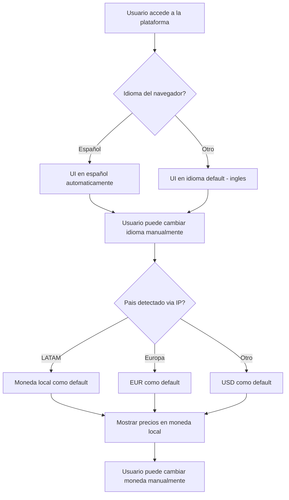
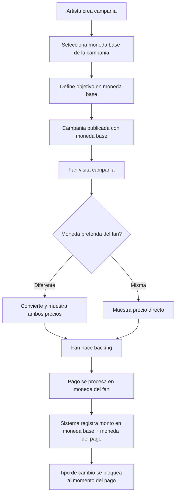
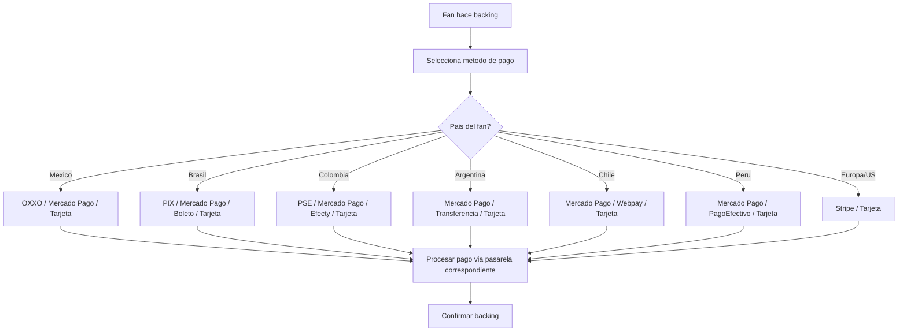

# US-PT-01: Posicionamiento LATAM-first

> **ID:** US-PT-01
> **Feature Name:** `pt-latam-first`
> **Prioridad:** Alta
> **Estimacion:** L (Large)
> **Modulo:** Plataforma (transversal - afecta todos los modulos)
> **Dependencias:** Ninguna directa (es infraestructura base)
> **Feature Origen:** F-14 del [analisis de funcionalidades](../analisis/20260217_analisis-funcionalidades-industria-musical.md#f-14-campania-en-español--latam-first)

---

## Historia de Usuario

**Como** artista o fan latinoamericano,
**Quiero** usar la plataforma completamente en español, pagar con metodos de pago locales (Mercado Pago, OXXO, PIX) y ver precios en mi moneda local,
**Para** participar en crowdfunding musical sin las barreras de idioma, conversion de divisas y falta de metodos de pago accesibles que tienen las plataformas anglosajonas.

---

## Actores

| Actor | Descripcion |
|-------|-------------|
| Artista LATAM | Crea campanias en español, recibe fondos en moneda local |
| Fan LATAM | Navega en español, paga con metodos locales, ve precios en su moneda |
| Sistema | Gestiona i18n, multi-moneda, integracion con pasarelas LATAM |

---

## Precondiciones

- Plataforma funcional en su version base (EUR/ingles)
- Cuentas de merchant configuradas en pasarelas LATAM
- Tipos de cambio actualizados (via API de proveedor de forex)

## Postcondiciones

- UI completamente localizada en español (no solo traducida)
- Fans pueden pagar con metodos locales de su pais
- Artistas pueden recibir fondos en su moneda local
- Campanias muestran precios en la moneda del visitante
- Todas las entidades con montos monetarios soportan multi-moneda via `MonedaId`

---

## Justificacion

**Latin music = $490M+ en H1 2025**, creciendo **6x mas rapido** que el mercado general estadounidense. Sin embargo, el crowdfunding musical en español es **practicamente inexistente**:

- Kickstarter: solo en ingles, sin metodos de pago LATAM
- Indiegogo: soporte limitado en español, pocos metodos locales
- Verkami: solo España, sin presencia en LATAM
- Patronite: solo España

**Oportunidad**: La diaspora latina (65M hispanos en US + LATAM completo) tiene fuerte cultura comunitaria y fanbases apasionadas. WePlay Rises puede ser la **primera plataforma de crowdfunding musical nativa en español** con infraestructura de pagos LATAM.

**Mercados objetivo por tamano**:

| Pais | Poblacion | Penetracion Internet | Metodo Pago Principal |
|------|-----------|---------------------|----------------------|
| Mexico | 130M | 76% | OXXO, Mercado Pago, SPEI |
| Colombia | 52M | 73% | PSE, Mercado Pago, Efecty |
| Argentina | 46M | 87% | Mercado Pago, transferencia bancaria |
| Chile | 19M | 92% | Mercado Pago, Webpay |
| Peru | 34M | 71% | Mercado Pago, PagoEfectivo |
| Brasil | 215M | 81% | PIX, Mercado Pago, Boleto |

---

## Alcance de esta US

### A. Localizacion (i18n/l10n)

Soporte nativo en español para toda la UI, no solo traduccion literal sino adaptacion cultural.

### B. Multi-moneda

Todas las entidades con montos monetarios soportan multiples monedas. Conversion automatica para mostrar precios en moneda del visitante.

### C. Pasarelas de pago LATAM

Integracion con metodos de pago locales por pais.

### D. Templates de campania LATAM

Templates adaptados a generos latinos (reggaeton, cumbia, salsa, regional mexicano, MPB, funk carioca).

### Excluido

- Traduccion a portugues (fase posterior, se prepara la infraestructura i18n)
- Soporte legal por pais (terminos y condiciones locales)
- Oficinas o soporte al cliente local en LATAM

---

## Flujo Principal: Localizacion de la Plataforma



### Idiomas Soportados (v1)

| Idioma | Codigo | Prioridad |
|--------|--------|-----------|
| Español (España) | es-ES | Alta |
| Español (LATAM) | es-419 | Alta |
| Ingles | en | Ya existente |

### Elementos a Localizar

| Elemento | Tipo | Ejemplo |
|----------|------|---------|
| Labels de UI | Estatico | "Apoyar campania", "Crear recompensa" |
| Mensajes de error | Estatico | "El titulo es obligatorio" |
| Formatos de fecha | Formato | DD/MM/YYYY (LATAM) vs MM/DD/YYYY |
| Formatos de numero | Formato | 1.000,50 (LATAM) vs 1,000.50 |
| Monedas | Formato | $1.000 MXN, R$500 BRL |
| Emails transaccionales | Templates | Notificaciones en idioma del usuario |
| Templates de campania | Contenido | Generos latinos, descripciones adaptadas |

---

## Flujo Principal: Multi-moneda



### Monedas Soportadas

| Moneda | Codigo | Simbolo | Paises |
|--------|--------|---------|--------|
| Euro | EUR | € | España, Europa |
| Dolar estadounidense | USD | $ | US, Ecuador |
| Peso mexicano | MXN | $ | Mexico |
| Peso colombiano | COP | $ | Colombia |
| Peso argentino | ARS | $ | Argentina |
| Peso chileno | CLP | $ | Chile |
| Sol peruano | PEN | S/ | Peru |
| Real brasileno | BRL | R$ | Brasil |

### Reglas de Conversion

| Regla | Detalle |
|-------|---------|
| Fuente de tipos de cambio | API externa (Open Exchange Rates, Fixer.io o similar) |
| Frecuencia de actualizacion | Cada 6 horas |
| Tipo de cambio al pagar | Se bloquea al momento de la transaccion |
| Margen de conversion | 0% (sin spread adicional, se usa tasa de mercado) |
| Moneda de liquidacion al artista | La moneda base de su campania |
| Registro en BD | Siempre se guardan: monto original, moneda original, monto convertido, moneda base, tasa usada |

---

## Flujo Principal: Pasarelas de Pago LATAM



### Pasarelas por Pais

| Pais | Pasarela Principal | Metodos Locales | Tarjetas |
|------|-------------------|-----------------|----------|
| Mexico | Mercado Pago | OXXO (efectivo), SPEI (transferencia) | Visa, MC, Amex |
| Colombia | Mercado Pago | PSE (transferencia), Efecty (efectivo) | Visa, MC |
| Argentina | Mercado Pago | Transferencia bancaria, Rapipago | Visa, MC, Naranja |
| Chile | Mercado Pago | Webpay (Transbank) | Visa, MC |
| Peru | Mercado Pago | PagoEfectivo | Visa, MC |
| Brasil | Mercado Pago | PIX (instantaneo), Boleto bancario | Visa, MC, Elo |
| España/Europa | Stripe | Bizum (futuro), transferencia SEPA | Visa, MC |
| US | Stripe | ACH (futuro) | Visa, MC, Amex |

### Comportamiento de Pagos en Efectivo

Los pagos en efectivo (OXXO, Efecty, PagoEfectivo) tienen particularidades:

| Aspecto | Comportamiento |
|---------|---------------|
| Tiempo de confirmacion | 24-72 horas (fan paga en tienda fisica) |
| Estado del backing | "Pendiente de pago" hasta confirmacion |
| Vencimiento | 72 horas para completar el pago |
| Notificacion | Email/push cuando se genera la referencia + cuando se confirma |
| Si vence | Backing se cancela automaticamente |

---

## Flujos Alternativos

| ID | Condicion | Accion |
|----|-----------|--------|
| FA-01 | Fan cambia moneda manualmente | Recalcular precios con tasa actual. Informar que la tasa puede variar al momento del pago |
| FA-02 | Tipo de cambio varia significativamente entre visita y pago | Mostrar aviso: "El tipo de cambio ha cambiado. Precio actualizado: X" |
| FA-03 | Pago en efectivo vence (72h) | Cancelar backing pendiente, liberar cupo de reward si aplica, notificar fan |
| FA-04 | Pasarela LATAM no disponible temporalmente | Fallback a pago con tarjeta internacional via Stripe |
| FA-05 | Artista quiere recibir en moneda diferente a la de su campania | No soportado en v1. La moneda base se define al crear la campania |
| FA-06 | Fan desde pais sin pasarela local configurada | Solo tarjeta internacional via Stripe |

---

## Criterios de Aceptacion

| ID | Criterio | Metodo de Prueba |
|----|----------|------------------|
| AC-PT01-1 | La UI se muestra en español automaticamente cuando el idioma del navegador es español | Cambiar idioma del navegador, verificar UI |
| AC-PT01-2 | El usuario puede cambiar idioma manualmente desde un selector persistente | Cambiar idioma, navegar entre paginas, verificar persistencia |
| AC-PT01-3 | Los formatos de fecha y numero se adaptan al locale del usuario (DD/MM/YYYY, separador decimal) | Verificar formatos en diferentes locales |
| AC-PT01-4 | El artista puede seleccionar la moneda base de su campania al crearla | Crear campania con MXN, verificar en BD |
| AC-PT01-5 | Los precios se muestran en la moneda preferida del fan con conversion automatica | Visitar campania en EUR desde Mexico, verificar precio en MXN |
| AC-PT01-6 | Al hacer backing, se muestra el precio en ambas monedas (original + convertida) si son diferentes | Hacer backing cross-moneda, verificar display |
| AC-PT01-7 | El tipo de cambio se bloquea al momento de confirmar el pago | Verificar que el monto no cambia entre seleccion y confirmacion |
| AC-PT01-8 | Fan en Mexico puede pagar con OXXO (genera referencia de pago) | Completar flujo OXXO, verificar referencia generada |
| AC-PT01-9 | Fan en Brasil puede pagar con PIX (genera codigo QR) | Completar flujo PIX, verificar QR generado |
| AC-PT01-10 | Fan en Colombia puede pagar con PSE (redirige a banco) | Completar flujo PSE, verificar redireccion |
| AC-PT01-11 | Pago en efectivo que no se completa en 72h se cancela automaticamente | Generar referencia OXXO, esperar vencimiento, verificar cancelacion |
| AC-PT01-12 | El registro de backing incluye: monto original, moneda original, monto convertido, moneda base, tasa de cambio | Hacer backing cross-moneda, verificar campos en BD |
| AC-PT01-13 | Los emails transaccionales se envian en el idioma del usuario | Cambiar idioma, hacer backing, verificar email |

---

## Especificacion Tecnica

### API Endpoints

#### GET /api/configuracion/monedas

Obtener monedas soportadas con tasas de cambio actuales.

**Auth:** Publico

**Response 200 OK:**
```json
{
    "data": {
        "monedaBase": "EUR",
        "monedas": [
            {
                "id": 1,
                "codigo": "EUR",
                "simbolo": "€",
                "nombre": "Euro",
                "tasaCambioDesdeBase": 1.0,
                "ultimaActualizacion": "2026-02-17T06:00:00Z"
            },
            {
                "id": 2,
                "codigo": "USD",
                "simbolo": "$",
                "nombre": "Dolar estadounidense",
                "tasaCambioDesdeBase": 1.08,
                "ultimaActualizacion": "2026-02-17T06:00:00Z"
            },
            {
                "id": 3,
                "codigo": "MXN",
                "simbolo": "$",
                "nombre": "Peso mexicano",
                "tasaCambioDesdeBase": 19.85,
                "ultimaActualizacion": "2026-02-17T06:00:00Z"
            }
        ]
    },
    "messages": []
}
```

---

#### GET /api/configuracion/metodos-pago?paisId={paisId}

Obtener metodos de pago disponibles para un pais.

**Auth:** Publico

**Response 200 OK:**
```json
{
    "data": [
        {
            "id": 1,
            "nombre": "Tarjeta de credito/debito",
            "pasarela": "Stripe",
            "icono": "credit-card",
            "tiempoConfirmacion": "Inmediato"
        },
        {
            "id": 5,
            "nombre": "OXXO",
            "pasarela": "MercadoPago",
            "icono": "oxxo",
            "tiempoConfirmacion": "24-72 horas",
            "instrucciones": "Genera una referencia y paga en cualquier OXXO"
        },
        {
            "id": 6,
            "nombre": "Mercado Pago",
            "pasarela": "MercadoPago",
            "icono": "mercadopago",
            "tiempoConfirmacion": "Inmediato"
        }
    ],
    "messages": []
}
```

---

#### POST /api/backings/{id}/pago-local

Iniciar pago con metodo local (genera referencia OXXO, QR PIX, redireccion PSE, etc.).

**Auth:** Fan (autenticado)

**Request:**
```json
{
    "metodoPagoId": 5,
    "monedaId": 3
}
```

**Response 201 Created:**
```json
{
    "data": {
        "backingId": "guid",
        "referenciaPago": "1234567890123456",
        "montoPagar": 595.00,
        "moneda": "MXN",
        "montoOriginal": 30.00,
        "monedaOriginal": "EUR",
        "tasaCambio": 19.85,
        "pasarela": "MercadoPago",
        "metodoPago": "OXXO",
        "instrucciones": "Presenta esta referencia en cualquier tienda OXXO y paga $595.00 MXN",
        "vencimiento": "2026-02-20T10:00:00Z",
        "urlQr": null,
        "urlRedireccion": null
    },
    "messages": [
        { "message": "Referencia de pago generada", "errorCode": "0001" }
    ]
}
```

---

#### POST /api/webhooks/mercadopago

Webhook para recibir confirmacion de pagos de Mercado Pago.

**Auth:** Validacion de firma (webhook secret)

**Procesamiento interno:**
1. Validar firma del webhook
2. Buscar backing por referencia externa
3. Actualizar estado del backing a "Pagado"
4. Ejecutar logica post-backing (Fan Score, notificaciones, etc.)

---

### Modelo de Datos

```
MaestraMoneda (extension de tabla existente o nueva)
  Id                    INT (PK)
  Codigo                NVARCHAR(3) -- ISO 4217
  Simbolo               NVARCHAR(5)
  Nombre                NVARCHAR(50)
  EsActiva              BIT DEFAULT 1

TasaCambio
  Id                    UNIQUEIDENTIFIER (PK)
  MonedaOrigenId        FK → MaestraMoneda
  MonedaDestinoId       FK → MaestraMoneda
  Tasa                  DECIMAL(18,6)
  FechaActualizacion    DATETIME2(3)

MaestraPasarelaPago
  1 = Stripe
  2 = MercadoPago

MaestraMetodoPago
  Id                    INT (PK)
  Nombre                NVARCHAR(50)
  PasarelaId            FK → MaestraPasarelaPago
  PaisId?               FK → MaestraPais (null = disponible globalmente)
  Icono                 NVARCHAR(50)
  TiempoConfirmacion    NVARCHAR(50)
  RequierePagoExterno   BIT -- true para OXXO, Boleto, etc.
  EsActivo              BIT DEFAULT 1

PagoLocal (registro de pagos con metodos locales)
  Id                    UNIQUEIDENTIFIER (PK)
  BackingId             FK → Backing
  MetodoPagoId          FK → MaestraMetodoPago
  ReferenciaPagoExterna NVARCHAR(100) -- ID en la pasarela
  MontoMonedaLocal      DECIMAL(18,2)
  MonedaLocalId         FK → MaestraMoneda
  MontoMonedaBase       DECIMAL(18,2)
  MonedaBaseId          FK → MaestraMoneda
  TasaCambioUsada       DECIMAL(18,6)
  EstadoPagoId          FK → MaestraEstadoPagoLocal
  FechaVencimiento?     DATETIME2(3) -- para pagos en efectivo
  FechaConfirmacion?    DATETIME2(3)
  FechaCreacion         DATETIME2(3)

MaestraEstadoPagoLocal
  1 = Pendiente
  2 = Confirmado
  3 = Vencido
  4 = Cancelado
  5 = Error

RecursoTraduccion (tabla i18n)
  Id                    UNIQUEIDENTIFIER (PK)
  Clave                 NVARCHAR(200) -- ej: "campania.crear.titulo.label"
  IdiomaId              FK → MaestraIdioma
  Valor                 NVARCHAR(MAX)

MaestraIdioma
  1 = en (English)
  2 = es-ES (Español España)
  3 = es-419 (Español LATAM)
```

### Cambios en Entidades Existentes

```
Campania (campos nuevos)
  + MonedaId            FK → MaestraMoneda (moneda base de la campania)

Backing (campos nuevos)
  + MonedaPagoId?       FK → MaestraMoneda (moneda en que pago el fan)
  + MontoPagoOriginal?  DECIMAL(18,2) (monto en moneda del fan)
  + TasaCambioUsada?    DECIMAL(18,6) (tasa al momento del pago)

User (campos nuevos)
  + IdiomaPreferidoId?  FK → MaestraIdioma
  + MonedaPreferidaId?  FK → MaestraMoneda
  + PaisId?             FK → MaestraPais
```

---

## Notas de Implementacion

- **i18n frontend**: Usar `react-i18next` con archivos JSON por idioma. Namespace por feature
- **i18n backend**: Mensajes de error y emails via tabla `RecursoTraduccion` o archivos `.resx`
- **Tipos de cambio**: API de Open Exchange Rates (plan gratuito: 1000 req/mes). Cache 6h. Fallback a tasa anterior si API falla
- **Mercado Pago**: SDK oficial para .NET. Un solo merchant account cubre 6 paises LATAM
- **PIX**: Via Mercado Pago o integracion directa con API del Banco Central de Brasil
- **Pagos en efectivo**: Son asincronos. El backing queda en estado "Pendiente de pago" hasta webhook de confirmacion
- **Deteccion de pais**: Via IP (MaxMind GeoIP) para sugerencia inicial. El usuario puede cambiar manualmente
- **Handler CQRS**: Command + Handler en mismo archivo, inyectar Service (no DbContext)
- **Fase 1**: Español + Mercado Pago (cubre 6 paises). Fase 2: PIX directo + Stripe LATAM
