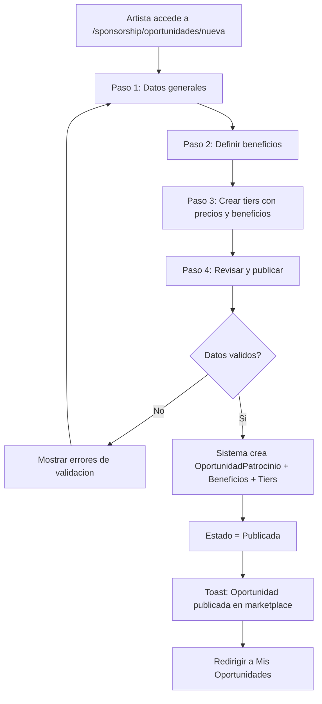
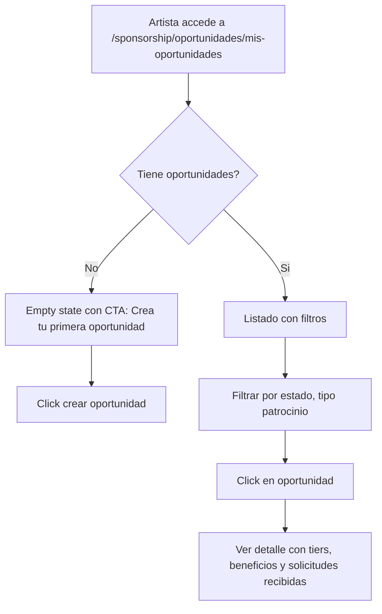
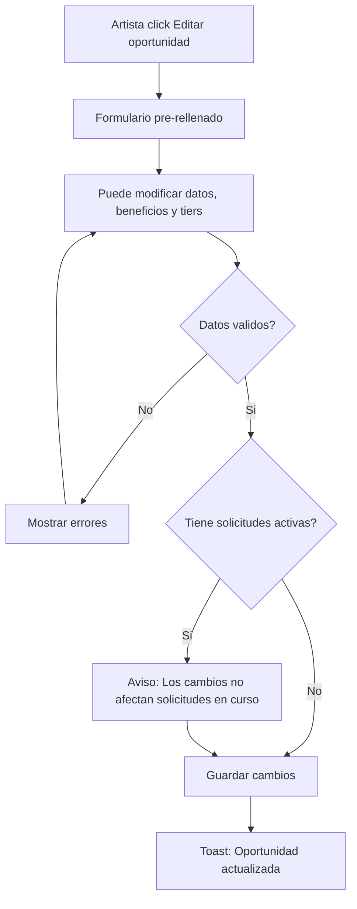
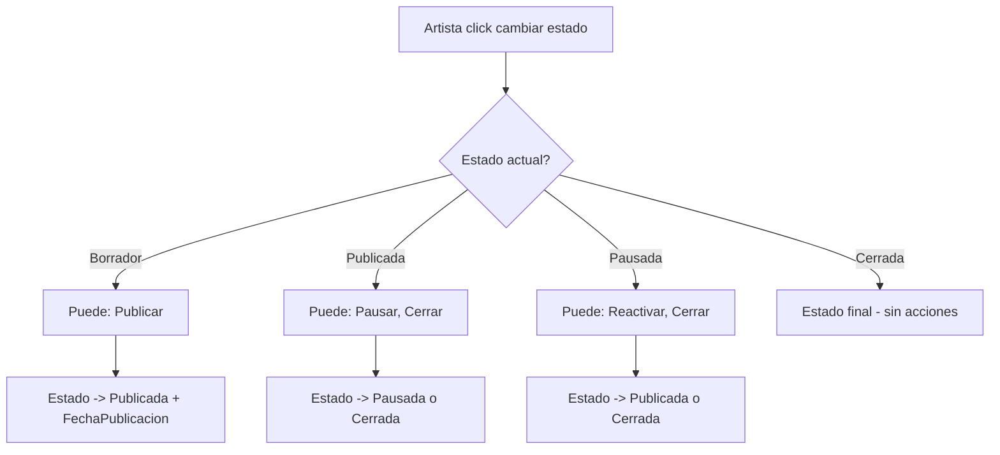

# US-SP-01: Foundation del Modulo y Oportunidades de Patrocinio

> **ID:** US-SP-01
> **Feature Name:** `sp-foundation-oportunidades`
> **Prioridad:** Alta
> **Estimacion:** XXL (Extra Extra Large)
> **Modulo:** Sponsorship
> **Dependencias:** US-CL-01 (PerfilMarca compartida)

---

## TAREA PREVIA: Revision de Agentes y Tooling

> **BLOQUEANTE:** Antes de implementar esta US, se debe verificar que el sistema de agentes
> soporta correctamente la creacion de un modulo NUEVO desde cero. Revisar:
>
> 1. **Migraciones EF Core**: Verificar que los agentes pueden generar migraciones para un nuevo DbContext
>    (`SponsorshipContext`) independiente del `CrowdfundingContext`, `CrowdsourcingContext` y `ContentLicensingContext`.
> 2. **Scaffolding de dominio**: Verificar que `/new-entity` y los templates de `.claude/templates/api/`
>    soportan la creacion de entidades en un modulo nuevo (no solo Crowdfunding/Crowdsourcing/ContentLicensing).
> 3. **Registro de nuevo contexto en DI + Program.cs**: Verificar que el patron de registro en `DependencyInjection.cs`
>    y `Program.cs` permite agregar un nuevo contexto sin romper los existentes.
> 4. **Referencia cruzada a PerfilMarca del modulo ContentLicensing**: Verificar que `PerfilMarca` (creada en US-CL-01)
>    puede referenciarse correctamente desde el `SponsorshipContext` sin duplicar la entidad ni la tabla.
> 5. **StronglyTypedIds nuevos**: Verificar que se pueden crear nuevos IDs tipados
>    (`OportunidadPatrocinioId`, `AcuerdoPatrocinioId`, `SolicitudPatrocinioId`, `MilestonePatrocinioId`,
>    `EntregablePatrocinioId`, `ValoracionPatrocinioId`, `MetricaPatrocinioId`) en el nuevo modulo.
>
> **Si alguno de estos puntos no esta soportado, crear/adaptar los agentes necesarios ANTES de empezar.**

---

## Historia de Usuario

**Como** administrador de la plataforma,
**Quiero** establecer la infraestructura base del modulo Sponsorship con modelo de dominio, migraciones, datos seed de tablas maestras, y la funcionalidad para que artistas publiquen oportunidades de patrocinio con tiers y beneficios,
**Para** que las marcas puedan descubrir oportunidades de patrocinio y los artistas puedan monetizar su audiencia a traves de acuerdos con marcas.

---

## Actores

| Actor | Descripcion |
|-------|-------------|
| Artista | Crea y gestiona oportunidades de patrocinio con tiers y beneficios |
| Administrador | Establece la infraestructura del modulo y datos seed |

---

## Precondiciones

- Modulo Sponsorship creado con proyectos Domain, Application, Infra, WebApi
- Migracion ejecutada con todas las tablas maestras y entidades base
- Datos seed de maestras cargados
- PerfilMarca disponible desde modulo ContentLicensing (US-CL-01)
- Artista tiene perfil activo en la plataforma

## Postcondiciones

- SponsorshipContext operativo con todas las entidades configuradas
- Tablas maestras con datos seed cargados
- Artista puede crear oportunidades de patrocinio
- Artista puede definir beneficios y tiers con precios por oportunidad
- Artista puede publicar oportunidades para que marcas las descubran

---

## Justificacion

Sponsorship es un modulo completamente nuevo que permite la conexion entre artistas y marcas para acuerdos de patrocinio. Esta US establece los cimientos: infraestructura del modulo (DbContext, migraciones, tablas maestras) y la funcionalidad core de creacion de oportunidades con tiers y beneficios. Sin esta base, ningun otro flujo del modulo puede funcionar.

---

## Alcance de esta US

### A. Infraestructura del Modulo

1. Crear proyecto `WePlayRises.Sponsorship.Domain`
2. Crear proyecto `WePlayRises.Sponsorship.Application`
3. Crear proyecto `WePlayRises.Sponsorship.Infra`
4. Crear proyecto `WePlayRises.Sponsorship.WebApi`
5. Crear `SponsorshipContext` con DbSets para todas las entidades
6. Registrar en `DependencyInjection.cs` y en `Program.cs`
7. Crear migracion inicial con todas las tablas
8. Cargar datos seed de maestras

### B. Oportunidades de Patrocinio

- Creacion de oportunidades con datos completos
- Vinculacion a campana o proyecto artistico (opcional)
- Definicion de beneficios disponibles
- Creacion de tiers (Bronce/Plata/Oro) con precio y beneficios por tier
- Publicacion/despublicacion de oportunidades

### C. Beneficios y Tiers

- Beneficios definidos por el artista (seleccion de tipos de beneficio maestros)
- Tiers con precio, nombre, descripcion y beneficios asociados
- Relacion N:M entre Tier y Beneficio

---

## Flujo Principal: Crear Oportunidad de Patrocinio



### Paso 1: Datos Generales de la Oportunidad

| Campo | Tipo | Obligatorio | Validacion |
|-------|------|-------------|------------|
| Titulo | Texto (max 200) | Si | Min 3 caracteres |
| Descripcion | Texto largo | Si | Max 4000 caracteres, min 20 caracteres |
| Tipo de patrocinio | Select (MaestraTipoPatrocinio) | Si | Debe existir en maestras |
| Campania vinculada | Select (campanas del artista) | No | FK valida si se indica |
| Audiencia estimada | Entero | No | > 0 |
| Moneda | Select (MaestraMoneda) | Si | Debe existir en maestras |
| Precio minimo | Decimal | No | > 0 |
| Precio maximo | Decimal | No | > 0, >= precio minimo |
| Es negociable | Boolean | Si | Default: true |
| Sectores preferidos | Multi-select (MaestraSectorMarca) | No | Deben existir en maestras |
| Sectores excluidos | Multi-select (MaestraSectorMarca) | No | No pueden solaparse con preferidos |
| Fecha limite | Date | No | >= hoy |

### Paso 2: Definir Beneficios

El artista selecciona que beneficios puede ofrecer a las marcas. Cada beneficio:

| Campo | Tipo | Obligatorio | Validacion |
|-------|------|-------------|------------|
| Tipo de beneficio | Select (MaestraTipoBeneficio) | Si | Debe existir en maestras |
| Descripcion personalizada | Texto (max 500) | No | - |
| Cantidad | Entero | No | > 0 (ej: 3 posts, 2 menciones) |

### Paso 3: Crear Tiers

El artista agrupa beneficios en tiers con precio. Cada tier:

| Campo | Tipo | Obligatorio | Validacion |
|-------|------|-------------|------------|
| Nombre | Texto (max 100) | Si | Min 2 caracteres |
| Descripcion | Texto (max 1000) | No | - |
| Precio | Decimal | Si | > 0 |
| Moneda | Select (MaestraMoneda) | Si | Debe existir en maestras |
| Orden | Entero | Automatico | Secuencial |
| Beneficios del tier | Multi-select (beneficios del paso 2) | Si | Al menos 1 beneficio |
| Es destacado | Boolean | Si | Default: false (solo 1 tier puede ser destacado) |

---

## Flujo Secundario: Listar Mis Oportunidades



**Datos por oportunidad en listado:**

| Dato | Fuente |
|------|--------|
| Titulo | OportunidadPatrocinio.Titulo |
| Tipo patrocinio | MaestraTipoPatrocinio.Nombre |
| Estado (badge) | MaestraEstadoOportunidad.Nombre |
| Precio desde | MIN(TierPatrocinio.Precio) |
| Num solicitudes | Contador de solicitudes recibidas |
| Fecha publicacion | OportunidadPatrocinio.FechaPublicacion |

---

## Flujo Secundario: Editar Oportunidad



**Reglas de edicion:**
- Todos los campos son editables
- No se pueden eliminar beneficios/tiers con solicitudes asociadas
- Al guardar, se actualiza `FechaActualizacion`

---

## Flujo Secundario: Cambiar Estado de Oportunidad



---

## Flujos Alternativos

| ID | Condicion | Accion |
|----|-----------|--------|
| FA-01 | Artista no tiene campanas activas | Permitir crear oportunidad sin vincular campana |
| FA-02 | Artista no define ningun tier | Permitir guardar como borrador |
| FA-03 | Sectores preferidos y excluidos se solapan | Error: Un sector no puede estar en ambas listas |
| FA-04 | Precio maximo menor que precio minimo | Error de validacion |
| FA-05 | Fecha limite es pasada | Error: La fecha limite debe ser futura |

---

## Criterios de Aceptacion

| ID | Criterio | Metodo de Prueba |
|----|----------|------------------|
| AC-SP01-1 | El modulo Sponsorship tiene DbContext propio (`SponsorshipContext`) operativo con migraciones ejecutadas | Ejecutar migracion, verificar tablas en BD |
| AC-SP01-2 | Todas las tablas maestras del modulo tienen datos seed cargados (12 maestras) | Verificar datos en BD tras migracion |
| AC-SP01-3 | PerfilMarca de ContentLicensing se referencia correctamente desde SponsorshipContext sin duplicar tabla | Verificar FK cruzada en BD |
| AC-SP01-4 | Un artista autenticado puede crear una oportunidad de patrocinio con titulo, descripcion, tipo y moneda | Completar formulario, verificar en BD |
| AC-SP01-5 | La oportunidad se crea con estado Borrador si no tiene tiers, o Publicada si tiene al menos un tier | Verificar estado en BD |
| AC-SP01-6 | El artista puede definir beneficios seleccionando tipos de beneficio de la maestra | Agregar beneficios, verificar en BD |
| AC-SP01-7 | El artista puede crear tiers con nombre, precio y beneficios asociados. La relacion N:M funciona | Crear tier con beneficios, verificar en BD |
| AC-SP01-8 | Solo un tier por oportunidad puede marcarse como destacado | Intentar marcar 2, verificar error |
| AC-SP01-9 | El artista puede listar sus oportunidades con filtros por estado y tipo de patrocinio | Crear oportunidades, verificar listado |
| AC-SP01-10 | Se puede editar una oportunidad existente: datos, beneficios y tiers. Se actualiza FechaActualizacion | Editar, verificar cambios |
| AC-SP01-11 | Se puede cambiar estado: Borrador -> Publicada -> Pausada/Cerrada. Publicada -> Cerrada | Cambiar estados, verificar transiciones |
| AC-SP01-12 | Las validaciones de campos obligatorios, rangos de precios y formato de URLs funcionan correctamente | Enviar datos invalidos, verificar errores |

---

## Especificacion Tecnica

### API Endpoints

#### POST /api/sponsorship/oportunidades

Crear oportunidad de patrocinio con beneficios y tiers.

**Auth:** Artista (autenticado)

**Request:**
```json
{
  "titulo": "Patrocinio gira nacional 2026",
  "descripcion": "Buscamos marca patrocinadora para nuestra gira de 10 ciudades. Ofrecemos visibilidad en escenarios, redes sociales y merch co-branded. Audiencia estimada de 50.000 asistentes.",
  "tipoPatrocinioId": 4,
  "campaniaId": null,
  "audienciaEstimada": 50000,
  "monedaId": 1,
  "precioMinimo": 5000.00,
  "precioMaximo": 25000.00,
  "esNegociable": true,
  "sectoresPreferidosIds": [1, 5, 6],
  "sectoresExcluidosIds": [8],
  "fechaLimite": "2026-06-01",
  "beneficios": [
    {
      "tipoBeneficioId": 1,
      "descripcionPersonalizada": "Logo en pantalla LED de escenario principal",
      "cantidad": 10
    },
    {
      "tipoBeneficioId": 3,
      "descripcionPersonalizada": "Posts en Instagram y TikTok",
      "cantidad": 5
    },
    {
      "tipoBeneficioId": 7,
      "descripcionPersonalizada": "Banner en zona VIP de cada concierto",
      "cantidad": 10
    },
    {
      "tipoBeneficioId": 8,
      "descripcionPersonalizada": "Camisetas co-branded edicion limitada",
      "cantidad": 500
    }
  ],
  "tiers": [
    {
      "nombre": "Bronce",
      "descripcion": "Visibilidad basica en escenarios y redes",
      "precio": 5000.00,
      "monedaId": 1,
      "esDestacado": false,
      "beneficioIndices": [0, 2]
    },
    {
      "nombre": "Plata",
      "descripcion": "Visibilidad completa con contenido dedicado",
      "precio": 12000.00,
      "monedaId": 1,
      "esDestacado": true,
      "beneficioIndices": [0, 1, 2]
    },
    {
      "nombre": "Oro",
      "descripcion": "Patrocinio premium con merch co-branded y exclusividad",
      "precio": 25000.00,
      "monedaId": 1,
      "esDestacado": false,
      "beneficioIndices": [0, 1, 2, 3]
    }
  ]
}
```

**Response 201 Created:**
```json
{
  "data": {
    "id": "guid",
    "titulo": "Patrocinio gira nacional 2026",
    "tipoPatrocinioNombre": "Tour/Evento",
    "estadoNombre": "Publicada",
    "numBeneficios": 4,
    "numTiers": 3,
    "precioDesde": 5000.00,
    "fechaPublicacion": "2026-02-17T10:00:00Z"
  },
  "messages": [
    { "message": "Oportunidad publicada en marketplace", "errorCode": "0001" }
  ]
}
```

**Errores:**
- `400 Bad Request` - Validacion fallida
- `401 Unauthorized` - No autenticado
- `403 Forbidden` - No es artista

---

#### GET /api/sponsorship/oportunidades/mis-oportunidades

Listar oportunidades del artista autenticado.

**Auth:** Artista (autenticado)

**Query params:** `estadoId`, `tipoPatrocinioId`, `page`, `pageSize`

**Response 200 OK:**
```json
{
  "data": {
    "items": [
      {
        "id": "guid",
        "titulo": "Patrocinio gira nacional 2026",
        "tipoPatrocinioNombre": "Tour/Evento",
        "estadoNombre": "Publicada",
        "precioDesde": 5000.00,
        "numSolicitudes": 3,
        "numTiers": 3,
        "audienciaEstimada": 50000,
        "fechaPublicacion": "2026-02-17T10:00:00Z",
        "fechaLimite": "2026-06-01"
      }
    ],
    "totalCount": 5,
    "page": 1,
    "pageSize": 10
  },
  "messages": []
}
```

---

#### GET /api/sponsorship/oportunidades/{id}

Detalle de oportunidad con beneficios, tiers y solicitudes recibidas.

**Auth:** Artista (propietario) o Marca (marketplace)

**Response 200 OK:**
```json
{
  "data": {
    "id": "guid",
    "titulo": "Patrocinio gira nacional 2026",
    "descripcion": "Buscamos marca patrocinadora...",
    "tipoPatrocinioId": 4,
    "tipoPatrocinioNombre": "Tour/Evento",
    "estadoId": 2,
    "estadoNombre": "Publicada",
    "campaniaId": null,
    "audienciaEstimada": 50000,
    "monedaNombre": "EUR",
    "precioMinimo": 5000.00,
    "precioMaximo": 25000.00,
    "esNegociable": true,
    "fechaLimite": "2026-06-01",
    "sectoresPreferidos": ["Tecnologia", "Entretenimiento", "Deportes"],
    "sectoresExcluidos": ["Finanzas"],
    "artista": {
      "id": "guid",
      "nombreArtistico": "Los Rockeros",
      "generoMusical": "Rock"
    },
    "beneficios": [
      {
        "id": "guid",
        "tipoBeneficioId": 1,
        "tipoBeneficioNombre": "Logo en campana",
        "descripcionPersonalizada": "Logo en pantalla LED de escenario principal",
        "cantidad": 10
      },
      {
        "id": "guid",
        "tipoBeneficioId": 3,
        "tipoBeneficioNombre": "Post redes sociales",
        "descripcionPersonalizada": "Posts en Instagram y TikTok",
        "cantidad": 5
      }
    ],
    "tiers": [
      {
        "id": "guid",
        "nombre": "Bronce",
        "descripcion": "Visibilidad basica en escenarios y redes",
        "precio": 5000.00,
        "monedaNombre": "EUR",
        "orden": 1,
        "esDestacado": false,
        "beneficios": [
          { "tipoBeneficioNombre": "Logo en campana", "cantidad": 10 },
          { "tipoBeneficioNombre": "Banner evento", "cantidad": 10 }
        ]
      },
      {
        "id": "guid",
        "nombre": "Plata",
        "descripcion": "Visibilidad completa con contenido dedicado",
        "precio": 12000.00,
        "monedaNombre": "EUR",
        "orden": 2,
        "esDestacado": true,
        "beneficios": [
          { "tipoBeneficioNombre": "Logo en campana", "cantidad": 10 },
          { "tipoBeneficioNombre": "Post redes sociales", "cantidad": 5 },
          { "tipoBeneficioNombre": "Banner evento", "cantidad": 10 }
        ]
      },
      {
        "id": "guid",
        "nombre": "Oro",
        "descripcion": "Patrocinio premium con merch co-branded y exclusividad",
        "precio": 25000.00,
        "monedaNombre": "EUR",
        "orden": 3,
        "esDestacado": false,
        "beneficios": [
          { "tipoBeneficioNombre": "Logo en campana", "cantidad": 10 },
          { "tipoBeneficioNombre": "Post redes sociales", "cantidad": 5 },
          { "tipoBeneficioNombre": "Banner evento", "cantidad": 10 },
          { "tipoBeneficioNombre": "Merch co-branded", "cantidad": 500 }
        ]
      }
    ],
    "numSolicitudes": 3,
    "fechaCreacion": "2026-02-17T10:00:00Z",
    "fechaPublicacion": "2026-02-17T10:00:00Z"
  },
  "messages": []
}
```

---

#### PUT /api/sponsorship/oportunidades/{id}

Editar oportunidad, beneficios y tiers.

**Auth:** Artista (propietario)

**Request:** (mismos campos que POST)

**Response 200 OK:**
```json
{
  "data": {
    "id": "guid",
    "titulo": "Patrocinio gira nacional 2026 (actualizada)",
    "fechaActualizacion": "2026-02-18T09:00:00Z"
  },
  "messages": [
    { "message": "Oportunidad actualizada", "errorCode": "0002" }
  ]
}
```

---

#### PATCH /api/sponsorship/oportunidades/{id}/estado

Cambiar estado de la oportunidad.

**Auth:** Artista (propietario)

**Request:**
```json
{
  "estadoOportunidadId": 3
}
```

**Response 200 OK:**
```json
{
  "data": {
    "id": "guid",
    "estadoNombre": "Pausada"
  },
  "messages": [
    { "message": "Estado actualizado", "errorCode": "0002" }
  ]
}
```

**Transiciones validas:**
- Borrador -> Publicada (requiere al menos 1 tier)
- Publicada -> Pausada
- Publicada -> Cerrada
- Pausada -> Publicada
- Pausada -> Cerrada

---

#### POST /api/sponsorship/oportunidades/{id}/tiers

Agregar tier a oportunidad existente.

**Auth:** Artista (propietario)

**Request:**
```json
{
  "nombre": "Platino",
  "descripcion": "Patrocinio ultra-premium con exclusividad total",
  "precio": 50000.00,
  "monedaId": 1,
  "esDestacado": false,
  "beneficioIds": ["guid-1", "guid-2", "guid-3", "guid-4"]
}
```

**Response 201 Created:**
```json
{
  "data": {
    "id": "guid",
    "nombre": "Platino",
    "precio": 50000.00,
    "orden": 4,
    "numBeneficios": 4
  },
  "messages": [
    { "message": "Tier creado", "errorCode": "0001" }
  ]
}
```

---

#### PUT /api/sponsorship/oportunidades/{oportunidadId}/tiers/{tierId}

Editar tier existente.

**Auth:** Artista (propietario)

**Request:** (mismos campos que POST tier)

**Response 200 OK:**
```json
{
  "data": {
    "id": "guid",
    "nombre": "Platino (actualizado)",
    "precio": 55000.00,
    "fechaActualizacion": "2026-02-18T09:00:00Z"
  },
  "messages": [
    { "message": "Tier actualizado", "errorCode": "0002" }
  ]
}
```

**Errores:**
- `400 Bad Request` - Tier tiene solicitudes asociadas (no se pueden eliminar beneficios vinculados)
- `404 Not Found` - Tier no pertenece a la oportunidad

---

### Modelo de Datos

```csharp
public class OportunidadPatrocinio
{
    public OportunidadPatrocinioId Id { get; set; }
    public Guid ArtistaId { get; set; }                      // FK -> Artista
    public int TipoPatrocinioId { get; set; }                // FK -> MaestraTipoPatrocinio
    public int EstadoOportunidadId { get; set; }             // FK -> MaestraEstadoOportunidad
    public int MonedaId { get; set; }                        // FK -> MaestraMoneda
    public Guid? CampaniaId { get; set; }                    // FK -> Campania (opcional)
    public string Titulo { get; set; } = null!;
    public string Descripcion { get; set; } = null!;
    public int? AudienciaEstimada { get; set; }
    public decimal? PrecioMinimo { get; set; }
    public decimal? PrecioMaximo { get; set; }
    public bool EsNegociable { get; set; }
    public DateTime? FechaLimite { get; set; }
    public DateTime? FechaPublicacion { get; set; }
    public DateTime FechaCreacion { get; set; }
    public DateTime? FechaActualizacion { get; set; }

    // Navigation
    public ICollection<BeneficioPatrocinio> Beneficios { get; set; } = new List<BeneficioPatrocinio>();
    public ICollection<TierPatrocinio> Tiers { get; set; } = new List<TierPatrocinio>();
    public ICollection<OportunidadSectorPreferido> SectoresPreferidos { get; set; } = new List<OportunidadSectorPreferido>();
    public ICollection<OportunidadSectorExcluido> SectoresExcluidos { get; set; } = new List<OportunidadSectorExcluido>();
    public ICollection<SolicitudPatrocinio> Solicitudes { get; set; } = new List<SolicitudPatrocinio>();
}

public class BeneficioPatrocinio
{
    public Guid Id { get; set; }
    public OportunidadPatrocinioId OportunidadId { get; set; }   // FK -> OportunidadPatrocinio
    public int TipoBeneficioId { get; set; }                      // FK -> MaestraTipoBeneficio
    public string? DescripcionPersonalizada { get; set; }
    public int? Cantidad { get; set; }
    public DateTime FechaCreacion { get; set; }

    // Navigation
    public OportunidadPatrocinio Oportunidad { get; set; } = null!;
    public ICollection<BeneficioTierPatrocinio> BeneficiosTier { get; set; } = new List<BeneficioTierPatrocinio>();
}

public class TierPatrocinio
{
    public Guid Id { get; set; }
    public OportunidadPatrocinioId OportunidadId { get; set; }   // FK -> OportunidadPatrocinio
    public int MonedaId { get; set; }                             // FK -> MaestraMoneda
    public string Nombre { get; set; } = null!;
    public string? Descripcion { get; set; }
    public decimal Precio { get; set; }
    public int Orden { get; set; }
    public bool EsDestacado { get; set; }
    public DateTime FechaCreacion { get; set; }
    public DateTime? FechaActualizacion { get; set; }

    // Navigation
    public OportunidadPatrocinio Oportunidad { get; set; } = null!;
    public ICollection<BeneficioTierPatrocinio> BeneficiosTier { get; set; } = new List<BeneficioTierPatrocinio>();
}

public class BeneficioTierPatrocinio
{
    public Guid BeneficioId { get; set; }                        // FK -> BeneficioPatrocinio
    public Guid TierId { get; set; }                             // FK -> TierPatrocinio

    // Navigation
    public BeneficioPatrocinio Beneficio { get; set; } = null!;
    public TierPatrocinio Tier { get; set; } = null!;
}

public class OportunidadSectorPreferido
{
    public OportunidadPatrocinioId OportunidadId { get; set; }
    public int SectorMarcaId { get; set; }

    public OportunidadPatrocinio Oportunidad { get; set; } = null!;
}

public class OportunidadSectorExcluido
{
    public OportunidadPatrocinioId OportunidadId { get; set; }
    public int SectorMarcaId { get; set; }

    public OportunidadPatrocinio Oportunidad { get; set; } = null!;
}
```

### Tablas Maestras (Seed Data)

```
MaestraTipoPatrocinio: 6 valores
  1. Campana - Patrocinio vinculado a una campana de crowdfunding especifica
  2. Artista - Patrocinio directo del artista y su marca personal
  3. Product Placement - Integracion de producto en contenido del artista
  4. Tour/Evento - Patrocinio de gira, concierto o evento en vivo
  5. Content - Patrocinio de creacion de contenido (videos, podcasts, etc.)
  6. Co-Branding - Colaboracion de marca conjunta (merch, ediciones limitadas)

MaestraTipoBeneficio: 12 valores
  1. Logo en campana - Logo de la marca visible en la pagina de campana
  2. Mencion en updates - Mencion de la marca en actualizaciones del artista
  3. Post redes sociales - Publicacion dedicada en redes del artista
  4. Story dedicado - Historia/story dedicada a la marca
  5. Video musical - Presencia de marca en video musical
  6. Podcast - Mencion o segmento patrocinado en podcast
  7. Banner evento - Banners y senalizacion en eventos en vivo
  8. Merch co-branded - Merchandising con branding conjunto
  9. Datos audiencia - Acceso a datos demograficos de audiencia
  10. Evento exclusivo - Acceso a evento privado o meet & greet
  11. Product placement - Integracion de producto en contenido
  12. Creditos - Mencion en creditos de obra o produccion

MaestraObjetivoMarca: 6 valores
  1. Brand Awareness - Aumentar reconocimiento de marca
  2. Engagement - Generar interaccion con audiencia
  3. Lead Generation - Captar leads y contactos
  4. Ventas Directas - Impulsar ventas de producto/servicio
  5. Posicionamiento - Asociar marca con valores/estilo del artista
  6. Lanzamiento - Apoyar lanzamiento de producto

MaestraEstadoOportunidad: 4 valores
  1. Borrador
  2. Publicada
  3. Pausada
  4. Cerrada

MaestraEstadoSolicitudPatrocinio: 6 valores
  1. Pendiente
  2. En Negociacion
  3. Aceptada
  4. Rechazada
  5. Expirada
  6. Cancelada

MaestraEstadoAcuerdoPatrocinio: 6 valores
  1. Pendiente Firma
  2. Activo
  3. En Ejecucion
  4. Completado
  5. Cancelado
  6. En Disputa

MaestraEstadoMilestone: 6 valores
  1. Pendiente
  2. En Progreso
  3. Entregado
  4. En Revision
  5. Aprobado
  6. Rechazado

MaestraEstadoEntregable: 7 valores
  1. Pendiente
  2. En Progreso
  3. Entregado
  4. En Revision
  5. Aprobado
  6. Requiere Cambios
  7. Rechazado

MaestraTipoMetrica: 11 valores
  1. Impresiones
  2. Clicks
  3. Engagement Rate
  4. Alcance
  5. Visualizaciones Video
  6. Likes
  7. Comentarios
  8. Shares
  9. Conversiones
  10. Leads
  11. Ventas Atribuidas

MaestraEstadoPago: 4 valores
  1. Pendiente
  2. Procesando
  3. Completado
  4. Fallido

MaestraTipoPago: 4 valores
  1. Anticipo
  2. Milestone
  3. Pago Final
  4. Bonus Performance
```

### Validaciones

```csharp
// CreateOportunidadPatrocinioValidator
RuleFor(x => x.Titulo)
    .NotEmpty().WithMessage("El titulo es obligatorio").WithErrorCode(ServiceResponseMessageType.Validation_Required)
    .MinimumLength(3).WithMessage("Minimo 3 caracteres").WithErrorCode(ServiceResponseMessageType.Validation_MinLength)
    .MaximumLength(200).WithMessage("Maximo 200 caracteres").WithErrorCode(ServiceResponseMessageType.Validation_MaxLength);

RuleFor(x => x.Descripcion)
    .NotEmpty().WithMessage("La descripcion es obligatoria").WithErrorCode(ServiceResponseMessageType.Validation_Required)
    .MinimumLength(20).WithMessage("Minimo 20 caracteres").WithErrorCode(ServiceResponseMessageType.Validation_MinLength)
    .MaximumLength(4000).WithMessage("Maximo 4000 caracteres").WithErrorCode(ServiceResponseMessageType.Validation_MaxLength);

RuleFor(x => x.TipoPatrocinioId)
    .NotEmpty().WithMessage("El tipo de patrocinio es obligatorio").WithErrorCode(ServiceResponseMessageType.Validation_Required);

RuleFor(x => x.MonedaId)
    .NotEmpty().WithMessage("La moneda es obligatoria").WithErrorCode(ServiceResponseMessageType.Validation_Required);

RuleFor(x => x.PrecioMaximo)
    .GreaterThanOrEqualTo(x => x.PrecioMinimo)
    .When(x => x.PrecioMaximo.HasValue && x.PrecioMinimo.HasValue)
    .WithMessage("El precio maximo debe ser >= al precio minimo")
    .WithErrorCode(ServiceResponseMessageType.Validation_InvalidRange);

RuleFor(x => x.FechaLimite)
    .GreaterThanOrEqualTo(DateTime.UtcNow.Date)
    .When(x => x.FechaLimite.HasValue)
    .WithMessage("La fecha limite debe ser futura")
    .WithErrorCode(ServiceResponseMessageType.Validation_InvalidRange);

RuleFor(x => x.AudienciaEstimada)
    .GreaterThan(0)
    .When(x => x.AudienciaEstimada.HasValue)
    .WithMessage("La audiencia estimada debe ser mayor a 0")
    .WithErrorCode(ServiceResponseMessageType.Validation_InvalidRange);

// CreateTierPatrocinioValidator
RuleFor(x => x.Nombre)
    .NotEmpty().WithMessage("El nombre del tier es obligatorio").WithErrorCode(ServiceResponseMessageType.Validation_Required)
    .MinimumLength(2).WithMessage("Minimo 2 caracteres").WithErrorCode(ServiceResponseMessageType.Validation_MinLength)
    .MaximumLength(100).WithMessage("Maximo 100 caracteres").WithErrorCode(ServiceResponseMessageType.Validation_MaxLength);

RuleFor(x => x.Precio)
    .GreaterThan(0).WithMessage("El precio debe ser mayor a 0").WithErrorCode(ServiceResponseMessageType.Validation_InvalidRange);

RuleFor(x => x.BeneficioIds)
    .NotEmpty().WithMessage("El tier debe tener al menos un beneficio").WithErrorCode(ServiceResponseMessageType.Validation_Required);
```

---

## Estructura de Archivos del Modulo

```
src/api/Modules/Sponsorship/
  WePlayRises.Sponsorship.Domain/
    Model/
      OportunidadPatrocinio.cs
      BeneficioPatrocinio.cs
      TierPatrocinio.cs
      BeneficioTierPatrocinio.cs
      OportunidadSectorPreferido.cs
      OportunidadSectorExcluido.cs
      SolicitudPatrocinio.cs          (US-SP-03)
      MensajePatrocinio.cs            (US-SP-03)
      AcuerdoPatrocinio.cs            (US-SP-04)
      MilestonePatrocinio.cs          (US-SP-04)
      EntregablePatrocinio.cs         (US-SP-04)
      PagoPatrocinio.cs               (US-SP-04)
      MetricaPatrocinio.cs            (US-SP-05)
      ValoracionPatrocinio.cs         (US-SP-06)
    Constants/
      ServiceResponseMessageType.cs
  WePlayRises.Sponsorship.Application/
    Features/
      OportunidadPatrocinio/
        Commands/
          CreateOportunidadPatrocinioCommand.cs
          UpdateOportunidadPatrocinioCommand.cs
          CambiarEstadoOportunidadCommand.cs
          CreateTierPatrocinioCommand.cs
          UpdateTierPatrocinioCommand.cs
        Queries/
          GetMisOportunidadesQuery.cs
          GetOportunidadByIdQuery.cs
        Validators/
          CreateOportunidadPatrocinioValidator.cs
          UpdateOportunidadPatrocinioValidator.cs
          CreateTierPatrocinioValidator.cs
        Dtos/
          OportunidadPatrocinioDto.cs
          OportunidadPatrocinioListDto.cs
          TierPatrocinioDto.cs
          BeneficioPatrocinioDto.cs
    Mapping/
      OportunidadPatrocinioProfile.cs
      TierPatrocinioProfile.cs
    Interfaces/
      Services/
        IOportunidadPatrocinioService.cs
        ITierPatrocinioService.cs
  WePlayRises.Sponsorship.Infra/
    Context/
      SponsorshipContext.cs
    Repositories/
      OportunidadPatrocinioRepository.cs
      TierPatrocinioRepository.cs
    Services/
      OportunidadPatrocinioService.cs
      TierPatrocinioService.cs
    DependencyInjection.cs
  WePlayRises.Sponsorship.WebApi/
    Controllers/
      OportunidadPatrocinioController.cs
```

---

## Mockups / UI

### Wizard - Crear Oportunidad (Paso 1: Datos Generales)
```
+--------------------------------------------------+
|  Nueva oportunidad de patrocinio         [1/4]   |
+--------------------------------------------------+
|                                                   |
|  Titulo *                                         |
|  [Patrocinio gira nacional 2026               ]  |
|                                                   |
|  Descripcion *                                    |
|  [Buscamos marca patrocinadora para nuestra    ]  |
|  [gira de 10 ciudades...                       ]  |
|                                                   |
|  Tipo de patrocinio *          Moneda *           |
|  [Tour/Evento          v]     [EUR         v]    |
|                                                   |
|  Campana vinculada (opcional)                     |
|  [Ninguna                  v]                     |
|                                                   |
|  Audiencia estimada        Negociable             |
|  [50000]                   [x] Si                 |
|                                                   |
|  Rango de precios                                 |
|  Minimo [5000] EUR    Maximo [25000] EUR          |
|                                                   |
|  Sectores preferidos                              |
|  [x] Tecnologia  [x] Entretenimiento             |
|  [x] Deportes    [ ] Moda                         |
|                                                   |
|  Sectores excluidos                               |
|  [ ] Tecnologia  [ ] Alimentacion                 |
|  [x] Finanzas    [ ] Salud                        |
|                                                   |
|  Fecha limite                                     |
|  [2026-06-01]                                     |
|                                                   |
|  [Cancelar]                    [Siguiente >]      |
+--------------------------------------------------+
```

### Wizard - Crear Oportunidad (Paso 3: Tiers)
```
+--------------------------------------------------+
|  Configurar tiers                        [3/4]   |
+--------------------------------------------------+
|                                                   |
|  +----------------------------------------------+|
|  | BRONCE                          5.000 EUR    ||
|  | Visibilidad basica en escenarios y redes     ||
|  | Beneficios:                                  ||
|  |   - Logo en campana (x10)                    ||
|  |   - Banner evento (x10)                      ||
|  | [Editar] [Eliminar]                          ||
|  +----------------------------------------------+|
|                                                   |
|  +----------------------------------------------+|
|  | PLATA                  DESTACADO 12.000 EUR  ||
|  | Visibilidad completa con contenido dedicado  ||
|  | Beneficios:                                  ||
|  |   - Logo en campana (x10)                    ||
|  |   - Post redes sociales (x5)                 ||
|  |   - Banner evento (x10)                      ||
|  | [Editar] [Eliminar]                          ||
|  +----------------------------------------------+|
|                                                   |
|  +----------------------------------------------+|
|  | ORO                            25.000 EUR    ||
|  | Patrocinio premium con merch co-branded      ||
|  | Beneficios:                                  ||
|  |   - Logo en campana (x10)                    ||
|  |   - Post redes sociales (x5)                 ||
|  |   - Banner evento (x10)                      ||
|  |   - Merch co-branded (x500)                  ||
|  | [Editar] [Eliminar]                          ||
|  +----------------------------------------------+|
|                                                   |
|  [+ Agregar tier]                                 |
|                                                   |
|  [< Atras]                     [Siguiente >]      |
+--------------------------------------------------+
```

### Listado Mis Oportunidades
```
+--------------------------------------------------+
|  Mis oportunidades de patrocinio   [+ Nueva]      |
+--------------------------------------------------+
|  Filtros: [Estado v] [Tipo patrocinio v]          |
+--------------------------------------------------+
|                                                   |
|  Patrocinio gira nacional 2026                    |
|  Tour/Evento | PUBLICADA | Desde 5.000 EUR       |
|  3 solicitudes | 50K audiencia | Limite: 1 jun   |
|                                                   |
|  Sponsor album debut                              |
|  Campana | BORRADOR | Sin tiers                   |
|  0 solicitudes | 10K audiencia                    |
|                                                   |
+--------------------------------------------------+
```

---

## Notas de Implementacion

- La creacion de oportunidad con beneficios y tiers es una operacion transaccional
- BeneficioTierPatrocinio es tabla de relacion N:M entre beneficios y tiers
- Los indices de beneficio en tiers del request (`beneficioIndices`) se resuelven en el handler al crear
- El wizard persiste estado en React (useState/useReducer), no en servidor
- SponsorshipContext referencia PerfilMarca de ContentLicensing (misma tabla, FK cruzada)
- Solo un tier por oportunidad puede ser `EsDestacado = true`
- Handler CQRS: Command + Handler en mismo archivo, inyectar Service (no DbContext)
- Los contadores de solicitudes se actualizan desde otros flujos (US-SP-03)
