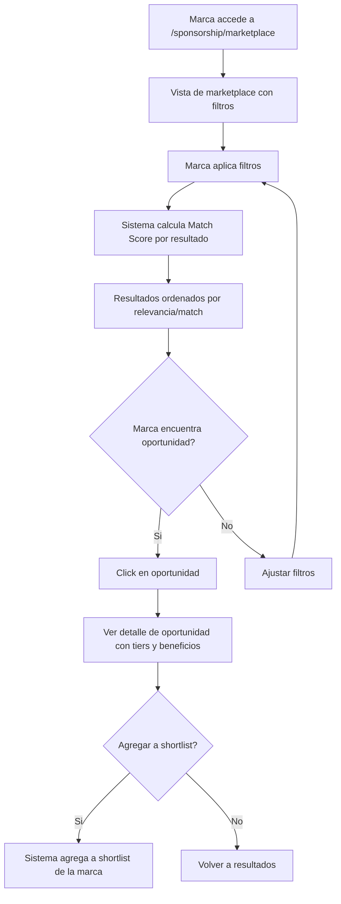
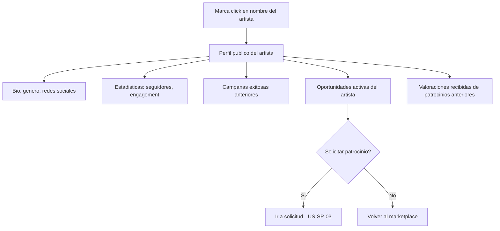
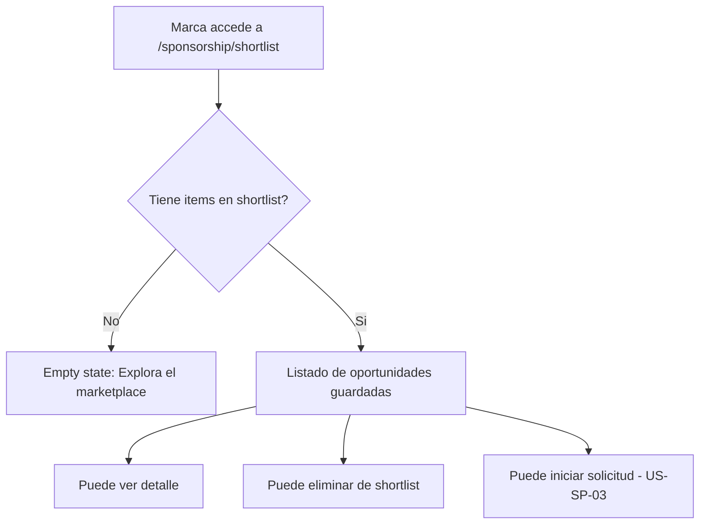
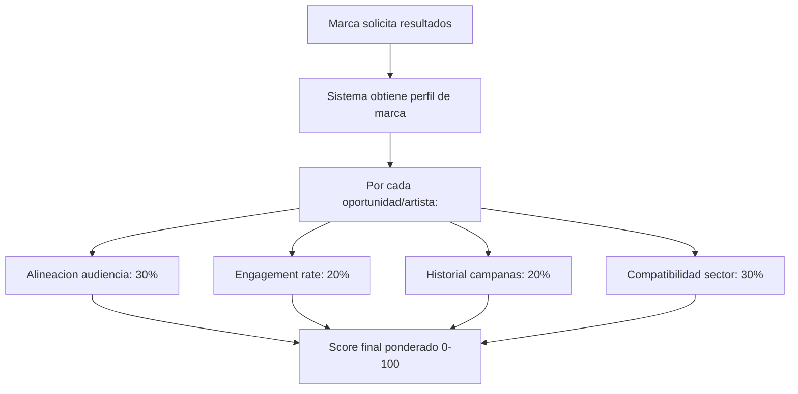

# US-SP-02: Marketplace - Descubrimiento y Matching Marca-Artista

> **ID:** US-SP-02
> **Feature Name:** `sp-marketplace-matching`
> **Prioridad:** Alta
> **Estimacion:** L (Large)
> **Modulo:** Sponsorship
> **Dependencias:** US-SP-01

---

## Historia de Usuario

**Como** marca registrada en la plataforma,
**Quiero** explorar oportunidades de patrocinio y artistas disponibles, filtrando por genero musical, tamano de audiencia, tipo de patrocinio, presupuesto y sector compatible, y ver un "Match Score" de alineacion marca-artista,
**Para** encontrar artistas que se alineen con los valores y objetivos de mi marca y tomar decisiones informadas de patrocinio.

---

## Actores

| Actor | Descripcion |
|-------|-------------|
| Marca | Explora el marketplace, filtra oportunidades, consulta perfiles publicos de artistas, gestiona shortlist |

---

## Precondiciones

- Marca tiene perfil activo (PerfilMarca creado en US-CL-01)
- Existen oportunidades publicadas por artistas (US-SP-01)
- Datos seed de maestras cargados

## Postcondiciones

- Marca puede descubrir oportunidades y artistas
- Marca puede agregar oportunidades a su shortlist
- Match Score calculado y visible por cada resultado

---

## Justificacion

El marketplace es el punto de encuentro entre marcas y artistas. Sin un sistema de descubrimiento con filtros relevantes y un indicador de compatibilidad (Match Score), las marcas no podrian encontrar eficientemente artistas alineados con su estrategia. El Match Score ahorra tiempo y mejora la calidad de las solicitudes de patrocinio.

---

## Flujo Principal: Explorar Marketplace de Patrocinios



### Filtros Disponibles

| Filtro | Tipo | Descripcion |
|--------|------|-------------|
| Genero musical | Multi-select (MaestraGeneroMusical) | Filtrar por genero del artista |
| Tamano audiencia | Select | Micro (<10K), Medio (10K-100K), Macro (>100K) |
| Tipo de patrocinio | Multi-select (MaestraTipoPatrocinio) | Campana, Artista, Tour, etc. |
| Rango presupuesto | Slider (min/max) | Filtrar por precio de tiers |
| Sector compatible | Multi-select (MaestraSectorMarca) | Sectores NO excluidos por el artista |
| Ubicacion geografica | Select (MaestraPais) | Pais del artista |
| Ordenar por | Select | Match Score, Precio, Audiencia, Fecha publicacion |

### Card de Resultado en Marketplace

| Dato | Fuente |
|------|--------|
| Nombre artista | Artista.NombreArtistico |
| Avatar/foto | Artista.UrlFoto |
| Genero musical | MaestraGeneroMusical.Nombre |
| Seguidores totales | Calculado (suma redes) |
| Match Score | Calculado (0-100%) |
| Titulo oportunidad | OportunidadPatrocinio.Titulo |
| Tipo patrocinio (badge) | MaestraTipoPatrocinio.Nombre |
| Precio desde | MIN(TierPatrocinio.Precio) |
| Num oportunidades activas | Contador |
| Audiencia estimada | OportunidadPatrocinio.AudienciaEstimada |

---

## Flujo Secundario: Ver Perfil Publico del Artista



### Secciones del Perfil Publico

| Seccion | Contenido |
|---------|-----------|
| Cabecera | Nombre artistico, genero, foto, ubicacion, verificado |
| Bio | Descripcion del artista, enlaces redes sociales |
| Estadisticas | Seguidores por red, engagement rate estimado, audiencia total |
| Historial campanas | Campanas de crowdfunding completadas (titulo, monto recaudado) |
| Oportunidades activas | Listado de oportunidades publicadas con precios |
| Reputacion | Puntuacion media, num valoraciones, badges |

---

## Flujo Secundario: Gestionar Shortlist



---

## Flujo Secundario: Calculo del Match Score



### Criterios del Match Score

| Criterio | Peso | Logica |
|----------|------|--------|
| Alineacion audiencia | 30% | Tamano audiencia vs presupuesto marca. Marcas grandes con artistas grandes = alto |
| Engagement rate | 20% | Ratio seguidores/interaccion estimado del artista |
| Historial campanas | 20% | Campanas completadas exitosamente + acuerdos previos completados |
| Compatibilidad sector | 30% | Sector de la marca NO esta en excluidos + esta en preferidos = maximo |

**Rangos de Match Score:**
- 80-100%: Excelente match (badge verde)
- 60-79%: Buen match (badge azul)
- 40-59%: Match moderado (badge amarillo)
- 0-39%: Match bajo (badge gris)

---

## Flujos Alternativos

| ID | Condicion | Accion |
|----|-----------|--------|
| FA-01 | No hay oportunidades que coincidan con filtros | Mostrar empty state con sugerencia de ampliar filtros |
| FA-02 | Marca no tiene perfil completo (sin sector) | Match Score se calcula sin componente de sector |
| FA-03 | Artista no tiene estadisticas de audiencia | Match Score se calcula sin componente de audiencia |
| FA-04 | Oportunidad tiene fecha limite vencida | No mostrar en marketplace (filtro automatico) |
| FA-05 | Sector de marca esta en sectores excluidos de la oportunidad | No mostrar esa oportunidad en resultados |

---

## Criterios de Aceptacion

| ID | Criterio | Metodo de Prueba |
|----|----------|------------------|
| AC-SP02-1 | Una marca autenticada puede acceder al marketplace y ver oportunidades publicadas con Match Score calculado | Acceder al marketplace, verificar listado con scores |
| AC-SP02-2 | Los filtros de genero musical, tamano audiencia, tipo patrocinio, presupuesto, sector y ubicacion funcionan correctamente | Aplicar cada filtro, verificar resultados filtrados |
| AC-SP02-3 | Las oportunidades donde el sector de la marca esta en sectores excluidos NO aparecen en los resultados | Crear oportunidad con exclusion, verificar que no aparece |
| AC-SP02-4 | El Match Score se calcula con los 4 criterios ponderados (audiencia 30%, engagement 20%, historial 20%, sector 30%) y muestra badge de color | Verificar calculo y badge por rango |
| AC-SP02-5 | La marca puede ver el perfil publico del artista con bio, estadisticas, campanas y oportunidades activas | Acceder a perfil publico, verificar secciones |
| AC-SP02-6 | La marca puede agregar y eliminar oportunidades de su shortlist | Agregar y eliminar, verificar en BD |
| AC-SP02-7 | Las oportunidades con fecha limite vencida no aparecen en el marketplace | Crear oportunidad vencida, verificar que no aparece |
| AC-SP02-8 | Los resultados se pueden ordenar por Match Score, Precio, Audiencia o Fecha de publicacion | Cambiar ordenamiento, verificar orden |

---

## Especificacion Tecnica

### API Endpoints

#### GET /api/sponsorship/marketplace

Explorar oportunidades de patrocinio con filtros y Match Score.

**Auth:** Marca (autenticado)

**Query params:** `generoMusicalIds`, `tamanoAudiencia`, `tipoPatrocinioIds`, `presupuestoMin`, `presupuestoMax`, `sectorIds`, `paisId`, `ordenarPor`, `page`, `pageSize`

**Response 200 OK:**
```json
{
  "data": {
    "items": [
      {
        "oportunidadId": "guid",
        "titulo": "Patrocinio gira nacional 2026",
        "tipoPatrocinioNombre": "Tour/Evento",
        "precioDesde": 5000.00,
        "precioHasta": 25000.00,
        "monedaNombre": "EUR",
        "audienciaEstimada": 50000,
        "esNegociable": true,
        "fechaLimite": "2026-06-01",
        "artista": {
          "id": "guid",
          "nombreArtistico": "Los Rockeros",
          "urlFoto": "https://cdn.weplay.com/artistas/rockeros.jpg",
          "generoMusicalNombre": "Rock",
          "seguidoresTotales": 85000,
          "numOportunidadesActivas": 2
        },
        "matchScore": 87,
        "matchScoreDetalle": {
          "audiencia": 25,
          "engagement": 18,
          "historial": 16,
          "sector": 28
        },
        "matchBadge": "excelente",
        "numTiers": 3,
        "enShortlist": false
      },
      {
        "oportunidadId": "guid",
        "titulo": "Sponsor album debut electro",
        "tipoPatrocinioNombre": "Content",
        "precioDesde": 1000.00,
        "precioHasta": 8000.00,
        "monedaNombre": "EUR",
        "audienciaEstimada": 15000,
        "esNegociable": true,
        "fechaLimite": "2026-08-15",
        "artista": {
          "id": "guid",
          "nombreArtistico": "DJ Pulse",
          "urlFoto": "https://cdn.weplay.com/artistas/djpulse.jpg",
          "generoMusicalNombre": "Electronica/EDM",
          "seguidoresTotales": 22000,
          "numOportunidadesActivas": 1
        },
        "matchScore": 64,
        "matchScoreDetalle": {
          "audiencia": 18,
          "engagement": 14,
          "historial": 10,
          "sector": 22
        },
        "matchBadge": "bueno",
        "numTiers": 2,
        "enShortlist": true
      }
    ],
    "totalCount": 15,
    "page": 1,
    "pageSize": 10
  },
  "messages": []
}
```

---

#### GET /api/sponsorship/marketplace/{oportunidadId}

Detalle de oportunidad desde la perspectiva de la marca (con tiers, beneficios y Match Score).

**Auth:** Marca (autenticado)

**Response 200 OK:**
```json
{
  "data": {
    "id": "guid",
    "titulo": "Patrocinio gira nacional 2026",
    "descripcion": "Buscamos marca patrocinadora para nuestra gira de 10 ciudades...",
    "tipoPatrocinioNombre": "Tour/Evento",
    "audienciaEstimada": 50000,
    "esNegociable": true,
    "fechaLimite": "2026-06-01",
    "sectoresPreferidos": ["Tecnologia", "Entretenimiento", "Deportes"],
    "artista": {
      "id": "guid",
      "nombreArtistico": "Los Rockeros",
      "urlFoto": "https://cdn.weplay.com/artistas/rockeros.jpg",
      "generoMusicalNombre": "Rock",
      "seguidoresTotales": 85000,
      "engagementRate": 4.2,
      "campanasCompletadas": 3
    },
    "tiers": [
      {
        "id": "guid",
        "nombre": "Bronce",
        "precio": 5000.00,
        "monedaNombre": "EUR",
        "esDestacado": false,
        "beneficios": [
          { "tipoBeneficioNombre": "Logo en campana", "cantidad": 10 },
          { "tipoBeneficioNombre": "Banner evento", "cantidad": 10 }
        ]
      },
      {
        "id": "guid",
        "nombre": "Plata",
        "precio": 12000.00,
        "monedaNombre": "EUR",
        "esDestacado": true,
        "beneficios": [
          { "tipoBeneficioNombre": "Logo en campana", "cantidad": 10 },
          { "tipoBeneficioNombre": "Post redes sociales", "cantidad": 5 },
          { "tipoBeneficioNombre": "Banner evento", "cantidad": 10 }
        ]
      },
      {
        "id": "guid",
        "nombre": "Oro",
        "precio": 25000.00,
        "monedaNombre": "EUR",
        "esDestacado": false,
        "beneficios": [
          { "tipoBeneficioNombre": "Logo en campana", "cantidad": 10 },
          { "tipoBeneficioNombre": "Post redes sociales", "cantidad": 5 },
          { "tipoBeneficioNombre": "Banner evento", "cantidad": 10 },
          { "tipoBeneficioNombre": "Merch co-branded", "cantidad": 500 }
        ]
      }
    ],
    "matchScore": 87,
    "matchBadge": "excelente",
    "enShortlist": false
  },
  "messages": []
}
```

---

#### GET /api/sponsorship/artistas/{artistaId}/perfil-publico

Perfil publico del artista para marcas.

**Auth:** Marca (autenticado)

**Response 200 OK:**
```json
{
  "data": {
    "id": "guid",
    "nombreArtistico": "Los Rockeros",
    "descripcion": "Banda de rock alternativo de Madrid...",
    "generoMusicalNombre": "Rock",
    "urlFoto": "https://cdn.weplay.com/artistas/rockeros.jpg",
    "paisNombre": "Espana",
    "esVerificado": true,
    "estadisticas": {
      "seguidoresTotales": 85000,
      "seguidoresInstagram": 45000,
      "seguidoresTikTok": 25000,
      "seguidoresYouTube": 15000,
      "engagementRate": 4.2,
      "audienciaTotal": 120000
    },
    "campanasCompletadas": [
      {
        "titulo": "Grabacion album debut",
        "montoRecaudado": 15000.00,
        "monedaNombre": "EUR",
        "estado": "Finalizada"
      }
    ],
    "oportunidadesActivas": [
      {
        "id": "guid",
        "titulo": "Patrocinio gira nacional 2026",
        "tipoPatrocinioNombre": "Tour/Evento",
        "precioDesde": 5000.00
      }
    ],
    "reputacion": {
      "puntuacionMedia": 4.5,
      "numValoraciones": 3,
      "porcentajeVolveriaTrabajar": 100
    }
  },
  "messages": []
}
```

---

#### POST /api/sponsorship/shortlist

Agregar oportunidad a shortlist de la marca.

**Auth:** Marca (autenticado)

**Request:**
```json
{
  "oportunidadId": "guid"
}
```

**Response 201 Created:**
```json
{
  "data": {
    "id": "guid",
    "oportunidadId": "guid",
    "oportunidadTitulo": "Patrocinio gira nacional 2026"
  },
  "messages": [
    { "message": "Oportunidad agregada a shortlist", "errorCode": "0001" }
  ]
}
```

---

#### DELETE /api/sponsorship/shortlist/{oportunidadId}

Eliminar oportunidad de la shortlist.

**Auth:** Marca (autenticado)

**Response 204 No Content**

---

#### GET /api/sponsorship/shortlist

Listar shortlist de la marca.

**Auth:** Marca (autenticado)

**Response 200 OK:**
```json
{
  "data": {
    "items": [
      {
        "oportunidadId": "guid",
        "titulo": "Patrocinio gira nacional 2026",
        "tipoPatrocinioNombre": "Tour/Evento",
        "precioDesde": 5000.00,
        "artista": {
          "nombreArtistico": "Los Rockeros",
          "generoMusicalNombre": "Rock"
        },
        "matchScore": 87,
        "fechaAgregado": "2026-02-17T10:00:00Z"
      }
    ],
    "totalCount": 3
  },
  "messages": []
}
```

---

### Modelo de Datos

```csharp
public class ShortlistPatrocinio
{
    public Guid Id { get; set; }
    public Guid PerfilMarcaId { get; set; }                     // FK -> PerfilMarca
    public OportunidadPatrocinioId OportunidadId { get; set; }  // FK -> OportunidadPatrocinio
    public DateTime FechaCreacion { get; set; }

    // Navigation
    public OportunidadPatrocinio Oportunidad { get; set; } = null!;
}
```

### Validaciones

```csharp
// Marketplace query - validaciones en el handler
RuleFor(x => x.PresupuestoMax)
    .GreaterThanOrEqualTo(x => x.PresupuestoMin)
    .When(x => x.PresupuestoMax.HasValue && x.PresupuestoMin.HasValue)
    .WithMessage("El presupuesto maximo debe ser >= al minimo")
    .WithErrorCode(ServiceResponseMessageType.Validation_InvalidRange);

RuleFor(x => x.PageSize)
    .InclusiveBetween(1, 50)
    .WithMessage("PageSize debe ser entre 1 y 50")
    .WithErrorCode(ServiceResponseMessageType.Validation_InvalidRange);

// AddToShortlistValidator
RuleFor(x => x.OportunidadId)
    .NotEmpty()
    .WithMessage("La oportunidad es obligatoria")
    .WithErrorCode(ServiceResponseMessageType.Validation_Required);
```

---

## Mockups / UI

### Marketplace de Patrocinios
```
+--------------------------------------------------+
|  Marketplace de Patrocinios                       |
+--------------------------------------------------+
|  Filtros:                                         |
|  Genero [Rock, Pop v]  Audiencia [Todos    v]    |
|  Tipo   [Todos     v]  Presup.  [1K - 50K   ]   |
|  Sector [Tecnologia v] Pais     [Todos     v]   |
|  Ordenar: [Match Score v]                         |
+--------------------------------------------------+
|                                                   |
|  +----------------------------------------------+|
|  | [Foto]  Los Rockeros          87% EXCELENTE  ||
|  |         Rock | 85K seguidores                ||
|  |                                              ||
|  |  Patrocinio gira nacional 2026               ||
|  |  Tour/Evento | Desde 5.000 EUR | Negociable  ||
|  |  3 tiers | 50K audiencia | Limite: 1 jun     ||
|  |                                              ||
|  |  [Ver detalle]  [+ Shortlist]                ||
|  +----------------------------------------------+|
|                                                   |
|  +----------------------------------------------+|
|  | [Foto]  DJ Pulse              64% BUENO      ||
|  |         Electronica | 22K seguidores         ||
|  |                                              ||
|  |  Sponsor album debut electro                 ||
|  |  Content | Desde 1.000 EUR | Negociable       ||
|  |  2 tiers | 15K audiencia | Limite: 15 ago     ||
|  |                                              ||
|  |  [Ver detalle]  [En shortlist]               ||
|  +----------------------------------------------+|
|                                                   |
|  Pagina 1 de 2  [< Anterior] [Siguiente >]       |
+--------------------------------------------------+
```

### Perfil Publico del Artista
```
+--------------------------------------------------+
|  [Foto]  Los Rockeros             VERIFICADO     |
|  Rock | Madrid, Espana                            |
+--------------------------------------------------+
|                                                   |
|  Banda de rock alternativo de Madrid. 10 anos    |
|  de trayectoria y 3 albums publicados.           |
|                                                   |
|  Instagram: 45K | TikTok: 25K | YouTube: 15K    |
|  Engagement rate: 4.2%                            |
|                                                   |
|  CAMPANAS COMPLETADAS                             |
|  - Grabacion album debut: 15.000 EUR recaudados  |
|                                                   |
|  OPORTUNIDADES ACTIVAS                            |
|  +----------------------------------------------+|
|  | Patrocinio gira nacional 2026               ||
|  | Tour/Evento | Desde 5.000 EUR                ||
|  | [Ver oportunidad]  [Solicitar patrocinio]    ||
|  +----------------------------------------------+|
|                                                   |
|  REPUTACION                                       |
|  4.5/5 (3 valoraciones)                          |
|  100% volveria a trabajar                         |
+--------------------------------------------------+
```

---

## Notas de Implementacion

- El Match Score se calcula en el backend para cada resultado del marketplace
- Para MVP, las estadisticas de seguidores se almacenan manualmente en el perfil del artista
- El calculo de Match Score es best-effort: si faltan datos, se redistribuye el peso entre los criterios disponibles
- La shortlist es por PerfilMarca + Oportunidad (constraint unico para evitar duplicados)
- El filtro de sectores excluidos se aplica automaticamente: si el sector de la marca esta en la lista de exclusion de una oportunidad, esa oportunidad no aparece
- La paginacion por defecto es de 10 items por pagina, maximo 50
- Handler CQRS: Command + Handler en mismo archivo, inyectar Service (no DbContext)
