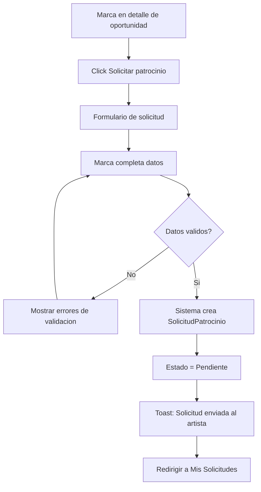
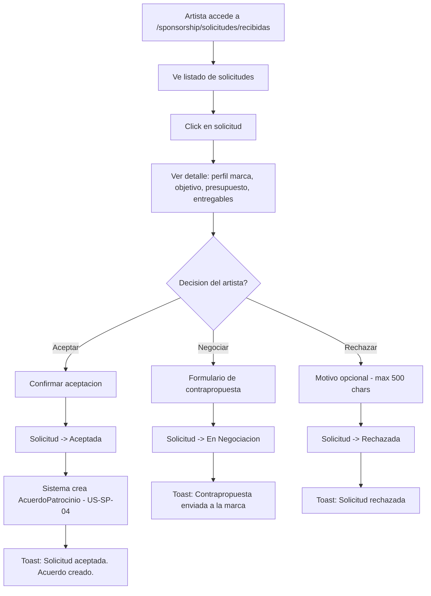
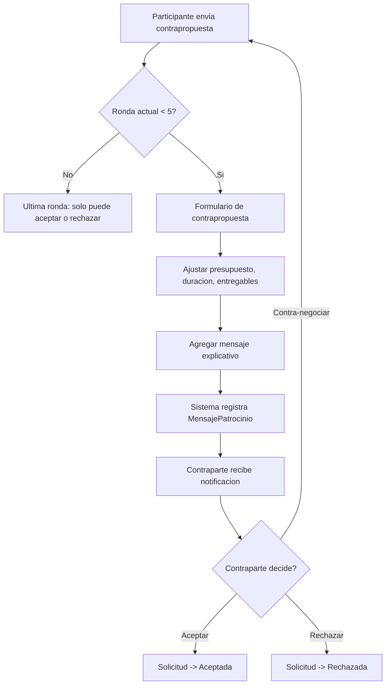
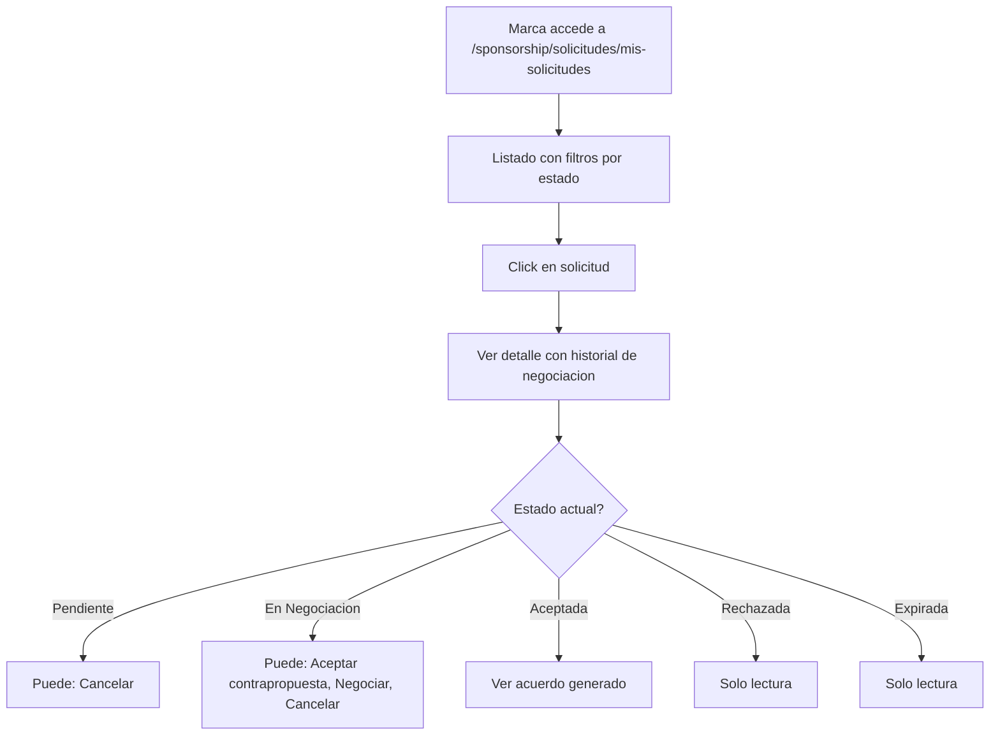

# US-SP-03: Solicitud y Negociacion de Patrocinio

> **ID:** US-SP-03
> **Feature Name:** `sp-solicitud-negociacion`
> **Prioridad:** Alta
> **Estimacion:** XL (Extra Large)
> **Modulo:** Sponsorship
> **Dependencias:** US-SP-02

---

## Historia de Usuario

**Como** marca registrada en la plataforma,
**Quiero** solicitar patrocinio a un artista indicando tipo de patrocinio, presupuesto, duracion y entregables esperados, y negociar los terminos del acuerdo con un maximo de 5 rondas de negociacion,
**Para** llegar a un acuerdo de patrocinio mutuamente beneficioso con el artista.

---

## Actores

| Actor | Descripcion |
|-------|-------------|
| Marca | Crea solicitudes de patrocinio, negocia terminos, cancela solicitudes |
| Artista | Revisa solicitudes recibidas, acepta, negocia o rechaza |

---

## Precondiciones

- Marca tiene perfil activo (PerfilMarca)
- Existe al menos una oportunidad publicada (US-SP-01) o artista con perfil publico
- Marca y artista estan autenticados

## Postcondiciones

- Solicitud de patrocinio creada y gestionada
- Si aceptada: se genera AcuerdoPatrocinio (US-SP-04)
- Si rechazada: artista puede continuar recibiendo otras solicitudes
- Historial de negociacion preservado

---

## Justificacion

La solicitud y negociacion son el puente entre el descubrimiento en el marketplace y la formalizacion de un acuerdo. Un flujo estructurado con rondas de negociacion limitadas asegura que ambas partes lleguen a un acuerdo en un tiempo razonable, evitando negociaciones interminables que diluyen el interes.

---

## Flujo Principal: Crear Solicitud de Patrocinio



### Tipos de Solicitud

| Tipo | Descripcion |
|------|-------------|
| Respuesta a oportunidad | Marca responde a una oportunidad publicada, seleccionando un tier |
| Propuesta directa | Marca propone patrocinio directo a un artista, sin oportunidad previa |

### Campos del Formulario

| Campo | Tipo | Obligatorio | Validacion |
|-------|------|-------------|------------|
| Oportunidad vinculada | Select (oportunidades del artista) | No | FK valida si se indica |
| Tier seleccionado | Select (tiers de la oportunidad) | No | FK valida si responde a oportunidad |
| Tipo de patrocinio | Select (MaestraTipoPatrocinio) | Si | Debe existir en maestras |
| Descripcion campana marca | Texto largo | Si | Min 20, max 4000 caracteres |
| Objetivo | Select (MaestraObjetivoMarca) | Si | Debe existir en maestras |
| Presupuesto propuesto | Decimal | Si | > 0 |
| Moneda | Select (MaestraMoneda) | Si | Debe existir en maestras |
| Duracion meses | Entero | Si | >= 1, <= 36 |
| Entregables esperados | JSON/Texto estructurado | No | Max 4000 caracteres |
| KPIs deseados | JSON/Texto estructurado | No | Max 2000 caracteres |
| Materiales que marca proporcionara | Texto largo | No | Max 2000 caracteres |
| Fecha inicio deseada | Date | No | >= hoy |

---

## Flujo Secundario: Artista Revisa Solicitud



### Datos Visibles para el Artista

| Dato | Fuente |
|------|--------|
| Nombre comercial | PerfilMarca.NombreComercial |
| Sector | MaestraSectorMarca.Nombre |
| Logo | PerfilMarca.UrlLogo |
| Sitio web | PerfilMarca.UrlSitioWeb |
| Descripcion marca | PerfilMarca.Descripcion |
| Objetivo de la solicitud | MaestraObjetivoMarca.Nombre |
| Presupuesto propuesto | SolicitudPatrocinio.PresupuestoPropuesto |
| Duracion | SolicitudPatrocinio.DuracionMeses |
| Entregables esperados | SolicitudPatrocinio.EntregablesEsperados |
| Alineacion valores | Evaluacion manual del artista |

---

## Flujo Secundario: Negociacion (max 5 rondas)



### Campos de Contrapropuesta

| Campo | Tipo | Obligatorio | Validacion |
|-------|------|-------------|------------|
| Presupuesto ajustado | Decimal | Si | > 0 |
| Duracion ajustada | Entero | No | >= 1, <= 36 |
| Entregables ajustados | JSON/Texto | No | Max 4000 caracteres |
| Mensaje | Texto largo | Si | Min 10, max 2000 caracteres |

### Reglas de Negociacion

- Maximo 5 rondas de negociacion (intercambios de propuestas)
- Cada ronda genera un `MensajePatrocinio` con los terminos propuestos
- En la ronda 5, solo se puede aceptar o rechazar (no negociar mas)
- El historico de todas las rondas es visible para ambas partes
- La solicitud expira automaticamente a los 30 dias sin respuesta

---

## Flujo Secundario: Marca Gestiona Sus Solicitudes



---

## Diagrama de Estados de la Solicitud

```
    +-------------+
    |  PENDIENTE  | <-- marca envia solicitud
    +------+------+
           |
    +------+------+------+
    |             |       |
 [aceptar]  [negociar] [rechazar]
    |             |       |
    v             v       v
+--------+ +-----------+ +-----------+
|ACEPTADA| |EN NEGOCIAC| | RECHAZADA |
+--------+ +-----+-----+ +-----------+
                  |
           +------+------+------+
           |             |       |
        [aceptar]  [negociar] [rechazar]
           |        (max 5)      |
           v             |       v
      +--------+         | +-----------+
      |ACEPTADA|         | | RECHAZADA |
      +--------+         | +-----------+
                         v
                   [ronda 5: solo aceptar/rechazar]

    * PENDIENTE --> EXPIRADA (30 dias sin respuesta)
    * PENDIENTE/EN NEGOCIACION --> CANCELADA (marca cancela)
```

---

## Flujos Alternativos

| ID | Condicion | Accion |
|----|-----------|--------|
| FA-01 | Marca ya tiene solicitud activa para la misma oportunidad | Error: Ya tienes una solicitud activa para esta oportunidad |
| FA-02 | Oportunidad esta pausada o cerrada | Error: Esta oportunidad no acepta solicitudes actualmente |
| FA-03 | Se alcanza ronda 5 de negociacion | Solo permitir aceptar o rechazar |
| FA-04 | Solicitud lleva 30 dias sin respuesta | Sistema marca como Expirada automaticamente |
| FA-05 | Marca cancela solicitud en estado Pendiente o En Negociacion | Solicitud -> Cancelada |
| FA-06 | Propuesta directa (sin oportunidad vinculada) | Formulario completo sin seleccion de tier |

---

## Criterios de Aceptacion

| ID | Criterio | Metodo de Prueba |
|----|----------|------------------|
| AC-SP03-1 | Una marca puede crear una solicitud de patrocinio respondiendo a una oportunidad publicada con tier seleccionado | Completar formulario, verificar en BD |
| AC-SP03-2 | Una marca puede crear una solicitud directa a un artista sin oportunidad vinculada | Crear solicitud directa, verificar en BD |
| AC-SP03-3 | La solicitud se crea en estado Pendiente y el artista la ve en sus solicitudes recibidas | Verificar estado y visibilidad |
| AC-SP03-4 | El artista puede aceptar una solicitud, lo cual genera automaticamente un AcuerdoPatrocinio | Aceptar solicitud, verificar acuerdo en BD |
| AC-SP03-5 | El artista puede negociar enviando una contrapropuesta con presupuesto ajustado y mensaje. La solicitud pasa a En Negociacion | Negociar, verificar estado y mensaje en BD |
| AC-SP03-6 | La negociacion permite maximo 5 rondas. En la ronda 5, solo se puede aceptar o rechazar | Completar 5 rondas, verificar que no permite nueva negociacion |
| AC-SP03-7 | El artista puede rechazar una solicitud con motivo opcional. La marca NO ve el motivo de rechazo | Rechazar, verificar que motivo no es visible para marca |
| AC-SP03-8 | Una marca no puede tener dos solicitudes activas para la misma oportunidad | Intentar duplicado, verificar error |
| AC-SP03-9 | Las solicitudes sin respuesta en 30 dias pasan automaticamente a estado Expirada | Verificar con job o servicio de expiracion |
| AC-SP03-10 | La marca puede cancelar una solicitud en estado Pendiente o En Negociacion | Cancelar, verificar estado |

---

## Especificacion Tecnica

### API Endpoints

#### POST /api/sponsorship/solicitudes

Crear solicitud de patrocinio.

**Auth:** Marca (autenticado)

**Request:**
```json
{
  "artistaId": "guid",
  "oportunidadId": "guid",
  "tierSeleccionadoId": "guid",
  "tipoPatrocinioId": 4,
  "descripcionCampanaMarca": "Estamos lanzando nuestra nueva linea de auriculares premium y buscamos asociarnos con artistas rock para llegar a su audiencia joven.",
  "objetivoMarcaId": 1,
  "presupuestoPropuesto": 12000.00,
  "monedaId": 1,
  "duracionMeses": 6,
  "entregablesEsperados": "[{\"tipo\": \"Post Instagram\", \"cantidad\": 3}, {\"tipo\": \"Story\", \"cantidad\": 5}, {\"tipo\": \"Mencion concierto\", \"cantidad\": 10}]",
  "kpisDeseados": "[{\"metrica\": \"Impresiones\", \"objetivo\": 100000}, {\"metrica\": \"Engagement Rate\", \"objetivo\": 5}]",
  "materialesProporcionados": "Productos para fotos, brief creativo, logos en alta resolucion, guia de marca.",
  "fechaInicioDeseada": "2026-04-01"
}
```

**Response 201 Created:**
```json
{
  "data": {
    "id": "guid",
    "artistaNombre": "Los Rockeros",
    "oportunidadTitulo": "Patrocinio gira nacional 2026",
    "estadoNombre": "Pendiente",
    "presupuestoPropuesto": 12000.00,
    "monedaNombre": "EUR",
    "fechaCreacion": "2026-02-17T10:00:00Z"
  },
  "messages": [
    { "message": "Solicitud enviada al artista", "errorCode": "0001" }
  ]
}
```

**Errores:**
- `400 Bad Request` - Validacion fallida o ya tiene solicitud activa para la oportunidad
- `401 Unauthorized` - No autenticado
- `403 Forbidden` - No tiene perfil de marca
- `404 Not Found` - Artista u oportunidad no existe

---

#### GET /api/sponsorship/solicitudes/mis-solicitudes

Listar solicitudes enviadas por la marca.

**Auth:** Marca (autenticado)

**Query params:** `estadoId`, `page`, `pageSize`

**Response 200 OK:**
```json
{
  "data": {
    "items": [
      {
        "id": "guid",
        "artistaNombre": "Los Rockeros",
        "oportunidadTitulo": "Patrocinio gira nacional 2026",
        "estadoNombre": "En Negociacion",
        "presupuestoPropuesto": 12000.00,
        "monedaNombre": "EUR",
        "rondaNegociacion": 2,
        "fechaCreacion": "2026-02-17T10:00:00Z",
        "fechaUltimaActividad": "2026-02-19T14:00:00Z"
      }
    ],
    "totalCount": 5,
    "page": 1,
    "pageSize": 10
  },
  "messages": []
}
```

---

#### GET /api/sponsorship/solicitudes/recibidas

Listar solicitudes recibidas por el artista.

**Auth:** Artista (autenticado)

**Query params:** `estadoId`, `oportunidadId`, `page`, `pageSize`

**Response 200 OK:**
```json
{
  "data": {
    "items": [
      {
        "id": "guid",
        "marcaNombreComercial": "SoundBrands Inc",
        "marcaSectorNombre": "Tecnologia",
        "marcaUrlLogo": "https://cdn.soundbrands.com/logo.png",
        "oportunidadTitulo": "Patrocinio gira nacional 2026",
        "tierNombre": "Plata",
        "estadoNombre": "Pendiente",
        "presupuestoPropuesto": 12000.00,
        "monedaNombre": "EUR",
        "objetivoNombre": "Brand Awareness",
        "fechaCreacion": "2026-02-17T10:00:00Z"
      }
    ],
    "totalCount": 3,
    "page": 1,
    "pageSize": 10
  },
  "messages": []
}
```

---

#### GET /api/sponsorship/solicitudes/{id}

Detalle de solicitud con historial de negociacion.

**Auth:** Participante (marca o artista)

**Response 200 OK:**
```json
{
  "data": {
    "id": "guid",
    "estadoId": 2,
    "estadoNombre": "En Negociacion",
    "rondaNegociacion": 2,
    "maxRondas": 5,
    "marca": {
      "id": "guid",
      "nombreComercial": "SoundBrands Inc",
      "sectorNombre": "Tecnologia",
      "urlLogo": "https://cdn.soundbrands.com/logo.png"
    },
    "artista": {
      "id": "guid",
      "nombreArtistico": "Los Rockeros"
    },
    "oportunidad": {
      "id": "guid",
      "titulo": "Patrocinio gira nacional 2026",
      "tierSeleccionado": {
        "nombre": "Plata",
        "precio": 12000.00
      }
    },
    "terminosActuales": {
      "presupuestoPropuesto": 10000.00,
      "monedaNombre": "EUR",
      "duracionMeses": 6,
      "entregablesEsperados": "[{\"tipo\": \"Post Instagram\", \"cantidad\": 3}]",
      "kpisDeseados": "[{\"metrica\": \"Impresiones\", \"objetivo\": 100000}]"
    },
    "mensajes": [
      {
        "id": "guid",
        "emisorTipo": "Marca",
        "emisorNombre": "SoundBrands Inc",
        "mensaje": "Nos interesa mucho tu gira. Proponemos 12.000 EUR por 6 meses con 3 posts y 5 stories.",
        "presupuestoRonda": 12000.00,
        "duracionRonda": 6,
        "ronda": 1,
        "fechaCreacion": "2026-02-17T10:00:00Z"
      },
      {
        "id": "guid",
        "emisorTipo": "Artista",
        "emisorNombre": "Los Rockeros",
        "mensaje": "Gracias por el interes. Dado el alcance de la gira (10 ciudades), el minimo para tier Plata seria 10.000 EUR. Podemos ajustar entregables.",
        "presupuestoRonda": 10000.00,
        "duracionRonda": 6,
        "ronda": 2,
        "fechaCreacion": "2026-02-19T14:00:00Z"
      }
    ],
    "miRol": "Marca",
    "puedoNegociar": true,
    "puedoAceptar": true,
    "puedoCancelar": true,
    "fechaCreacion": "2026-02-17T10:00:00Z",
    "fechaExpiracion": "2026-03-19T10:00:00Z"
  },
  "messages": []
}
```

---

#### PATCH /api/sponsorship/solicitudes/{id}/aceptar

Aceptar solicitud (artista acepta, o marca acepta contrapropuesta). **Transaccional:** actualiza solicitud y crea AcuerdoPatrocinio.

**Auth:** Participante (marca o artista)

**Response 200 OK:**
```json
{
  "data": {
    "solicitudId": "guid",
    "estadoNombre": "Aceptada",
    "acuerdoId": "guid"
  },
  "messages": [
    { "message": "Solicitud aceptada. Acuerdo de patrocinio creado.", "errorCode": "0002" }
  ]
}
```

---

#### PATCH /api/sponsorship/solicitudes/{id}/negociar

Enviar contrapropuesta.

**Auth:** Participante (marca o artista, turno del contrario al ultimo mensaje)

**Request:**
```json
{
  "presupuestoAjustado": 11000.00,
  "duracionAjustada": 6,
  "entregablesAjustados": "[{\"tipo\": \"Post Instagram\", \"cantidad\": 4}, {\"tipo\": \"Story\", \"cantidad\": 6}]",
  "mensaje": "Podemos llegar a 11.000 EUR si aumentamos a 4 posts y 6 stories. Creo que es un buen punto medio."
}
```

**Response 200 OK:**
```json
{
  "data": {
    "solicitudId": "guid",
    "estadoNombre": "En Negociacion",
    "rondaNegociacion": 3,
    "maxRondas": 5
  },
  "messages": [
    { "message": "Contrapropuesta enviada", "errorCode": "0002" }
  ]
}
```

**Errores:**
- `400 Bad Request` - Ronda maxima alcanzada o no es su turno
- `403 Forbidden` - No es participante

---

#### PATCH /api/sponsorship/solicitudes/{id}/rechazar

Rechazar solicitud.

**Auth:** Artista (propietario de la oportunidad)

**Request:**
```json
{
  "motivo": "El presupuesto no se alinea con nuestras expectativas para este tipo de patrocinio"
}
```

**Response 200 OK:**
```json
{
  "data": {
    "id": "guid",
    "estadoNombre": "Rechazada"
  },
  "messages": [
    { "message": "Solicitud rechazada", "errorCode": "0002" }
  ]
}
```

---

#### PATCH /api/sponsorship/solicitudes/{id}/cancelar

Cancelar solicitud (por la marca).

**Auth:** Marca (emisora de la solicitud)

**Response 200 OK:**
```json
{
  "data": {
    "id": "guid",
    "estadoNombre": "Cancelada"
  },
  "messages": [
    { "message": "Solicitud cancelada", "errorCode": "0002" }
  ]
}
```

---

#### POST /api/sponsorship/solicitudes/{id}/mensajes

Enviar mensaje dentro de la negociacion (sin contrapropuesta formal).

**Auth:** Participante (marca o artista)

**Request:**
```json
{
  "mensaje": "Tengo una pregunta sobre el alcance de las menciones en concierto. Se incluye pantalla LED?"
}
```

**Response 201 Created:**
```json
{
  "data": {
    "id": "guid",
    "emisorNombre": "SoundBrands Inc",
    "mensaje": "Tengo una pregunta sobre...",
    "fechaCreacion": "2026-02-20T10:00:00Z"
  },
  "messages": [
    { "message": "Mensaje enviado", "errorCode": "0001" }
  ]
}
```

---

### Modelo de Datos

```csharp
public class SolicitudPatrocinio
{
    public SolicitudPatrocinioId Id { get; set; }
    public Guid PerfilMarcaId { get; set; }                     // FK -> PerfilMarca
    public Guid ArtistaId { get; set; }                         // FK -> Artista
    public OportunidadPatrocinioId? OportunidadId { get; set; } // FK -> OportunidadPatrocinio (opcional)
    public Guid? TierSeleccionadoId { get; set; }               // FK -> TierPatrocinio (opcional)
    public int TipoPatrocinioId { get; set; }                   // FK -> MaestraTipoPatrocinio
    public int ObjetivoMarcaId { get; set; }                    // FK -> MaestraObjetivoMarca
    public int EstadoSolicitudId { get; set; }                  // FK -> MaestraEstadoSolicitudPatrocinio
    public int MonedaId { get; set; }                           // FK -> MaestraMoneda
    public string DescripcionCampanaMarca { get; set; } = null!;
    public decimal PresupuestoPropuesto { get; set; }
    public int DuracionMeses { get; set; }
    public string? EntregablesEsperados { get; set; }           // JSON
    public string? KpisDeseados { get; set; }                   // JSON
    public string? MaterialesProporcionados { get; set; }
    public DateTime? FechaInicioDeseada { get; set; }
    public int RondaNegociacion { get; set; }
    public string? MotivoRechazo { get; set; }
    public DateTime FechaCreacion { get; set; }
    public DateTime? FechaActualizacion { get; set; }
    public DateTime FechaExpiracion { get; set; }

    // Navigation
    public OportunidadPatrocinio? Oportunidad { get; set; }
    public ICollection<MensajePatrocinio> Mensajes { get; set; } = new List<MensajePatrocinio>();
    public AcuerdoPatrocinio? Acuerdo { get; set; }
}

public class MensajePatrocinio
{
    public Guid Id { get; set; }
    public SolicitudPatrocinioId SolicitudId { get; set; }      // FK -> SolicitudPatrocinio
    public string EmisiorUserId { get; set; } = null!;           // FK -> Identity.User
    public string EmisiorTipo { get; set; } = null!;             // "Marca" o "Artista"
    public string Mensaje { get; set; } = null!;
    public decimal? PresupuestoRonda { get; set; }
    public int? DuracionRonda { get; set; }
    public string? EntregablesRonda { get; set; }                // JSON
    public int? Ronda { get; set; }                              // null si es mensaje informativo
    public bool EsContrapropuesta { get; set; }
    public DateTime FechaCreacion { get; set; }

    // Navigation
    public SolicitudPatrocinio Solicitud { get; set; } = null!;
}
```

### Validaciones

```csharp
// CreateSolicitudPatrocinioValidator
RuleFor(x => x.ArtistaId)
    .NotEmpty().WithMessage("El artista es obligatorio").WithErrorCode(ServiceResponseMessageType.Validation_Required);

RuleFor(x => x.TipoPatrocinioId)
    .NotEmpty().WithMessage("El tipo de patrocinio es obligatorio").WithErrorCode(ServiceResponseMessageType.Validation_Required);

RuleFor(x => x.DescripcionCampanaMarca)
    .NotEmpty().WithMessage("La descripcion es obligatoria").WithErrorCode(ServiceResponseMessageType.Validation_Required)
    .MinimumLength(20).WithMessage("Minimo 20 caracteres").WithErrorCode(ServiceResponseMessageType.Validation_MinLength)
    .MaximumLength(4000).WithMessage("Maximo 4000 caracteres").WithErrorCode(ServiceResponseMessageType.Validation_MaxLength);

RuleFor(x => x.ObjetivoMarcaId)
    .NotEmpty().WithMessage("El objetivo es obligatorio").WithErrorCode(ServiceResponseMessageType.Validation_Required);

RuleFor(x => x.PresupuestoPropuesto)
    .GreaterThan(0).WithMessage("El presupuesto debe ser mayor a 0").WithErrorCode(ServiceResponseMessageType.Validation_InvalidRange);

RuleFor(x => x.MonedaId)
    .NotEmpty().WithMessage("La moneda es obligatoria").WithErrorCode(ServiceResponseMessageType.Validation_Required);

RuleFor(x => x.DuracionMeses)
    .InclusiveBetween(1, 36).WithMessage("La duracion debe ser entre 1 y 36 meses").WithErrorCode(ServiceResponseMessageType.Validation_InvalidRange);

// NegociarSolicitudValidator
RuleFor(x => x.PresupuestoAjustado)
    .GreaterThan(0).WithMessage("El presupuesto debe ser mayor a 0").WithErrorCode(ServiceResponseMessageType.Validation_InvalidRange);

RuleFor(x => x.Mensaje)
    .NotEmpty().WithMessage("El mensaje es obligatorio").WithErrorCode(ServiceResponseMessageType.Validation_Required)
    .MinimumLength(10).WithMessage("Minimo 10 caracteres").WithErrorCode(ServiceResponseMessageType.Validation_MinLength)
    .MaximumLength(2000).WithMessage("Maximo 2000 caracteres").WithErrorCode(ServiceResponseMessageType.Validation_MaxLength);

// RechazarSolicitudValidator
RuleFor(x => x.Motivo)
    .MaximumLength(500)
    .When(x => !string.IsNullOrEmpty(x.Motivo))
    .WithMessage("Maximo 500 caracteres")
    .WithErrorCode(ServiceResponseMessageType.Validation_MaxLength);
```

---

## Mockups / UI

### Formulario de Solicitud
```
+--------------------------------------------------+
|  Solicitar patrocinio a Los Rockeros              |
+--------------------------------------------------+
|                                                   |
|  Oportunidad: Patrocinio gira nacional 2026       |
|  Tier: [Plata (12.000 EUR)       v]              |
|                                                   |
|  Tipo de patrocinio *                             |
|  [Tour/Evento                    v]              |
|                                                   |
|  Objetivo *                                       |
|  [Brand Awareness                v]              |
|                                                   |
|  Describe tu campana *                            |
|  [Estamos lanzando nuestra nueva linea de      ]  |
|  [auriculares premium y buscamos...            ]  |
|                                                   |
|  Presupuesto *        Moneda    Duracion *        |
|  [12000]              [EUR v]   [6] meses         |
|                                                   |
|  Entregables esperados                            |
|  [3 posts Instagram, 5 stories, 10 menciones   ]  |
|                                                   |
|  KPIs deseados                                    |
|  [100K impresiones, 5% engagement              ]  |
|                                                   |
|  Materiales que proporcionaras                    |
|  [Productos, brief creativo, logos, guia marca ]  |
|                                                   |
|  Fecha inicio deseada                             |
|  [2026-04-01]                                     |
|                                                   |
|  [Cancelar]               [Enviar solicitud]      |
+--------------------------------------------------+
```

### Vista de Negociacion
```
+--------------------------------------------------+
|  Solicitud #SP-2026-001       EN NEGOCIACION     |
|  SoundBrands Inc <-> Los Rockeros                |
|  Ronda 2 de 5                                     |
+--------------------------------------------------+
|                                                   |
|  TERMINOS ACTUALES                                |
|  Presupuesto: 10.000 EUR | 6 meses               |
|  Entregables: 3 posts, 5 stories                  |
|                                                   |
|  HISTORIAL DE NEGOCIACION                         |
|  +----------------------------------------------+|
|  | R1 - SoundBrands (17 feb)                    ||
|  | Proponemos 12.000 EUR por 6 meses con        ||
|  | 3 posts y 5 stories.                         ||
|  | Presupuesto: 12.000 EUR                      ||
|  +----------------------------------------------+|
|  | R2 - Los Rockeros (19 feb)                   ||
|  | El minimo para tier Plata seria 10.000 EUR.  ||
|  | Podemos ajustar entregables.                 ||
|  | Presupuesto: 10.000 EUR                      ||
|  +----------------------------------------------+|
|                                                   |
|  [Aceptar terminos]  [Negociar]  [Rechazar]      |
+--------------------------------------------------+
```

### Listado Solicitudes Recibidas (Artista)
```
+--------------------------------------------------+
|  Solicitudes recibidas           3 pendientes     |
+--------------------------------------------------+
|  Filtros: [Estado v] [Oportunidad v]              |
+--------------------------------------------------+
|                                                   |
|  [Logo] SoundBrands Inc | Tecnologia              |
|  Patrocinio gira nacional 2026 | Tier: Plata     |
|  PENDIENTE | 12.000 EUR | Brand Awareness         |
|  Recibida hace 2 dias                             |
|                                                   |
|  [Logo] FashionBrand Co | Moda                    |
|  Patrocinio gira nacional 2026 | Tier: Oro       |
|  EN NEGOCIACION (R2/5) | 20.000 EUR | Engagement  |
|  Ultima actividad hace 1 dia                      |
|                                                   |
+--------------------------------------------------+
```

---

## Notas de Implementacion

- La aceptacion de solicitud es transaccional: actualiza solicitud y crea AcuerdoPatrocinio
- La negociacion funciona por turnos: despues de un mensaje de la marca, toca al artista, y viceversa
- Los mensajes informativos (sin contrapropuesta) no cuentan como ronda de negociacion
- MotivoRechazo se almacena pero no se muestra a la marca (privacidad del artista)
- La expiracion automatica (30 dias) se gestiona via job/servicio programado
- FechaExpiracion se calcula como FechaCreacion + 30 dias al crear la solicitud
- Entregables y KPIs se almacenan como JSON string para flexibilidad en el MVP
- Handler CQRS: Command + Handler en mismo archivo, inyectar Service (no DbContext)
