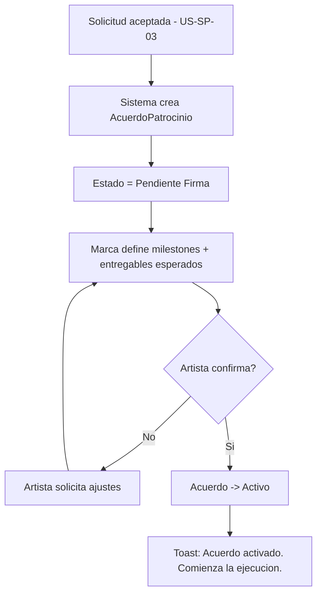
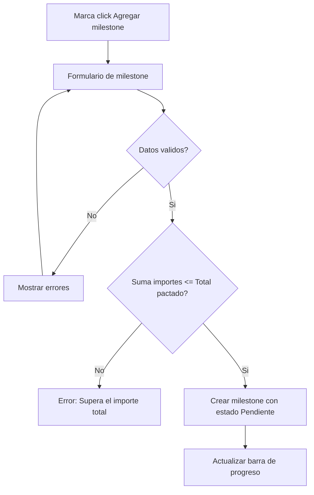
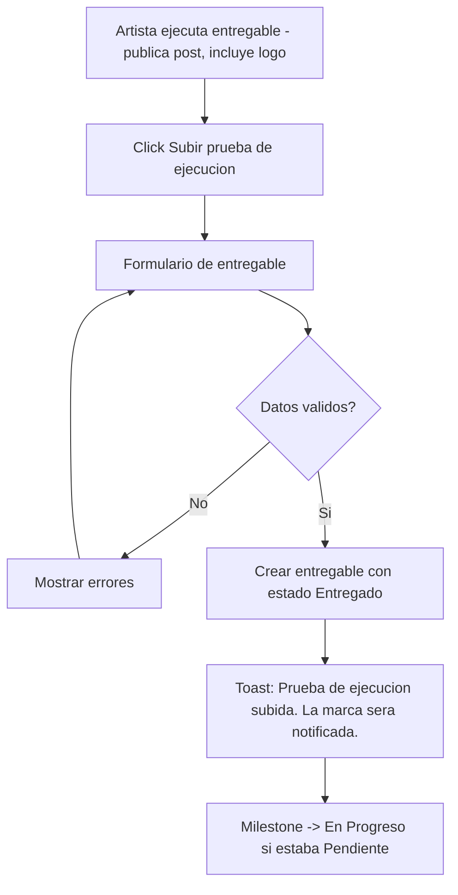
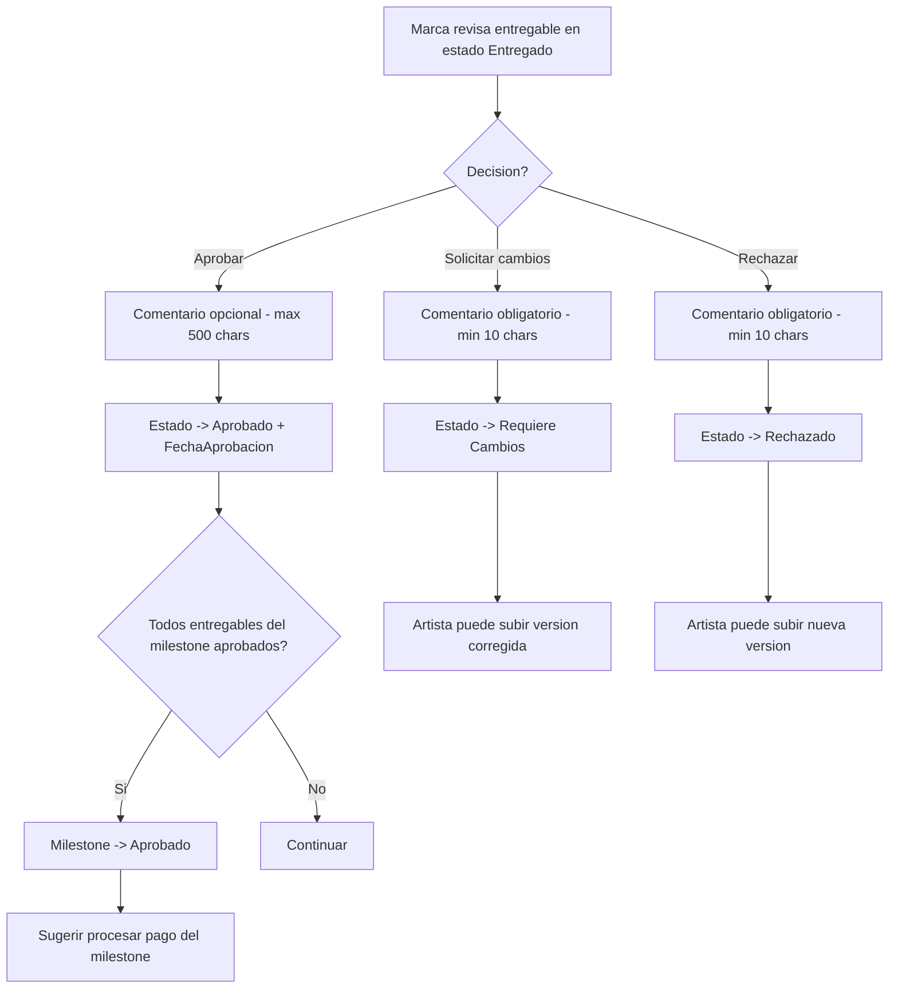
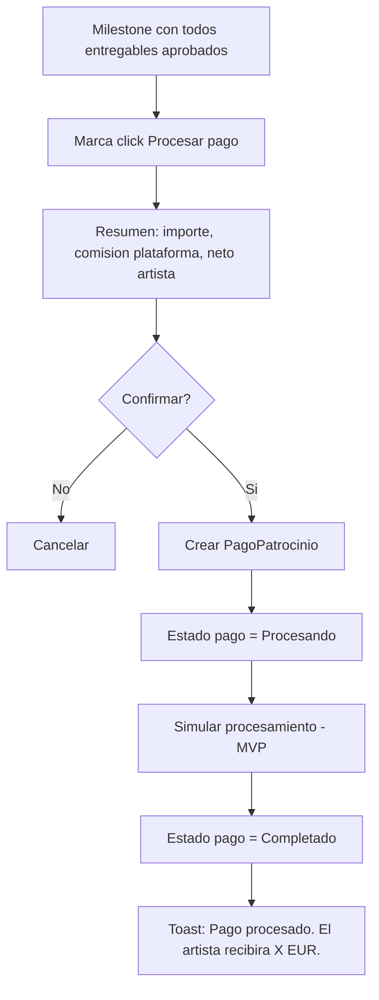
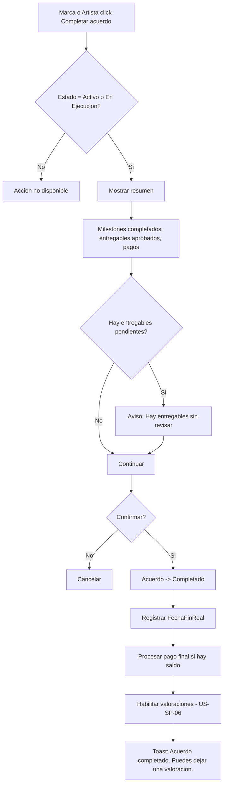
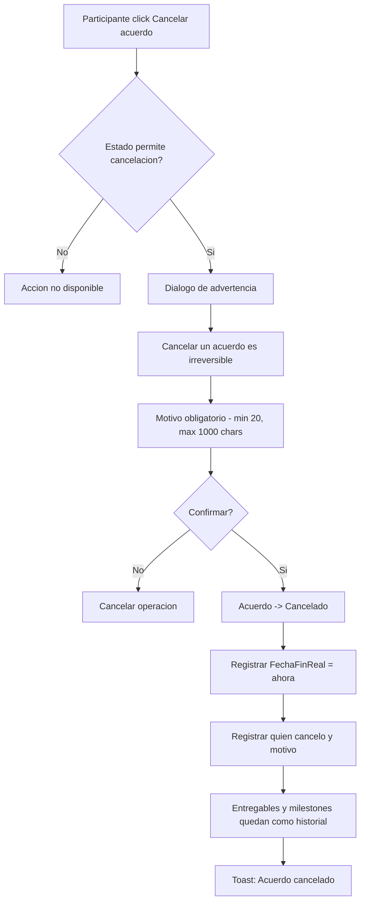
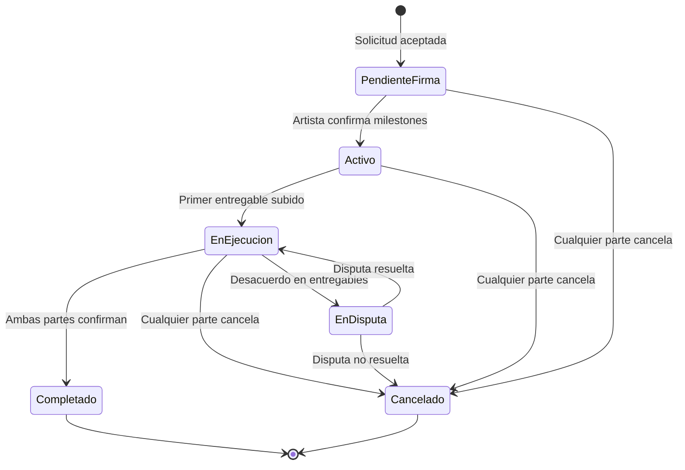

# US-SP-04: Acuerdo con Milestones y Entregables

> **ID:** US-SP-04
> **Feature Name:** `sp-acuerdo-milestones`
> **Prioridad:** Alta
> **Estimacion:** XXL (Extra Extra Large)
> **Modulo:** Sponsorship
> **Dependencias:** US-SP-03

---

## Historia de Usuario

**Como** artista o marca participante de un patrocinio acordado,
**Quiero** gestionar el ciclo de vida completo del acuerdo: definir milestones, ejecutar entregables (posts, logos, menciones), subir pruebas de ejecucion, aprobar o rechazar entregas, y procesar pagos por milestone,
**Para** llevar un control estructurado del patrocinio desde la formalizacion hasta la entrega final y el pago completo.

---

## Actores

| Actor | Descripcion |
|-------|-------------|
| Marca | Define milestones y entregables esperados, aprueba/rechaza entregas, procesa pagos |
| Artista | Ejecuta entregables, sube pruebas de ejecucion, confirma milestones |

---

## Precondiciones

- Existe una solicitud de patrocinio aceptada (US-SP-03)
- AcuerdoPatrocinio creado automaticamente al aceptar la solicitud

## Postcondiciones

- Acuerdo gestionado con milestones y entregables
- Entregables aprobados por la marca
- Pagos procesados por milestone
- Acuerdo completado o cancelado con historial preservado

---

## Justificacion

El acuerdo de patrocinio necesita un sistema de gestion que permita a ambas partes llevar un control detallado del progreso. Los milestones estructuran el trabajo en fases, los entregables permiten verificar el cumplimiento, y los pagos por milestone aseguran que el artista reciba compensacion proporcional al avance. Sin este flujo, no hay forma de garantizar transparencia ni rendicion de cuentas.

---

## Flujo Principal: Creacion Automatica del Acuerdo



### Datos del Acuerdo Generado Automaticamente

| Campo del Acuerdo | Origen |
|-------------------|--------|
| SolicitudId | De la solicitud aceptada |
| PerfilMarcaId | De la marca de la solicitud |
| ArtistaId | Del artista de la solicitud |
| OportunidadId | De la solicitud (si existe) |
| TierId | De la solicitud (si existe) |
| ImporteTotal | Ultimo presupuesto acordado en negociacion |
| MonedaId | De la solicitud |
| ComisionPlataforma | 10-15% sobre ImporteTotal |
| ImporteNetoArtista | ImporteTotal - ComisionPlataforma |
| EstadoAcuerdoId | "Pendiente Firma" |
| DuracionMeses | De la solicitud |
| FechaInicio | FechaInicioDeseada de la solicitud o hoy |
| FechaFinPrevista | FechaInicio + DuracionMeses |

---

## Flujo Secundario: Definir Milestones



### Campos por Milestone

| Campo | Tipo | Obligatorio | Validacion |
|-------|------|-------------|------------|
| Titulo | Texto (max 200) | Si | Min 3 caracteres |
| Descripcion | Texto largo | No | Max 1000 caracteres |
| Orden | Entero | Automatico | Secuencial |
| Importe parcial | Decimal | Si | > 0 |
| Porcentaje parcial | Decimal | Calculado | Automatico sobre el total |
| Fecha limite | Date | No | >= fecha inicio del acuerdo |
| Entregables esperados del milestone | Texto | No | Max 2000 caracteres |

**Reglas de milestones:**
- La suma de importes parciales debe ser <= ImporteTotal del acuerdo
- Se muestra en tiempo real: "Asignado: X de Y EUR (Z% del total)"
- Solo la marca puede crear/editar milestones mientras el acuerdo esta en `Pendiente Firma` o `Activo`
- Cada milestone se crea con estado `Pendiente`
- No se puede eliminar un milestone con entregables asociados

---

## Flujo Secundario: Ejecutar y Subir Entregable



### Campos del Formulario de Entregable

| Campo | Tipo | Obligatorio | Validacion |
|-------|------|-------------|------------|
| Titulo | Texto (max 200) | Si | Min 3 caracteres |
| Descripcion | Texto largo | No | Max 1000 caracteres |
| Tipo de prueba | Select | Si | Screenshot, URL, Video, Documento |
| URL del recurso | URL | Si | URL valida (screenshot, enlace post, etc.) |
| Milestone asociado | Select | Si | Debe ser milestone del mismo acuerdo |
| Fecha ejecucion | Date | Si | <= hoy |

---

## Flujo Secundario: Aprobar o Rechazar Entregable



**Reglas:**
- Solo la marca puede revisar entregables en estado `Entregado`
- **Aprobar**: Pasa a `Aprobado`. Se registra FechaAprobacion y ComentarioAprobacion (opcional)
- **Solicitar cambios**: Pasa a `Requiere Cambios`. Comentario obligatorio. Artista sube correccion
- **Rechazar**: Pasa a `Rechazado`. Comentario obligatorio. Artista puede subir nueva version
- Cuando todos los entregables de un milestone estan aprobados, el milestone pasa a `Aprobado`

---

## Flujo Secundario: Procesar Pago por Milestone



### Estructura de Pagos

| Tipo de Pago | Descripcion | Momento |
|--------------|-------------|---------|
| Anticipo | Porcentaje configurable del total (default 20%) | Al activar el acuerdo |
| Milestone | Importe parcial del milestone completado | Al aprobar todos los entregables |
| Pago Final | Saldo restante | Al completar el acuerdo |
| Bonus Performance | Bonus por resultados excepcionales | Opcional, post-completado |

### Comision Plataforma

- Rango: 10-15% sobre importe total del acuerdo
- Default MVP: 12%
- Se calcula al crear el acuerdo y se muestra en cada pago
- Desglose por pago: ImporteBruto, ComisionPlataforma, ImporteNeto

---

## Flujo Secundario: Completar Acuerdo



---

## Flujo Secundario: Cancelar Acuerdo



---

## Diagrama de Estados del Acuerdo



```
                +------------------+
                | PENDIENTE FIRMA  |
                +--------+---------+
                         |
                   [artista confirma]
                         |
                         v
                +------------------+
                |      ACTIVO      |
                +--------+---------+
                         |
                  [primer entregable]
                         |
                         v
                +------------------+
                |   EN EJECUCION   |
                +--------+---------+
                         |
            +------------+------------+
            |            |            |
       [completar]  [cancelar]  [disputa]
            |            |            |
            v            v            v
    +-----------+ +-----------+ +-----------+
    | COMPLETADO| | CANCELADO | | EN DISPUTA|
    +-----------+ +-----------+ +-----+-----+
                                      |
                               [resolver/cancelar]
```

## Diagrama de Estados del Milestone

```
    +-------------+
    |  PENDIENTE  | <-- marca define
    +------+------+
           |
    [artista sube entregable]
           |
           v
    +-------------+
    | EN PROGRESO |
    +------+------+
           |
    [artista sube ultimo entregable]
           |
           v
    +-------------+
    |  ENTREGADO  |
    +------+------+
           |
    [marca revisa]
           |
    +------+------+
    |             |
 [todo ok]   [rechaza alguno]
    |             |
    v             v
+----------+ +----------+
| APROBADO | |RECHAZADO | --> artista corrige --> EN PROGRESO
+----------+ +----------+
```

## Diagrama de Estados del Entregable

```
    +-------------+
    |  PENDIENTE  | <-- milestone definido
    +------+------+
           |
    [artista trabaja]
           |
           v
    +-------------+
    | EN PROGRESO |
    +------+------+
           |
    [artista sube prueba]
           |
           v
    +-------------+
    |  ENTREGADO  |
    +------+------+
           |
    [marca revisa]
           |
    +------+------+------+
    |             |       |
 [aprobar] [req.cambios] [rechazar]
    |             |       |
    v             v       v
+--------+ +-----------+ +----------+
|APROBADO| |REQ.CAMBIOS| |RECHAZADO |
+--------+ +-----+-----+ +----+-----+
                 |              |
          [artista corrige]  [nueva version]
                 |              |
                 v              v
           ENTREGADO       ENTREGADO
```

---

## Flujos Alternativos

| ID | Condicion | Accion |
|----|-----------|--------|
| FA-01 | Artista no confirma milestones en 15 dias | Aviso a ambas partes. Opcion de cancelar |
| FA-02 | Marca intenta crear milestone que excede total | Error en tiempo real: Asignado supera el total |
| FA-03 | Artista sube entregable sin milestone asociado | Error: Debe seleccionar un milestone |
| FA-04 | Marca completa acuerdo sin milestones definidos | Error: Debe haber al menos un milestone |
| FA-05 | Entregable rechazado: artista sube nueva version | Nuevo entregable vinculado al mismo milestone |
| FA-06 | Marca cancela acuerdo con pagos ya realizados | Pagos previos no se reembolsan en MVP |

---

## Criterios de Aceptacion

| ID | Criterio | Metodo de Prueba |
|----|----------|------------------|
| AC-SP04-1 | Al aceptar una solicitud, se crea un AcuerdoPatrocinio con todos los datos derivados y estado Pendiente Firma | Aceptar solicitud, verificar acuerdo en BD |
| AC-SP04-2 | La comision de plataforma se calcula automaticamente (12% por defecto) y se muestra ImporteTotal, ComisionPlataforma e ImporteNetoArtista | Verificar calculo en BD |
| AC-SP04-3 | La marca puede definir milestones con titulo, importe parcial y fecha limite. La suma de importes <= ImporteTotal | Crear milestones, verificar validacion |
| AC-SP04-4 | El artista puede confirmar los milestones propuestos, pasando el acuerdo a estado Activo | Confirmar, verificar estado |
| AC-SP04-5 | El artista puede subir pruebas de ejecucion (screenshot, URL) vinculadas a un milestone. Se crean con estado Entregado | Subir entregable, verificar en BD |
| AC-SP04-6 | La marca puede aprobar (comentario opcional), solicitar cambios (comentario obligatorio) o rechazar (comentario obligatorio) entregables | Probar las 3 acciones, verificar estados |
| AC-SP04-7 | Cuando todos los entregables de un milestone estan aprobados, el milestone pasa a Aprobado y se sugiere procesar pago | Aprobar todos, verificar estado milestone |
| AC-SP04-8 | La marca puede procesar pago por milestone con desglose: bruto, comision, neto artista | Procesar pago, verificar en BD |
| AC-SP04-9 | Al completar un acuerdo, se registra FechaFinReal, se procesa pago final y se habilitan valoraciones | Completar acuerdo, verificar todo |
| AC-SP04-10 | Al cancelar, se muestra dialogo de advertencia, se requiere motivo obligatorio, y el acuerdo pasa a Cancelado | Cancelar, verificar estados |
| AC-SP04-11 | Solo los dos participantes del acuerdo pueden ver su detalle. Otros usuarios reciben 403 | Intentar acceso no autorizado |
| AC-SP04-12 | La vista de detalle muestra cabecera, milestones con barra de progreso, entregables agrupados, pagos y timeline | Verificar todas las secciones visibles |

---

## Especificacion Tecnica

### API Endpoints

#### GET /api/sponsorship/acuerdos/mis-acuerdos

Listar acuerdos del usuario (como marca o artista).

**Auth:** Marca o Artista (autenticado)

**Query params:** `estadoId`, `rol` (marca/artista), `page`, `pageSize`

**Response 200 OK:**
```json
{
  "data": {
    "items": [
      {
        "id": "guid",
        "artistaNombre": "Los Rockeros",
        "marcaNombreComercial": "SoundBrands Inc",
        "oportunidadTitulo": "Patrocinio gira nacional 2026",
        "estadoNombre": "En Ejecucion",
        "importeTotal": 12000.00,
        "monedaNombre": "EUR",
        "progreso": 40,
        "milestonesCompletados": 1,
        "milestonesTotales": 3,
        "proximoDeadline": "2026-04-15",
        "miRol": "Marca"
      }
    ],
    "totalCount": 3,
    "page": 1,
    "pageSize": 10
  },
  "messages": []
}
```

---

#### GET /api/sponsorship/acuerdos/{id}

Detalle completo del acuerdo con milestones, entregables y pagos.

**Auth:** Participante del acuerdo

**Response 200 OK:**
```json
{
  "data": {
    "id": "guid",
    "estadoId": 3,
    "estadoNombre": "En Ejecucion",
    "importeTotal": 12000.00,
    "comisionPlataforma": 1440.00,
    "importeNetoArtista": 10560.00,
    "monedaNombre": "EUR",
    "duracionMeses": 6,
    "fechaInicio": "2026-04-01",
    "fechaFinPrevista": "2026-10-01",
    "fechaFinReal": null,
    "marca": {
      "id": "guid",
      "nombreComercial": "SoundBrands Inc",
      "urlLogo": "https://cdn.soundbrands.com/logo.png"
    },
    "artista": {
      "id": "guid",
      "nombreArtistico": "Los Rockeros"
    },
    "oportunidad": {
      "id": "guid",
      "titulo": "Patrocinio gira nacional 2026"
    },
    "milestones": [
      {
        "id": "guid",
        "titulo": "Fase 1 - Lanzamiento redes sociales",
        "descripcion": "3 posts + 5 stories durante primeros 2 meses",
        "orden": 1,
        "importeParcial": 4000.00,
        "porcentajeParcial": 33.3,
        "estadoNombre": "Aprobado",
        "fechaLimite": "2026-05-31",
        "fechaCompletado": "2026-05-28T16:00:00Z",
        "entregables": [
          {
            "id": "guid",
            "titulo": "Post Instagram - Lanzamiento auriculares",
            "tipoPrueba": "Screenshot",
            "urlRecurso": "https://drive.google.com/screenshot1.png",
            "estadoNombre": "Aprobado",
            "fechaEjecucion": "2026-04-15",
            "fechaAprobacion": "2026-04-16T10:00:00Z",
            "comentarioAprobacion": "Excelente post, gran engagement"
          }
        ]
      },
      {
        "id": "guid",
        "titulo": "Fase 2 - Presencia en conciertos",
        "descripcion": "Banners y menciones en 5 conciertos",
        "orden": 2,
        "importeParcial": 5000.00,
        "porcentajeParcial": 41.7,
        "estadoNombre": "En Progreso",
        "fechaLimite": "2026-08-31",
        "fechaCompletado": null,
        "entregables": [
          {
            "id": "guid",
            "titulo": "Foto banner concierto Madrid",
            "tipoPrueba": "Screenshot",
            "urlRecurso": "https://drive.google.com/banner-madrid.jpg",
            "estadoNombre": "Entregado",
            "fechaEjecucion": "2026-06-15",
            "fechaAprobacion": null
          }
        ]
      },
      {
        "id": "guid",
        "titulo": "Fase 3 - Cierre y reportes",
        "descripcion": "Resumen final de metricas y contenido",
        "orden": 3,
        "importeParcial": 3000.00,
        "porcentajeParcial": 25.0,
        "estadoNombre": "Pendiente",
        "fechaLimite": "2026-09-30",
        "fechaCompletado": null,
        "entregables": []
      }
    ],
    "pagos": [
      {
        "id": "guid",
        "tipoPagoNombre": "Anticipo",
        "importeBruto": 2400.00,
        "comisionPlataforma": 288.00,
        "importeNeto": 2112.00,
        "estadoPagoNombre": "Completado",
        "fechaPago": "2026-04-01T10:00:00Z"
      },
      {
        "id": "guid",
        "tipoPagoNombre": "Milestone",
        "milestoneNombre": "Fase 1 - Lanzamiento redes sociales",
        "importeBruto": 4000.00,
        "comisionPlataforma": 480.00,
        "importeNeto": 3520.00,
        "estadoPagoNombre": "Completado",
        "fechaPago": "2026-05-29T10:00:00Z"
      }
    ],
    "importeAsignado": 12000.00,
    "porcentajeAsignado": 100,
    "importePagado": 6400.00,
    "importePendiente": 5600.00,
    "miRol": "Marca",
    "timeline": [
      {
        "accion": "Entregable subido: Foto banner concierto Madrid",
        "fecha": "2026-06-15T14:00:00Z",
        "actor": "Los Rockeros"
      },
      {
        "accion": "Pago procesado: Fase 1 (3.520 EUR neto)",
        "fecha": "2026-05-29T10:00:00Z",
        "actor": "SoundBrands Inc"
      },
      {
        "accion": "Milestone completado: Fase 1",
        "fecha": "2026-05-28T16:00:00Z",
        "actor": "Sistema"
      }
    ]
  },
  "messages": []
}
```

---

#### POST /api/sponsorship/acuerdos/{id}/milestones

Crear milestone en el acuerdo.

**Auth:** Marca (participante)

**Request:**
```json
{
  "titulo": "Fase 1 - Lanzamiento redes sociales",
  "descripcion": "3 posts + 5 stories durante primeros 2 meses",
  "importeParcial": 4000.00,
  "fechaLimite": "2026-05-31",
  "entregablesEsperados": "3 posts en Instagram, 5 stories en TikTok, 2 reels"
}
```

**Response 201 Created:**
```json
{
  "data": {
    "id": "guid",
    "titulo": "Fase 1 - Lanzamiento redes sociales",
    "orden": 1,
    "importeParcial": 4000.00,
    "porcentajeParcial": 33.3,
    "importeAsignadoTotal": 4000.00
  },
  "messages": [
    { "message": "Milestone creado", "errorCode": "0001" }
  ]
}
```

---

#### PUT /api/sponsorship/acuerdos/{id}/milestones/{mId}

Editar milestone (solo si no completado).

**Auth:** Marca (participante)

**Request:** (mismos campos que POST)

**Response 200 OK:**
```json
{
  "data": {
    "id": "guid",
    "titulo": "Fase 1 - Lanzamiento redes (actualizado)",
    "fechaActualizacion": "2026-04-05T09:00:00Z"
  },
  "messages": [
    { "message": "Milestone actualizado", "errorCode": "0002" }
  ]
}
```

---

#### POST /api/sponsorship/acuerdos/{id}/entregables

Subir prueba de ejecucion de entregable.

**Auth:** Artista (participante)

**Request:**
```json
{
  "titulo": "Post Instagram - Lanzamiento auriculares",
  "descripcion": "Post con foto de producto en estudio de grabacion",
  "tipoPrueba": "Screenshot",
  "urlRecurso": "https://drive.google.com/screenshot1.png",
  "milestoneId": "guid",
  "fechaEjecucion": "2026-04-15"
}
```

**Response 201 Created:**
```json
{
  "data": {
    "id": "guid",
    "titulo": "Post Instagram - Lanzamiento auriculares",
    "estadoNombre": "Entregado",
    "fechaCreacion": "2026-04-15T14:00:00Z"
  },
  "messages": [
    { "message": "Prueba de ejecucion subida. La marca sera notificada.", "errorCode": "0001" }
  ]
}
```

---

#### PATCH /api/sponsorship/entregables/{id}/aprobar

Aprobar entregable.

**Auth:** Marca (participante)

**Request:**
```json
{
  "comentario": "Excelente post, gran engagement. 2.500 likes en 24h."
}
```

**Response 200 OK:**
```json
{
  "data": {
    "id": "guid",
    "estadoNombre": "Aprobado",
    "fechaAprobacion": "2026-04-16T10:00:00Z",
    "todosAprobadosEnMilestone": true,
    "milestoneEstadoNombre": "Aprobado"
  },
  "messages": [
    { "message": "Entregable aprobado", "errorCode": "0002" }
  ]
}
```

---

#### PATCH /api/sponsorship/entregables/{id}/rechazar

Rechazar o solicitar cambios en entregable.

**Auth:** Marca (participante)

**Request:**
```json
{
  "comentario": "El logo no es visible en la foto. Necesita mayor protagonismo del producto.",
  "requiereCambios": true
}
```

**Response 200 OK:**
```json
{
  "data": {
    "id": "guid",
    "estadoNombre": "Requiere Cambios"
  },
  "messages": [
    { "message": "Se han solicitado cambios al artista.", "errorCode": "0002" }
  ]
}
```

---

#### POST /api/sponsorship/acuerdos/{id}/pagos

Procesar pago por milestone.

**Auth:** Marca (participante) o Sistema (anticipo automatico)

**Request:**
```json
{
  "tipoPagoId": 2,
  "milestoneId": "guid",
  "importeBruto": 4000.00
}
```

**Response 201 Created:**
```json
{
  "data": {
    "id": "guid",
    "tipoPagoNombre": "Milestone",
    "importeBruto": 4000.00,
    "comisionPlataforma": 480.00,
    "importeNeto": 3520.00,
    "estadoPagoNombre": "Completado"
  },
  "messages": [
    { "message": "Pago procesado. El artista recibira 3.520,00 EUR.", "errorCode": "0001" }
  ]
}
```

---

#### PATCH /api/sponsorship/acuerdos/{id}/completar

Completar acuerdo.

**Auth:** Marca o Artista (participante, ambos deben confirmar)

**Response 200 OK:**
```json
{
  "data": {
    "id": "guid",
    "estadoNombre": "Completado",
    "fechaFinReal": "2026-09-28T16:00:00Z",
    "importeTotalPagado": 12000.00
  },
  "messages": [
    { "message": "Acuerdo completado. Puedes dejar una valoracion.", "errorCode": "0002" }
  ]
}
```

---

#### PATCH /api/sponsorship/acuerdos/{id}/cancelar

Cancelar acuerdo.

**Auth:** Participante del acuerdo

**Request:**
```json
{
  "motivo": "Cambio en la estrategia de marca. Lamentamos no poder continuar con el patrocinio."
}
```

**Response 200 OK:**
```json
{
  "data": {
    "id": "guid",
    "estadoNombre": "Cancelado",
    "fechaFinReal": "2026-06-01T12:00:00Z"
  },
  "messages": [
    { "message": "Acuerdo cancelado", "errorCode": "0002" }
  ]
}
```

---

### Modelo de Datos

```csharp
public class AcuerdoPatrocinio
{
    public AcuerdoPatrocinioId Id { get; set; }
    public SolicitudPatrocinioId SolicitudId { get; set; }       // FK -> SolicitudPatrocinio
    public Guid PerfilMarcaId { get; set; }                      // FK -> PerfilMarca
    public Guid ArtistaId { get; set; }                          // FK -> Artista
    public OportunidadPatrocinioId? OportunidadId { get; set; }  // FK -> OportunidadPatrocinio
    public Guid? TierId { get; set; }                            // FK -> TierPatrocinio
    public int EstadoAcuerdoId { get; set; }                     // FK -> MaestraEstadoAcuerdoPatrocinio
    public int MonedaId { get; set; }                            // FK -> MaestraMoneda
    public decimal ImporteTotal { get; set; }
    public decimal ComisionPlataformaPorcentaje { get; set; }
    public decimal ComisionPlataforma { get; set; }
    public decimal ImporteNetoArtista { get; set; }
    public int DuracionMeses { get; set; }
    public DateTime FechaInicio { get; set; }
    public DateTime? FechaFinPrevista { get; set; }
    public DateTime? FechaFinReal { get; set; }
    public string? MotivoCancelacion { get; set; }
    public string? CanceladoPor { get; set; }                    // UserId
    public DateTime FechaCreacion { get; set; }
    public DateTime? FechaActualizacion { get; set; }

    // Navigation
    public SolicitudPatrocinio Solicitud { get; set; } = null!;
    public ICollection<MilestonePatrocinio> Milestones { get; set; } = new List<MilestonePatrocinio>();
    public ICollection<EntregablePatrocinio> Entregables { get; set; } = new List<EntregablePatrocinio>();
    public ICollection<PagoPatrocinio> Pagos { get; set; } = new List<PagoPatrocinio>();
    public ICollection<MetricaPatrocinio> Metricas { get; set; } = new List<MetricaPatrocinio>();
    public ICollection<ValoracionPatrocinio> Valoraciones { get; set; } = new List<ValoracionPatrocinio>();
}

public class MilestonePatrocinio
{
    public MilestonePatrocinioId Id { get; set; }
    public AcuerdoPatrocinioId AcuerdoId { get; set; }          // FK -> AcuerdoPatrocinio
    public int EstadoMilestoneId { get; set; }                   // FK -> MaestraEstadoMilestone
    public string Titulo { get; set; } = null!;
    public string? Descripcion { get; set; }
    public int Orden { get; set; }
    public decimal ImporteParcial { get; set; }
    public DateTime? FechaLimite { get; set; }
    public DateTime? FechaCompletado { get; set; }
    public string? EntregablesEsperados { get; set; }
    public DateTime FechaCreacion { get; set; }
    public DateTime? FechaActualizacion { get; set; }

    // Navigation
    public AcuerdoPatrocinio Acuerdo { get; set; } = null!;
    public ICollection<EntregablePatrocinio> Entregables { get; set; } = new List<EntregablePatrocinio>();
}

public class EntregablePatrocinio
{
    public EntregablePatrocinioId Id { get; set; }
    public AcuerdoPatrocinioId AcuerdoId { get; set; }          // FK -> AcuerdoPatrocinio
    public MilestonePatrocinioId MilestoneId { get; set; }       // FK -> MilestonePatrocinio
    public int EstadoEntregableId { get; set; }                  // FK -> MaestraEstadoEntregable
    public string Titulo { get; set; } = null!;
    public string? Descripcion { get; set; }
    public string TipoPrueba { get; set; } = null!;              // Screenshot, URL, Video, Documento
    public string UrlRecurso { get; set; } = null!;
    public DateTime FechaEjecucion { get; set; }
    public string? ComentarioAprobacion { get; set; }
    public string? ComentarioRechazo { get; set; }
    public DateTime? FechaAprobacion { get; set; }
    public DateTime FechaCreacion { get; set; }
    public DateTime? FechaActualizacion { get; set; }

    // Navigation
    public AcuerdoPatrocinio Acuerdo { get; set; } = null!;
    public MilestonePatrocinio Milestone { get; set; } = null!;
}

public class PagoPatrocinio
{
    public Guid Id { get; set; }
    public AcuerdoPatrocinioId AcuerdoId { get; set; }          // FK -> AcuerdoPatrocinio
    public MilestonePatrocinioId? MilestoneId { get; set; }      // FK -> MilestonePatrocinio (null para anticipo)
    public int TipoPagoId { get; set; }                          // FK -> MaestraTipoPago
    public int EstadoPagoId { get; set; }                        // FK -> MaestraEstadoPago
    public decimal ImporteBruto { get; set; }
    public decimal ComisionPlataforma { get; set; }
    public decimal ImporteNeto { get; set; }
    public DateTime? FechaPago { get; set; }
    public DateTime FechaCreacion { get; set; }

    // Navigation
    public AcuerdoPatrocinio Acuerdo { get; set; } = null!;
    public MilestonePatrocinio? Milestone { get; set; }
}
```

### Validaciones

```csharp
// CreateMilestonePatrocinioValidator
RuleFor(x => x.Titulo)
    .NotEmpty().WithMessage("El titulo es obligatorio").WithErrorCode(ServiceResponseMessageType.Validation_Required)
    .MinimumLength(3).WithMessage("Minimo 3 caracteres").WithErrorCode(ServiceResponseMessageType.Validation_MinLength)
    .MaximumLength(200).WithMessage("Maximo 200 caracteres").WithErrorCode(ServiceResponseMessageType.Validation_MaxLength);

RuleFor(x => x.ImporteParcial)
    .GreaterThan(0).WithMessage("El importe parcial debe ser mayor a 0").WithErrorCode(ServiceResponseMessageType.Validation_InvalidRange);

// CreateEntregablePatrocinioValidator
RuleFor(x => x.Titulo)
    .NotEmpty().WithMessage("El titulo es obligatorio").WithErrorCode(ServiceResponseMessageType.Validation_Required)
    .MinimumLength(3).WithMessage("Minimo 3 caracteres").WithErrorCode(ServiceResponseMessageType.Validation_MinLength)
    .MaximumLength(200).WithMessage("Maximo 200 caracteres").WithErrorCode(ServiceResponseMessageType.Validation_MaxLength);

RuleFor(x => x.UrlRecurso)
    .NotEmpty().WithMessage("La URL de la prueba es obligatoria").WithErrorCode(ServiceResponseMessageType.Validation_Required)
    .Must(BeAValidUrl).WithMessage("Debe ser una URL valida").WithErrorCode(ServiceResponseMessageType.Validation_InvalidUrl);

RuleFor(x => x.MilestoneId)
    .NotEmpty().WithMessage("Debe seleccionar un milestone").WithErrorCode(ServiceResponseMessageType.Validation_Required);

RuleFor(x => x.FechaEjecucion)
    .LessThanOrEqualTo(DateTime.UtcNow.Date).WithMessage("La fecha de ejecucion no puede ser futura").WithErrorCode(ServiceResponseMessageType.Validation_InvalidRange);

// RechazarEntregablePatrocinioValidator
RuleFor(x => x.Comentario)
    .NotEmpty().WithMessage("El comentario es obligatorio al rechazar").WithErrorCode(ServiceResponseMessageType.Validation_Required)
    .MinimumLength(10).WithMessage("Minimo 10 caracteres").WithErrorCode(ServiceResponseMessageType.Validation_MinLength);

// CancelarAcuerdoPatrocinioValidator
RuleFor(x => x.Motivo)
    .NotEmpty().WithMessage("El motivo es obligatorio").WithErrorCode(ServiceResponseMessageType.Validation_Required)
    .MinimumLength(20).WithMessage("Minimo 20 caracteres").WithErrorCode(ServiceResponseMessageType.Validation_MinLength)
    .MaximumLength(1000).WithMessage("Maximo 1000 caracteres").WithErrorCode(ServiceResponseMessageType.Validation_MaxLength);
```

---

## Mockups / UI

### Detalle de Acuerdo
```
+--------------------------------------------------+
|  Patrocinio Gira Nacional 2026       EN EJECUCION|
|  SoundBrands Inc <-> Los Rockeros                |
|  12.000 EUR | 6 meses | Abr - Oct 2026          |
|  Comision: 12% (1.440 EUR) | Neto: 10.560 EUR   |
+--------------------------------------------------+
|                                                   |
|  MILESTONES                    [+ Agregar]        |
|  Asignado: 12.000 de 12.000 EUR (100%)           |
|  [========================] 100%                  |
|                                                   |
|  1. Fase 1 - Redes sociales    4.000 EUR APROBADO|
|     Limite: 31 may | Completado: 28 may          |
|     Entregables:                                  |
|     - Post IG lanzamiento        APROBADO        |
|     - Story TikTok #1            APROBADO        |
|     - Story TikTok #2            APROBADO        |
|     Pago: 3.520 EUR neto - COMPLETADO            |
|                                                   |
|  2. Fase 2 - Conciertos        5.000 EUR PROGRESO|
|     Limite: 31 ago | En progreso                  |
|     Entregables:                                  |
|     - Foto banner Madrid         ENTREGADO       |
|       [Aprobar] [Req.cambios] [Rechazar]          |
|                                                   |
|  3. Fase 3 - Cierre            3.000 EUR PENDIENT|
|     Limite: 30 sep                                |
|                                                   |
|  PAGOS                                            |
|  +------+ +----------+ +--------+                 |
|  |Antici| |Milestone 1| |Pendien|                 |
|  |2.112E| |3.520 EUR  | |5.600 E|                 |
|  | DONE | |   DONE    | |  ...  |                 |
|  +------+ +----------+ +--------+                 |
|                                                   |
|  TIMELINE                                         |
|  - Entregable subido (hace 1 dia)                 |
|  - Pago Fase 1 procesado (hace 3 dias)            |
|  - Milestone 1 completado (hace 4 dias)           |
|                                                   |
|  [Completar acuerdo]  [Cancelar acuerdo]          |
+--------------------------------------------------+
```

### Formulario de Entregable (Artista)
```
+--------------------------------------------------+
|  Subir prueba de ejecucion                        |
+--------------------------------------------------+
|                                                   |
|  Milestone *                                      |
|  [Fase 2 - Conciertos             v]             |
|                                                   |
|  Titulo *                                         |
|  [Foto banner concierto Madrid              ]     |
|                                                   |
|  Descripcion                                      |
|  [Banner 3x2m en zona VIP del concierto    ]     |
|                                                   |
|  Tipo de prueba *                                 |
|  [Screenshot                       v]            |
|                                                   |
|  URL del recurso *                                |
|  [https://drive.google.com/banner-madrid.jpg]     |
|                                                   |
|  Fecha de ejecucion *                             |
|  [2026-06-15]                                     |
|                                                   |
|  [Cancelar]             [Subir prueba]            |
+--------------------------------------------------+
```

---

## Notas de Implementacion

- La creacion del acuerdo al aceptar solicitud es transaccional
- La comision de plataforma (default 12%) se configura a nivel de sistema
- Los pagos en MVP se simulan como "procesados" instantaneamente (sin pasarela real)
- La barra de progreso se calcula: SUM(Milestones aprobados) / ImporteTotal
- Los entregables se agrupan por milestone en el frontend
- El timeline se construye a partir de cambios de estado, entregables y pagos
- La cancelacion con pagos previos NO genera reembolso en el MVP
- MVP: Sin notificaciones push. Los participantes ven cambios al acceder al detalle
- Handler CQRS: Command + Handler en mismo archivo, inyectar Service (no DbContext)
- Considerar optimistic concurrency en operaciones de milestone y pago
