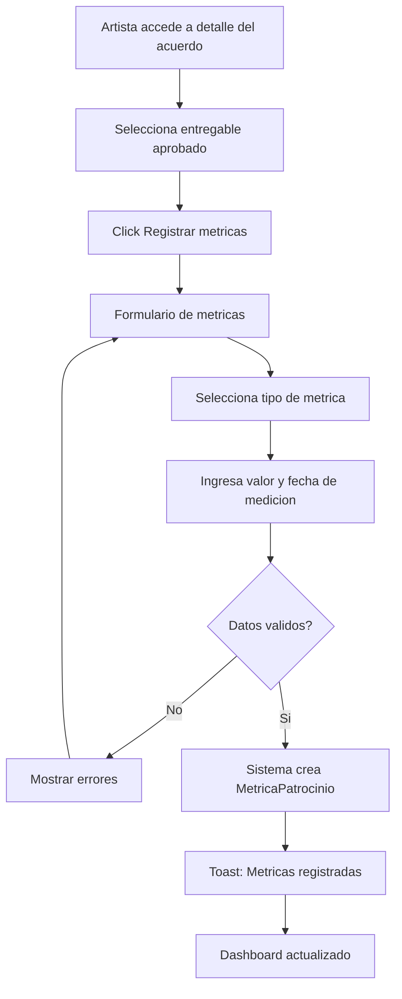
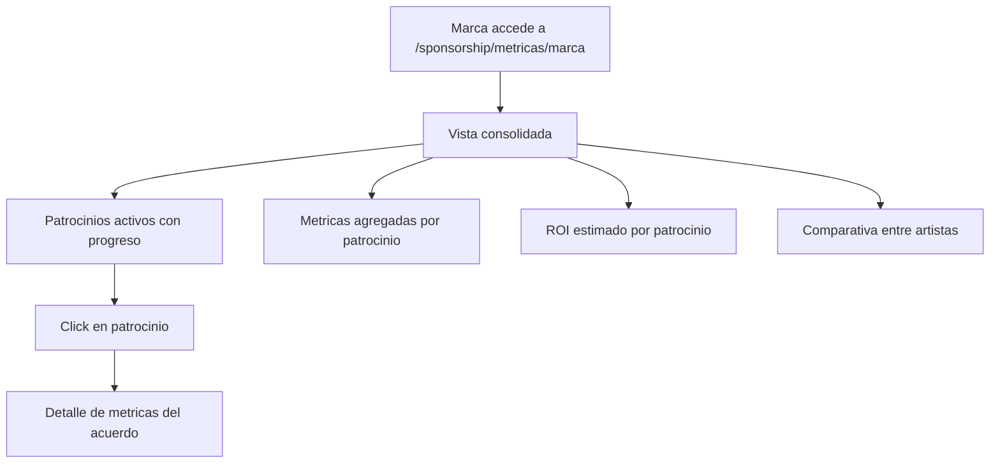
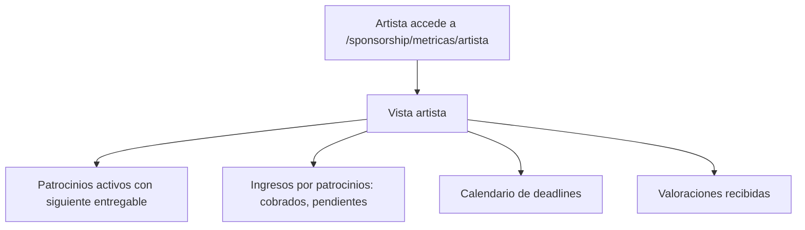
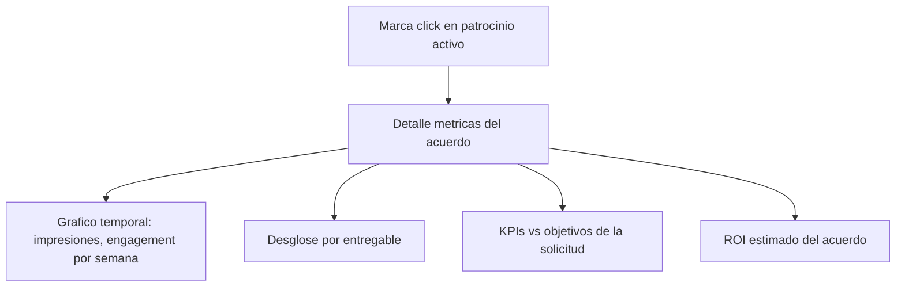

# US-SP-05: Tracking, Metricas y Reporting de Patrocinio

> **ID:** US-SP-05
> **Feature Name:** `sp-tracking-metricas`
> **Prioridad:** Media
> **Estimacion:** L (Large)
> **Modulo:** Sponsorship
> **Dependencias:** US-SP-04

---

## Historia de Usuario

**Como** marca patrocinadora,
**Quiero** ver metricas y resultados de mis patrocinios activos (impresiones, clicks, engagement, conversiones) con comparativas entre artistas y calculos de ROI estimado,
**Para** evaluar el rendimiento de cada patrocinio y tomar decisiones informadas para futuras inversiones.

---

## Actores

| Actor | Descripcion |
|-------|-------------|
| Marca | Consulta dashboard de metricas, comparativas y ROI de patrocinios |
| Artista | Registra metricas de sus entregables, consulta dashboard de ingresos y deadlines |

---

## Precondiciones

- Existe al menos un acuerdo de patrocinio en estado Activo o En Ejecucion (US-SP-04)
- Artista ha subido al menos un entregable

## Postcondiciones

- Metricas registradas y almacenadas por acuerdo y entregable
- Dashboard de marca con vision consolidada
- Dashboard de artista con ingresos y calendario
- ROI estimado calculado por patrocinio

---

## Justificacion

Las marcas necesitan medir el retorno de su inversion en patrocinios. Sin un sistema de tracking de metricas, no es posible evaluar si un patrocinio esta generando los resultados esperados. Un dashboard consolidado con comparativas permite a la marca optimizar su estrategia y al artista demostrar el valor que aporta.

---

## Flujo Principal: Artista Registra Metricas de Entregable



### Campos de Registro de Metrica

| Campo | Tipo | Obligatorio | Validacion |
|-------|------|-------------|------------|
| Acuerdo | Automatico | Si | FK acuerdo activo |
| Entregable | Select (entregables del acuerdo) | No | FK valida si se indica |
| Tipo de metrica | Select (MaestraTipoMetrica) | Si | Debe existir en maestras |
| Valor | Decimal | Si | >= 0 |
| Fecha medicion | Date | Si | <= hoy |
| Fuente | Texto (max 200) | No | Ej: "Instagram Insights", "Manual" |
| Notas | Texto (max 500) | No | Contexto adicional |

### Tipos de Metrica

| Id | Tipo | Unidad | Descripcion |
|----|------|--------|-------------|
| 1 | Impresiones | Numero | Veces que el contenido fue mostrado |
| 2 | Clicks | Numero | Clicks en enlace o CTA |
| 3 | Engagement Rate | Porcentaje | (Interacciones / Alcance) * 100 |
| 4 | Alcance | Numero | Usuarios unicos que vieron el contenido |
| 5 | Visualizaciones Video | Numero | Veces que un video fue reproducido |
| 6 | Likes | Numero | Reacciones positivas |
| 7 | Comentarios | Numero | Comentarios en publicaciones |
| 8 | Shares | Numero | Veces que fue compartido |
| 9 | Conversiones | Numero | Acciones completadas (compras, registros) |
| 10 | Leads | Numero | Contactos o leads generados |
| 11 | Ventas Atribuidas | Moneda | Ventas directamente atribuidas al patrocinio |

### Fuentes de Datos

| Fuente | Descripcion | Disponibilidad |
|--------|-------------|----------------|
| Manual (artista) | Artista ingresa metricas desde capturas de pantalla de analytics | MVP |
| API Instagram | Conexion automatica con Instagram Insights | Futuro |
| API TikTok | Conexion automatica con TikTok Analytics | Futuro |
| API YouTube | Conexion automatica con YouTube Studio | Futuro |

---

## Flujo Secundario: Dashboard de Marca



### Secciones del Dashboard de Marca

| Seccion | Contenido |
|---------|-----------|
| Resumen | Total patrocinios activos, inversion total, ROI medio |
| Patrocinios activos | Cards con progreso, metricas clave y siguiente milestone |
| Metricas por patrocinio | Impresiones, clicks, engagement, conversiones por acuerdo |
| ROI estimado | (Valor generado / Inversion) * 100 por patrocinio |
| Comparativa artistas | Tabla con metricas lado a lado de diferentes artistas |
| Top entregables | Entregables con mejor rendimiento (mas engagement) |

### Calculo de ROI Estimado

```
ROI = ((Valor generado - Inversion) / Inversion) * 100

Valor generado = SUM(Ventas atribuidas) + (Leads * Valor estimado por lead)
Inversion = ImporteTotal del acuerdo
```

- Si no hay ventas atribuidas ni leads, el ROI se muestra como "Pendiente de datos"
- Valor estimado por lead: configurable por la marca (default 10 EUR)

---

## Flujo Secundario: Dashboard de Artista



### Secciones del Dashboard de Artista

| Seccion | Contenido |
|---------|-----------|
| Resumen | Total patrocinios activos, ingresos totales, valoracion media |
| Patrocinios activos | Cards con progreso y siguiente entregable pendiente |
| Ingresos | Desglose: cobrados vs pendientes, por patrocinio |
| Calendario | Vista calendario con deadlines de milestones y entregables |
| Valoraciones | Puntuacion media y ultimas valoraciones recibidas |

---

## Flujo Secundario: Detalle de Metricas por Acuerdo



---

## Flujos Alternativos

| ID | Condicion | Accion |
|----|-----------|--------|
| FA-01 | Acuerdo sin metricas registradas | Mostrar empty state con CTA para artista |
| FA-02 | Marca no tiene patrocinios activos | Dashboard vacio con enlace al marketplace |
| FA-03 | Artista registra metrica con valor negativo | Error de validacion |
| FA-04 | Metrica ya registrada para mismo entregable, tipo y fecha | Actualizar valor existente |

---

## Criterios de Aceptacion

| ID | Criterio | Metodo de Prueba |
|----|----------|------------------|
| AC-SP05-1 | El artista puede registrar metricas (tipo, valor, fecha) para un acuerdo o entregable especifico | Registrar metrica, verificar en BD |
| AC-SP05-2 | La marca puede ver un dashboard consolidado con patrocinios activos, metricas agregadas y ROI estimado | Acceder al dashboard, verificar secciones |
| AC-SP05-3 | El ROI estimado se calcula correctamente como ((Valor generado - Inversion) / Inversion) * 100 | Verificar calculo con datos de prueba |
| AC-SP05-4 | La marca puede ver comparativa de metricas entre diferentes artistas patrocinados | Crear multiples acuerdos, verificar comparativa |
| AC-SP05-5 | El artista puede ver su dashboard con patrocinios activos, ingresos y calendario de deadlines | Acceder al dashboard artista, verificar secciones |
| AC-SP05-6 | Las metricas se pueden desglosar por entregable y por semana/mes | Verificar graficos temporales |
| AC-SP05-7 | Si se registra metrica duplicada (mismo entregable, tipo y fecha), se actualiza el valor existente | Registrar duplicado, verificar actualizacion |
| AC-SP05-8 | Las validaciones de valores (>= 0, fecha <= hoy, tipo valido) funcionan correctamente | Enviar datos invalidos, verificar errores |

---

## Especificacion Tecnica

### API Endpoints

#### GET /api/sponsorship/metricas/marca

Dashboard de metricas para la marca.

**Auth:** Marca (autenticado)

**Response 200 OK:**
```json
{
  "data": {
    "resumen": {
      "totalPatrociniosActivos": 3,
      "inversionTotal": 35000.00,
      "monedaNombre": "EUR",
      "roiMedio": 23.5,
      "impresionesTotales": 450000,
      "engagementRateMedio": 4.1
    },
    "patrociniosActivos": [
      {
        "acuerdoId": "guid",
        "artistaNombre": "Los Rockeros",
        "oportunidadTitulo": "Patrocinio gira nacional 2026",
        "importeTotal": 12000.00,
        "progreso": 40,
        "metricas": {
          "impresiones": 185000,
          "clicks": 3200,
          "engagementRate": 4.2,
          "conversiones": 45,
          "ventasAtribuidas": 2250.00
        },
        "roiEstimado": 18.75,
        "proximoDeadline": "2026-08-31",
        "proximoMilestone": "Fase 2 - Conciertos"
      }
    ],
    "comparativaArtistas": [
      {
        "artistaNombre": "Los Rockeros",
        "impresiones": 185000,
        "engagementRate": 4.2,
        "costoPorImpresion": 0.065,
        "costoPorClick": 3.75,
        "roiEstimado": 18.75
      },
      {
        "artistaNombre": "DJ Pulse",
        "impresiones": 120000,
        "engagementRate": 5.8,
        "costoPorImpresion": 0.067,
        "costoPorClick": 2.50,
        "roiEstimado": 31.2
      }
    ],
    "topEntregables": [
      {
        "titulo": "Post IG - Lanzamiento auriculares",
        "artistaNombre": "Los Rockeros",
        "impresiones": 45000,
        "engagementRate": 6.1
      }
    ]
  },
  "messages": []
}
```

---

#### GET /api/sponsorship/metricas/artista

Dashboard de metricas para el artista.

**Auth:** Artista (autenticado)

**Response 200 OK:**
```json
{
  "data": {
    "resumen": {
      "totalPatrociniosActivos": 2,
      "ingresosTotales": 8560.00,
      "ingresosCobrados": 5632.00,
      "ingresosPendientes": 2928.00,
      "monedaNombre": "EUR",
      "valoracionMedia": 4.5,
      "numValoraciones": 3
    },
    "patrociniosActivos": [
      {
        "acuerdoId": "guid",
        "marcaNombreComercial": "SoundBrands Inc",
        "oportunidadTitulo": "Patrocinio gira nacional 2026",
        "importeNetoTotal": 10560.00,
        "importeCobrado": 5632.00,
        "importePendiente": 4928.00,
        "progreso": 40,
        "siguienteEntregable": "Foto banner concierto Barcelona",
        "siguienteDeadline": "2026-07-15"
      }
    ],
    "calendario": [
      {
        "fecha": "2026-07-15",
        "acuerdoId": "guid",
        "marcaNombre": "SoundBrands Inc",
        "tipo": "milestone_deadline",
        "titulo": "Fase 2 - Conciertos"
      },
      {
        "fecha": "2026-08-31",
        "acuerdoId": "guid",
        "marcaNombre": "SoundBrands Inc",
        "tipo": "milestone_deadline",
        "titulo": "Fase 2 - Deadline"
      }
    ]
  },
  "messages": []
}
```

---

#### POST /api/sponsorship/acuerdos/{id}/metricas

Registrar metrica para un acuerdo.

**Auth:** Artista (participante)

**Request:**
```json
{
  "entregableId": "guid",
  "tipoMetricaId": 1,
  "valor": 45000,
  "fechaMedicion": "2026-04-22",
  "fuente": "Instagram Insights",
  "notas": "Captura tomada 7 dias despues de la publicacion"
}
```

**Response 201 Created:**
```json
{
  "data": {
    "id": "guid",
    "tipoMetricaNombre": "Impresiones",
    "valor": 45000,
    "fechaMedicion": "2026-04-22",
    "fuente": "Instagram Insights"
  },
  "messages": [
    { "message": "Metrica registrada", "errorCode": "0001" }
  ]
}
```

**Errores:**
- `400 Bad Request` - Validacion fallida
- `403 Forbidden` - No es participante del acuerdo

---

#### GET /api/sponsorship/acuerdos/{id}/metricas

Obtener metricas detalladas de un acuerdo.

**Auth:** Participante del acuerdo

**Query params:** `tipoMetricaId`, `fechaDesde`, `fechaHasta`

**Response 200 OK:**
```json
{
  "data": {
    "acuerdoId": "guid",
    "metricas": [
      {
        "id": "guid",
        "entregableTitulo": "Post IG - Lanzamiento auriculares",
        "tipoMetricaNombre": "Impresiones",
        "valor": 45000,
        "fechaMedicion": "2026-04-22",
        "fuente": "Instagram Insights"
      },
      {
        "id": "guid",
        "entregableTitulo": "Post IG - Lanzamiento auriculares",
        "tipoMetricaNombre": "Engagement Rate",
        "valor": 6.1,
        "fechaMedicion": "2026-04-22",
        "fuente": "Instagram Insights"
      }
    ],
    "resumen": {
      "impresionesTotales": 185000,
      "clicksTotales": 3200,
      "engagementRateMedio": 4.2,
      "conversionesTotales": 45,
      "ventasAtribuidas": 2250.00
    },
    "seriesTemporal": [
      {
        "semana": "2026-W16",
        "impresiones": 45000,
        "clicks": 800,
        "engagement": 6.1
      },
      {
        "semana": "2026-W20",
        "impresiones": 32000,
        "clicks": 600,
        "engagement": 3.8
      }
    ]
  },
  "messages": []
}
```

---

### Modelo de Datos

```csharp
public class MetricaPatrocinio
{
    public MetricaPatrocinioId Id { get; set; }
    public AcuerdoPatrocinioId AcuerdoId { get; set; }           // FK -> AcuerdoPatrocinio
    public EntregablePatrocinioId? EntregableId { get; set; }     // FK -> EntregablePatrocinio (opcional)
    public int TipoMetricaId { get; set; }                        // FK -> MaestraTipoMetrica
    public decimal Valor { get; set; }
    public DateTime FechaMedicion { get; set; }
    public string? Fuente { get; set; }
    public string? Notas { get; set; }
    public DateTime FechaCreacion { get; set; }
    public DateTime? FechaActualizacion { get; set; }

    // Navigation
    public AcuerdoPatrocinio Acuerdo { get; set; } = null!;
    public EntregablePatrocinio? Entregable { get; set; }
}
```

### Validaciones

```csharp
// CreateMetricaPatrocinioValidator
RuleFor(x => x.TipoMetricaId)
    .NotEmpty().WithMessage("El tipo de metrica es obligatorio").WithErrorCode(ServiceResponseMessageType.Validation_Required);

RuleFor(x => x.Valor)
    .GreaterThanOrEqualTo(0).WithMessage("El valor debe ser >= 0").WithErrorCode(ServiceResponseMessageType.Validation_InvalidRange);

RuleFor(x => x.FechaMedicion)
    .NotEmpty().WithMessage("La fecha de medicion es obligatoria").WithErrorCode(ServiceResponseMessageType.Validation_Required)
    .LessThanOrEqualTo(DateTime.UtcNow.Date).WithMessage("La fecha de medicion no puede ser futura").WithErrorCode(ServiceResponseMessageType.Validation_InvalidRange);

RuleFor(x => x.Fuente)
    .MaximumLength(200)
    .When(x => !string.IsNullOrEmpty(x.Fuente))
    .WithMessage("Maximo 200 caracteres")
    .WithErrorCode(ServiceResponseMessageType.Validation_MaxLength);

RuleFor(x => x.Notas)
    .MaximumLength(500)
    .When(x => !string.IsNullOrEmpty(x.Notas))
    .WithMessage("Maximo 500 caracteres")
    .WithErrorCode(ServiceResponseMessageType.Validation_MaxLength);
```

---

## Mockups / UI

### Dashboard de Marca
```
+--------------------------------------------------+
|  Dashboard de Patrocinios                         |
+--------------------------------------------------+
|                                                   |
|  +----------+ +----------+ +----------+           |
|  | Activos  | | Inversion| | ROI Medio|           |
|  |     3    | | 35K EUR  | |   23.5%  |           |
|  +----------+ +----------+ +----------+           |
|                                                   |
|  PATROCINIOS ACTIVOS                              |
|  +----------------------------------------------+|
|  | Los Rockeros - Gira Nacional                 ||
|  | 12.000 EUR | Progreso: 40%                   ||
|  | [========>              ] 40%                ||
|  | Impresiones: 185K | Engagement: 4.2%        ||
|  | ROI: 18.75% | Proximo: Fase 2 (31 ago)      ||
|  | [Ver detalle]                                ||
|  +----------------------------------------------+|
|                                                   |
|  COMPARATIVA ARTISTAS                             |
|  +----------------------------------------------+|
|  | Artista    | Impr.  | Eng% | CPM  | ROI     ||
|  |------------|--------|------|------|---------|  |
|  | Rockeros   | 185K   | 4.2% | 0.06 | 18.7%  ||
|  | DJ Pulse   | 120K   | 5.8% | 0.07 | 31.2%  ||
|  +----------------------------------------------+|
|                                                   |
|  TOP ENTREGABLES                                  |
|  1. Post IG Rockeros - 45K impr, 6.1% eng        |
|  2. Video TikTok Pulse - 38K views, 7.2% eng     |
|                                                   |
+--------------------------------------------------+
```

### Dashboard de Artista
```
+--------------------------------------------------+
|  Mis Patrocinios                                  |
+--------------------------------------------------+
|                                                   |
|  +----------+ +----------+ +----------+           |
|  | Activos  | | Cobrado  | | Pendiente|           |
|  |     2    | | 5.632 E  | | 2.928 E  |           |
|  +----------+ +----------+ +----------+           |
|                                                   |
|  PATROCINIOS ACTIVOS                              |
|  +----------------------------------------------+|
|  | SoundBrands Inc - Gira Nacional              ||
|  | Neto: 10.560 EUR | Cobrado: 5.632 EUR       ||
|  | Progreso: 40%                                ||
|  | Siguiente: Foto banner Barcelona (15 jul)    ||
|  +----------------------------------------------+|
|                                                   |
|  CALENDARIO                                       |
|  Jul 2026                                         |
|  +----------------------------------------------+|
|  | L  M  X  J  V  S  D                         ||
|  |          1  2  3  4  5                        ||
|  | 6  7  8  9  10 11 12                         ||
|  | 13 14 [15] 16 17 18 19  <- Banner Barcelona  ||
|  | 20 21 22 23 24 25 26                         ||
|  | 27 28 29 30 31                               ||
|  +----------------------------------------------+|
|                                                   |
+--------------------------------------------------+
```

---

## Notas de Implementacion

- El calculo de ROI se realiza en el backend al consultar el dashboard
- Las series temporales se agregan por semana para graficos
- Metricas duplicadas (mismo acuerdo + entregable + tipo + fecha) se actualizan en vez de crear nuevas
- MVP: Solo entrada manual de metricas. Integracion con APIs de redes sociales es futuro
- El calendario del artista se construye a partir de FechaLimite de milestones
- Los graficos comparativos se generan en el frontend con los datos agregados del API
- Handler CQRS: Command + Handler en mismo archivo, inyectar Service (no DbContext)
- Considerar cachear los calculos de dashboard (RequestCache) para evitar queries pesadas
