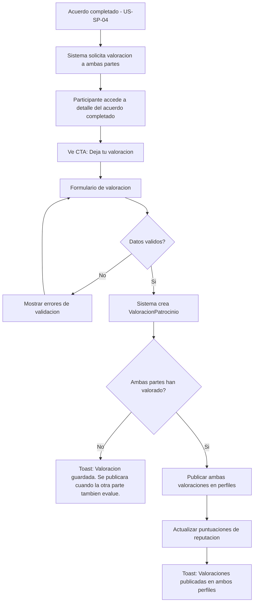
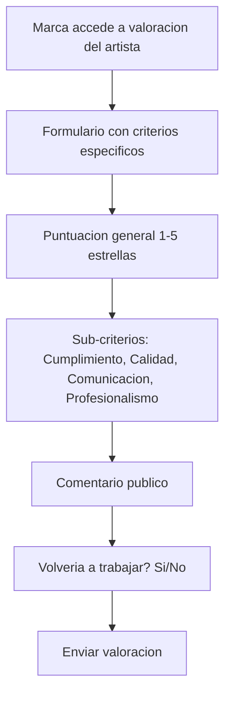
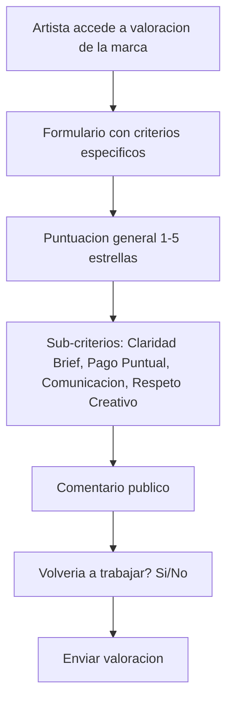
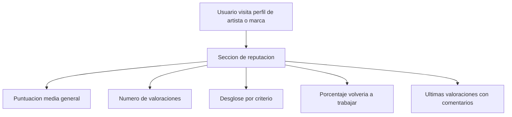
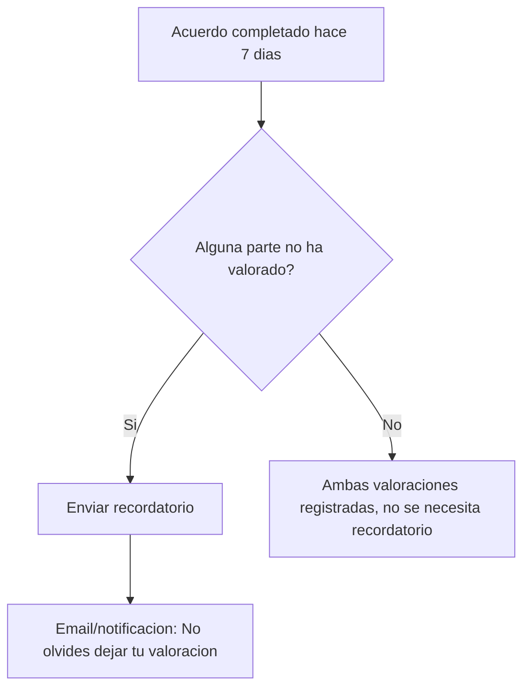

# US-SP-06: Valoraciones Post-Patrocinio

> **ID:** US-SP-06
> **Feature Name:** `sp-valoraciones`
> **Prioridad:** Media
> **Estimacion:** M (Medium)
> **Modulo:** Sponsorship
> **Dependencias:** US-SP-04

---

## Historia de Usuario

**Como** marca o artista que ha completado un acuerdo de patrocinio,
**Quiero** dejar una valoracion mutua con puntuacion general (1-5), criterios especificos de evaluacion, comentario publico y un indicador de "volveria a trabajar con esta persona",
**Para** construir reputacion en la plataforma y ayudar a otros usuarios a tomar decisiones informadas sobre futuros patrocinios.

---

## Actores

| Actor | Descripcion |
|-------|-------------|
| Marca | Evalua al artista en cumplimiento, calidad, comunicacion y profesionalismo |
| Artista | Evalua a la marca en claridad del brief, pago puntual, comunicacion y respeto creativo |

---

## Precondiciones

- Existe un acuerdo de patrocinio en estado `Completado` (US-SP-04)
- Ambas partes participaron activamente en el acuerdo

## Postcondiciones

- Valoraciones registradas para ambas partes
- Puntuaciones publicadas en perfiles (solo cuando ambas partes han evaluado)
- Reputacion actualizada en el marketplace

---

## Justificacion

La confianza es fundamental en una plataforma de patrocinios. Un sistema de valoraciones bidireccional permite que tanto marcas como artistas construyan reputacion verificable. Al publicar las valoraciones solo cuando ambas partes han evaluado, se evita el sesgo de represalia y se fomenta la honestidad.

---

## Flujo Principal: Dejar Valoracion Post-Patrocinio



### Reglas de Publicacion

- Las valoraciones se almacenan inmediatamente pero **NO se publican** hasta que ambas partes hayan evaluado
- Esto evita el sesgo de represalia: ninguna parte puede ver la valoracion del otro antes de evaluar
- Una vez publicadas, son permanentes y no se pueden editar ni eliminar
- El sistema muestra un aviso: "Tu valoracion sera visible cuando la otra parte tambien evalue"

---

## Flujo Secundario: Marca Evalua al Artista



### Criterios de Evaluacion: Marca -> Artista

| Criterio | Descripcion | Escala |
|----------|-------------|--------|
| Puntuacion general | Valoracion global de la experiencia | 1-5 estrellas |
| Cumplimiento | Entrego los entregables acordados a tiempo y en forma | 1-5 |
| Calidad | La calidad del contenido y ejecucion fue la esperada | 1-5 |
| Comunicacion | Fue facil comunicarse, respondio a tiempo, proactivo | 1-5 |
| Profesionalismo | Trato profesional, respeto de acuerdos, actitud | 1-5 |

---

## Flujo Secundario: Artista Evalua a la Marca



### Criterios de Evaluacion: Artista -> Marca

| Criterio | Descripcion | Escala |
|----------|-------------|--------|
| Puntuacion general | Valoracion global de la experiencia | 1-5 estrellas |
| Claridad del brief | El brief y los entregables esperados fueron claros y bien definidos | 1-5 |
| Pago puntual | Los pagos se procesaron a tiempo segun lo acordado | 1-5 |
| Comunicacion | Fue facil comunicarse, feedback constructivo, disponibilidad | 1-5 |
| Respeto creativo | Respeto la vision creativa del artista, no impuso cambios innecesarios | 1-5 |

---

## Flujo Secundario: Ver Reputacion en Perfil



### Datos de Reputacion

| Dato | Calculo |
|------|---------|
| Puntuacion media general | AVG(PuntuacionGeneral) de todas las valoraciones |
| Puntuacion por criterio | AVG de cada sub-criterio |
| Num valoraciones | COUNT de valoraciones publicadas |
| % volveria a trabajar | (COUNT donde VolveriaTrabajar = true / Total) * 100 |
| Ultimas valoraciones | Top 5 mas recientes con comentario y puntuacion |

---

## Flujo Secundario: Recordatorio de Valoracion



**Reglas de recordatorio:**
- Primer recordatorio: 7 dias despues de completar el acuerdo
- Segundo recordatorio: 14 dias despues
- Despues de 30 dias sin valoracion, se marca como "No evaluado" y la otra valoracion se publica igualmente

---

## Flujos Alternativos

| ID | Condicion | Accion |
|----|-----------|--------|
| FA-01 | Participante intenta valorar acuerdo no completado | Error: Solo se puede valorar acuerdos completados |
| FA-02 | Participante ya dejo valoracion para este acuerdo | Error: Ya has dejado tu valoracion |
| FA-03 | Han pasado 30 dias y una parte no ha valorado | Publicar la valoracion existente |
| FA-04 | Acuerdo cancelado (no completado) | No se habilitan valoraciones |

---

## Criterios de Aceptacion

| ID | Criterio | Metodo de Prueba |
|----|----------|------------------|
| AC-SP06-1 | Al completar un acuerdo, se habilita el CTA de valoracion para ambas partes | Completar acuerdo, verificar CTA visible |
| AC-SP06-2 | La marca puede evaluar al artista con puntuacion general, 4 sub-criterios, comentario y indicador "volveria a trabajar" | Completar formulario marca, verificar en BD |
| AC-SP06-3 | El artista puede evaluar a la marca con puntuacion general, 4 sub-criterios, comentario y indicador "volveria a trabajar" | Completar formulario artista, verificar en BD |
| AC-SP06-4 | Las valoraciones NO se publican hasta que ambas partes hayan evaluado | Valorar solo una parte, verificar que no es visible en perfil |
| AC-SP06-5 | Cuando ambas partes han valorado, las valoraciones se publican en ambos perfiles simultaneamente | Ambas partes valoran, verificar publicacion |
| AC-SP06-6 | La reputacion del perfil muestra: puntuacion media, num valoraciones, desglose por criterio y % volveria a trabajar | Verificar datos de reputacion en perfil |
| AC-SP06-7 | Un participante no puede dejar dos valoraciones para el mismo acuerdo | Intentar duplicado, verificar error |
| AC-SP06-8 | Despues de 30 dias sin valoracion de una parte, la valoracion existente se publica igualmente | Verificar publicacion automatica tras 30 dias |

---

## Especificacion Tecnica

### API Endpoints

#### POST /api/sponsorship/acuerdos/{id}/valoraciones

Dejar valoracion para un acuerdo completado.

**Auth:** Participante del acuerdo (marca o artista)

**Request (Marca evalua artista):**
```json
{
  "puntuacionGeneral": 5,
  "criterio1Valor": 5,
  "criterio1Nombre": "Cumplimiento",
  "criterio2Valor": 4,
  "criterio2Nombre": "Calidad",
  "criterio3Valor": 5,
  "criterio3Nombre": "Comunicacion",
  "criterio4Valor": 5,
  "criterio4Nombre": "Profesionalismo",
  "comentario": "Excelente experiencia con Los Rockeros. Cumplieron con todos los entregables a tiempo y la calidad del contenido supero nuestras expectativas. Muy profesionales y faciles de trabajar.",
  "volveriaTrabajar": true
}
```

**Request (Artista evalua marca):**
```json
{
  "puntuacionGeneral": 4,
  "criterio1Valor": 5,
  "criterio1Nombre": "Claridad Brief",
  "criterio2Valor": 5,
  "criterio2Nombre": "Pago Puntual",
  "criterio3Valor": 4,
  "criterio3Nombre": "Comunicacion",
  "criterio4Valor": 3,
  "criterio4Nombre": "Respeto Creativo",
  "comentario": "Buena experiencia general. El brief fue muy claro y los pagos siempre puntuales. Podrian mejorar un poco en respetar la vision creativa del artista sin tantas revisiones.",
  "volveriaTrabajar": true
}
```

**Response 201 Created:**
```json
{
  "data": {
    "id": "guid",
    "puntuacionGeneral": 5,
    "esPublicada": false,
    "mensajePublicacion": "Tu valoracion sera visible cuando la otra parte tambien evalue."
  },
  "messages": [
    { "message": "Valoracion guardada. Se publicara cuando la otra parte tambien evalue.", "errorCode": "0001" }
  ]
}
```

**Errores:**
- `400 Bad Request` - Acuerdo no completado, ya tiene valoracion o validacion fallida
- `403 Forbidden` - No es participante del acuerdo

---

#### GET /api/sponsorship/acuerdos/{id}/valoraciones

Obtener valoraciones de un acuerdo.

**Auth:** Participante del acuerdo

**Response 200 OK:**
```json
{
  "data": {
    "acuerdoId": "guid",
    "estadoAcuerdo": "Completado",
    "valoraciones": [
      {
        "id": "guid",
        "evaluadorTipo": "Marca",
        "evaluadorNombre": "SoundBrands Inc",
        "evaluadoTipo": "Artista",
        "evaluadoNombre": "Los Rockeros",
        "puntuacionGeneral": 5,
        "criterios": [
          { "nombre": "Cumplimiento", "valor": 5 },
          { "nombre": "Calidad", "valor": 4 },
          { "nombre": "Comunicacion", "valor": 5 },
          { "nombre": "Profesionalismo", "valor": 5 }
        ],
        "comentario": "Excelente experiencia con Los Rockeros...",
        "volveriaTrabajar": true,
        "esPublicada": true,
        "fechaCreacion": "2026-10-01T10:00:00Z"
      },
      {
        "id": "guid",
        "evaluadorTipo": "Artista",
        "evaluadorNombre": "Los Rockeros",
        "evaluadoTipo": "Marca",
        "evaluadoNombre": "SoundBrands Inc",
        "puntuacionGeneral": 4,
        "criterios": [
          { "nombre": "Claridad Brief", "valor": 5 },
          { "nombre": "Pago Puntual", "valor": 5 },
          { "nombre": "Comunicacion", "valor": 4 },
          { "nombre": "Respeto Creativo", "valor": 3 }
        ],
        "comentario": "Buena experiencia general...",
        "volveriaTrabajar": true,
        "esPublicada": true,
        "fechaCreacion": "2026-10-02T14:00:00Z"
      }
    ],
    "miValoracion": {
      "yaEvaluado": true,
      "valoracionId": "guid"
    }
  },
  "messages": []
}
```

---

#### GET /api/sponsorship/artistas/{id}/reputacion

Reputacion publica del artista en el modulo Sponsorship.

**Auth:** Cualquier usuario autenticado

**Response 200 OK:**
```json
{
  "data": {
    "artistaId": "guid",
    "nombreArtistico": "Los Rockeros",
    "puntuacionMedia": 4.7,
    "numValoraciones": 5,
    "porcentajeVolveriaTrabajar": 100,
    "desgloseCriterios": {
      "cumplimiento": 4.8,
      "calidad": 4.4,
      "comunicacion": 4.9,
      "profesionalismo": 4.7
    },
    "ultimasValoraciones": [
      {
        "evaluadorNombre": "SoundBrands Inc",
        "puntuacionGeneral": 5,
        "comentario": "Excelente experiencia con Los Rockeros...",
        "volveriaTrabajar": true,
        "fecha": "2026-10-01T10:00:00Z"
      },
      {
        "evaluadorNombre": "FashionBrand Co",
        "puntuacionGeneral": 4,
        "comentario": "Buen trabajo, cumplieron los plazos aunque...",
        "volveriaTrabajar": true,
        "fecha": "2026-08-15T12:00:00Z"
      }
    ]
  },
  "messages": []
}
```

---

#### GET /api/sponsorship/marcas/{id}/reputacion

Reputacion publica de la marca en el modulo Sponsorship.

**Auth:** Cualquier usuario autenticado

**Response 200 OK:**
```json
{
  "data": {
    "marcaId": "guid",
    "nombreComercial": "SoundBrands Inc",
    "puntuacionMedia": 4.3,
    "numValoraciones": 4,
    "porcentajeVolveriaTrabajar": 75,
    "desgloseCriterios": {
      "claridadBrief": 4.5,
      "pagoPuntual": 4.8,
      "comunicacion": 4.0,
      "respetoCreativo": 3.8
    },
    "ultimasValoraciones": [
      {
        "evaluadorNombre": "Los Rockeros",
        "puntuacionGeneral": 4,
        "comentario": "Buena experiencia general...",
        "volveriaTrabajar": true,
        "fecha": "2026-10-02T14:00:00Z"
      }
    ]
  },
  "messages": []
}
```

---

### Modelo de Datos

```csharp
public class ValoracionPatrocinio
{
    public ValoracionPatrocinioId Id { get; set; }
    public AcuerdoPatrocinioId AcuerdoId { get; set; }           // FK -> AcuerdoPatrocinio
    public string EvaluadorUserId { get; set; } = null!;          // FK -> Identity.User
    public string EvaluadorTipo { get; set; } = null!;            // "Marca" o "Artista"
    public string EvaluadorNombre { get; set; } = null!;
    public string EvaluadoTipo { get; set; } = null!;             // "Marca" o "Artista"
    public string EvaluadoNombre { get; set; } = null!;
    public int PuntuacionGeneral { get; set; }                    // 1-5
    public int Criterio1Valor { get; set; }                       // 1-5
    public string Criterio1Nombre { get; set; } = null!;
    public int Criterio2Valor { get; set; }                       // 1-5
    public string Criterio2Nombre { get; set; } = null!;
    public int Criterio3Valor { get; set; }                       // 1-5
    public string Criterio3Nombre { get; set; } = null!;
    public int Criterio4Valor { get; set; }                       // 1-5
    public string Criterio4Nombre { get; set; } = null!;
    public string Comentario { get; set; } = null!;
    public bool VolveriaTrabajar { get; set; }
    public bool EsPublicada { get; set; }
    public DateTime FechaCreacion { get; set; }
    public DateTime? FechaPublicacion { get; set; }

    // Navigation
    public AcuerdoPatrocinio Acuerdo { get; set; } = null!;
}
```

### Validaciones

```csharp
// CreateValoracionPatrocinioValidator
RuleFor(x => x.PuntuacionGeneral)
    .InclusiveBetween(1, 5).WithMessage("La puntuacion debe ser entre 1 y 5").WithErrorCode(ServiceResponseMessageType.Validation_InvalidRange);

RuleFor(x => x.Criterio1Valor)
    .InclusiveBetween(1, 5).WithMessage("La puntuacion del criterio debe ser entre 1 y 5").WithErrorCode(ServiceResponseMessageType.Validation_InvalidRange);

RuleFor(x => x.Criterio2Valor)
    .InclusiveBetween(1, 5).WithMessage("La puntuacion del criterio debe ser entre 1 y 5").WithErrorCode(ServiceResponseMessageType.Validation_InvalidRange);

RuleFor(x => x.Criterio3Valor)
    .InclusiveBetween(1, 5).WithMessage("La puntuacion del criterio debe ser entre 1 y 5").WithErrorCode(ServiceResponseMessageType.Validation_InvalidRange);

RuleFor(x => x.Criterio4Valor)
    .InclusiveBetween(1, 5).WithMessage("La puntuacion del criterio debe ser entre 1 y 5").WithErrorCode(ServiceResponseMessageType.Validation_InvalidRange);

RuleFor(x => x.Criterio1Nombre)
    .NotEmpty().WithMessage("El nombre del criterio es obligatorio").WithErrorCode(ServiceResponseMessageType.Validation_Required);

RuleFor(x => x.Criterio2Nombre)
    .NotEmpty().WithMessage("El nombre del criterio es obligatorio").WithErrorCode(ServiceResponseMessageType.Validation_Required);

RuleFor(x => x.Criterio3Nombre)
    .NotEmpty().WithMessage("El nombre del criterio es obligatorio").WithErrorCode(ServiceResponseMessageType.Validation_Required);

RuleFor(x => x.Criterio4Nombre)
    .NotEmpty().WithMessage("El nombre del criterio es obligatorio").WithErrorCode(ServiceResponseMessageType.Validation_Required);

RuleFor(x => x.Comentario)
    .NotEmpty().WithMessage("El comentario es obligatorio").WithErrorCode(ServiceResponseMessageType.Validation_Required)
    .MinimumLength(20).WithMessage("Minimo 20 caracteres para un comentario constructivo").WithErrorCode(ServiceResponseMessageType.Validation_MinLength)
    .MaximumLength(2000).WithMessage("Maximo 2000 caracteres").WithErrorCode(ServiceResponseMessageType.Validation_MaxLength);
```

---

## Mockups / UI

### Formulario de Valoracion (Marca evalua Artista)
```
+--------------------------------------------------+
|  Evaluar a Los Rockeros                           |
|  Acuerdo: Patrocinio Gira Nacional 2026           |
+--------------------------------------------------+
|                                                   |
|  Puntuacion general *                             |
|  [*] [*] [*] [*] [*]    5/5                     |
|                                                   |
|  Cumplimiento *                                   |
|  Entrego los entregables a tiempo y en forma      |
|  [*] [*] [*] [*] [*]    5/5                     |
|                                                   |
|  Calidad *                                        |
|  Calidad del contenido y ejecucion               |
|  [*] [*] [*] [*] [ ]    4/5                     |
|                                                   |
|  Comunicacion *                                   |
|  Facilidad de comunicacion y proactividad        |
|  [*] [*] [*] [*] [*]    5/5                     |
|                                                   |
|  Profesionalismo *                                |
|  Trato profesional y respeto de acuerdos         |
|  [*] [*] [*] [*] [*]    5/5                     |
|                                                   |
|  Comentario publico *                             |
|  [Excelente experiencia con Los Rockeros.      ]  |
|  [Cumplieron con todos los entregables a       ]  |
|  [tiempo y la calidad supero expectativas.     ]  |
|                                                   |
|  Volveria a trabajar con este artista? *          |
|  (x) Si    ( ) No                                 |
|                                                   |
|  i Tu valoracion sera visible cuando la otra      |
|    parte tambien evalue.                          |
|                                                   |
|  [Cancelar]              [Enviar valoracion]      |
+--------------------------------------------------+
```

### Seccion de Reputacion en Perfil del Artista
```
+--------------------------------------------------+
|  REPUTACION EN PATROCINIOS                        |
+--------------------------------------------------+
|                                                   |
|  4.7/5  [*][*][*][*][*]   5 valoraciones         |
|  100% volveria a trabajar                         |
|                                                   |
|  Desglose por criterio:                           |
|  Cumplimiento     [===============] 4.8            |
|  Calidad          [=============]   4.4            |
|  Comunicacion     [================] 4.9           |
|  Profesionalismo  [===============] 4.7            |
|                                                   |
|  ULTIMAS VALORACIONES                             |
|  +----------------------------------------------+|
|  | SoundBrands Inc          5/5  Volveria: Si   ||
|  | "Excelente experiencia con Los Rockeros..."   ||
|  | 1 oct 2026                                    ||
|  +----------------------------------------------+|
|  | FashionBrand Co           4/5  Volveria: Si   ||
|  | "Buen trabajo, cumplieron los plazos..."      ||
|  | 15 ago 2026                                   ||
|  +----------------------------------------------+|
|                                                   |
+--------------------------------------------------+
```

### Seccion de Reputacion en Perfil de Marca
```
+--------------------------------------------------+
|  REPUTACION EN PATROCINIOS                        |
+--------------------------------------------------+
|                                                   |
|  4.3/5  [*][*][*][*][ ]   4 valoraciones         |
|  75% volveria a trabajar                          |
|                                                   |
|  Desglose por criterio:                           |
|  Claridad Brief   [===============] 4.5            |
|  Pago Puntual     [================] 4.8           |
|  Comunicacion     [=============]   4.0            |
|  Respeto Creativo [===========]     3.8            |
|                                                   |
+--------------------------------------------------+
```

---

## Notas de Implementacion

- ValoracionPatrocinio tiene constraint unico: (AcuerdoId, EvaluadorUserId) - un evaluador por acuerdo
- El campo EsPublicada controla la visibilidad. Se pone a true cuando ambas partes han valorado
- La publicacion simultanea se hace con un trigger en el handler: al crear la segunda valoracion, se actualizan ambas con EsPublicada = true y FechaPublicacion = ahora
- Despues de 30 dias, un job/servicio publica la valoracion existente aunque la otra parte no haya evaluado
- Los endpoints de reputacion solo devuelven valoraciones con EsPublicada = true
- Las puntuaciones medias se calculan en tiempo real (o se cachean con RequestCache)
- Los criterios son fijos por tipo de evaluador (marca siempre evalua cumplimiento/calidad/comunicacion/profesionalismo, artista siempre evalua claridad/pago/comunicacion/respeto)
- Handler CQRS: Command + Handler en mismo archivo, inyectar Service (no DbContext)
- Considerar indices en BD para queries de reputacion (AcuerdoId, EvaluadorUserId, EsPublicada)
