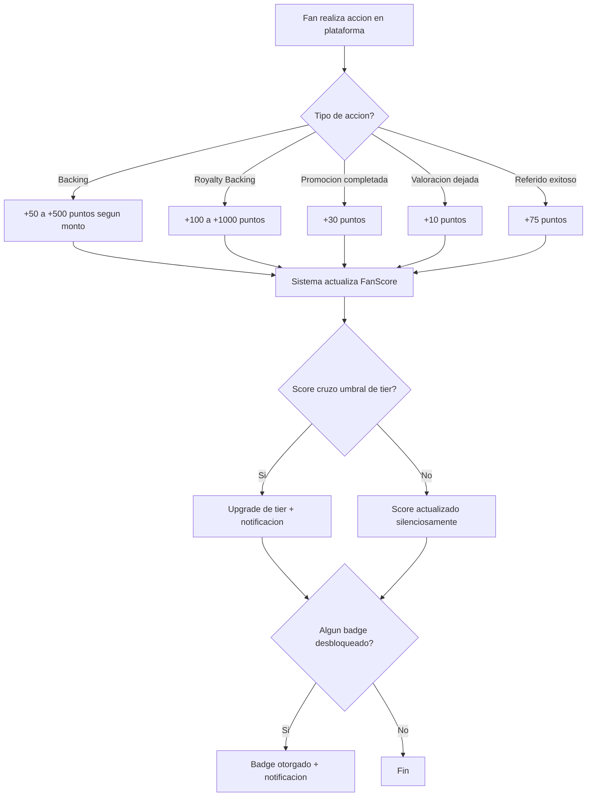
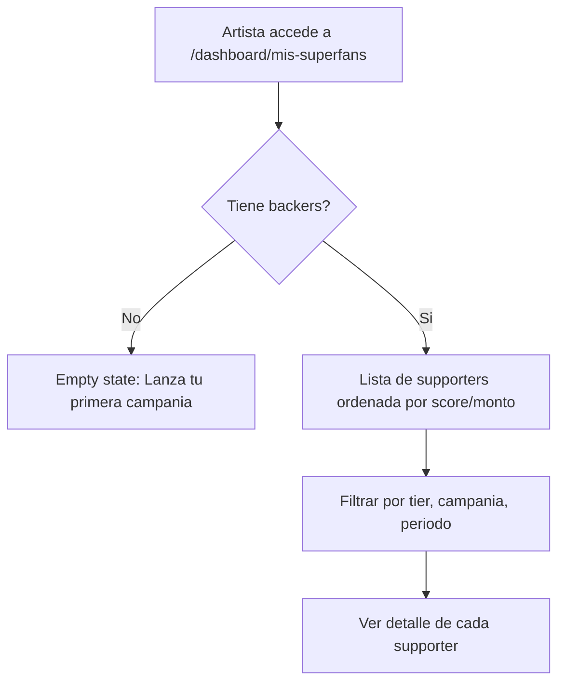

# US-UA-01: Sistema Superfan Tiers y Fan Passport

> **ID:** US-UA-01
> **Feature Name:** `ua-superfan-tiers-fan-passport`
> **Prioridad:** Alta
> **Estimacion:** XL (Extra Large)
> **Modulo:** UserAccess (extension transversal)
> **Dependencias:** US-01 (Registro Artista), US-04 (Hacer Backing)
> **Feature Origen:** F-02 del [analisis de funcionalidades](../analisis/20260217_analisis-funcionalidades-industria-musical.md#f-02-superfan-tiers--fan-passport)

---

## Historia de Usuario

**Como** fan activo en la plataforma,
**Quiero** acumular puntos y subir de nivel (tier) segun mi historial de backings, engagement y participacion en la plataforma, con un "Fan Passport" portable que muestre mi trayectoria como supporter,
**Para** obtener perks exclusivos (early access, mensajes directos con artistas, badges), ser reconocido por los artistas como superfan, y llevar mi reputacion entre campanias.

---

## Actores

| Actor | Descripcion |
|-------|-------------|
| Fan | Usuario registrado que acumula Fan Score a traves de actividad |
| Artista | Ve sus superfans, puede ofrecer perks exclusivos por tier |
| Sistema | Calcula scores, asigna tiers, otorga badges automaticamente |

---

## Precondiciones

- Usuario tiene cuenta activa en la plataforma
- Existen datos seed de tiers y badges

## Postcondiciones

- Cada usuario tiene un FanScore calculado
- Cada usuario tiene un FanTier asignado (basado en score)
- Los badges se otorgan automaticamente al cumplir condiciones
- Los artistas pueden ver el desglose de superfans de sus campanias

---

## Justificacion

**El dato mas importante de este analisis**: Los superfans representan el **2% de los listeners** pero generan el **18% de los streams** y la mayoria del revenue de merch y conciertos. Goldman Sachs estima un potencial anual de **$4.3B** en monetizacion superfan.

WePlay Rises ya tiene la data necesaria (backings, campañas apoyadas, montos) pero no la explota. Un sistema de tiers:

1. **Retiene usuarios** entre campanias (tienen un "level" que no quieren perder)
2. **Aumenta ticket promedio** (el fan quiere subir de tier)
3. **Genera social proof** (badges visibles en perfil y comentarios)
4. **Alimenta otros modulos**: CrowdPromotion (superfans como promotores naturales), Sponsorship (data de superfans atractiva para marcas)

**Referencia**: Spotify "Music Pro" ($5.99/mes), Sesh ($7M raised, 250+ artistas), Stationhead (UMG compro participacion).

---

## Alcance de esta US

### A. Fan Score (motor de puntuacion)

Sistema de puntos que se acumula automaticamente con cada accion del fan en la plataforma.

### B. Fan Tiers (niveles)

Cuatro niveles basados en el Fan Score acumulado, con perks crecientes.

### C. Badges (insignias)

Logros desbloqueables por acciones especificas (primer backing, 10 campanias, early adopter, etc.).

### D. Fan Passport (perfil publico de supporter)

Pagina publica que muestra trayectoria: tiers, badges, campanias apoyadas, artistas favoritos.

### E. Dashboard de Superfans para Artistas

Vista donde el artista ve quienes son sus supporters mas comprometidos.

---

## Flujo Principal: Acumulacion Automatica de Fan Score



### Tabla de Puntos por Accion

| Accion | Puntos | Condiciones |
|--------|--------|-------------|
| Backing reward (cualquier monto) | 50 | Por cada backing completado |
| Backing reward (+100 EUR) | 100 | Backing de 100+ EUR |
| Backing reward (+500 EUR) | 250 | Backing de 500+ EUR |
| Royalty Backing (cualquier monto) | 100 | Por cada royalty backing |
| Royalty Backing (+500 EUR) | 500 | Royalty backing de 500+ EUR |
| Completar tarea de promocion | 30 | Via CrowdPromotion |
| Dejar valoracion en acuerdo | 10 | Via CrowdSourcing/Sponsorship |
| Referir usuario que hace backing | 75 | Backing completado del referido |
| Primer backing en la plataforma | 100 | Bonus unico |
| Backing a 5 artistas diferentes | 200 | Bonus unico |
| Backing a 10 artistas diferentes | 500 | Bonus unico |
| 1 ano de antiguedad activa | 300 | Bonus anual |

---

## Fan Tiers

| Tier | Nombre | Score Minimo | Icono | Perks |
|------|--------|-------------|-------|-------|
| 1 | **Supporter** | 0 | Estrella bronce | Perfil basico, historial de backings |
| 2 | **Fan** | 500 | Estrella plata | Badge visible en comentarios, early access a campanias (24h antes) |
| 3 | **Superfan** | 2,000 | Estrella oro | Todo lo anterior + mensajes directos con artistas, invitacion a listening parties virtuales, descuento 10% en merch |
| 4 | **Patron** | 10,000 | Estrella diamante | Todo lo anterior + nombre en creditos de proyectos fondeados, acceso a eventos exclusivos, video-call trimestral con artistas top |

---

## Badges (Insignias)

| Badge | Condicion | Icono |
|-------|-----------|-------|
| **Early Bird** | Backear una campania en las primeras 24h | Pajaro |
| **First Blood** | Primer backing completado | Gota |
| **Diversificador** | Backear 5 artistas diferentes | Abanico |
| **Mega Supporter** | Backear 10 campanias | Trofeo |
| **Inversor** | Primer royalty backing | Grafico |
| **Promotor Nato** | Completar 10 tareas de promocion | Megafono |
| **Veterano** | 1 ano de antiguedad | Medalla |
| **Whale** | Acumular 1,000+ EUR en backings totales | Ballena |
| **Pionero** | Estar entre los primeros 100 usuarios de la plataforma | Bandera |
| **Coleccionista** | Tener 10+ badges | Corona |

---

## Flujo Principal: Fan Passport (Perfil Publico)

```mermaid
flowchart TD
    A[Cualquier usuario accede a /fans/{username}] --> B[Ve Fan Passport]
    B --> C[Header: nombre, avatar, tier badge, score, miembro desde]
    C --> D[Seccion: Badges obtenidos]
    D --> E[Seccion: Artistas apoyados con montos totales]
    E --> F[Seccion: Campanias apoyadas recientes]
    F --> G[Seccion: Estadisticas - total invertido, num campanias, artistas unicos]
```

### Mockup - Fan Passport

```
+--------------------------------------------------+
|  FAN PASSPORT                                      |
+--------------------------------------------------+
|                                                    |
|  [Avatar]  @username                               |
|            ★★★ SUPERFAN (2,340 pts)               |
|            Miembro desde enero 2026                |
|                                                    |
+--------------------------------------------------+
|  BADGES (7/10)                                     |
|  [Early Bird] [First Blood] [Diversificador]       |
|  [Mega Supporter] [Inversor] [Veterano] [Whale]    |
+--------------------------------------------------+
|  ARTISTAS APOYADOS (12)                            |
|  DJ Nova ★★★         3 campanias    850 EUR        |
|  Maria Luna ★★       2 campanias    400 EUR        |
|  Los Rebeldes ★      1 campania     150 EUR        |
|  ... ver todos                                     |
+--------------------------------------------------+
|  ESTADISTICAS                                      |
|  Total invertido: 2,150 EUR                        |
|  Campanias apoyadas: 15                            |
|  Artistas unicos: 12                               |
|  Royalty shares activos: 3                         |
+--------------------------------------------------+
```

---

## Flujo Principal: Dashboard de Superfans para Artistas



### Datos del Dashboard - Artista

| Dato | Fuente |
|------|--------|
| Username del fan | User.UserName |
| Fan Tier (badge visual) | FanTier.Nombre |
| Fan Score | FanScore.PuntosTotales |
| Num campanias apoyadas (de este artista) | COUNT(Backings del artista) |
| Monto total aportado (a este artista) | SUM(Backings.Monto del artista) |
| Tiene royalty shares | RoyaltyShare.Count > 0 |
| Es promotor activo | Promotor.EsActivo AND tiene PromoEventos |
| Ultima actividad | MAX(Backing.FechaCreacion) |

---

## Flujos Alternativos

| ID | Condicion | Accion |
|----|-----------|--------|
| FA-01 | Fan pierde tier (no soportado en v1) | Los tiers NO se pierden, solo se ganan. El score nunca decrece |
| FA-02 | Fan quiere ocultar su Fan Passport | Opcion de privacidad: Fan Passport puede ser publico, solo para artistas apoyados, o privado |
| FA-03 | Badge ya otorgado | No se duplican. Si la condicion ya se cumplio, no se re-otorga |
| FA-04 | Artista quiere enviar mensaje a todos sus superfans (tier 3+) | Feature futura. En esta US solo se muestra el listado |

---

## Criterios de Aceptacion

| ID | Criterio | Metodo de Prueba |
|----|----------|------------------|
| AC-UA01-1 | El Fan Score se incrementa automaticamente al completar un backing | Hacer backing, verificar score en BD |
| AC-UA01-2 | Los puntos se asignan segun la tabla definida (50 para backing basico, 100 para +100 EUR, etc.) | Hacer backings de diferentes montos, verificar puntos |
| AC-UA01-3 | El Fan Tier se actualiza automaticamente al cruzar umbral (500, 2000, 10000) | Acumular puntos suficientes, verificar tier change |
| AC-UA01-4 | El usuario recibe notificacion al subir de tier | Cruzar umbral, verificar notificacion |
| AC-UA01-5 | Los badges se otorgan automaticamente al cumplir condicion (ej: primer backing → "First Blood") | Completar primera accion, verificar badge |
| AC-UA01-6 | El Fan Passport muestra: tier, score, badges, artistas apoyados, estadisticas | Acumular actividad, verificar pagina /fans/{username} |
| AC-UA01-7 | El Fan Passport respeta configuracion de privacidad (publico/artistas/privado) | Cambiar privacidad, verificar visibilidad |
| AC-UA01-8 | El artista ve dashboard de superfans con lista ordenada por score | Verificar /dashboard/mis-superfans con datos correctos |
| AC-UA01-9 | El artista puede filtrar superfans por tier y campania | Aplicar filtros, verificar resultados |
| AC-UA01-10 | El badge visual del tier aparece junto al username en comentarios y backings | Hacer backing, verificar badge en listado de backers |
| AC-UA01-11 | Los puntos por acciones de CrowdPromotion (completar tarea) se acumulan correctamente | Completar tarea de promocion, verificar puntos |

---

## Especificacion Tecnica

### API Endpoints

#### GET /api/fan-score/me

Obtener score y tier del usuario autenticado.

**Auth:** Usuario autenticado

**Response 200 OK:**
```json
{
    "data": {
        "puntosTotales": 2340,
        "tierId": 3,
        "tierNombre": "Superfan",
        "puntosParaSiguienteTier": 7660,
        "siguienteTierNombre": "Patron",
        "porcentajeProgreso": 23.4,
        "badges": [
            { "id": "guid", "nombre": "Early Bird", "fechaObtenido": "2026-01-15T10:00:00Z" },
            { "id": "guid", "nombre": "First Blood", "fechaObtenido": "2026-01-10T10:00:00Z" }
        ],
        "estadisticas": {
            "totalInvertido": 2150.00,
            "numCampanias": 15,
            "numArtistasUnicos": 12,
            "numRoyaltyShares": 3,
            "miembroDesde": "2026-01-01T00:00:00Z"
        }
    },
    "messages": []
}
```

---

#### GET /api/fans/{username}/passport

Obtener Fan Passport publico de un usuario.

**Auth:** Segun privacidad del fan

**Response 200 OK:**
```json
{
    "data": {
        "username": "musiclover92",
        "tierId": 3,
        "tierNombre": "Superfan",
        "puntosTotales": 2340,
        "miembroDesde": "2026-01-01T00:00:00Z",
        "badges": [
            { "nombre": "Early Bird", "icono": "bird", "fechaObtenido": "2026-01-15" },
            { "nombre": "Whale", "icono": "whale", "fechaObtenido": "2026-02-01" }
        ],
        "artistasApoyados": [
            {
                "artistaId": "guid",
                "nombre": "DJ Nova",
                "numCampanias": 3,
                "montoTotal": 850.00
            }
        ],
        "estadisticas": {
            "totalInvertido": 2150.00,
            "numCampanias": 15,
            "numArtistasUnicos": 12
        }
    },
    "messages": []
}
```

---

#### GET /api/artista/mis-superfans

Dashboard de superfans del artista autenticado.

**Auth:** Artista

**Query params:** `tierId`, `campaniaId`, `orderBy` (score|monto|reciente), `page`, `pageSize`

**Response 200 OK:**
```json
{
    "data": {
        "resumen": {
            "totalSupporters": 156,
            "supporters": 89,
            "fans": 42,
            "superfans": 20,
            "patrons": 5
        },
        "items": [
            {
                "username": "musiclover92",
                "tierId": 3,
                "tierNombre": "Superfan",
                "fanScore": 2340,
                "numCampanias": 3,
                "montoTotal": 850.00,
                "tieneRoyaltyShares": true,
                "esPromotor": true,
                "ultimaActividad": "2026-02-15T10:00:00Z"
            }
        ],
        "totalCount": 156,
        "page": 1,
        "pageSize": 20
    },
    "messages": []
}
```

---

### Modelo de Datos

```
FanScore
  Id                    UNIQUEIDENTIFIER (PK)
  UserId                FK → Users (unique)
  PuntosTotales         INT DEFAULT 0
  TierId                FK → MaestraFanTier
  FechaCreacion         DATETIME2(3)
  FechaActualizacion?   DATETIME2(3)

FanScoreHistorial (log de puntos)
  Id                    UNIQUEIDENTIFIER (PK)
  FanScoreId            FK → FanScore
  Puntos                INT
  TipoAccionId          FK → MaestraTipoAccionFan
  ReferenciaId?         UNIQUEIDENTIFIER (BackingId, PromoEventoId, etc.)
  Descripcion           NVARCHAR(200)
  FechaCreacion         DATETIME2(3)

FanBadge
  Id                    UNIQUEIDENTIFIER (PK)
  FanScoreId            FK → FanScore
  BadgeDefinicionId     FK → MaestraBadgeDefinicion
  FechaObtenido         DATETIME2(3)

MaestraFanTier
  1 = Supporter (0 pts)
  2 = Fan (500 pts)
  3 = Superfan (2,000 pts)
  4 = Patron (10,000 pts)

MaestraTipoAccionFan
  1 = Backing Reward
  2 = Backing High Value
  3 = Royalty Backing
  4 = Promo Task Completed
  5 = Valoracion
  6 = Referido
  7 = Bonus Primer Backing
  8 = Bonus Multi-Artista
  9 = Bonus Antiguedad

MaestraBadgeDefinicion
  Id, Nombre, Descripcion, Icono, Condicion (JSON), PuntosRequeridos
```

---

## Notas de Implementacion

- El calculo de Fan Score debe ser **event-driven**: un domain event (BackingCreated, PromoTaskCompleted, etc.) dispara el calculo
- Los tiers NUNCA se degradan. Solo se suben. El score nunca decrece
- Los badges se evaluan tras cada cambio de score, no en batch
- El Fan Passport es cache-friendly (cambia con poca frecuencia)
- Privacidad: default "publico". El fan puede cambiar a "solo artistas apoyados" o "privado"
- Handler CQRS: Command + Handler en mismo archivo, inyectar Service (no DbContext)
